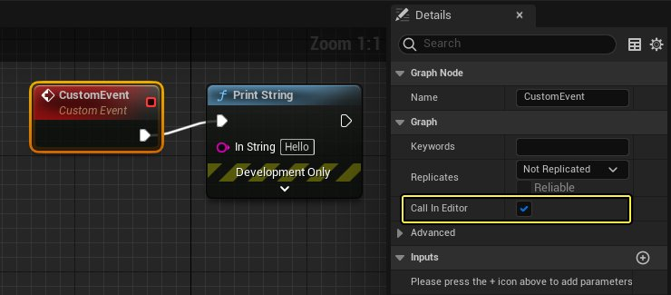
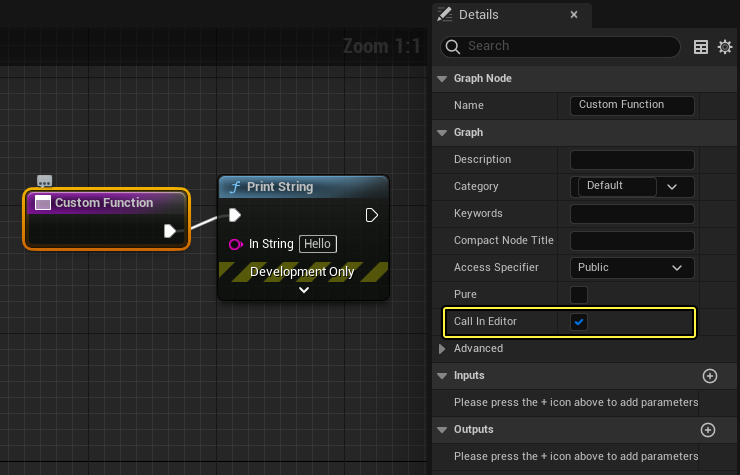
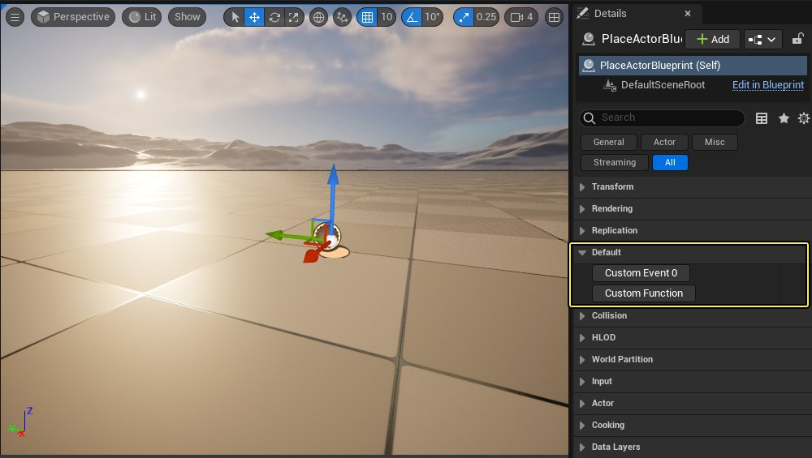

# 在编辑器中调用蓝图

> 路径：虚幻引擎5.7文档 / 建立你的开发流程 / 编辑器的脚本与自动化 / 使用蓝图编写编辑器脚本 / 在编辑器中调用蓝图

> 原始页面：https://dev.epicgames.com/documentation/unreal-engine/calling-blueprints-in-the-unreal-editor

你可以在 **虚幻编辑器** 中按需调用 **蓝图自定义事件** 和 **蓝图自定义函数**。此方法十分适用于在运行时和编辑器中运行相同 **蓝图图表**。例如，你可以在 **编辑器UI** 中测试或预览运行时Gameplay。同时其也是在编辑器中触发蓝图的简单方法，此类蓝图在3D空间中需将 **Actor** 或位置作为情境。

### 支持的蓝图类

并非所有 **蓝图类** 都能在虚幻编辑器中运行自身的自定义事件和函数。

- 以下步骤适用于可放置在关卡中的蓝图类：即直接或间接派生自 **Actor** 的类。
- 若要访问如在 **内容浏览器** 中使用 **资源** 等纯编辑器功能，可在如 `EditorUtilityActor` 等可放置纯编辑器基类中派生蓝图类。注意：由于打包的虚幻编辑器应用程序中未包含纯编辑器类，因此使用纯编辑器基类时无法在运行时触发蓝图。

> [!NOTE]
> 派生自 **Actor** 的 **编辑器工具蓝图** 类不在 **细节（Details）** 面板中公开函数或自定义事件的按钮，在编辑器中此类函数或自定义事件被标为可调用。若一定要使用 **细节（Details）** 面板中的按钮来驱动蓝图逻辑，则在普通蓝图类中创建图表，而非在编辑器工具蓝图类中。要利用更灵活、更强大的方法创建自定义UI，在虚幻编辑器中驱动蓝图逻辑时，建议使用[编辑器工具控件](https://dev.epicgames.com/documentation/404)。

## 步骤

1. 在蓝图类的 **事件图表** 中使用 **Custom Event** 节点时，可在 **细节（Details）** 面板中设置 **图表（Graph）> 在编辑器中调用（Call in Editor）**：

   

   同样，在蓝图类上新建函数时可选择新函数的节点并在 **细节（Details）** 面板中设置相同选项：

   
2. 若还未将蓝图类的实例添加到 **关卡**L 中，请进行添加。
3. **在关卡视口（Level Viewport）** 或 **世界大纲视图（World Outliner）** 中选择 **蓝图Actor**。**细节（Details）** 面板将显示各 **在编辑器中调用（Call in Editor）** 事件和函数的已设置按钮。此类按钮通常位于 **默认（Default）** 部分，其中的蓝图类同时公开被标记为实例可编辑的变量。

   

   > [!NOTE]
   > 若自定义事件或函数具有输入，**细节（Details）** 面板中将不会显示。
4. 点击此类按钮以触发执行事件图表，将自"Custom Event"节点开始，或触发自定义函数。
