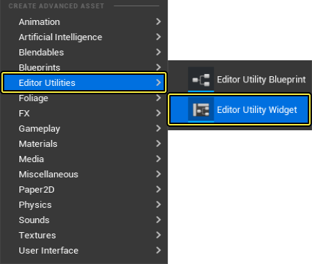
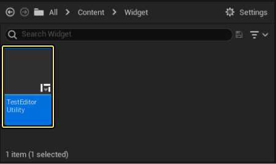
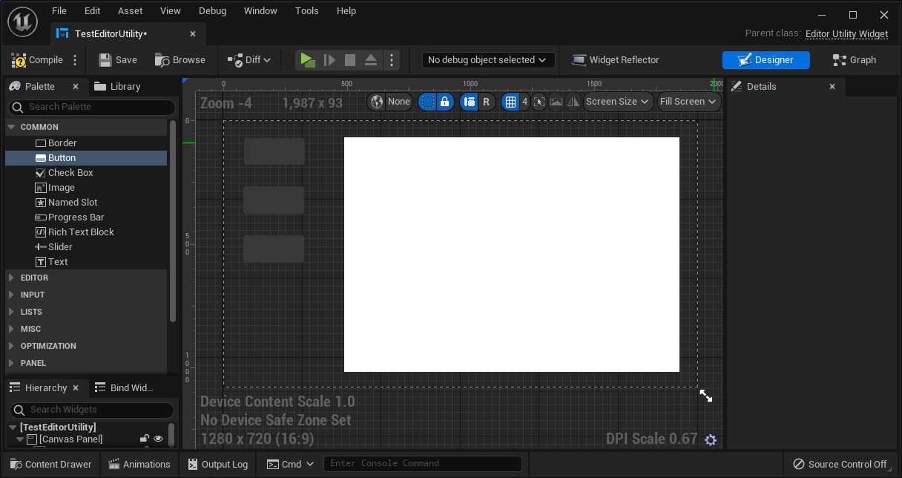
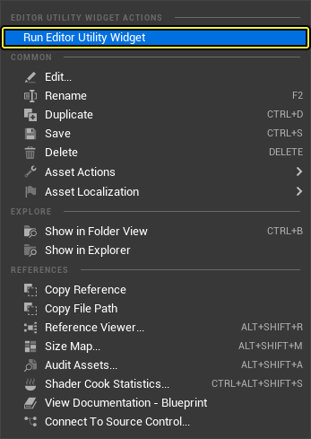
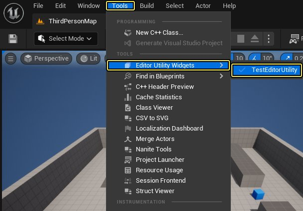

# 编辑器工具控件

> 路径：虚幻引擎5.7文档 / 建立你的开发流程 / 编辑器的脚本与自动化 / 使用蓝图编写编辑器脚本 / 编辑器工具控件

> 原始页面：https://dev.epicgames.com/documentation/unreal-engine/editor-utility-widgets-in-unreal-engine

如果您想要修改 **虚幻编辑器** 的用户界面(UI)，您可以使用 **编辑器工具控件（Editor Utility Widgets）** 来添加新的UI元素。编辑器工具控件是基于 **虚幻动态图形（Unreal Motion Graphics）** (UMG)的，所以您可以像在任何其他UMG控件蓝图中一样设置蓝图中的控件。

这些控件专门用于编辑器UI，您可以使用它们来创建自定义编辑器选项卡。然后，您可以从窗口（Windows）菜单中选择这些自定义选项卡，就像选择现有的编辑器选项卡一样。

## 创建编辑器工具控件

1. 在 **内容浏览器（Content Browser）** 中单击右键，选择 **编辑器工具（Editor Utilities）> 编辑器控件（Editor Widget）**。

   
2. 命名编辑器工具控件资产。在本例中，该资产被命名为 **TestEditorUtility**。双击该 **编辑器工具控件资产（Editor Utility Widget Asset）** 以打开控件蓝图进行编辑。

   
3. 根据需要编辑控件蓝图。

   
4. 右键单击该 **编辑器工具控件资产（Editor Utility Widget Asset）**，并选择 **运行编辑器工具控件（Run Editor Utility Widget）** 以打开一个显示编辑器工具的编辑器选项卡。该选项卡只能与关卡编辑器选项卡一起停靠。

   
5. 一旦您运行了编辑器工具控件，它就会出现在关卡编辑器的窗口（Windows）下拉框中的编辑器工具控件（Editor Utility Widgets）类别下。

   
