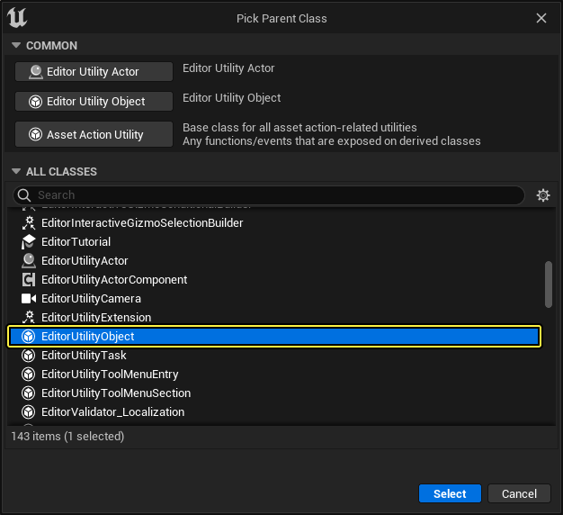
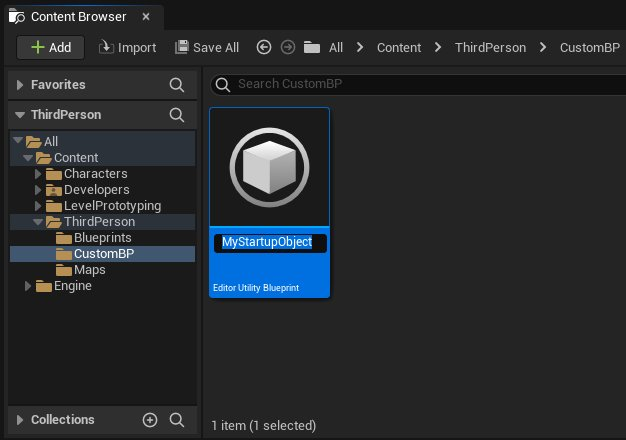
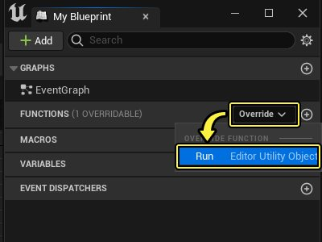
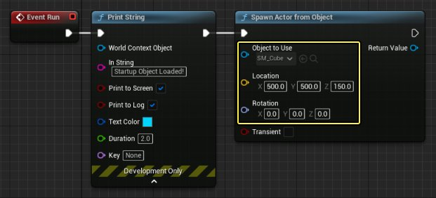
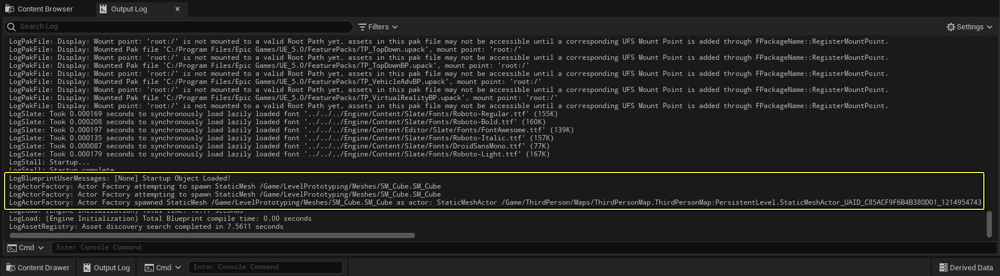
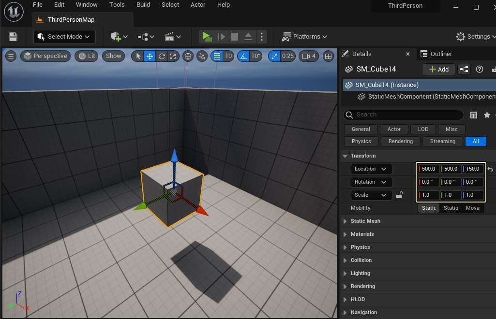
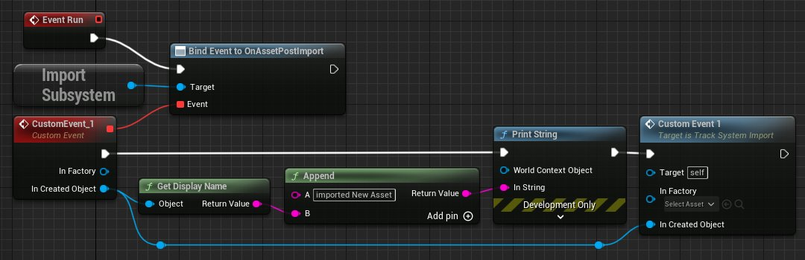

# 在编辑器启动时执行蓝图

> 路径：虚幻引擎5.7文档 / 建立你的开发流程 / 编辑器的脚本与自动化 / 使用蓝图编写编辑器脚本 / 在编辑器启动时执行蓝图

> 原始页面：https://dev.epicgames.com/documentation/unreal-engine/running-blueprints-at-unreal-editor-startup

你可以设置 **虚幻编辑器**，固定在打开项目时运行预定义的蓝图图表。该操作有助于预期设置编辑环境，不受打开项目的用户和所在计算机的影响。例如，根据内容开发流程或生产标准的需要，部分创建的编辑系统需进行初始化，加载或修改内容，从硬盘重新导入 **资源** 以获取最新修改，打开自定义 **编辑器工具控件（Editor Utility Widgets）**，或绑定到编辑会话期间可能发生的事件。

本页指南会对将纯编辑器蓝图类注册为 **启动对象** 的方式进行介绍，以保证启动虚幻编辑器时均调用此类对象上的函数。

> [!NOTE]
> 此类指南适用于直接或间接派生自 **EditorUtilityObject** 的编辑器工具蓝图，及编辑器工具控件。

## 步骤

1. 若尚无派生自 **EditorUtilityObject** 的编辑器工具蓝图或编辑器工具控件，请进行创建。例如，以下指南将新建编辑器工具蓝图：

   1. 在 **内容浏览器** 中点击右键，选择 **编辑器工具（Editor Utility）> 编辑器工具蓝图（Editor Utility Blueprint）**。

      
   2. 选择父类。推荐选择 **EditorUtilityObject**，也可选择派生自 **EditorUtilityObject** 的其他类。点击 **创建（Create）**。

      
   3. 输入新类的描述性名称，并按 **回车键**。

      
2. 双击蓝图类，在 **蓝图编辑器** 中打开。
3. 覆盖该类的 **Run** 函数。

   为此，需将光标悬停在 **我的蓝图（My Blueprint）** 面板中的 **函数（Functions）** 组上，直至显示 **覆盖（Override）** 按钮。点击 **覆盖（Override）** 按钮并在下拉列表中选择 **运行（Run）**。

   

   蓝图编辑器会在 **事件图表** 中新建 **Event Run** 节点。添加要在此处触发的蓝图逻辑。

   例如，此实现将向日志写入消息来表示已调用函数，之后会在编辑器默认启动关卡中生成立方体。

   
4. **编译（Compile）** 并 **保存（Save）** 蓝图类。
5. 关闭虚幻编辑器。
6. 找到 `DefaultEditorPerProjectUserSettings.ini` 文件，其位于 `Project/Config/<platform>/DefaultEditorPerProjectUserSettings.ini` 下的项目文件夹内。在文本编辑器中将其打开。
7. 找到文件的以下部分：

   ```
           [/Script/Blutility.EditorUtilitySubsystem]		
   ```

   若不存在该部分，请进行创建。
8. 对于要作为启动对象的蓝图类，在 `StartupObjects` 阵列中将路径作为新值添加到该类中。路径以 `/Game/` 开头，然后将路径添加到蓝图类，如 **内容浏览器** 中所示。对象名称后跟句点 `.` 字符，然后再次重复对象名称。

   例如，要注册在上述第1步中创建的对象，可使用：

   ```
       [/Script/Blutility.EditorUtilitySubsystem]    StartupObjects=/Game/ThirdPerson/CustomBP/MyStartupObject.MyStartupObject 
   ```

   如需注册多个启动对象，请在各附加行前添加 `+` 字符。例如，三个启动对象的大致配置如下：

   ```
       [/Script/Blutility.EditorUtilitySubsystem]    StartupObjects=/Game/Folder/MyClass.MyClass    +StartupObjects=/Game/AnotherFolder/MyOtherClass.MyOtherClass    +StartupObjects=/Game/AnotherFolder/MyThirdClass.MyThirdClass 
   ```
9. 保存并关闭 `.ini` 文件。
10. 重启虚幻编辑器并重新加载项目。

## 最终结果

重新加载项目时，编辑器工具子系统会为被辨识为启动对象的蓝图类创建实例。对于各实例，其会调用 **Run** 函数的自定义实现。

例如，之前步骤中实现的 **Run** 函数有以下两个效果：

- **输出日志** 中打印的行：

  
- 关卡中心新生成的立方体：

  

## 绑定到编辑器事件

启动对象还可将蓝图类中的自定义事件绑定到其他事件，用户在虚幻编辑器中操作项目内容时可能会发生此类事件。由于任何用户打开项目内容时会固定调用启动对象，因此该设置可确保编辑体验的一致性。

例如，该 **Run** 函数的实现会在编辑器导入新资源时，绑定到 **导入子系统（Import Subsystem）** 触发的事件。在本例中，其会将资源名称打印到屏幕和日志中。还可使用返回的新资源相关信息来执行其他步骤，例如验证新资源的命名或文件夹位置是否符合项目中所用的命名和内容规则。在启动对象中放入此类检查，有助于确保所有向项目贡献内容的用户可进行相同验证步骤。



> [!TIP]
> 从 **Bind Event to...** 节点上的 **事件** 输入向左拖出，选择 **添加事件（Add Event）>添加自定义事件（Add Custom Event）** 以获取公开其他输入的自定义事件节点，如上图所示的 **In Factory** 和 **In Created Object**。

> [!NOTE]
> 启动对象仅可绑定到编辑器启动时现有的其他对象。此外，若绑定对象留下内存（例如关闭并重新打开关卡），绑定将丢失。因此，最安全的方法是绑定到整个编辑会话期间可用的对象，如上例中所示的子系统。

欲了解绑定至蓝图事件的更多相关信息，参阅[事件调度器](../../../../blueprints-visual-scripting/specialized-blueprint-visual-scripting-node-groups/event-dispatchers/index.md)和[绑定和解绑事件](../../../../blueprints-visual-scripting/specialized-blueprint-visual-scripting-node-groups/event-dispatchers/binding-and-unbinding-events/index.md)。欲了解子系统及其访问方式，参阅[编程子系统](https://dev.epicgames.com/documentation/404)。
