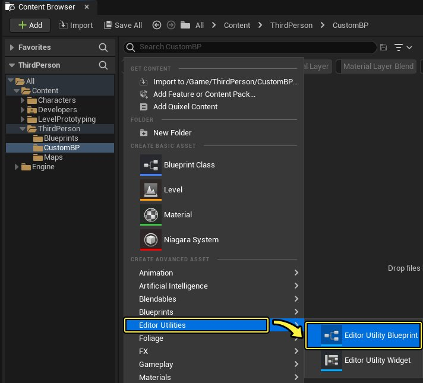
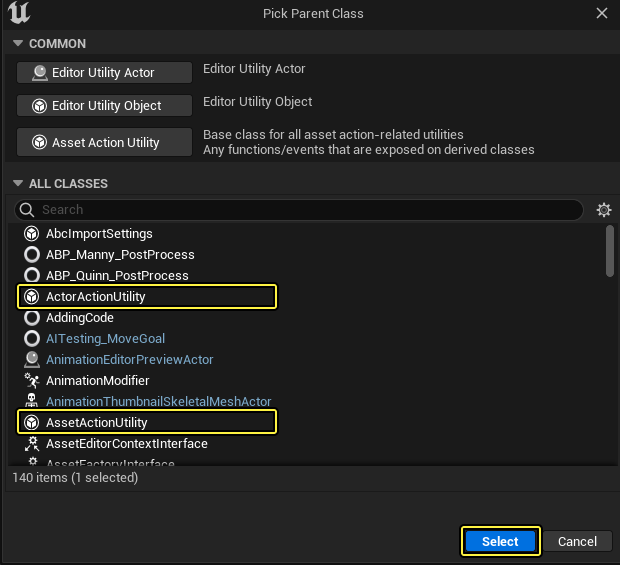
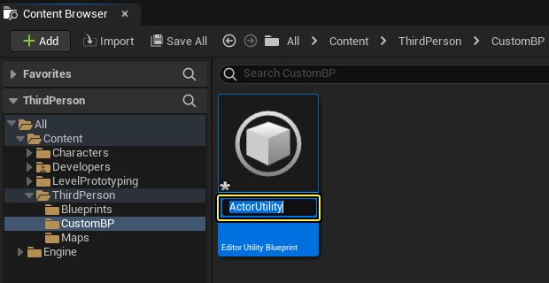
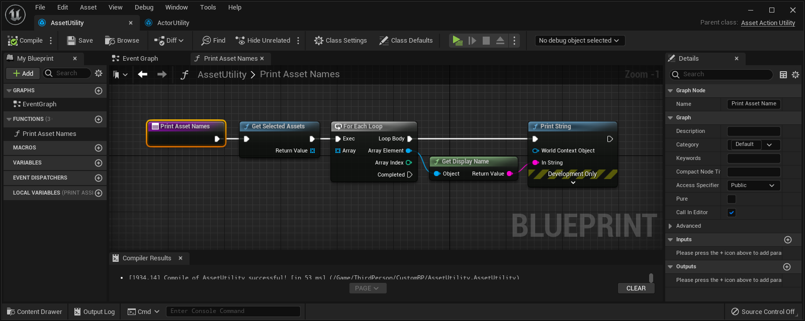
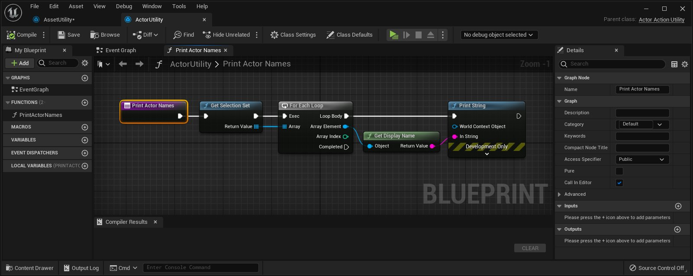
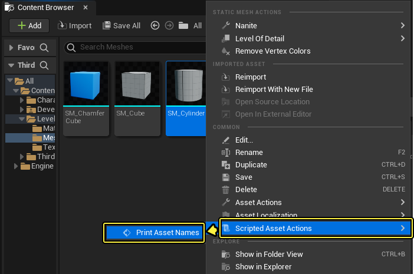
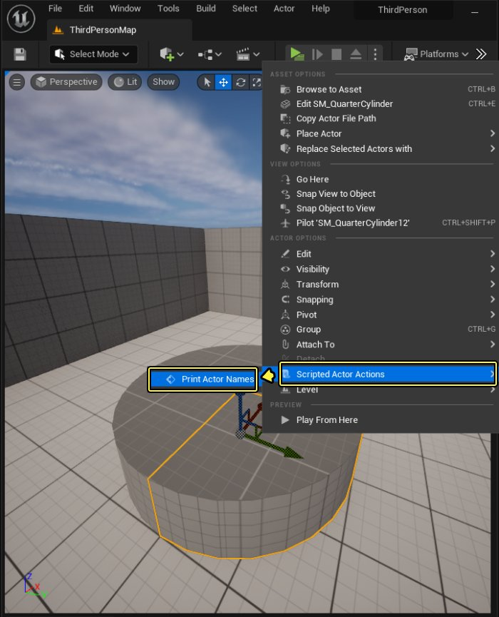

# 脚本化操作

> 路径：虚幻引擎5.7文档 / 建立你的开发流程 / 编辑器的脚本与自动化 / 使用蓝图编写编辑器脚本 / 脚本化操作

> 原始页面：https://dev.epicgames.com/documentation/unreal-engine/scripted-actions-in-unreal-engine

**脚本化操作** 是一种 **编辑器工具蓝图**，右键点击 **内容浏览器** 中的资产，或右键点击 **关卡视口**（如上所示）或 **世界大纲视图** 中的Actor，即可在 **虚幻编辑器** 中进行启动。

蓝图逻辑需拥有对 **资产** 或 **Actor** 集的情境感知时，此类工作流程将十分有用。通常，**脚本化操作** 会获取运行操作时选中资产或Actor的列表，然后修改此类对象或将之纳入图表的考量中。

本页指南将展示创建和启动此类编辑器工具蓝图的方法，以及如何自定义以只应用于特定类型的资产或Actor。

## 步骤

在此过程中，将利用支持脚本化操作的父类来新建编辑器工具蓝图类，同时设置该类的新事件图表（显示为脚本化操作）。

1. 在 **内容浏览器** 中，右键点击要在其中创建新类的文件夹，然后在快捷菜单中选择 **编辑器工具（Editor Utilities）> 编辑器工具蓝图（Editor Utility Blueprint）**。

   
2. 决定是在 **内容浏览器** 中选择的资产上，还是在 **关卡视口** 或 **世界大纲视图** 中选择的Actor上执行脚本化操作。

   - 若要在资产上执行脚本化操作，选择 **AssetActionUtility** 作为父类，然后按 **选择（Select）**。
   - 若要在Actor上执行脚本化操作，选择 **ActorActionUtility** 作为父类，然后按 **选择（Select）**。

   
3. 在 **内容浏览器** 中指定新类的描述性名称。

   

   > [!TIP]
   > 运行该类的脚本化操作时，将隐藏该类命名。若之后要修改脚本化操作或添加新操作，只需将该类与项目的其他蓝图类进行区分即可。
4. 在蓝图编辑器中双击新类以打开。
5. 要创建该类的脚本化操作，可选择新建函数，或在该类的事件图表中新建 **Custom Event** 节点。

   > [!NOTE]
   > 确保在函数条目节点或Custom Event节点上勾选 **在编辑器中调用（Call in Editor）** 复选框。新建函数时将自动完成该操作，但若选择使用Custom Event节点，则须手动完成操作。

   例如，该 **AssetActionUtility** 上的新函数将在内容浏览器中选中的资产列表中迭代，并在 **关卡视口** 中打印各资产命名。

   

   下图显示了在 **ActorActionUtility** 上实现的类似函数。

   

   > [!TIP]
   > **开发（Development）> 编辑器（Editor）** 类别下包含部分有益于脚本化操作的蓝图节点，包括上述范例中的节点，此类节点将返回在运行脚本化操作时选中对象的列表：**Get Selected Assets**（返回 **内容浏览器** 内所有选中资产的引用排列）和 **Get Selection Set**（返回当前在关卡内选中的Actor排列）。
   >
   > 若尚未安装 **编辑器脚本编写工具** 插件，建议进行安装以访问用于使用资产和关卡Actor的额外函数库。参阅[编辑器脚本编写和自动化](../../index.md)。
6. **保存（Save）** 并 **编译（Compile）** 蓝图类。

## 最终结果

保存并编译蓝图类后，根据选择的蓝图类父类，快捷菜单中将显示资产或Actor的新 **脚本化操作（Scripted Actions）** 子菜单。该子菜单包含在蓝图类中设置的所有函数或Custom Event节点。

例如，在 **内容浏览器** 中右键点击一个或多个资产时：

或在 **关卡视口** 或 **世界大纲视图** 中右键点击一个或多个Actor时：

> [!TIP]
> 在 **AssetActionUtility** 或 **ActorActionUtility** 类上设置的所有函数和Custom Event节点均可作为快捷菜单中可用的单独选项。可按需在单个蓝图类中任意创建多个不同脚本化操作，或创建多个蓝图类并在其中分配脚本化操作。

## 将操作限制为特定类

如果你编译并保存了蓝图，然后右键单击关卡中的actor，你可能会发现上下文菜单中出现了 **脚本化Actor动作（Scripted Actor Actions）** 选项。该脚本可用于任何actor类别，所以如果脚本不是为多个类设计的，则可能会@@出现错误。要控制美术师可以影响哪些actor，可以将脚本动作限制为特定类。

要调整支持的类：

1. 在顶部工具栏中，单击

   类默认设置（Class Defaults）

   。
2. 在

   支持的类（Supported Classes）

   栏中，单击加号

   (+)

   图标。
3. 搜索并单击 **静态网格体Actor（Static Mesh Actor）**。

   
4. 编译

   （Ctrl+Alt）并

   保存

   （Ctrl+S）。

## 动态输入

可设置脚本化操作，以需求调用操作的用户的信息。若向函数条目节点或Custom Event节点添加一个或多个 **输入**，在编辑器中运行脚本化操作时均会要求提供该输入。在脚本需要额外信息（每次调用操作时此类信息可能有所不同）时，此设置非常有用。

例如，该函数有三个输入：字符串、Actor对象引用和材质对象引用：

> 图片已省略：A function with inputs

运行该函数的脚本化操作时，编辑器将弹出可设置此类输入值的小窗口：

> 图片已省略：Set input values

> [!NOTE]
> 编辑器将验证所有输入是否与其应匹配的值类型匹配。但此操作无法保证输入必然有值，或者此类值在特定情境中有意义。注意：脚本应处理未指定的输入值，并验证用户提供的输入值。
