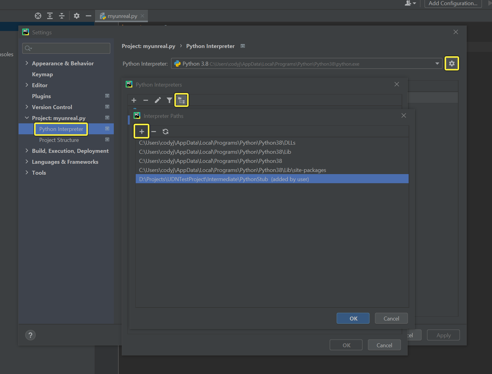
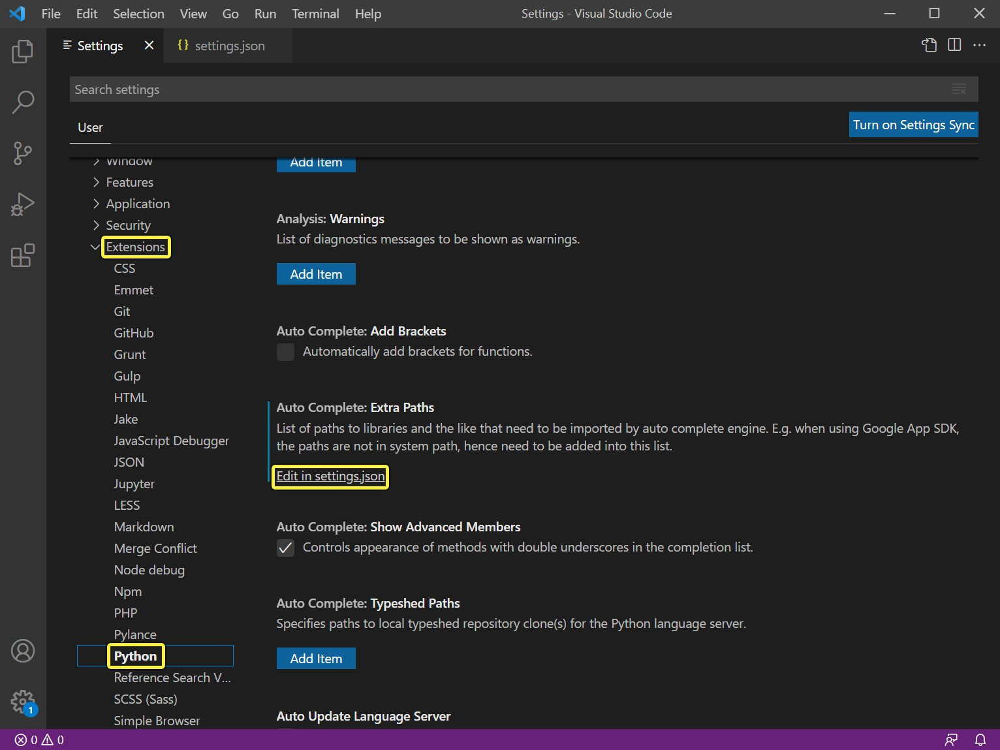
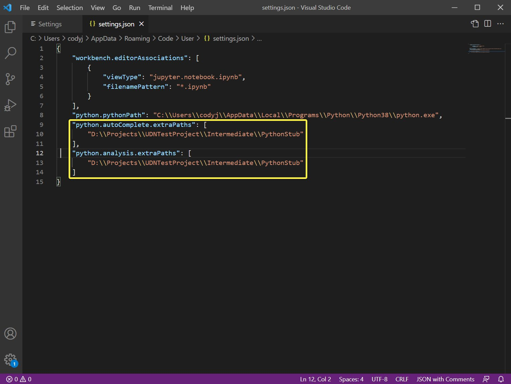

# 为编辑器Python脚本设置自动完成

> 路径：虚幻引擎5.7文档 / 建立你的开发流程 / 编辑器的脚本与自动化 / 使用Python脚本化运行虚幻编辑器 / 为编辑器Python脚本设置自动完成

> 原始页面：https://dev.epicgames.com/documentation/unreal-engine/setting-up-autocomplete-for-unreal-editor-python-scripting

## 先决条件:启用开发人员模式

在设置自动完成之前，你需要让 **虚幻引擎Python插件** 生成所需的存根。要完成此操作，前往 **编辑器偏好设置（Editor Preferences）> 插件（Plugins）> Python**，选择 **开发人员模式（Developer Mode）**，之后重新启动编辑器。生成的存根文件将位于 `PROJECT_DIRECTORY/Intermediate/PythonStub`。

## PyCharm

打开 **设置（Settings）** 窗口，前往 **项目（Project）> Python 解译器（Python Interpreter）**，然后点击齿轮并选择 **全部显示（Show all）**。在 **Python解译器（Python Interpreters）** 窗口中，你可以点击 **路径（Paths）按钮** 并点击 **+**，添加存根文件的位置。



你还需要前往 **帮助（Help）> 编辑自定义属性（Edit Custom Properties）** 并添加以下内容来提高智能提示文件的大小上限：

```
		idea.max.intellisense.filesize = 25000 
```

重新启动PyCharm后，你就可以在虚幻引擎API中看到自动完成菜单中的函数。

## VSCode

前往 **设置（Settings）> 扩展（Extension）> Python** 并找到 **自动完成：更多路径（Auto Complete: Extra Paths）**。点击链接打开 **settings.json** 文件，将路径添加到 **python.autoComplete.extraPaths** 下的存根文件。





重新启动 **Visual Studio Code（VSCode）** 之后，现在应该能够在UE API中看到自动完成菜单中的函数。

## 输入提示

从虚幻引擎5.1开始，Python插件可以生成一个桩代码用于输入提示，（更多关于输入提示的相关信息，参考[PEP 484](https://peps.python.org/pep-0484/))。 输入提示会出现在你的Python IDE自动完成菜单中。输入提示可以进行配置，在虚幻引擎菜单栏中点击 **编辑（Edit） > 编辑器偏好设置（Editor Preferences）**。这样会打开 **编辑器偏好设置（Editor Preferences）** 选项卡。找到 **插件（Plugins） > Python** 来查看可用的Python脚本插件用户设置。要使用输入提示，必须启用 **开发者模式（Developer Mode）**。下表展示了可用的输入提示模式和相关信息。

| 输入提示模式 | 描述 |
| --- | --- |
| **自动完成（Auto-Completion）** | 提示完全一致的参数并返回类型或者方法的类型。 |
| **输入检查（Type Checker）** | 添加全部可能的输入纠正。比如，它会提示你在输入一个 `unreal.Name` 的时候将其替换为一个Python字符串。这样会让自动完成菜单过于杂乱并且难以阅读，但是这个选项在IDE打开输入检查的时候会更有用。 |
| **关闭（Off）** | 完全关闭输入提示。 |

默认情况下， **输入提示模式（Type Hinting Mode）** 设置为 **自动完成（Auto-Completion）**。

请注意，这种提示并不完全准确。在一些情况下，生成桩代码时输入并不明确。在另外的一些情况下，C++反射API在参数或者方法的返回值可以为 `None` 的时候，不能提供足够的信息来准确给出提示

> [!NOTE]
> 每次启动编辑器时都会重新生成存根文件。因此，你可以在将新函数提供给Python之后重新启动编辑器，或启用新插件来确保存根文件保持最新状态。
