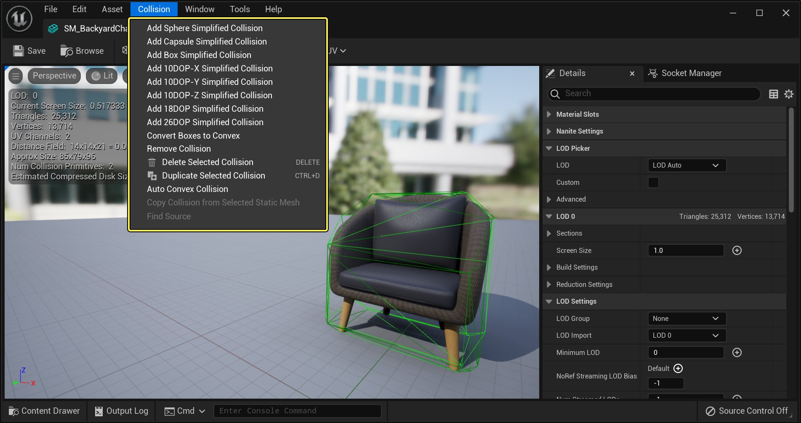
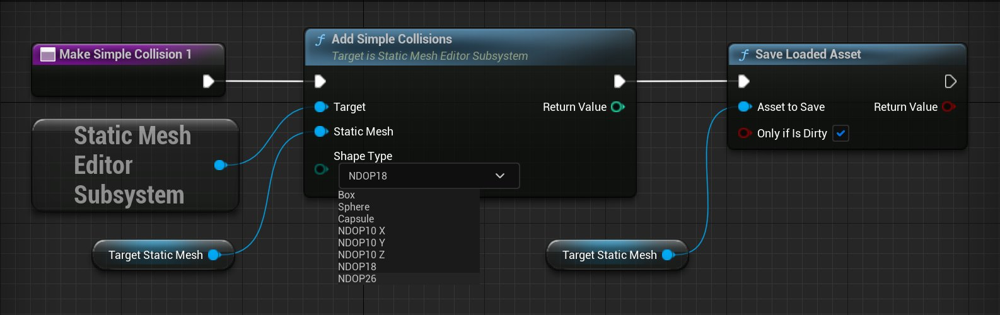
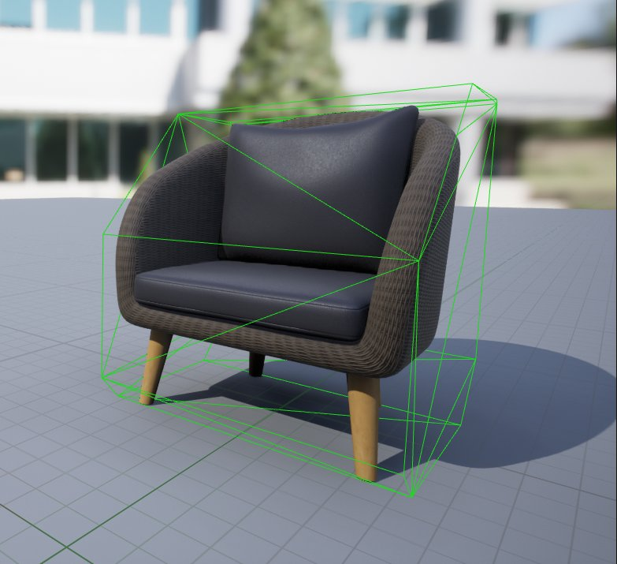
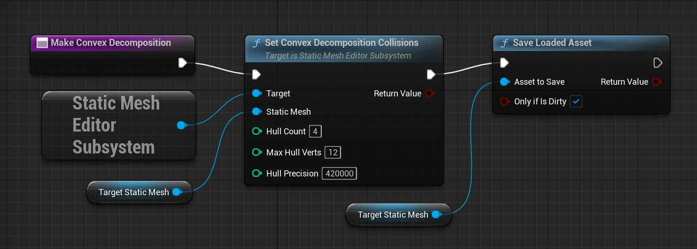
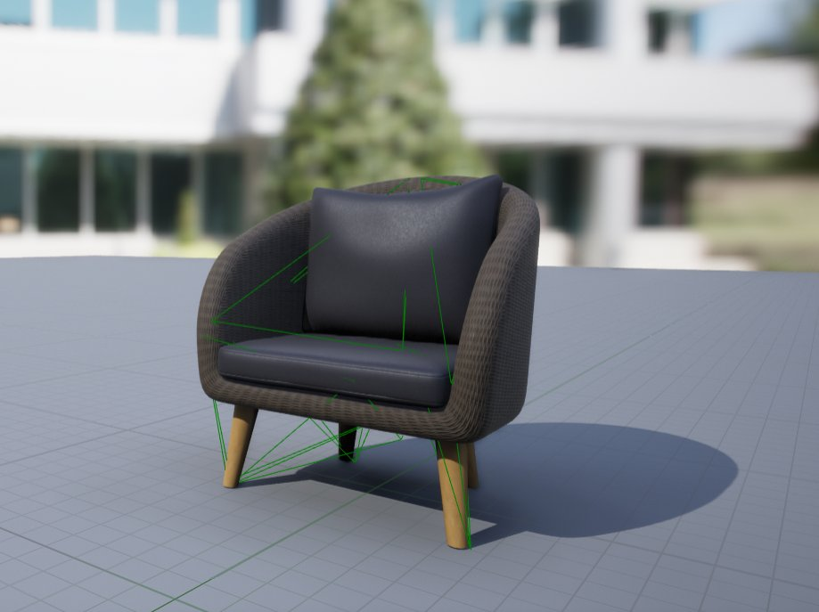
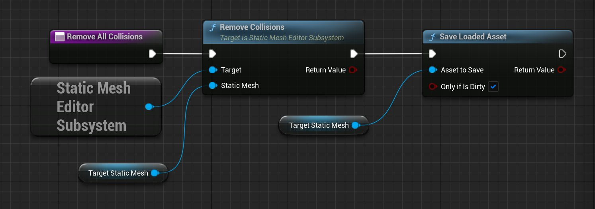

# 在蓝图和Python中设置静态网格体碰撞

> 路径：虚幻引擎5.7文档 / 建立你的开发流程 / 编辑器的脚本与自动化 / 虚幻编辑器脚本使用教程 / 在蓝图和Python中设置静态网格体碰撞

> 原始页面：https://dev.epicgames.com/documentation/unreal-engine/setting-up-collisions-with-static-meshes-in-blueprints-and-python-in-unreal-engine

为了使静态网格体成为关卡中物理模拟的一部分，必须为其设置 **碰撞网格体** 。它表示静态网格体对象在物理模拟中的边界。每当物理系统需要检查其他物理对象是否与网格体碰撞，以及执行高性能光线投射来测试对网格体的碰撞时，都会使用该碰撞网格体。可以使用静态网格体的可见几何体作为其碰撞网格体，但是可见几何体通常过于详细了。即使要提供逼真的效果，物理交互通常也不需要具有如此高的准确性，因此可以通过尽量简化碰撞网格体来提升物理系统的性能。

可以在静态网格体编辑器中自动为静态网格体创建简单的碰撞表示：

点击查看大图。

有关详细信息，请参阅[设置与静态网格体模型的碰撞](../../../../working-with-content/static-meshes/setting-up-collisions-with-static-meshes/index.md)。

在某些情况下，可能需要以编程方式创建这些碰撞网格体表示，而非在静态网格体编辑器中手动创建。例如，需要在同一个项目中设置大量静态网格体对象时，将其逐一打开可能并不现实。你可能希望在用于导入和管理内容的较大自动化流程中一步完成这些碰撞设置。

以下部分将展示如何使用蓝图和Python在虚幻编辑器中自动将上述不同类型的碰撞网格体应用给静态网格体资源。

> [!NOTE]
> 现在还不能使用蓝图或Python来导入另一个静态网格体并将其用作自定义的碰撞网格体。要实现这个目的，可以采用以下任意一种方式：
>
> - 使用静态网格体编辑器用户界面从支持的文件格式导入碰撞网格体。
> - 同时将碰撞网格体作为可见静态网格体导入，使用特定的命名规则注明其代表想要用于碰撞测试的几何体。具体详情，请参见[FBX静态网格体管线](../../../../working-with-content/fbx-content-pipeline/fbx-static-mesh-pipeline/index.md#%E7%A2%B0%E6%92%9E)或[Datasmith概述](../../../../working-with-content/datasmith/datasmith-plugins-overview/index.md)。

选择实现方法：

Blueprints

Python

可在 **编辑器脚本（Editor Scripting） > 静态网格体（Static Mesh）** 类别下找到需要管理静态网格体碰撞的节点。

> [!NOTE]
> 要使用这些节点，蓝图类必须派生自Editor-only类，例如 **PlacedEditorUtilityBase** 类。有关细节，请参阅[使用蓝图脚本化编辑器](../../index.md)。

设置碰撞会修改静态网格体资源。如果要保留所做的更改，接下来还需使用 **保存资源（Save Asset）** 或 **保存已加载的资源（Save Loaded Asset）** 等节点。

可在`unreal.EditorStaticMeshLibrary`类中找到管理静态网格体碰撞所需的大部分函数。

设置LOD会修改静态网格体资源。如果要保留所做的更改，接下来还需要使用 `unreal.EditorAssetLibrary.save_asset()`或`unreal.EditorAssetLibrary.save_loaded_asset()` 等函数。

## 添加简单碰撞形态

要将新的简化碰撞形状添加到静态网格体，请使用 **Add Simple Collisions** 节点（你需要添加 **静态网格体编辑器子系统（Static Mesh Editor Subsystem）** 作为目标，此节点才能起作用）。使用 **形状类型（Shape Type）** 输入可控制你想添加哪种碰撞形状。这些选项与静态网格体编辑器的 **碰撞（Collision）** 菜单中提供的选项匹配。

点击查看大图。

要为静态网格体添加简单碰撞形态，请使用 `unreal.EditorStaticMeshLibrary.add_simple_collisions()` 函数。传递它：

*要修改的 `unreal.StaticMesh` 对象。* 表示要创建的碰撞Primitive的类型的 `unreal.ScriptingCollisionShapeType` 列举中的项。这些选项与静态网格体编辑器的 **碰撞（Collision）** 菜单中提供的选项匹配。

例如：

import unreal asset_path = "/Game/ArchVis/Mesh" def add_box_collision (static_mesh): # 可以改为使用.SPHERE、.CAPSULE、.NDOP10_X、.NDOP10_Y、.NDOP10_Z、.NDOP18、.NDOP26 shape_type = unreal.ScriptingCollisionShapeType.BOX unreal.EditorStaticMeshLibrary.add_simple_collisions(static_mesh, shape_type) unreal.EditorAssetLibrary.save_loaded_asset(static_mesh) # 获取路径中所有资源的列表。 all_assets = unreal.EditorAssetLibrary.list_assets(asset_path) # 将它们全部装入内存。 all_assets_loaded = [unreal.EditorAssetLibrary.load_asset(a) for a in all_assets] # 过滤该列表，使之只包含静态网格体。 static_mesh_assets = unreal.EditorFilterLibrary.by_class(all_assets_loaded, unreal.StaticMesh) # 在列表中的每个静态网格体上运行上面的函数。 list(map(add_box_collision, static_mesh_assets))

请注意，该操作会为静态网格体的现有的任何其他简单碰撞形态添加新的碰撞形态（如有）。如果要先删除现有的碰撞形态，请参阅下面的 *删除所有简单碰撞* 。

点击查看大图。

## 自动生成凸面碰撞

要根据静态网格体的可见几何体为该网格体自动生成凸包碰撞形状，请使用 **Set Convex Decomposition Collisions** 节点（你需要添加 **静态网格体编辑器子系统（Static Mesh Editor Subsystem）** 作为目标，此节点才能起作用）。

点击查看大图。

该节点中的输入与在静态网格体编辑器用户界面选择 **碰撞（Collisions） > 自动凸面碰撞（Auto Convex Collisions）** 时要求你提供的选项完全匹配。它们控制生成的碰撞网格体的复杂度和保真度。一般情况下，值越大，生成的碰撞网格体越接近于静态网格体的可见几何体，但是运行时模拟它的成本也越高。

要从静态网格体的可见几何体为其自动生成凸面碰撞形态，请使用 `unreal.EditorStaticMeshLibrary.set_convex_decomposition_collisions()` 函数。传递它：

*要修改的 `unreal.StaticMesh` 对象。* 三个定义最大凸包数、每个凸包的最大顶点数和凸包精度的整数。这些参数与在静态网格体编辑器用户界面选择 **碰撞（Collisions） > 自动凸面碰撞（Auto Convex Collisions）** 时要求你提供的选项完全匹配。它们控制生成的碰撞网格体的复杂度和保真度。一般情况下，值越大，生成的碰撞网格体越接近于静态网格体的可见几何体，但是运行时模拟它的成本也越高。

例如：

import unreal asset_path = "/Game/ArchVis/Mesh" def set_convex_collision (static_mesh): unreal.EditorStaticMeshLibrary.set_convex_decomposition_collisions(static_mesh, 4, 12, 460000) unreal.EditorAssetLibrary.save_loaded_asset(static_mesh) # 获取路径中所有资源的列表。 all_assets = unreal.EditorAssetLibrary.list_assets(asset_path)# 将它们全部装入内存。 all_assets_loaded = [unreal.EditorAssetLibrary.load_asset(a) for a in all_assets]# 过滤该列表，使之只包含静态网格体。 static_mesh_assets = unreal.EditorFilterLibrary.by_class(all_assets_loaded, unreal.StaticMesh)# 在列表中的每个静态网格体上运行上面的函数。 list(map(set_convex_collision, static_mesh_assets))

在新的网格体生成前，会自动从静态网格体删除所有现有的碰撞网格体。

请注意，相较于使用简单碰撞Primitive，该方法生成的效果比较不容易预测且比较不规则。最好在不规则的网格体上使用，或在可以可视化方式调整生成设置以确保生成的结果足够简单并且非常适合于静态网格体的可见几何体时使用。

点击查看大图。

## 删除所有简单碰撞

你可以使用 **Remove Collisions** 节点清除分配到你的静态网格体的所有碰撞网格体（你需要添加 **静态网格体编辑器子系统（Static Mesh Editor Subsystem）** 作为目标，此节点才能起作用）。

点击查看大图。

删除后，任何"简单"物理碰撞测试都无法发现该网格体，但是考虑静态网格体的可见几何体的"详细"测试仍能够发现它。另请参阅[简单和复杂碰撞](../../../../gameplay-systems/physics/collision/simple-versus-complex-collision/index.md)。

可使用 `unreal.EditorStaticMeshLibrary.remove_collisions()` 函数清除所有指定给静态网格体的碰撞网格体。

例如：

import unreal asset_path = "/Game/ArchVis/Mesh" def remove_collisions (static_mesh): unreal.EditorStaticMeshLibrary.remove_collisions(static_mesh) unreal.EditorAssetLibrary.save_loaded_asset(static_mesh) # 获取路径中所有资源的列表。 all_assets = unreal.EditorAssetLibrary.list_assets(asset_path)# 将它们全部装入内存。 all_assets_loaded = [unreal.EditorAssetLibrary.load_asset(a) for a in all_assets]# 过滤该列表，使之只包含静态网格体。 static_mesh_assets = unreal.EditorFilterLibrary.by_class(all_assets_loaded, unreal.StaticMesh)# 在列表中的每个静态网格体上运行上面的函数。 list(map(remove_collision, static_mesh_assets))

删除后，任何"简单"物理碰撞测试都无法发现该网格体，但是考虑静态网格体的可见几何体的"详细"测试仍能够发现它。另请参阅[简单和复杂碰撞](../../../../gameplay-systems/physics/collision/simple-versus-complex-collision/index.md)。

## 在碰撞中使用LOD

如果已为静态网格体设置了细节层次（Levels of Detail）（LOD），可使用其中一个细节较少的LOD作为碰撞网格体。

调用 `set_editor_property()` 函数（在 `unreal.StaticMesh` 对象上），以将 `lod_for_collision` 属性设置为要使用的LOD索引。例如：

import unreal asset_path = "/Game/ArchVis/Mesh" def use_lod_for_collisions (static_mesh): static_mesh.set_editor_property("lod_for_collision", 3) unreal.EditorAssetLibrary.save_loaded_asset(static_mesh) # 获取路径中所有资源的列表。 all_assets = unreal.EditorAssetLibrary.list_assets(asset_path) # 将它们全部装入内存。 all_assets_loaded = [unreal.EditorAssetLibrary.load_asset(a) for a in all_assets] # 过滤该列表，使之只包含静态网格体。 static_mesh_assets = unreal.EditorFilterLibrary.by_class(all_assets_loaded, unreal.StaticMesh) # 在列表中的每个静态网格体上运行上面的函数。 list(map(use_lod_for_collision, static_mesh_assets))

另请参阅[如何设置LOD碰撞](../../../../working-with-content/static-meshes/creating-and-using-lods/index.md)。

> [!NOTE]
> 尚不可以通过蓝图或Python设置自定义碰撞网格体。要导入自定义网格体并在物理模拟中将它用作静态网格体的碰撞网格体，必须执行以下任一操作：
>
> - 使用静态网格体编辑器用户界面从受支持的文件格式导入碰撞网格体。
> - 导入可见静态网格体时将碰撞网格体一起导入，并使用特殊的命名规范来表明它表示的是你要用于碰撞测试的几何体。有关细节，请参阅
>
>   FBX静态网格体流程
>
>   ，或或
>
>   Datasmith概述
>
>   。
