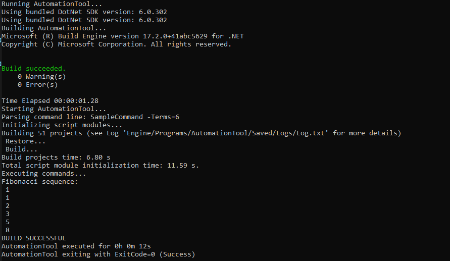
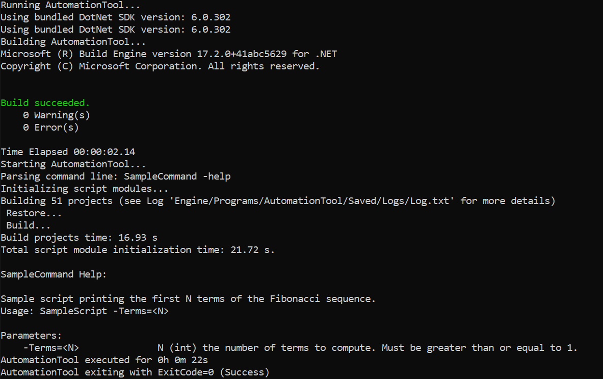

# 创建自动化项目

> 路径：虚幻引擎5.7文档 / 建立你的开发流程 / 用虚幻构建管线 / 自动工具 / 创建自动化项目

> 原始页面：https://dev.epicgames.com/documentation/unreal-engine/create-an-automation-project-in-unreal-engine

要创建特定于项目的自动化脚本，你需要在虚幻自动化工具可以检测到的位置创建新的C#项目。

## 创建自动化项目

以下步骤可引导你创建新的C#自动化项目：

1. 打开命令提示符并从你的虚幻引擎根目录运行

   GenerateProjectFiles.bat

   。

   1. 这将为Visual Studio生成

      Ue5.sln

      文件。
2. 在Visual Studio中打开

   Ue5.sln

   文件。
3. 在Visual Studio中，右键点击主

   解决方案UE5（Solution UE5）

   目录，然后选择

   添加（Add）> 新项目...（New Project...）

   。
4. 打开 **添加新项目（Add a new project）** 窗口后，找到并选择 **C#类库（C# Class Library）** 。

   > [!WARNING]
   > 不要选择 **类库(.NET Framework) Visual C#（Class Library (.NET Framework) Visual C#）** 选项。虚幻自动化工具以.NET 6.0为目标，如果你试图以.NET Framework为目标，将发生错误。
5. 界面上将弹出菜单，提示你选择新C#类库的设置。
6. 将 **项目名称（Project name）** 设置为自动化脚本的名称。例如，可将其称为 `SampleScript.Automation` 。

   > [!NOTE]
   > 自动化脚本首选的命名规范是 `<SCRIPT_NAME>.Automation` 。
7. 项目的

   位置（Location）

   取决于项目是原生虚幻引擎项目还是外来虚幻引擎项目。

   - 对原生项目，请将

     位置（Location）

     设置为

     <UNREAL_ENGINE_ROOT>\Engine\Source\Programs

     。
   - 对外来项目，请将 **位置（Location）** 设置为 `<PROJECT_ROOT>\Build` 。

     > [!NOTE]
     > 如需详细了解原生项目和外来项目的区别，请参阅[管理游戏代码](../../../../cpp-programming/setting-up-your-development-environment-for-cplusplus/managing-game-code/index.md)文档。
8. 点击

   下一步（Next）

   调出

   更多信息（Additional Information）

   窗口。为此类库选择

   框架（Framework）

   。
9. 在下拉菜单中，选择

   .NET 6.0（长期支持）（.NET 6.0 (Long-term support)）

   并点击

   创建（Create）

   。
10. Visual Studio会创建名为

    SampleScript.Automation

    的新文件夹。在新创建的

    SampleScript.Automation

    文件夹中，有一个名为

    Class1.cs

    的文件。将此文件的名称更改为

    SampleScript.cs

    。Visual Studio还会提示你选择是否还想更改所有项目引用。选择

    是（Yes）

    。

### 项目设置

| **设置** | **值** | **说明** |
| --- | --- | --- |
| 名称（Name） | `SampleScript.Automation` | 自动化项目生成脚本会查找带有 `*.Automation.csproj` 扩展名的 `*.csproj` 文件。 |
| 位置（Location） | 原生项目： `<UNREAL_ENGINE_ROOT>\\Engine\\Source\\Programs` 外来项目： `<PROJECT_ROOT>\\Build\\Scripts` | 你可以将项目保存到项目的Build目录或引擎的源目录中。 |
| .NET框架（.NET Framework） | 6.0 |  |

## 配置自动化项目

### 调整构建设置

编写自动化脚本之前，有一些构建设置需要调整：

1. 在Visual Studio

   解决方案资源管理器（Solution Explorer）

   中，找到并选中

   SampleScript.Automation

   。
2. 选中此文件夹之后，转至Visual Studio菜单栏中的

   构建（Build）> 配置管理器...（Configuration Manager...）

   。
3. 在

   配置管理器（Configuration Manager）

   窗口中，找到

   SampleScript.Automation

   项目。
4. 在项目的

   配置（Configuration）

   下拉菜单中，选择

   编辑...（Edit...）

   。

   1. 界面上应该会显示标题为

      编辑项目配置（Edit Project Configurations）

      的新窗口。
   2. 在此窗口中，选择

      Release

      ，点击

      重命名（Rename）

      ，并将

      Release

      更改为

      Development

      。
   3. 界面上应该会显示新窗口，要求你确认将

      Release

      重命名为

      Development

      的选择。点击

      是（Yes）

      并关闭这两个打开的窗口。

### 配置项目属性

现在你必须为自动化项目配置输出路径：

1. 在Visual Studio

   解决方案资源管理器（Solution Explorer）

   中，找到并选中

   SampleScript.Automation

   。
2. 右键点击此文件夹，然后选择

   属性（Properties）

   。
3. 在

   构建（Build）

   选项卡下，选择你所需的

   基础输出路径（Base output path）

   。我们在此需要将输出路径设置为

   bin\

   。

> [!NOTE]
> 如果使用外来虚幻引擎项目，那么你需要打开 `.csproj` 文件，并更新ProjectReference才能使用 `$(EngineDir)` ：
>
> ```
> 	<ProjectReference Include="$(EngineDir)\Source\Programs\AutomationTool\AutomationUtils\AutomationUtils.Automation.csproj" />
> ```

### 验证自动化项目

在继续之前，首先验证我们的项目是否已成功被虚幻自动化工具检测为新的自动化项目。要验证项目配置是否正确，请先关闭Visual Studio。右键单击项目的 `*.uproject` 文件并运行 `GenerateProjectFiles.bat` 。打开生成的Visual Studio文件，然后找到 `..\Programs\Automation` 。新的自动化项目 `SampleScript.Automation` 现在应该会显示在此目录中。这意味着，虚幻自动化工具已成功检测到我们的新自动化项目。

### 添加项目引用

现在你可以使用虚幻自动化工具注册你的自动化项目：

1. 在Visual Studio

   解决方案资源管理器（Solution Explorer）

   中，找到并选中

   SampleScript.Automation

   。
2. 右键点击

   SampleScript.Automation

   并选择

   添加（Add）> 项目引用...（Project Reference...）

   。
3. 这将打开标题为

   引用管理器 - SampleScript.Automation（Reference Manager - SampleScript.Automation）

   的窗口。
4. 找到

   AutomationUtils.Automation

   并选中名称旁边的复选框，然后点击

   确定（OK）

   。

## 向自动化脚本添加代码

[创建自动化项目](#%E5%88%9B%E5%BB%BA%E8%87%AA%E5%8A%A8%E5%8C%96%E9%A1%B9%E7%9B%AE)和[配置自动化项目](#%E9%85%8D%E7%BD%AE%E8%87%AA%E5%8A%A8%E5%8C%96%E9%A1%B9%E7%9B%AE)小节已说明如何创建名为 `SampleScript.Automation` 的自动化项目。在此文件夹中，你还创建了名为 `SampleScript.cs` 的C#文件。我们会在此文件中添加自动化脚本命令。

我们在此会编写一个函数，将斐波纳契数列的项打印到命令行，截至调用自动化脚本时用户输入的命令行参数所指定的项数。该示例演示了自动化脚本的以下特征：

- 帮助命令
- 命令行输入
- 命令行输出
- 日志记录

### 自动化脚本代码

下面是此自动化脚本示例的示例代码。复制此代码示例并粘贴到 `SampleScript.cs` 中。

```
	using AutomationTool; 	namespace SampleScript.Automation	{		// 使用[Help()]属性记录命令及其参数的文档。		[Help("Sample script printing the first N terms of the Fibonacci sequence.")]		[Help("Usage: SampleScript -Terms=<N>")]		[Help("Terms=<N>", "N (int) the number of terms to compute.Must be greater than or equal to 1.")] 		// BuildCommand是所有命令的基类。		public class SampleCommand : BuildCommand		{			public override void ExecuteBuild()			{				// ParseParamInt()方法将检索此示例的命令行参数。				// ParseParam()将检索布尔值，ParseParamValue()将检索字符串。				int NumTerms = ParseParamInt("Terms");				if (NumTerms < 1)				{					throw new ArgumentException("Invalid number of terms specified. Enter -help for syntax.");				}				else				{					LogInformation("Fibonacci sequence:"); 					int TermA = 1;					int TermB = 1; 					for (int i = 0; i < NumTerms; i++)					{						LogInformation(" {0}", TermA); 						int TermC = TermA + TermB;						TermA = TermB;						TermB = TermC;					}				}			}		}	}
```

## 执行自动化脚本

现在你可以开始运行自动化脚本：

1. 打开命令提示符并找到你的

   UNREAL_ENGINE_ROOT

   目录。
2. 输入命令：

   RunUAT.bat SampleCommand -Terms=6
3. 此命令将编译并运行AutomationTool ，执行

   SampleScript.cs

   文件中的

   SampleCommand

   。
4. 如果一切正常运作，你应该会在命令提示符中看到类似于以下输出的内容：

   

   点击查看大图。
5. 你还可以运行：`RunUAT.bat SampleCommand -help` ，显示 `SampleCommand` 类中的 `[Help(...)]` 消息文本中的信息。

   

   点击查看大图。
