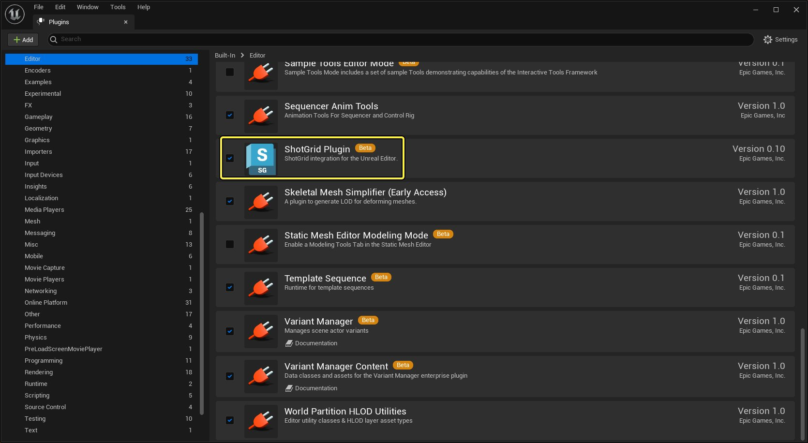
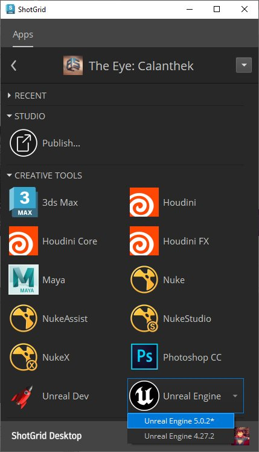
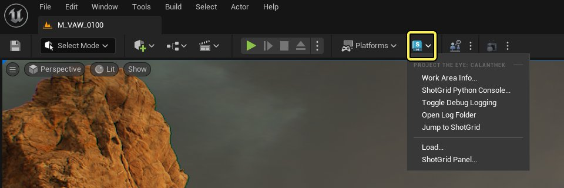
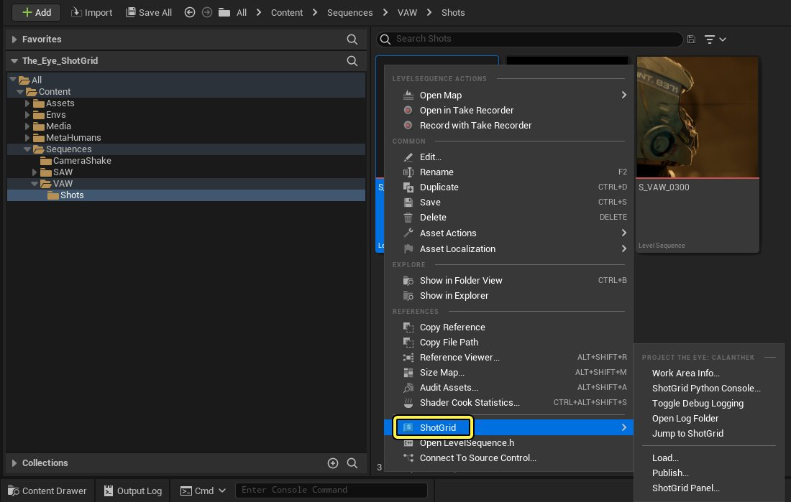
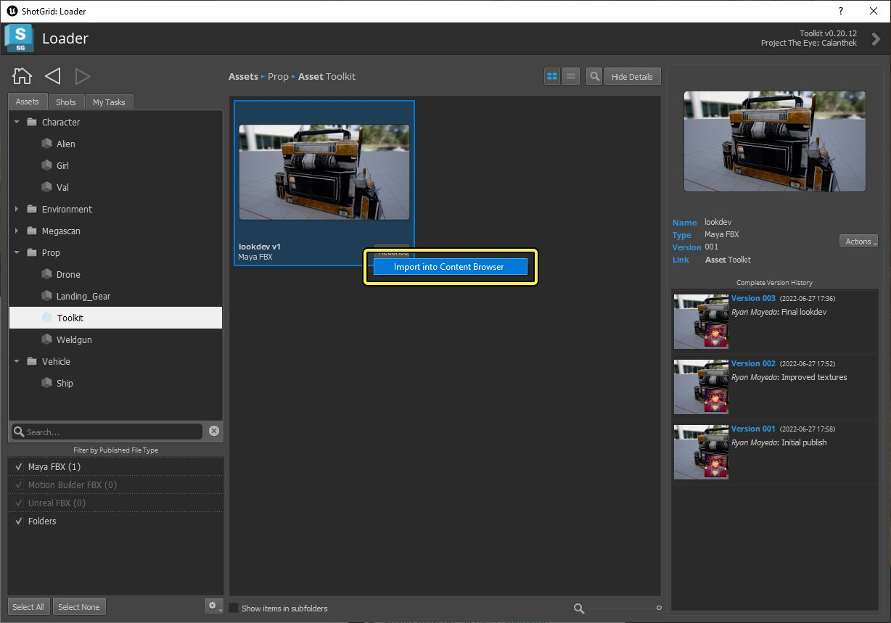
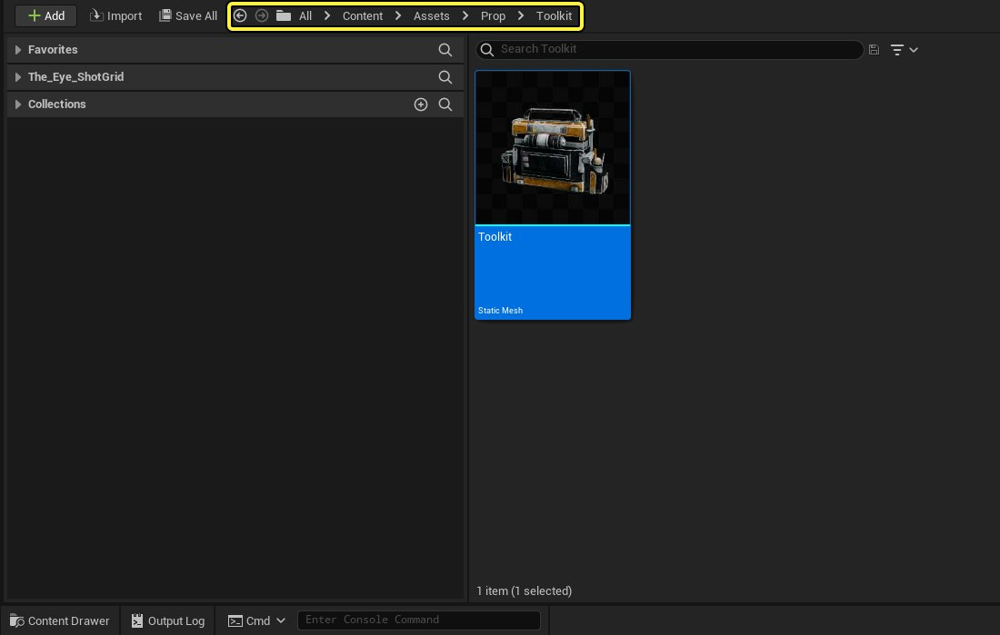
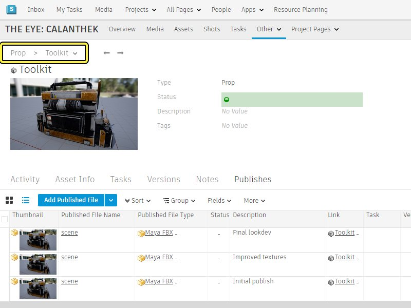
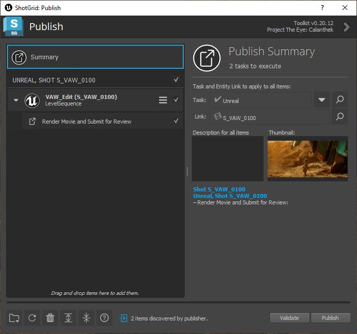

# 虚幻引擎与Autodesk ShotGrid

> 路径：虚幻引擎5.7文档 / 建立你的开发流程 / 虚幻引擎与Autodesk ShotGrid

> 原始页面：https://dev.epicgames.com/documentation/unreal-engine/using-unreal-engine-with-autodesk-shotgrid

> 图片已省略：虚幻编辑器中的Autodesk ShotGrid集成

Epic Games已携手Autodesk，共同将虚幻引擎集成到ShotGrid制片管理系统中。现在你可以将虚幻编辑器作为ShotGrid内容构建流程的重要组成部分：你可以从ShotGrid中加载资产并在虚幻编辑器中处理，并将虚幻引擎项目中的资产和Actor发回ShotGrid，供组织中的其他人员处理。

- 如果你对ShotGrid尚不熟悉，请参阅其

  功能页面

  和

  帮助中心

  以了解它的功能。
- 如果你之前尚未使用过与ShotGrid集成的桌面应用程序，请仔细阅读

  集成用户手册

  ，了解有关它引入的工作流程和应用程序的基本知识，以帮助你的团队跨多个不同的内容创建工具进行协作。

> [!NOTE]
> 虽然该集成包含了ShotGrid管线工具包的所有基本功能，但它并不是一个完备的流程，无法解决你在全面制片流程中使用虚幻引擎内容的所有需求。我们希望基于你提供的反馈不断完善此集成，以尽快达到此目标。目前，如果你已在使用ShotGrid（或正在考虑采用它），请将此集成看作有用的起始点，以及有经验的流程开发人员进行构建的基础。

## 设置虚幻引擎项目

任何虚幻引擎项目都可与ShotGrid配合使用。但是，你必须首先在项目中启用"ShotGrid插件（ShotGrid Plugin）"。

1. 在虚幻编辑器的主菜单中，选择

   编辑（Edit） > 插件（Plugins）

   以打开

   插件（Plugins）

   窗口。
2. 在 **编辑器（Editor）** 分段中，找到 **ShotGrid插件（ShotGrid Plugin）** 并勾选 **启用（Enabled）** 复选框。

   
3. 按照提示重启项目。

到目前为止，你不会看到虚幻编辑器UI有任何变化，这是正常的情况。请参阅下一部分，了解如何从ShotGrid Desktop应用程序启动虚幻编辑器。

> [!TIP]
> 为项目启用ShotGrid插件同时也会启用 **Python编辑器脚本插件（Python Editor Script Plugin）** 。启用此插件之后，可在虚幻编辑器中运行Python代码来处理内容。有关详情，请参阅[使用Python脚本化运行编辑器](https://dev.epicgames.com/documentation/404)。

## 启动虚幻编辑器

要在会话中激活ShotGrid集成，必须从ShotGrid Desktop应用程序启动虚幻编辑器。

如果你之前尚未在网页上使用过ShotGrid，请参阅[建立一个ShotGrid项目文档](setting-up-a-shotgrid-project-to-work/index.md)以了解入门信息。

1. 启动

   ShotGrid Desktop

   并使用用户账号登录组织的ShotGrid站点。
2. 打开任何

   已配置为使用虚幻编辑器的

   ShotGrid项目。
3. ShotGrid Desktop接着会扫描计算机以查找虚幻引擎安装，并在 **应用程序（Apps）** 页面上提供快捷方式：

   

   点击其中一个快捷方式。
4. 在

   虚幻项目浏览器（Unreal Project Browser）

   中，选择一个已启用"ShotGrid插件（ShotGrid Plugin）"的项目，然后点击

   打开（Open）

   。

## ShotGrid菜单

在ShotGrid项目环境中运行虚幻编辑器时，将会看到主工具栏中添加了ShotGrid菜单：

你也可以在 **内容浏览器（Content Browser）** 中右键点击 **资产（Assets）** ，来打开相同的菜单。

> [!NOTE]
> ShotGrid中的一些集合会对上下文做出反应并且根据你的选择提供对应的功能。

| 选项 | 说明 |
| --- | --- |
| 打开/关闭调试日志记录（Toggle Debug Logging） | 确定ShotGrid集成是否将调试消息写入"输出日志（Output Log）"和磁盘上的日志文件。请参阅下面的[调试日志](#%E8%B0%83%E8%AF%95%E6%97%A5%E5%BF%97%E8%AE%B0%E5%BD%95)。 |
| 打开日志文件夹（Open Log Folder） | 打开计算机上包含你的ShotGrid日志文件的位置。 |
| 跳转到ShotGrid（Jump to ShotGrid） | 在系统的默认Web浏览器中打开当前ShotGrid项目。 |
| 工作区信息（Work Area Info...） | 打开ShotGrid的 **当前工作区（Your Current Work Area）** 工具，它显示当前项目、环境设置和正在运行的工具包应用程序。有关细节，请参阅[ShotGrid文档](https://shotgunsoftware.zendesk.com/hc/en-us)。 |
| 加载（Load...） | 打开ShotGrid的 **加载器（Loader）** 工具。请参阅下面的[将ShotGrid中的内容加载到虚幻编辑器中](#%E5%B0%86shotgrid%E4%B8%AD%E7%9A%84%E5%86%85%E5%AE%B9%E5%8A%A0%E8%BD%BD%E5%88%B0%E8%99%9A%E5%B9%BB%E7%BC%96%E8%BE%91%E5%99%A8%E4%B8%AD)。 |
| 发布（Publish...） | 打开ShotGrid的 **发布（Publish）** 工具。请参阅下面的[将虚幻编辑器中的内容发布到ShotGrid中](#%E5%8F%91%E5%B8%83%E5%86%85%E5%AE%B9)。通常需要右键点击要发布的资产或Actor来打开此工具。从工具栏打开此面板时，它不支持从虚幻会话中拖放资产或Actor。 |
| ShotGrid面板（ShotGrid Panel...） | 打开 **ShotGrid面板（ShotGrid Panel）** 工具。使用此选项可查看ShotGrid项目中正在发生的所有活动，而不必离开虚幻编辑器。有关细节，请参阅[ShotGrid文档](https://shotgunsoftware.zendesk.com/hc/en-us)。 |

## 将ShotGrid中的内容加载到虚幻编辑器中

ShotGrid工具包中有一个 **加载器（Loader）** 应用程序，你可使用它在虚幻编辑器中将美术师发布到ShotGrid的内容导入虚幻项目中。

- 要启动"加载器（Loader）"应用程序，请从ShotGrid菜单中选择

  加载（Load...）

  。
- 在"加载器（Loader）"中，你可以浏览已发布到ShotGrid项目中或与ShotGrid任务相关的全部资产：

  
- 选择要导入的一个或多个资产，并将其导入到内容浏览器中。为此，你可以右键点击资产并从快捷菜单选择

  导入到内容浏览器中（Import into Content Browser）

  ，或点击任何已选中资产的

  操作（Actions）

  按钮并选择

  导入到内容浏览器中（Import into Content Browser）

  。
- 虚幻集成当前支持从ShotGrid中导入FBX文件。它使用内置FBX导入流程在虚幻引擎将它们转化为静态网格体。
- [ShotGrid工具包的模板系统](https://developer.shotgridsoftware.com/)可以使用来自制片追踪数据库中的元数据，帮助你将导入的已发布内容整理到虚幻编辑器的内容浏览器中的文件夹中。你可以利用这一点，从ShotGrid获取数据，在项目中自动化运行命名规则的最佳实践。

  

  
- 有关使用

  加载器（Loader）

  应用程序的细节，请参阅

  ShotGrid加载器文档

  。

## 将虚幻编辑器中的内容发布到ShotGrid中

ShotGrid工具包中有一个 **发布（Publish）** 应用程序，你可使用它在虚幻编辑器中将在虚幻编辑器中创建或修改的内容导出到ShotGrid项目。然后，使用虚幻编辑器或其他应用程序的其他美术师可使用自己的ShotGrid"加载器（Loader）"应用程序来导入该内容，并在下游使用它。或者，组织中的其他人可在ShotGrid网页应用程序中审核你在虚幻编辑器中所做的工作。

- 要启动"发布（Publish）"应用程序，请在内容浏览器中右键点击要发布的资产，然后从ShotGrid菜单中选择

  发布（Publish...）

  。
- "发布（Publish）"应用程序将列出所有你已选择并且它能够导出的项。

  
- 虚幻集成当前支持发布：

  - 静态网格体资产

    。虚幻集成使用内置的FBX导出器将这些资产作为FBX文件导出到ShotGrid中。
  - 关卡序列

    。可在ShotGrid网页应用程序中或在桌面上被渲染到电影文件并导出到ShotGrid以供在RV中查看。
- 在"发布（Publish）"应用程序中，可以为要发布的每个虚幻资产添加说明和缩略图。这有助于下游的美术师和审核人员了解所发布的内容。
- 以喜欢的方式设置好所有要发布的资产后，点击

  发布（Publish）

  将其全部导出为FBX文件，并使其在项目的共享存储位置中对于其他ShotGrid应用程序可用。
- 有关使用

  发布（Publish）

  应用程序的细节，请参阅

  ShotGrid集成用户手册

  。

## 从Maya发布内容并在虚幻中渲染

`tk-config-unrealbasic` 管线配置包含了一个用于 **Maya** 的 **Publish** 钩子，提供了完整的"Maya到虚幻再到ShotGrid"资产审核工作流程，可以在激活时会自动执行以下操作：

- 将模型从

  Maya

  导出为FBX文件。
- 将导出的

  FBX

  发布到ShotGrid数据库和磁盘上。
- 将FBX文件导入到一个

  虚幻编辑器（Unreal Editor）

  模板项目用于转盘。
- 在

  虚幻编辑器（Unreal Editor）

  中使用

  影片渲染队列（Movie Render Queue）

  为模型执行实时转盘渲染。
- 将渲染上传到

  ShotGrid

  进行审核。

> 图片已省略：发布Maya内容

你可以根据自己的资产审核要求来自定义虚幻编辑器模板项目。

## 调试日志记录

ShotGrid集成会将关于它所执行的一切操作的消息记录到虚幻编辑器中的 **输出日志（Output Log）** 中。这些消息都以 `LogPython` 类别记录：

> 图片已省略：ShotGrid的调试日志记录

它还将针对你的平台将相同消息记录到 `tk-unreal.log` 和 `tk-desktop.log` 文件中（位于[ShotGrid日志文件夹](https://developer.shotgridsoftware.com/38c5c024/)中）。你可以随时从ShotGrid菜单中选择 **打开日志文件夹（Open Log Folder）** ，直接转至此文件夹。

这些日志消息有助于你观察集成正在执行哪些任务，并诊断问题或异常行为。但是，默认情况下，集成会以最详细的方式记录消息。如果要减少输出到“输出日志（Output Log）”的消息数量，你可以从ShotGrid菜单选择 **切换调试日志记录（Toggle Debug Logging）** 来禁用日志记录。
