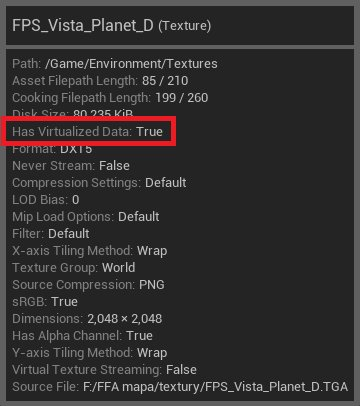

# 虚拟资产概述

> 路径：虚幻引擎5.7文档 / 建立你的开发流程 / 虚拟资产 / 虚拟资产概述

> 原始页面：https://dev.epicgames.com/documentation/unreal-engine/overview-of-virtual-assets-in-unreal-engine

随着项目逐渐变大并来到开发后期，资产的大小和数量都会增加。这会产生多个常见的痛点：

- 通过源码控制同步大项目会让所有开发人员花费越来越长的时间。这有可能为同步新工作空间造成很高的机会成本。
- 更大的项目为每个单独的开发人员使用大量硬盘空间。
- 网速缓慢时，开发人员若传输大型文件和使用大量数据，同步速度会慢于其团队成员。
- 源码控制系统经常执行重复工作，分发相同文件的多个副本。

**虚拟资产（Virtual Assets）** 提供了更快速、更高效的方法，随着项目大小的增加，在所有团队成员之间同步数据。虚拟资产系统的核心目标是将编辑器批量数据独立于核心资产元数据进行存储，从而降低项目的磁盘空间要求。

本指南概述了虚拟资产的运作方式以及如何在项目中使用它们。

## 虚拟资产的运作方式

使用[资产](../../../understanding-the-basics/assets-and-content-packs/index.md)时，用户只需要有关其资产的极简信息，以便在编辑器中显示。 例如，[纹理](../../../designing-visuals-rendering-and-graphics/textures/index.md)只需要缩略图和编辑器属性（例如坐标和比例），即可显示在内容浏览器中。除此之外，纹理的 `.uasset` 文件的大部分是像素数据，用户可能从不会调用它们进行加载。

虚拟资产将此信息分为两个部分：

- **核心资产元数据** - 当资产在源码控制中时存在的部分。
- **批量数据** - 资产数据的主要部分，保存在源码控制中单独位置中的共享[**派生数据缓存（Derived Data Cache (DDC)）**](../../using-derived-data-cache/index.md)中。

这样就可以在源码控制中同步项目时仅同步核心资产数据。然后，你可以像在你的计算机上那样浏览资产，根据需要选择性同步和加载其批量数据。虚拟资产还支持使用不同的功能开发分支，这样就可以防止尚未稳定的试验性功能影响其他团队成员。

## 虚拟资产的优势

虚拟资产具有以下优势。这些优势在数据占用量不断增加的大项目上最明显，但所有规模的项目都能受益。

#### 更快同步到项目

单独的贡献者仅在需要时同步文件的批量数据。这样会使用少得多的数据，这在没有高速连接的情况下很有用，并会缩短提取项目所需的同步时间。这尤其适合有大量资产积压的在线服务游戏。

#### 存储更少数据

批量数据主要存在于你的源码控制中或集中位置的派生数据缓存中，而不是单独开发人员的硬盘上。这意味着，你的项目会为你的团队成员使用更少的硬盘空间。空间节省量取决于项目中有哪些类型的资产，但硬盘使用量通常会减少4/5或更多。

#### 减少重复

如果你的项目有多个工作空间，这可能导致许多相同文件重复。如果你将虚拟资产用于共享DDC，这些文件会去重，进一步减少单独用户的计算机上的占用量。

## 虚拟资产的要求

必须满足以下要求，才能在项目中使用虚拟资产。

### 源码控制

要使用虚拟资产，你需要将项目与Perforce集成。我们还推荐使用虚幻编辑器检入工作流程，因为这可确保文件在检入时会虚拟化。

### 共享DDC（可选）

使用虚拟资产时不需要使用派生数据缓存，但推荐这样做，因为其性能优于访问Perforce。DDC后端应该仅用作缓存存储，因为DDC用作持久存储通常不安全。

### 互联网连接

如果你的用户在访问共享数据缓存时，拥有可靠、快速的网络连接，那么虚拟资产运行起来效果不错。如果网络不佳，那么用户最好提前处理好同步和存储空间相关的问题，否则可能会遇到显著的卡顿。

在无法成功拉取负载（payload）时，虚幻编辑器会无法继续执行，因为此时数据损坏的风险很高。用户可以试着重新拉取内容或退出编辑器。

> [!TIP]
> 如果你的团队无法获得可靠的互联网连接，则不建议使用虚拟资产系统。

## 如何部署虚拟资产

虚拟资产目前是测试版功能，并且默认情况下禁用。你可以在项目的 `DefaultEngine.ini` 文件中添加以下属性来将其启用：

DefaultEngine.ini

```
	[Core.ContentVirtualization]	SystemName=Default 	[Core.VirtualizationModule]	BackendGraph=VABackendGraph_Example 	[VABackendGraph_Example]	PersistentStorageHierarchy=(Entry=SourceControlCache)	CacheStorageHierarchy=(Entry=DDCCache)	SourceControlCache=(Type=p4SourceControl, DepotRoot=[asset location])	DDCCache=(Type=DDCBackend)
```

在上面的示例中，将"[asset location]"替换为你的Perforce服务器上存储虚拟化有效负载的路径位置。请务必在路径前后加上双引号。

这些设置会为当前支持的所有资产启用虚拟化。从此时开始，你使用编辑器或虚幻虚拟化工具（Unreal Virtualization Tool）提交到仓库的所有使用资产都自动虚拟化。有效负载虚拟化后，将永久存储在你指定的Perforce位置中，并且会使用你的项目常用DDC设置在DDC中进行临时缓存，以便更快地访问。

要检查数据包是否已虚拟化，请将鼠标悬停在内容浏览器中的相应资产上。如果"有虚拟化数据（Has Virtualized Data）"的提示文本条目为 `true` ，则资产已成功转换为使用虚拟资产系统。



如需详细了解如何配置虚拟资产，包括以上配置文件，请参阅[虚拟资产快速入门指南](../virtual-assets-quickstart/index.md)。

### 如何手动定位文件

如果你想虚拟化资产而不必更改文件，请使用 **虚幻虚拟化工具（Unreal Virtualization Tool）** 对其进行转换。此工具的源代码位于 `Engine\Source\Programs\UnrealVirtualizationTool\` 中。编译虚幻虚拟化工具之后，使用以下参数在命令行中运行它：

Command Line

```
	-ClientSpecName=[Workspace Name] -Mode=Changelist -Changelist=[Changelist Number]
```

- **ClientSpecName：** 要从中提交的工作空间的名称。
- **Changelist：** 要虚拟化和提交的变更列表。

目标变更列表中包含的所有文件都将转换为使用虚拟资产，然后提交。

### 定义你的项目的后端

**后端图表** 定义了虚幻引擎在何处存储项目后端中的虚拟资产。这主要由两个列表定义：

- **CacheStorageHierarchy：** 用于加快提取操作的快速后端。最好在这些后端中查找有效负载，但这不是必需操作。
- **PersistentStorageHierarchy：** 更缓慢，但更可靠的后端。你必须始终能够在持久存储中查找文件。

开发人员提取有效负载时，系统会首先查看CacheStorageHierarchy中的后端，如果不能在其中某个后端中找到请求的数据，它将回退为PersistentStorageHierarchy。如果任一列表包含多个后端条目，系统会按列出的顺序处理它们，因此它们应该按从最快到最慢的顺序列出。通常，CacheStorageHierarchy包含共享DDC，而PersistentStorageHierarchy会参考你的源码控制系统。

你可以在 `DefaultEngine.ini` 文件中定义后端图表以及虚拟资产的其他配置变量。下面是带有占位符名称的示例后端图表：

DefaultEngine.ini

```
	[VABackendGraph_Example]	PersistentStorageHierarchy=(Entry=SourceControlCache)	CacheStorageHierarchy=(Entry=DDCCache)	SourceControlCache=(Type=p4SourceControl, DepotRoot="...")	DDCCache=(Type=DDCBackend)
```

要定位后端图表，请将 `[Core.ContentVirtualization]` 下的 `BackendGraph` 变量设置为你想使用的图表的名称。

DefaultEngine.ini

```
	[Core.ContentVirtualization]	BackendGraph=VABackendGraph_FileSystem
```

如需详细了解如何构建后端图表，请参阅[虚拟资产的后端图表](../backend-graphs-for-virtual-assets/index.md)页面。

## 虚拟资产的指南

以下小节提供了关于你应该如何将虚拟资产合并到项目中的建议。

### 虚拟化资产的方法

如果你要开始新项目，你应该立即开始使用虚拟资产。这样你的团队可获得所有性能优势，而没有稍后添加虚拟资产时可能发生的问题，从而带来最顺畅的开发体验。

如果你要将虚拟资产添加到现有项目，则需要考虑是要使用手动、批量还是滚动方法来添加此支持。哪种方法适合你的项目取决于其范围和你的制作时间表。

#### 批量虚拟化

同时虚拟化整个项目可尽快获得最佳同步性能，但项目越大，这样做的风险就越高。所有二进制内容都必须检入，才能切换。此外，项目的所有批量数据会同时推送到共享DDC，这会造成潜在的安全风险。这可能对项目带来重大干扰，这可能对于大项目的后期制作阶段尤其不可行。

#### 批量虚拟化

要避免干扰，你可以使用脚本通过预先确定的一组变更列表定期运行虚幻虚拟化工具，有效地批量虚拟化资产。这样就可以分阶段处理不同的团队或功能，同时最终确保你在全局应用虚拟资产使用。

#### 手动虚拟化

仅虚拟化特定文件夹可更大程度地控制哪些资产在共享DDC中有批量数据，还可以更轻松地分阶段推出虚拟资产。但是，你只会提高你直接关注的功能或文件夹中的同步性能。

要立即获得最大优势，同时尽可能减少对项目的干扰，你应该针对项目中最大的资产。你还可以安全地针对很长时间没有更改的资产。

要确保你广泛应用虚拟资产的优势，你可以在团队成员保存其文件时虚拟化资产。虽然这样不好捕获团队没有积极处理的资产，但可确保逐渐稳定引入虚拟资产。

#### 指南摘要

- 如果你要开始新项目，你应该立即开始使用虚拟资产。
- 如果你的项目处于中期或后期制作中，你可能不想在你频繁迭代的内容上实现虚拟资产，因为这可能会干扰你的项目。但是，你可以安全地虚拟化团队很长时间都没有更改的资产。
- 要限制切换到虚拟资产对项目稳定性的影响，而仍从中受益，你还可以仅针对项目中最大的资产。

## 虚拟资产的注意事项

虽然虚拟资产很有益，但在一些情况下可能会让你的项目变得更复杂或失去有效性。

### 网络和资产使用情况

用户的网络连接中的多项因素可能降低虚拟资产系统的有效性：

- 与DDC的网络连接缓慢。
- 无法访问DDC。
- 使用相似资产的人非常少。

如果上述任一情况成立，批量数据提取可能十分缓慢，用户将在本地编译并烘焙许多或所有资产。这会使用相同数量的磁盘空间，并且所需时间可能超过直接提前同步。
