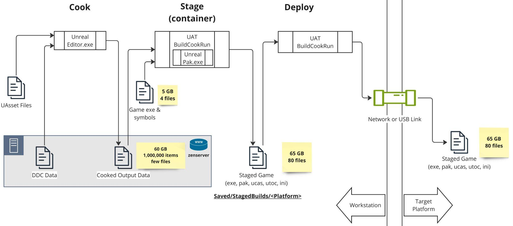
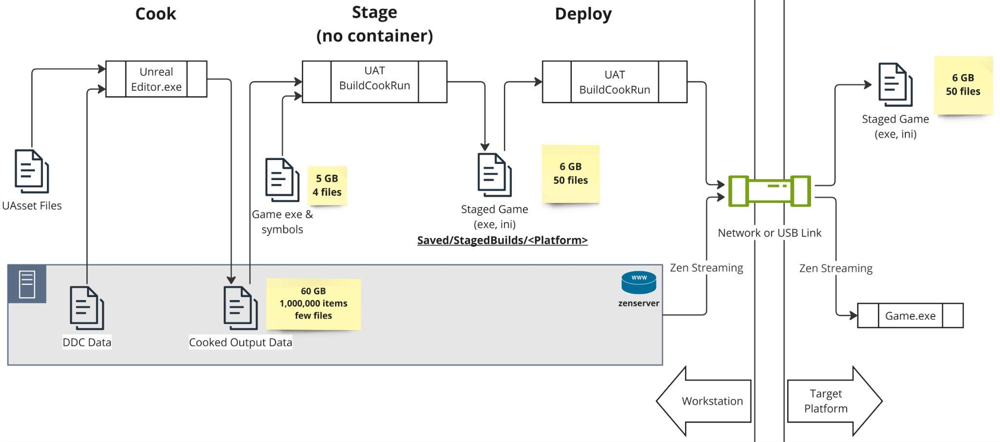
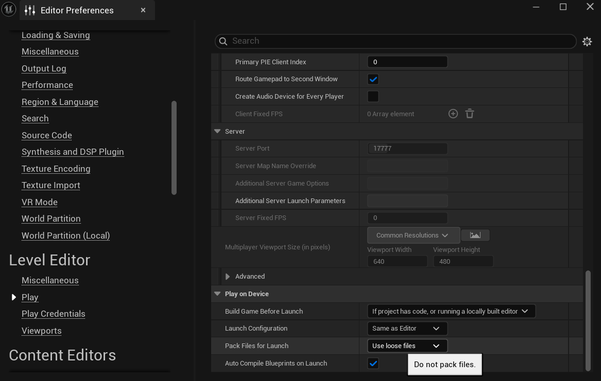
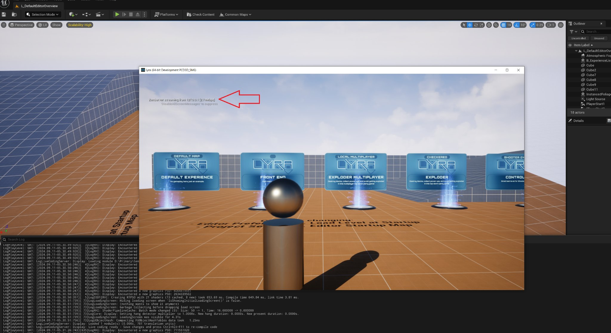
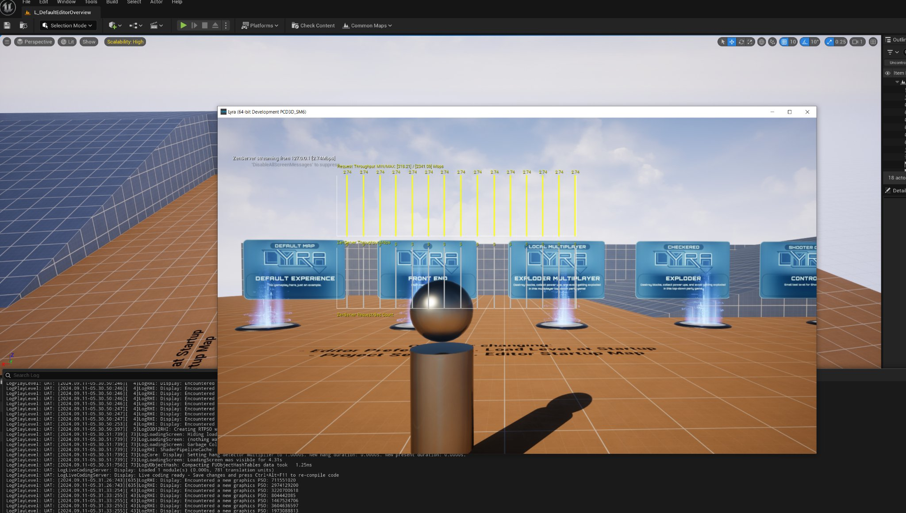

# Zenserver流送

> 路径：虚幻引擎5.7文档 / 建立你的开发流程 / Zen存储服务器 / Zenserver流送

> 原始页面：https://dev.epicgames.com/documentation/unreal-engine/how-to-use-zenserver-streaming-to-play-on-target-in-unreal-engine

在采取步骤从Zen存储服务器（Zenserver）流送数据之前，请先确保按照本页的说明将[将Zenserver启用为烘焙输出存储](../using-zen-storage-server-as-cooked-output-store/index.md)。

使用Zenserver流送的目的如下：

- 加快暂存和部署速度。
- 让我们能够用加载游戏的同一个存储进行烘焙，而无需在中间进行大量的数据转换，从而在未来实现更直接、更高效的目标工作流。

## 理解烘焙/暂存/部署

将Zenserver作为烘焙输出存储并暂存为容器文件（ `*.pak` 、 `*.utoc` 、 `*.ucas` ）时，可将内容管线可视化如下：



烘焙数据将按烘焙阶段以高粒度写入Zenserver，然后在暂存阶段从Zenserver读取，并写入为聚合的 `.pak`/`.utoc`/`.ucas` 文件。

这样既避免了由文件数量过高导致的文件系统开销，又为目标设备上的运行时游戏保留了相同的行为。所有数据最终都会成为存储在目标平台本地磁盘上的数据，并主要用 `.pak`/`.utoc`/`.ucas` 文件进行存储。

不过 **还有办法能进一步改进迭代** ，即避免这种情况下的数据复制过程：在将所有烘焙数据暂存为 `.pak`/`.utoc`/`.ucas` 文件后，再进一步复制数据，从而将这些文件复制到目标平台上的过程。

这时Zenserver的网络功能就能派上用场。

## 环境、安全性和用例

在启用Zenserver流送前，请考虑网络环境以及允许通过网络访问Zenserver对安全性的影响。

Zenserver是一款 **不使用身份验证** 的存储服务器。虽然未来可能会增加身份验证功能，但Zenserver目前的用途是在办公室局域网或VPN等可信环境中使用，在这种环境中，所有能访问Zenserver的用户都享有对内容进行读/写/删除的所有权限。不建议在公共场合（如互联网）或不受信任的网络环境中远程访问Zenserver，因为这可能导致数据泄露、损坏/中毒，或造成存储在Zenserver中的DDC、烘焙输出或其他数据丢失。

Zenserver流送的使用场景如下：

- 在家庭或办公室等可信网络中。
- 使用非发布构建的配置（调试、开发、测试等）。
- 在Zenserver（工作站上）与目标平台（游戏主机或移动设备）之间的距离较短时。

对于不符合这些用例的情况，建议继续使用容器（ `.pak`/`.utoc`/`.ucas` ）来暂存工作流程，而不要使用Zenserver流送。

Zenserver的默认设置如下:

- 只监听本地机器的请求，不监听网络上其他机器的请求。
- 仅在本地机器进程需要使用Zenserver时才保持运行。

要使用Zenserver流送，你需要更改这两项细节，从而确保当游戏在目标平台（游戏主机或移动端）上启动时，Zenserver处于运行状态且可用。更改默认设置的方法见下文的[启用Zenserver流送](#%E5%90%AF%E7%94%A8zenserver%E6%B5%81%E9%80%81)。

使用Zenserver流送时，可将内容管线可视化如下：



## 启用Zenserver流送

如果你确定自己位于可信的网络中（见上文[环境、安全性和用例](#%E7%8E%AF%E5%A2%83%E3%80%81%E5%AE%89%E5%85%A8%E6%80%A7%E5%92%8C%E7%94%A8%E4%BE%8B)），那么你应该更改配置以允许Zenserver以这样一种方式启动：即使虚幻编辑器不再运行，来自网络中其他机器的服务请求也会被识别并继续运行。

这两点都是通过虚幻引擎的配置来控制的，具体配置会影响虚幻编辑器或其他工具启动Zenserver的方式。请将以下内容加入到项目的 `DefaultEngine.ini` 中：

DefaultEngine.ini

```
	[Zen.AutoLaunch] 	LimitProcessLifetime=false 	AllowRemoteNetworkService=true
```

这些配置行（以及随后的重启编辑器）意味着Zenserver的启动方式将允许它在编辑器被关闭后继续运行，并继续为来自其他机器（如你的目标平台）的网络请求提供服务。

## 网络或USB连接注意事项

使用Zenserver流送时，请务必尽可能优化工作站和目标平台之间的网络或USB连接。这意味着：

- 尽可能使用1 Gbps或10 Gbps的有线以太网连接。
- 对于支持USB 3速度的移动设备，使用USB 3.2 Gen2（10 Gbps）连接线。
- 避免使用WiFi网络连接。

具体的要求将取决于你的游戏的细节及其对I/O的使用负载，因此上述信息只是指导原则，而非严格要求。我们内部认为1 Gbps对游戏而言已经足够，而10 Gbps可为Zenserver流送提供更快的启动/加载时间。

## 不使用容器文件进行暂存

一旦允许Zenserver持续运行并为来自其他机器的网络请求提供服务，我们就可以通过暂存来对其加以利用，而无需使用pak/utoc/ucas文件。暂存是内容管线中的一项操作，发生在烘焙之后，部署之前。暂存由虚幻自动化工具（UAT）进行，可以手动调用，也可以通过编辑器中的按钮或菜单来调用。调用UAT暂存时：

1. 如果传递了 `-pak` 参数，则会暂存为容器（ `.pak`/`.utoc`/`.ucas` ）文件。
2. 如果没有传递 `-pak` 参数，则不会暂存为容器（ `.pak`/`.utoc`/`.ucas` ）文件。

当将Zenserver作为烘焙输出存储时，Zenserver流送会被专门用于 **不使用** 容器文件进行暂存的情况。

## 通过虚幻编辑器

默认情况下，虚幻编辑器内置的 **在设备上运行（Play on Device）** 功能被设为不使用容器（ `.pak`/`.utoc`/`.ucas` ）文件进行暂存。

使用 **编辑（Edit） | 编辑器偏好设置（Editor Preferences）** 菜单，然后选择 **Level Editor（关卡编辑器） | 运行（Play）** 分段，即可检查或确认该配置。该分段包含 **在设备上运行（Play on Device）** 类别，其中包含 **启动时的打包文件（Pack Files for Launch）** 的设置项：



要通过编辑器使用Zenserver流送，必须将此设置设为 **使用零散文件（Use loose files）** 。如果配置正确，就可以使用[此处描述的机制在目标平台上启动](../../../sharing-and-releasing-projects/packaging-and-cooking/launching-unreal-engine-projects-on-devices/index.md)。

## 通过ushell

> [!NOTE]
> [ushell](../../how-to-use-ushell/index.md)是虚幻引擎的命令行界面，拥有简短的命令和丰富的Tab补全功能。它位于 `Engine/Extras/ushell` 目录下。相关快速入门和文档见Engine/Extras/ushell/README.txt。

将Zenserver配置为烘焙输出存储后，ushell的 `.stage` 命令会默认自动采用无容器（或Zenserver流送）工作流。

ushell

```
	.cook game <platform> 	.stage game <platform> 	.deploy game <platform> 	.run game <platform>
```

如果将Zenserver启用为烘焙输出存储，并且想要用容器文件进行暂存，那么你必须用 `.stage` 命令传递一个位置参数，以明确要求暂存的容器文件目标。

ushell

```
	.stage game <platform> development pak
```

上方示例中 `pak` 的第4个位置参数可以是：

- `pak` ：暂存的烘焙输出数据将存储在容器（ `.pak`/`.utoc`/`.ucas` ）文件中
- `nopak` ：暂存的烘焙输出数据将以零散文件的形式存储在文件系统中，或者，如果启用 **将Zen作为烘焙输出存储（Zen as cooked output store）** ，则存储在Zenserver中。
- `zen` ：如果启用 **将Zen作为烘焙输出存储（Zen as cooked output store）** ，则暂存的烘焙输出数据将被存储在Zenserver中；如果未启用，则会发出错误提示。
- `auto` ：（默认值）如果启用 **将Zen作为烘焙输出存储（Zen as cooked output store）** ，则暂存的烘焙输出数据将被存储在Zenserver中；如果未启用，则存储在容器文件中。

## 通过你的开发环境/调试器

在你选择的开发环境或调试器中，Zenserver流送的使用应该是自动的。启动时，游戏可执行文件将查找 `ue.projectstore` 文件是否存在。如果找到该文件，则游戏将尝试连接Zenserver以获取烘焙数据。

`ue.projectstore` 文件是一个简单的JSON格式文件，其中的信息包括主机名、端口和其他标识符信息等，这些信息是游戏连接到Zenserver并从中获取烘焙数据所必需的。

虽然ue.projectstore文件的内容几乎适用于所有情况，但如果需要重载连接参数，那么可以向游戏运行时传递一个或多个下列命令行参数，以重载 `ue.projectstore` 文件中指定的内容：

ue.projectstore

```
	-ZenStoreHost=<ip_or_hostname> 	-ZenStorePort=<host_port_number> 	-ZenStoreProject=<project_id> 	-ZenStorePlatform=<platform_id>
```

## 验证Zenserver流送是否处于使用状态

使用Zenserver流送时，你应该能看到项目的 `Saved/StagedBuilds/<Platform>` 文件夹中存在一个 `ue.projectstore` 文件，且该文件夹（及其子文件夹）不包含任何 `*.uasset` or `*.pak`/`*.utoc`/`*.ucas` 文件。

除了该目录的内容外，在游戏运行时（调试或开发版本，而非测试版本），你还可以在屏幕左上方看到 "Zenserver流送来源于...（ZenServer streaming from …）" 文本。



你还可以发出控制台命令：

控制台命令

```
	zen.showgraphs 1
```

屏幕上会显示Zenserver流送吞吐量随时间变化的图表。


