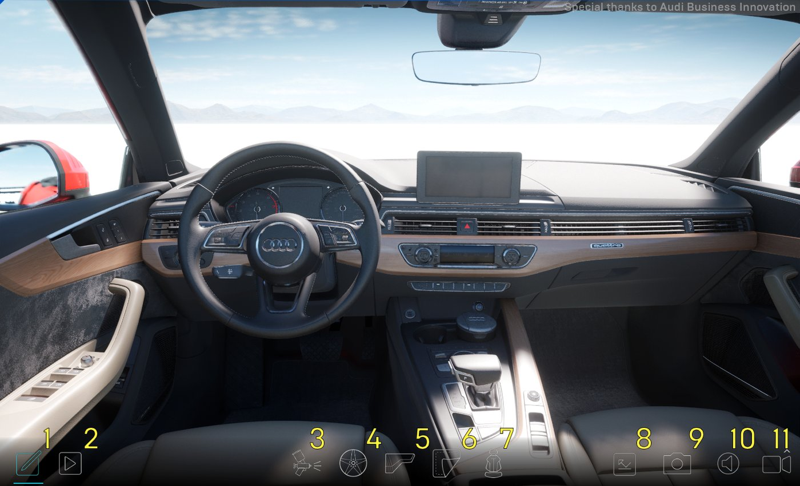
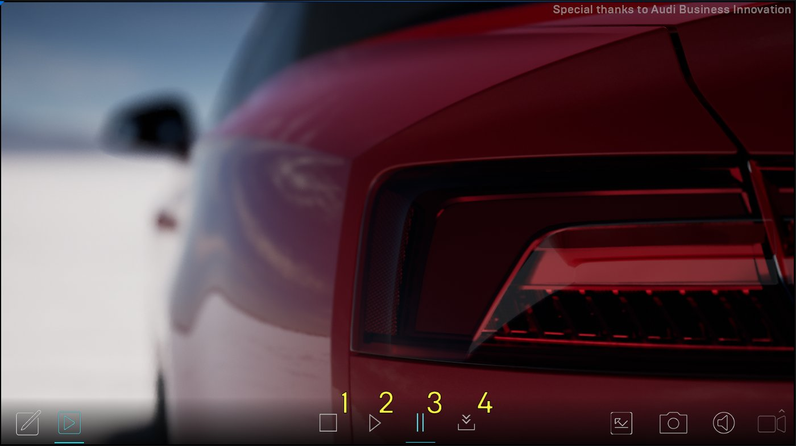
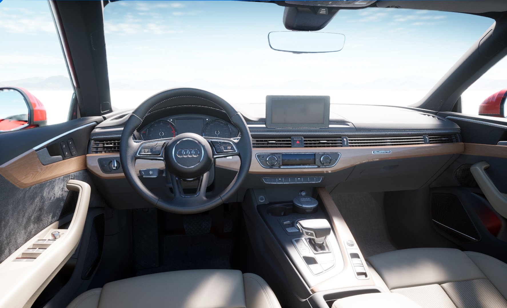
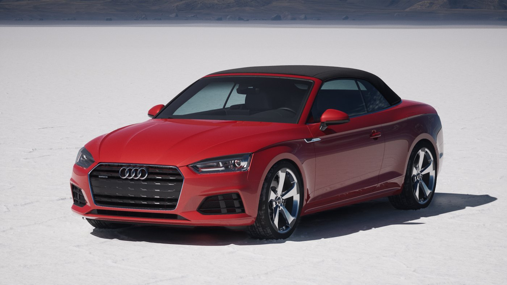
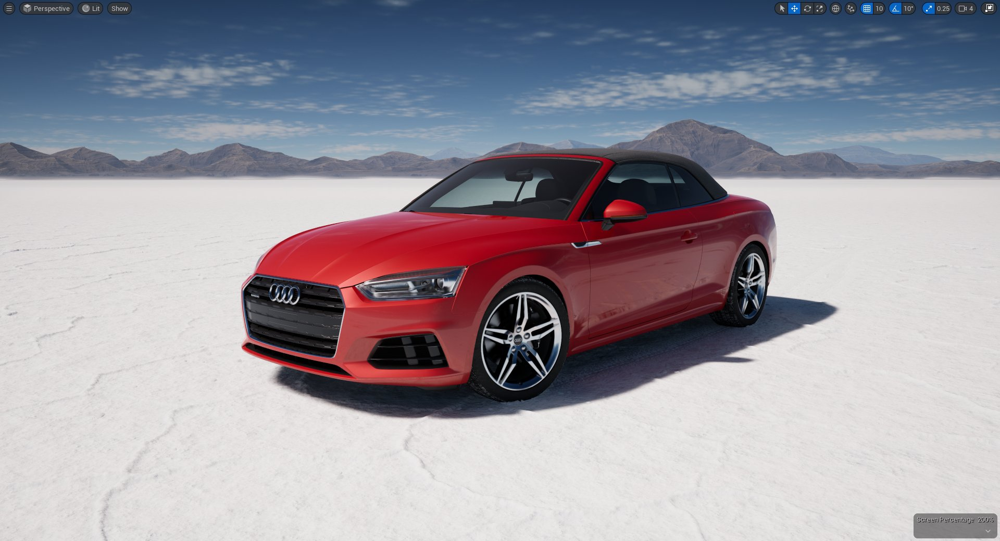
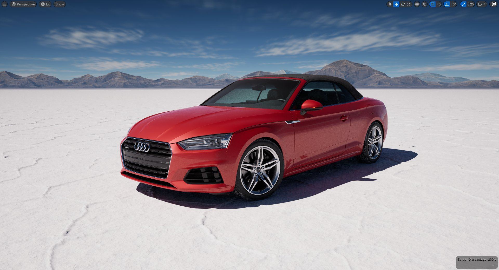
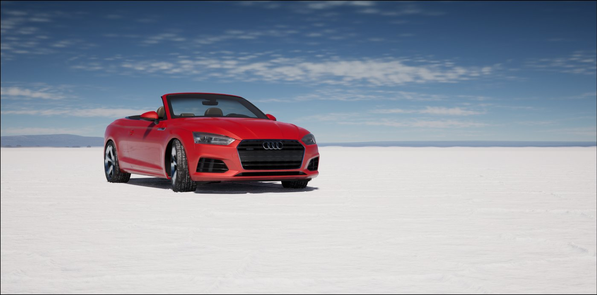
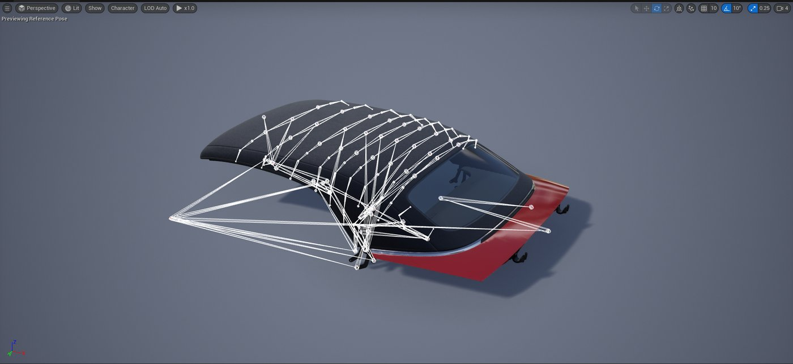

# 汽车配置器示例

> 路径：虚幻引擎5.7文档 / 示例与教学 / 引擎功能示例 / 汽车配置器示例

> 原始页面：https://dev.epicgames.com/documentation/unreal-engine/automotive-configurator-sample-in-unreal-engine

如今，越来越多的车企开始转用实时解决方案——如虚幻引擎（UE）——来推动它们的可视化商业项目。 **汽车配置器**示例正是这样一个为汽车行业3D可视化美术师量身打造的案例，蕴含了Epic Games在汽车配置器创建方面积累的各种心得实践。

汽车配置器示例演示了以下功能：

- [变体管理器](https://dev.epicgames.com/documentation/unreal-engine/variant-manager-template-overview?application_version=5.7)
- [Lumen](https://dev.epicgames.com/documentation/assets/building-virtual-worlds/lighting-and-shadows/global-illumination/lumen)
- [路径追踪器](https://dev.epicgames.com/documentation/assets/building-virtual-worlds/lighting-and-shadows/ray-tracing-and-path-tracing/path-tracer)
- [体积云](../../../building-virtual-worlds/lighting-the-environment/environmental-light-with-fog-clouds-sky-and-atmosphere/volumetric-cloud-component/index.md)
- [Chaos布料解算器](../../../gameplay-systems/physics/cloth-simulation/clothing-tool/index.md)
- [Control Rig](https://dev.epicgames.com/documentation/assets/animating-characters-and-objects/ControlRig)
- [Sequencer](../../../animating-characters-and-objects/cinematics-and-movie-making/unreal-engine-sequencer-movie-tool-overview/index.md)
- [影片渲染队列](https://dev.epicgames.com/documentation/assets/animating-characters-and-objects/Sequencer/movie-render-pipeline#movierenderqueue)

## 如何使用汽车配置器

### 下载示例

要使用汽车配置器示例创建项目，请按以下步骤操作：

1. 通过**Fab**访问[汽车配置器](https://fab.com/s/f54cb8fd6f65)，点击**添加到我的库（Add to My Library）**，即可在**Epic Games启动器**中显示该项目文件。

   1. 或者，你也可以在启动程序的Fab中或UE的Fab插件中搜索该示例项目。
2. 在**Epic Games启动器**中，找到**虚幻引擎 > 库 > Fab库**以访问项目。

   > [!NOTE]
   > 只有在你安装了兼容的引擎版本时，示例项目才会出现在**Fab库**中。
3. 点击**创建项目（Create Project）**并按照屏幕上的提示下载示例并启动新项目。
4. 从Fab下载[汽车材质](https://fab.com/s/da380b9a6082)和[汽车盐滩](https://fab.com/s/db62e7a8704a)资产。

要了解有关从Fab访问示例内容的更多信息，请参阅[示例与教程](../../index.md)。

> [!NOTE]
> 项目需要用到以下插件（默认启用）：
>
> - **影片渲染队列**
> - **颜色校正区域**
> - **控制绑定（Control Rig）**
> - **变体管理器**
>
> 可能需要你重启编辑器才能生效。

### 用户界面导航

汽车配置器以[产品配置器](../../../working-with-content/working-with-scene-variants/product-configurator-template/index.md)模板为基础构建。 使用[变体管理器](https://dev.epicgames.com/documentation/unreal-engine/variant-manager-template-overview?application_version=5.7)，你可以选择各种已保存的静态网格体配置（即**变体**），然后定制出一辆奥迪A5。

你可以使用屏幕底部的界面按钮来控制配置器。

| 编号 | 说明 |
| --- | --- |
| **1** | 配置器模式 |
| **2** | 商业展台模式 |
| **3** | 汽车涂层颜色 |
| **4** | 车轮风格 |
| **5** | 内饰颜色 |
| **6** | 皮革颜色 |
| **7** | 座椅面料风格 |
| **8** | 开关路径追踪 |
| **9** | 截图 |
| **10** | 静音/取消静音 |
| **11** | 摄像机视角 |

汽车配置器还包含一些由蓝色闪烁圆圈表示的聚焦点。 这些聚焦点的动画效果使用[Control Rig](https://dev.epicgames.com/documentation/assets/animating-characters-and-objects/ControlRig)制作，Control Rig是虚幻引擎中一个基于蓝图的动画控制系统：

- **打开/关闭车门（Open/Close Doors）**：打开和关闭车门。
- **打开/关闭敞篷软顶（Open/Close Convertible Soft Top）**：车内视角下，通过点击位于后视镜旁的车顶控制开关，打开和关闭敞篷车顶。
- **打开/关闭后备箱（Open/Close Trunk）**：打开和关闭后备箱盖。
- **喇叭（Horn）**：按下喇叭。
- **启动/停止汽车引擎（Start/Stop the Engine）**：点击发动机启动按钮将启动或停止发动机。 启动引擎后，仪表盘和奥迪虚拟驾驶舱（Audi Virtual Cockpit）将会亮起，同时前灯和尾灯也会亮起。

### 渲染商业级画面

点击配置器中的**播放**按钮可以将定制车辆切换成商业模式。

在商业展台模式下，你的汽车将成为媒体聚光灯下的闪耀明星。 在此模式下，你的汽车会像汽车广告中那般被从多个角度拍摄。 可以用以下按钮控制拍摄效果。

| 编号 | 说明 |
| --- | --- |
| **1** | Stop |
| **2** | Play |
| **3** | 暂停 |
| **4** | 渲染视频 |

在[Sequencer](../../../animating-characters-and-objects/cinematics-and-movie-making/unreal-engine-sequencer-movie-tool-overview/index.md)的支持下，摄像机会在盐湖滩上快速疾驰，同时凸显车轮和内饰的效果。 商业模式在处理实时光照和阴影时用到了[光线追踪](../../../building-virtual-worlds/lighting-the-environment/ray-tracing-and-path-tracing-features/index.md)。得益于[影片渲染队列](https://dev.epicgames.com/documentation/assets/animating-characters-and-objects/Sequencer/movie-render-pipeline#movierenderqueue)运行时功能，你可以将动画视频保存到电脑上。 可选择使用路径追踪器

## 变体管理器

汽车配置器建立在产品配置器模板的基础上，并使用变体管理器来保存用于定制汽车的各种资产配置。

**移动滑条来查看各类内饰变体**

每个配置选项都存储在一个名为**变体（Variant）**的条目中。 每个变体都指向Actor上的一个属性；当变体激活后，属性就会相应改变。 变体被排列成变体集，数据在经过**BP_Configurator**蓝图的处理后用于填充用户界面选项。 在上图中可以看到，当你更改内饰选项后，变体管理器会将该效果用于汽车Actor上的不同静态网格体组件上。

关于变体管理器的更多信息，请参阅我们的[变体管理器](https://dev.epicgames.com/documentation/unreal-engine/variant-manager-template-overview?application_version=5.7)文档。

## Lumen全局光照和反射

虚幻引擎使用[Lumen全局光照和反射](https://dev.epicgames.com/documentation/assets/building-virtual-worlds/lighting-and-shadows/global-illumination/lumen)系统来创建动态的全局光照和阴影。

汽车配置器示例使用Lumen来提供扩散的互相反射以及间接的高光反射，以此准确表示轮毂和车身的周边环境，从而最大化地利用汽车材质包中的Clear Coat属性。

要了解更多在关卡中使用Lumen的相关信息，请参阅[Lumen](https://dev.epicgames.com/documentation/assets/building-virtual-worlds/lighting-and-shadows/global-illumination/lumen)文档。

## 路径追踪器

[路径追踪器](https://dev.epicgames.com/documentation/assets/building-virtual-worlds/lighting-and-shadows/ray-tracing-and-path-tracing/path-tracer)是虚幻引擎的渐进式硬件加速渲染模式。 它用于生成物理准确的全局光照和材质的反射与折射，无需额外设置就能够让路径追踪器为你提供照片般真实的渲染。

采用Lumen光照的奥迪A5

采用路径追踪器光照的奥迪A5

路径追踪器完全整合了[Sequencer](../../../animating-characters-and-objects/cinematics-and-movie-making/unreal-engine-sequencer-movie-tool-overview/index.md)和[影片渲染队列](https://dev.epicgames.com/documentation/assets/animating-characters-and-objects/Sequencer/movie-render-pipeline#movierenderqueue)，能够胜任高质量影视渲染输出。

在汽车配置器示例中，你可以在界面中选择是否启用路径追踪功能，以便输出拥有照片级真实度的屏幕捕捉画面，或者用作商业渲染画面。

有关路径追踪器的更多信息，请参阅[路径追踪器](https://dev.epicgames.com/documentation/assets/building-virtual-worlds/lighting-and-shadows/ray-tracing-and-path-tracing/path-tracer)文档。

## 体积云

示例中的[体积云](../../../building-virtual-worlds/lighting-the-environment/environmental-light-with-fog-clouds-sky-and-atmosphere/volumetric-cloud-component/index.md)使用了基于物理和材质的云渲染系统，以便创建岩滩上的云层。

Epic Games团队之所以采用体积云，除了能为盐滩增添美感外，还因为这能让反弹的光线反射到汽车漆面上。 体积云组件使用了默认的云材质的材质实例来实现这些效果。

有关体积云系统的更多信息，请参阅我们的[体积云](../../../building-virtual-worlds/lighting-the-environment/environmental-light-with-fog-clouds-sky-and-atmosphere/volumetric-cloud-component/index.md)文档。

## Chaos布料解算器

汽车配置器示例使用[Chaos布料解算器](../../../gameplay-systems/physics/cloth-simulation/clothing-tool/index.md)来模拟敞篷车布料车顶的物理交互。

通过直接在引擎中使用布料绘制，Epic Games团队得以指定各种属性，比如摩擦、限制、阻力以及僵硬度，以此来模拟奥迪A5的帆布软质车顶。

要了解更多Chaos布料解算器和引擎内布料工具的相关信息，请参阅[布料工具](../../../gameplay-systems/physics/cloth-simulation/clothing-tool/index.md)文档。

## 控制绑定

[Control Rig](https://dev.epicgames.com/documentation/assets/animating-characters-and-objects/ControlRig/)系统是一个基于脚本的节点化绑定系统，相当于在引擎中直接提供了绑定和动画工具。

在汽车配置器中，Epic Games团队在两个方面上用到了控制绑定。 第一个是为汽车创建了一个扩展性很强的汽车骨架网格体，并为车轮、车门和后备箱创建了动画。 第二个是为敞篷车顶创建动画。

在奥迪A5的车身骨架中，每个可移动元素都配有多个枢轴点位置。 通过这种方法，汽车的主几何体不需要绑定到汽车上，骨架网格可以快速导入虚幻中。 导入后，网格体会添加到蓝图中，然后该蓝图会将其余汽车组件添加到枢轴点位置上，然后将在运行时将骨架绑定到控制绑定上。 这样就能让枢轴点位置的更新变得更加容易，同时避免回到DCC应用中重新修改。

考虑到车篷的复杂性，布料材质的车顶敞篷是作为单独部件创建的，拥有自己的骨架和控制绑定。 状态机会跟踪该顶篷的打开状态，确保顶篷在配置器应用中被选中时运行正确的过渡动画。

关于使用Control Rig在引擎内制作动画的更多信息，请参阅[Control Rig](https://dev.epicgames.com/documentation/assets/animating-characters-and-objects/ControlRig)文档。

## Sequencer

作为商业模式的基石，[Sequencer](../../../animating-characters-and-objects/cinematics-and-movie-making/unreal-engine-sequencer-movie-tool-overview/index.md)是一个强大的关键帧动画系统，允许用户创建游戏动画。

> 图片已省略：使用Sequencer的商业视图

在商业展台模式中，我们创建了多个包含摄像机动画的关卡序列，展示了汽车的各种可配置功能。 Epic Games团队随后使用**影片渲染队列**来渲染、保存关卡序列，然后使用非线性编辑程序进行组装。 之后，编辑好的序列作为一个主序列被导入虚幻引擎，继续添加音频，并对摄像机、动画和整体时长进行改进。 序列位于**CarConfigurator/Commercial/Sequences**文件夹。

有关在项目中使用Sequencer的更多信息，请参阅[Sequencer](../../../animating-characters-and-objects/cinematics-and-movie-making/unreal-engine-sequencer-movie-tool-overview/index.md)文档。

## 影片渲染队列

[影片渲染队列](https://dev.epicgames.com/documentation/assets/animating-characters-and-objects/Sequencer/movie-render-pipeline#movierenderqueue)是引擎用于输出最终商业级渲染画面的功能，可以导出高质量媒体文件。 结合实时光线追踪后，最终渲染画面可以进一步优化抗锯齿、径向运动模糊，并减少光线追踪中的噪点。

> 图片已省略：运行时的影片渲染队列

Epic Games团队使用蓝图在运行时启用影片渲染队列。 这样就可以直接从配置器中渲染和保存汽车的商业展台序列动画。

关于使用影片渲染队列功能的更多信息，请参阅[影片渲染队列](https://dev.epicgames.com/documentation/assets/animating-characters-and-objects/Sequencer/movie-render-pipeline#movierenderqueue)文档。

## 在配置器中添加美术资产

如需向汽车配置器添加新的美术资产，你可以直接向关卡变体集添加新的变体。 无论是材质还是静态网格体资产，过程都是差不多的。 下面的例子介绍了如何向配置器添加一个新的车漆颜色。

本示例中的奥迪A5使用了[车辆材质包](https://www.fab.com/listings/5dd132fe-ee32-4e8c-9cd3-7496547dfb29)中的车漆、皮革和内饰。 如需在界面中添加额外的颜色，请按照以下步骤进行操作：

1. 创建一个自定义文件夹，用于保存你的新材质和它可能需要的纹理取样。 操作方法是右键点击**CarConfigurator**文件夹，选择**新建文件夹（New Folder）**。 将新文件夹命名为**Custom**。
2. 如果示例中没有你要添加的颜色，可以使用[车辆材质包](../../free-epic-games-content/automotive-materials-pack/index.md)中的工具来创建车漆，或者自己导入并设置材质。 在本示例中，你需要复制一个车漆材质，然后编辑它。 有关导入纹理和创建新材质的更多信息，请参阅[材质指南](../../../designing-visuals-rendering-and-graphics/unreal-engine-materials/unreal-engine-materials-tutorials/index.md)文档。
3. 接下来，打开**CarConfigurator/Shared**文件夹，双击**CarVariants**关卡变体集，在变体管理器中打开它。

   > 图片已省略：打开关卡变体
4. 为了确保你的新建颜色能添加到所有所需的静态网格体上，你可以复制一个现有的变体。 打开**车漆（Paint）、内饰（Trim）**或**皮革（Leather）**变体集，右键点击列表中的最后一个变体。 在菜单中选择**复制（Duplicate）**选项。

   > 图片已省略：变体复制
5. 右键点击你的新变体，选择**重命名（Rename）**。 创建一个符合该颜色的新名称。

   > 图片已省略：变体重命名
6. 点击**属性（Properties）**面板中的**BP_AudiA5**，显示该汽车的**属性（Properties）**和**数值（Values）**。 然后点击数值列中每个值的下拉菜单，选择新的颜色（**SM_trunkDetails**材质除外）。

   > 图片已省略：更改变体颜色

   > [!NOTE]
   > 更改**SM_trunkDetails**的材质会改变汽车的牌照。
7. 最后，设置新变体的缩略图。方法是打开变体，将**视口（Viewport）**摄像机放置到能够最佳显示新选项的位置。

   > 图片已省略：设置视口摄像机
8. 然后在**变体管理器（Variant Manager）**中右键点击变体，选择**从视口设置（Set from viewport）**选项。

   > 图片已省略：视口中的变体缩略图
9. 点击编辑器中的**播放（Play）**按钮来测试示例。 你的新变体应该会出现在用户界面中。
