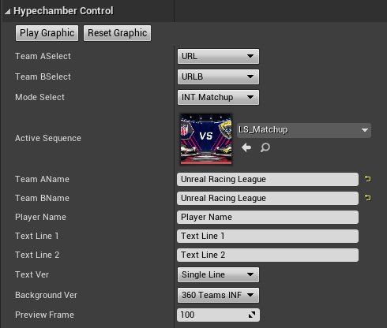
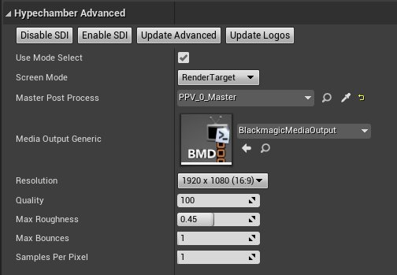
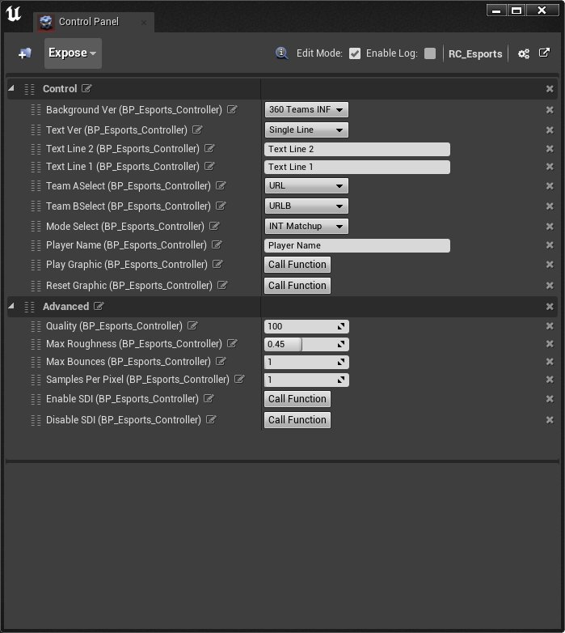
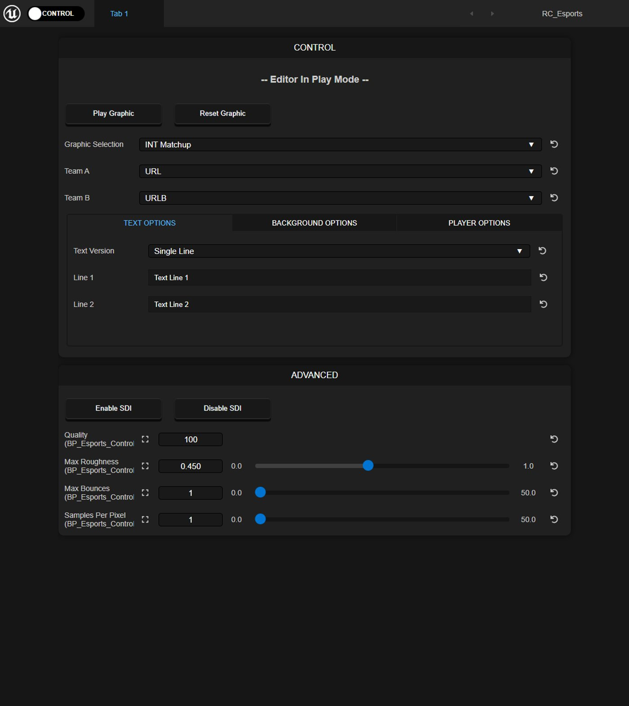
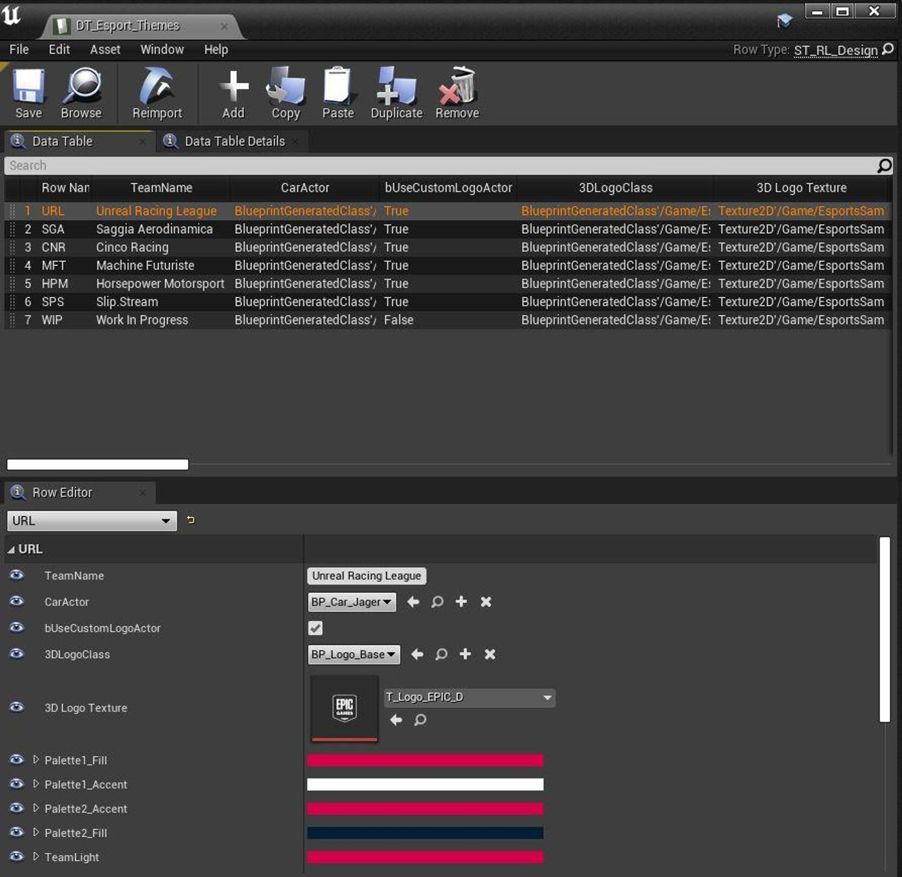
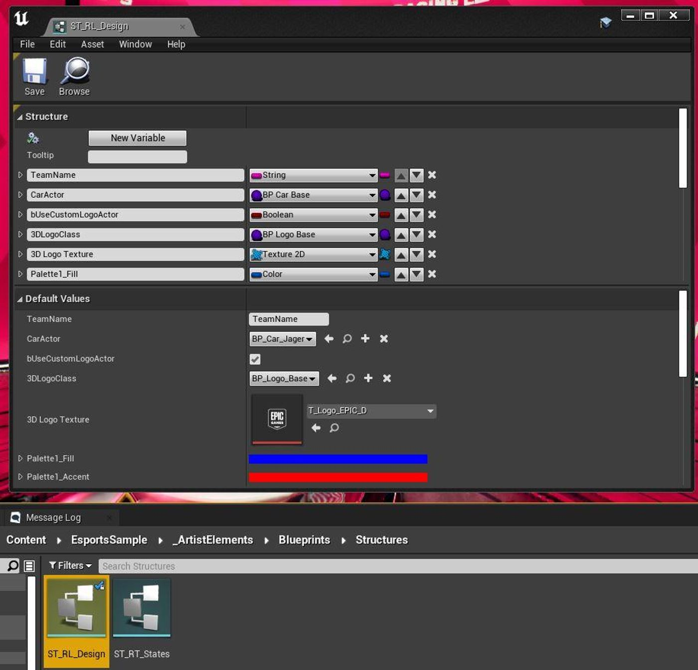
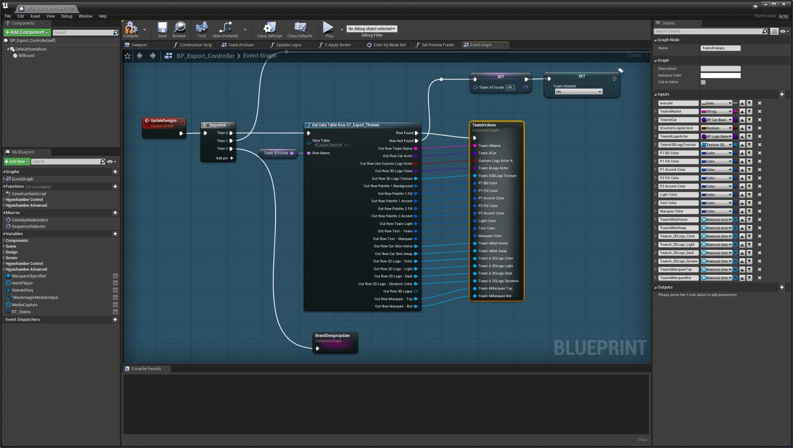
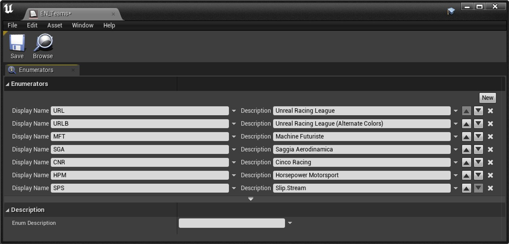

# 虚拟演播室展台示例

> 路径：虚幻引擎5.7文档 / 示例与教学 / 引擎功能示例 / 虚拟演播室展台示例

> 原始页面：https://dev.epicgames.com/documentation/unreal-engine/broadcast-esports-hype-chamber-sample-with-motion-graphics-in-unreal-engine

在动态图形设计和体育竞技领域中，实时渲染技术正变得日益重要。 Epic Games与Capacity Studios合作推出了一个高品质的虚拟演播室展台示例，介绍了如何为电子竞技节目设计、开发和播放包含丰富动画元素的内容。

进入演播室，了解如何通过高级蓝图和数据表工作流来驱动一个体育类动态图形资产包。

通过学习本示例和文本，你将了解：

- 如何在实时节目和预渲染动画中运用动态图形动画。 此示例中包含10个动态图形示例。
- 如何构建一个可高度自定义的图形资产包，让美术师可以自由切换其中的3D模型、纹理、材质和光照效果（全部由单个蓝图控制器驱动）。 当你更改战队名称时，场景中的所有元素都会相应替换。
- 如何通过向数据表添加新战队来扩展工作流。

## 入门指南

用虚拟演播室展台示例设置项目的步骤如下：

1. 通过**Fab**访问[虚拟演播室展台示例，](https://fab.com/s/0d3553fc0080)点击**添加到我的库（Add to My Library）**，即可在**Epic Games启动器**中显示该项目文件。

   1. 或者，你也可以在启动程序的Fab中或UE的Fab插件中搜索该示例项目。
2. 在**Epic Games启动器**中，找到**虚幻引擎 > 库 > Fab库**以访问项目。

   > [!NOTE]
   > 只有在你安装了兼容的引擎版本时，示例项目才会出现在**Fab库**中。
3. 点击**创建项目（Create Project）**并按照屏幕上的提示下载示例并启动新项目。

要了解有关从Fab访问示例内容的更多信息，请参阅[示例与教程](../../index.md)。

## 播放图形和动画

在虚幻编辑器的**工具栏**中，点击**运行（Play）**可运行关卡。

在**世界大纲视图（World Outliner）**中，选择**BP_HypeChamber_Controller**，打开其**细节（Details）**面板。 这些都是在**在编辑器中运行（Play in Editor）**模式下可以更改的选项。

### 演播室控件

点击**播放图形（Play Graphic）**可播放3D图形和动画。

> 动图已省略：在演播室中播放图形

点击**重置图形（Reset Graphic）**可将所有内容重置到初始状态。

> 动图已省略：在演播室中重置图形

更改**战队Aselect（Team Aselect）**可调整关卡中的战队。 如果你的设计包含两个战队，那么战队ASelect（Team Aselect）会显示在左侧，**战队Bselect（Team Bselect）**显示在右侧。

> 动图已省略：在演播室中选择战队

**模式选择（Mode Select）**可以更改关卡中显示的内容。 每种模式关联不同的运态图形和动画。 以下选项可供你选择：

- INT Matchup
- INT Matchup Infinite
- INT Team Hype Chamber
- INT Player Name
- INT Text
- INT_Logo
- FS Open
- FS Team Hype Chamber Wide
- FS Team Hype Chamber Close
- FS Backgrounds
- BUMP Team Victory

### 演播室高级选项

演播室控制台（Hype Chamber Controller）提供了以下设置，用于定制播放动态图形和动画时的媒体输出和后期处理效果。

| 参数 | 说明 |
| --- | --- |
| 禁用SDI（Disable SDI） | 禁用激活媒体捕获输出。 |
| 启用SDI（Enable SDI） | 启用基于通用媒体输出的媒体捕获输出。 |
| 更新高级设置（Update Advanced） | 将质量和光线追踪设置更新为演播室控制台（Hype Chamber Controller）设置的值。 |
| 更新徽标（Update Logos） | 更新屏幕墙中的背景徽标和颜色。 |
| 使用模式选择（Use Mode Select） | 启用后，你可以用演播室控制台控制要使用的场景。 在使用动画渲染队列之前，你需要禁用此功能。 |
| 屏幕模式（Screen Mode） | 填充演播室屏幕的内容类型。 默认为动态图形场景的渲染目标。 |
| 主后期处理（Master Post Process） | 对具有最高优先级的场景后期处理体积的引用。 |
| 通用媒体输出（Media Output Generic） | 定义内容的媒体捕获输出。 默认使用Blackmagic SDI配置。 |
| 分辨率 | 媒体捕获的输出分辨率大小。 |
| 质量 | 即`sg.resolution`质量命令输入。 |
| 最大粗糙度（Max Roughness） | 后期处理体积光线追踪的最大粗糙度。 |
| 最大反弹次数（Max Bounces） | 后期处理体积光线追踪的最大反弹次数。 |
| 逐像素采样（Samples Per Pixel） | 后期处理体积光线追踪的逐像素样次数。 |

### 使用远程控制播放图形和动画内容

在**EsportsSample/_ArtistElements/Blueprints**中，双击远程控制面板中的**RC_Esports远程控制预设（RC_Esports Remote Control Preset）**。 BP_Esports_Controller的细节（Details）面板中的参数与RC_Esports预设中公开的参数相同。

在本地计算机上输入URL **127.0.0.1:7000**，或在第二台设备上输入使用7000端口的计算机的IP地址，启动远程控制Web应用程序，以便远程控制战队图形和文本。 参阅[远程控制Web应用程序](../../../production-pipeline/scripting-and-automating-the-unreal-editor/remote-control/remote-control-presets-and-web-application/remote-control-web-application/index.md)了解使用Web应用程序的详情。

## 编辑战队主题

要编辑当前战队主题，请在**内容浏览器（Content Browser）**中找到**EsportsSample/_ArtistElements/Blueprints/Data**，**双击DT_Esport_Themes**，在数据表资产编辑器（Data Table Asset Editor）中打开它。

每一行包含一个战队的所有数据，从战队名称到战队的颜色控制板，一应俱全。 点击任意一行并在**行编辑器（Row Editor）**中编辑其数据，即可更改战队主题。

要更改定义战队主题的参数，请找到**EsportsSample/_ArtistElements/Blueprints/Structures**，**双击ST_RL_Design**，在结构资产编辑器（Structure Asset Editor）中打开它。

在**Esports/_ArtistElements/Blueprints**中，双击**BP_Esport_Controller**，在蓝图编辑器（Blueprint Editor）中打开它。 在**UpdateData**分段中，按行名查找**DT_Esport_Themes**数据表，以便在关卡中填充战队数据。 添加参数时，请确保将参数连接到**TeamAValues**和**TeamBValues**节点定义过的资产上。

点击查看大图。

## 创建自己的战队

按照以下步骤将新战队添加到选项中。

1. 在内容浏览器（Content Browser）中，找到**EsportsSample/_ArtistElements/Blueprints/Enums**，双击**EN_Teams**，在枚举资产编辑器中打开它。

   
2. 点击**新增（New）**添加一个枚举值。
3. 将新枚举值的**显示名称（Display Name）**设置为战队简称，将**说明（Description）**设置为战队全称。 在此示例中，新战队的显示名称为**WIP**，其说明为**Work in Progress**。
4. 找到**EsportsSample/_ArtistElements/Blueprints/Data**，点击**（+）添加（(+) Add）**添加新行。
5. 将新行的名称设置为战队的简称，将战队名称（Team Name）设置为战队的全称。 在此示例中，行的名称为**WIP**，战队名称为**Work in Progress**。

   > 图片已省略：演播室战队数据表新条目
6. 现在你可以修改关卡的BP_HypeChamber_Controller中的演播室控件（Hypechamber Controls）来选择你的新战队了。

## 使用动画渲染队列进行批量渲染

在内容浏览器（Content Browser）中，找到**EsportsSample/_ArtistElements/Blueprints**。 右键点击**EUW_VersioningUtility**[编辑器工具控件](../../../user-interfaces/basics-of-user-interface-development/displaying-your-ui/creating-widgets/index.md)资产，并选择**运行编辑器工具控件（Run Editor Utility Widget）**。

在新窗口中打开编辑器工具控件（Editor Utility Widget）。

> 图片已省略：演播室编辑器工具控件

此控件将使用[影片渲染队列](https://dev.epicgames.com/documentation/assets/animating-characters-and-objects/Sequencer/movie-render-pipeline#movierenderqueue)为具有各种战队配置的批量渲染序列提供控制方法。 以下参数会影响渲染作业。

| 参数 | 说明 |
| --- | --- |
| 模式选择（Mode Select） | 选择渲染时应配置和播放的图形动画。 |
| 目标序列（Target Sequence） | 模式选择的目标关卡序列。 可以在编辑器中打开以便预览图形。 |
| 战队AList（Team AList） | 要使用所选图形进行渲染的战队列表。 在有两个战队的图形或模式中，这可以控制左侧的战队。 |
| 团队BList（Team BList） | 要使用所选图形进行渲染的第二个战队列表。 在有两个战队的图形或模式中，这可以控制右侧的战队。 |
| 文本版本（Text Ver） | 选择要在渲染中使用的文本模式动画的版本。 输入文本默认为当前设置为文本行1和文本行2输入的内容。 |
| 背景版本（Background Ver） | 选择渲染中的背景模式动画版本。 |
| 演播室控制器（Hype Chamber Con） | 对场景中BP_Hypechamber_Controller的调试引用。 |
| 渲染预设（Render Preset） | 用于渲染作业的影片渲染队列渲染预设资产。 |
| 输出文件夹（Output Folder） | 渲染资产的输出目录。 |
| 管线执行器作业（Pipeline Executor Job） | 显示有效执行器作业的调试视图。 |
| 下一个渲染执行器（Next Render Executor） | 显示下一个执行器作业的调试视图。 |
| 队列索引（Queue Index） | 战队A和战队B列表中当前正在进行的渲染作业的调试状态 |
| 作业数量（Job Count） | 列出的要进行的渲染作业的总数。 这由战队A列表中的战队数量决定。 |

点击**（+）开始渲染（(+) Start Render）**可以启动渲染作业。

> 图片已省略：演播室批量渲染
