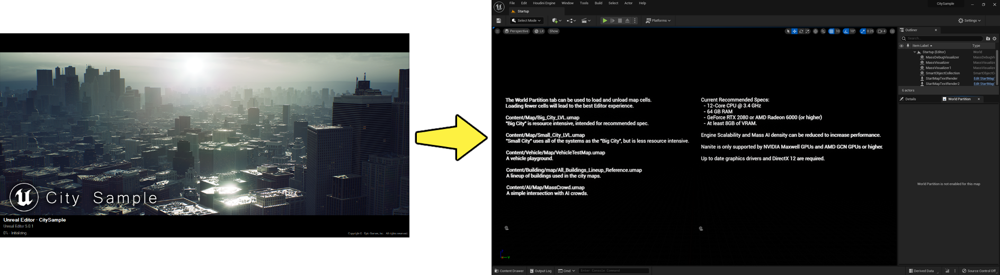
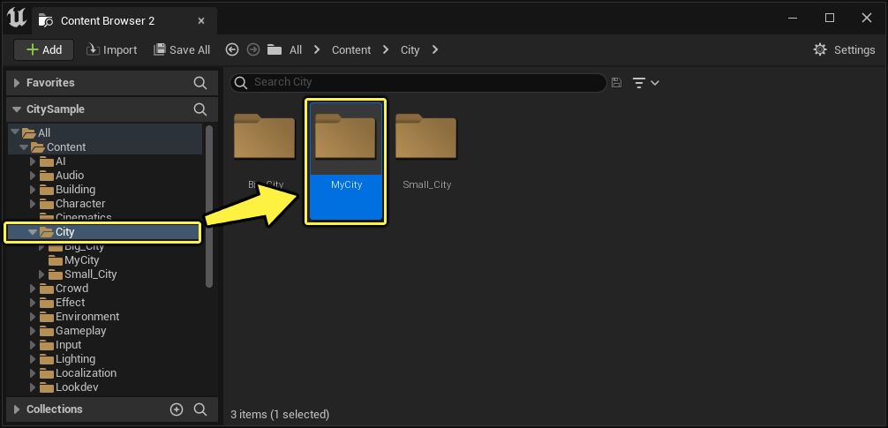
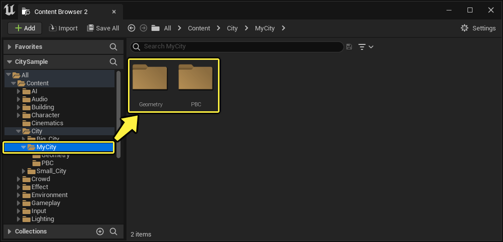
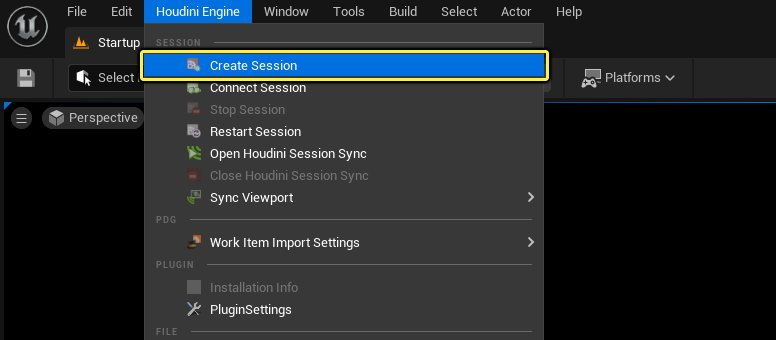
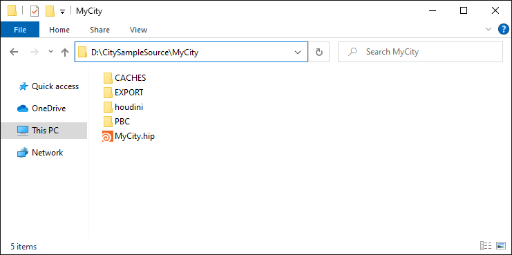
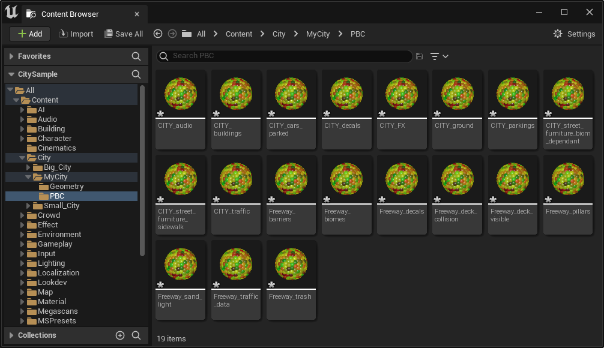
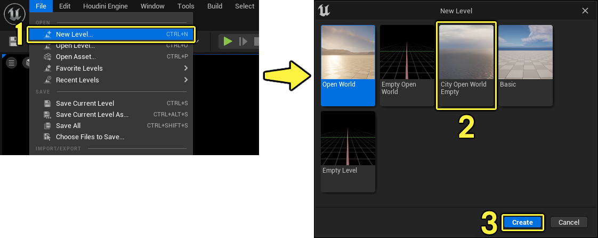
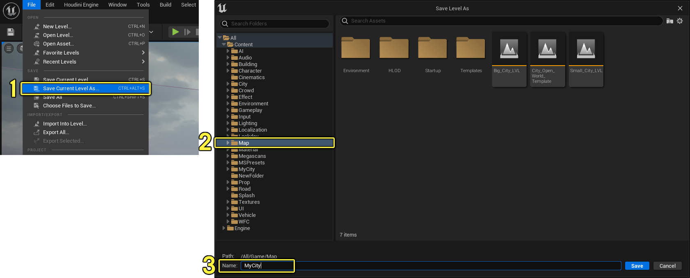

# "城市示例"快速入门 - 在虚幻引擎5中生成城市和高速公路

> 路径：虚幻引擎5.7文档 / 示例与教学 / 引擎功能示例 / 城市示例 / "城市示例"快速入门 - 在虚幻引擎5中生成城市和高速公路

> 原始页面：https://dev.epicgames.com/documentation/unreal-engine/city-sample-quick-start-for-generating-a-city-and-freeway-in-unreal-engine-5

**城市示例** 项目是一个技术演示，介绍如何在虚幻引擎5中使用SideFX的Houdini Engine中程序化生成的数据来创建初步的模拟世界。"城市示例"使用从Houdini生成的数据来填充资产，并以此控制AI模拟、音效模拟等等。

关于本指南是两部分系列的第二部分，详细介绍了如何将你在Houdini Engine中生成的数据导入虚幻引擎5中。

> [!WARNING]
> 要完成指南的本部分，你必须首先学习["城市示例" - 使用Houdini生成城市和高速公路](../city-sample-quick-start-for-generating-a-city-a-5309ebb8/index.md)。

在本指南中，你将学习如何：

- 将你从Houdini Engine生成的数据导入虚幻引擎5中。
- 准备开放世界环境以支持你的城市。
- 使用规则处理器导入Houdini程序化数据以生成你的城市。
- 将点云数据用于区域图表进行交通模拟。
- 为世界分区生成层级细节级别网格体。

## 本指南的先决条件

- 完成

  "城市示例" - 使用Houdini生成城市和高速公路
- SideFX Houdini

  - 我们推荐使用版本18.5.532，因为这是用于开发"城市示例"项目的版本。
- 至少2GB的可用硬盘空间，用于提取数据和生成小型城市。对于更大的城市，预计会使用5到10GB的空间。
- 参阅

  "城市示例"推荐的系统规格

  。
- 通过Epic Games启动程序下载

  "城市示例"

  虚幻引擎5项目。

### 关于本指南的附加说明

- 本指南中使用的工作流程和文件适用于Windows 10操作系统。虽然虚幻引擎和Houdini支持Mac和Linux，但这些工作流程和源文件没有针对这些系统进行测试，我们无法保证它们会按预期运行。
- 本指南还假定你掌握了Windows操作系统中使用命令提示符等的知识。

## 第1步 - 项目设置和配置

若要使用你在学习"城市示例"：使用Houdini生成城市和高速公路"指南时自行生成的城市数据，你首先需要在虚幻引擎5中打开并设置一些内容。

1. 使用虚幻引擎5打开 **城市示例** 项目。

   
2. 在 **内容浏览器（Content Browser）** 中的 **内容（Content）> 城市（City）** 下，使用与你在Houdini中创建的城市完全相同的名称创建一个文件夹。例如，你在第一部分中创建的示例Houdini城市文件名为"MyCity"。因此，将你在内容浏览器中创建的文件夹命名为 **MyCity** 。

   
3. 打开命名的城市文件夹，并创建名为 **Geometry** 和 **PBC** 的两个新文件夹。

   
4. "城市示例"项目包含已经启用的 **Houdini Engine插件**。从主菜单打开 **Houdini Engine** 下拉菜单，选择 **创建会话（Create Session）** 。

   

   > [!NOTE]
   > 如果无法创建会话，请查看 **输出日志（Output Log）** ，了解无法创建会话的前因后果。

此时，你已打开"城市示例"项目并创建了文件夹位置来导入你在Houdini中为你自己的城市生成的数据。你创建了以你的城市命名的新文件夹，并在其中创建了名为 **Geometry** 和 **PBC** 的两个文件夹。

## 第2步 - 将城市数据导入虚幻引擎5中

你在之前的步骤中创建了自己城市的文件夹并启动了Houdini Engine会话，现在你可以将数据导入虚幻引擎5中。

1. 在Windows中，打开你保存Houdini城市数据的文件位置。在[使用Houdini生成城市和高速公路](../city-sample-quick-start-for-generating-a-city-a-5309ebb8/index.md)的快速入门指南的第一部分，你将文件夹路径设置为 `D:/CitySampleSource/MyCity`。

   
2. 在Windows **MyCity** 文件夹中，打开 **PBC** 文件夹。在虚幻引擎中，使用 **内容浏览器（Content Browser）** 打开 **城市（City）> MyCity > PBC** 文件夹。在Windows中选择PBC文件夹中的所有文件，并将其拖入虚幻引擎中的PBC文件夹。

   导入过程完成后，你的 **PBC** 文件夹应该如下所示，带有Houdini生成的导入点云数据。

   
3. 在Windows **MyCity** 文件夹中，打开 **EXPORT** 文件夹。在虚幻引擎中，使用 **内容浏览器（Content Browser）** 打开 **城市（City）> MyCity > 几何体（Geometry）** 文件夹。在Windows中选择EXPORT文件夹中的所有文件，并将其拖入虚幻引擎中的Geometry文件夹。

   > [!NOTE]
   > 该视频已加速，显示了导入Houdini中所创建的小型城市的完整过程。导入过程可能需要一些时间，具体取决于你的城市规模。例如，在"城市示例"项目随附的城市中，导入Small_City所需时间不到10分钟，导入Big_City所需时间超过40分钟。
4. 使用 **文件（File）** 菜单 **全部保存（Save All）** 。

此时，你应该会看到你的所有几何体和点云数据文件都已导入并保存为本指南第1步中创建的文件夹中的资产。这些资产在后续步骤中将用于开始生成你的城市。

## 第3步 - 准备开放世界关卡

在本步骤中，你将根据City Open World模板关卡创建新关卡。该模板关卡提供了自行创建城市的起始点，就像"城市示例"中的城市那样，可以自行设置光照和天空盒，并使用蓝图生成器来填充数据。

1. 使用 **文件（File）** 菜单，选择 **新关卡（New Level）** (1)。从可用模板选择 **City Open World Empty** (2)并点击 **创建（Create）** (3)。

   
2. 创建新关卡之后，使用 **文件（File）** 菜单 **将当前关卡另存为（Save Current Level As）** (1)。在 **内容（Content）> 地图（Maps）** (2)文件夹中保存地图，并在文本字段中输入你的城市的 **名称（Name）** (3)。例如，本指南将 **MyCity** 用作关卡名称。

   
3. 在 **将关卡另存为（Save Level As）** 窗口中点击 **保存（Save）** 。

   > 图片已省略：保存关卡

现在你有一个关卡，可用于生成和构建你的城市。

> 图片已省略：空白城市关卡

## 第4步 - 运行规则处理器生成功能

所需的数据全部都已导入引擎中，可以开始生成城市了，并且你有一个贴图，可用于加载和保存数据。在本步骤中，你将使用规则处理器来处理你导入引擎中的城市和高速公路点云数据。规则处理器会将生成的点云数据从Houdini Engine映射到一些规则，这些规则会指示虚幻引擎如何使用该数据来填充世界。

1. 从主菜单使用 **窗口（Window）> 规则处理器（Rule Processor）** 打开 **RuleProcessor_City** 。这将打开窗口，你在Houdini中生成的文件将在此用于在虚幻引擎中生成城市。

   > 图片已省略：undefined

   点击查看大图。
2. 在 **RuleProcessor_City** 窗口中，将 **点云（Point Cloud）** 列的分配资产替换为 **城市（City）> [YourCityName] > PBC** 文件夹中同名的资产。例如，本指南使用第2步中导入 **城市（City）> MyCity > PBC** 文件夹中的文件。
3. 在 **RuleProcessor_City** 窗口中，点击 **运行规则（Run Rules）** 以处理你已导入的城市文件。

   > 图片已省略：为城市PBC文件运行规则处理器
4. 系统将显示弹窗，要求你确认处理。准备就绪后，点击 **确定（OK）** 。

   > 图片已省略：确认运行规则处理器

   > [!WARNING]
   > 生成城市所需时间根据城市规模而有所不同。完成处理可能需要15分钟到1小时不等。
5. 为 **PBC** 文件夹中的 **Freeway** PBC 文件重复该过程。从主菜单使用 **窗口（Window）> 规则处理器（Rule Processor）** 打开 **Rule Processor_Freeway** 。将 **点云（Point Cloud）** 列的资产替换为 **City> [YourCityName] > PBC** 中同名的资产。例如，本指南使用第2步中导入 **城市（City）> MyCity > PBC** 文件夹中的文件。
6. 在 **RuleProcessor_Freeway** 窗口中，点击 **运行规则（Run Rules）** 以处理你已导入的高速公路文件。

   > 图片已省略：运行高速公路规则处理器
7. 系统将显示弹窗，要求你确认处理。准备就绪后，点击 **确定（OK）** 。

   > 图片已省略：确认运行规则处理器

   > [!WARNING]
   > 生成城市所需时间根据城市规模而有所不同。完成处理可能需要15分钟到1小时不等。
8. 在 **世界分区（World Partition）** 面板中，**左键点击并拖动** 以选择世界分区地图中的所有单元。**右键点击** 并选择 **加载所选单元（Load Selected Cells）** 。

将规则处理器用于城市和高速公路点云数据，就能为虚幻引擎提供根据规则集生成城市所需的信息。这让引擎能够放置资产来构建城市。

规则处理器完成数据处理之后，你可以使用世界分区编辑器将城市加载到关卡视口中。加载之后，你可以马上检查你的城市。

> 图片已省略：虚幻编辑器中加载的城市

## 第5步 - 为交通的区域图表设置点云数据

你已经有了可以处理的城市，现在关卡中包含了两个蓝图生成器，用于配置和设置城市。这意味着，你需要复制用于小城市的一些数据资产，将其用于你自己的城市。这些数据资产依赖于你导入的点云数据。

1. 在关卡视口中，使用 **显示（Show）** 下拉菜单确保启用了 **导航（Navigation）** 。

   > 图片已省略：关卡视口显示菜单启用导航
2. 在 **内容浏览器（Content Browser）** 中，找到 **内容（Content）> AI > 交通（Traffic）** 文件夹。

   > 图片已省略：在内容浏览器中打开AI > 交通文件夹
3. 在 **ParkingSpaces** 文件夹中，复制 **CitySampleSmallCityParkingSpaces** 数据资产。将其重命名，将"SmallCity"替换为你的城市名称。例如，本指南使用 **CitySampleMyCityParkingSpaces** 。

   > 图片已省略：打开Parking Spaces文件夹并复制资产
4. 打开 **CitySampleMyCityParkingSpace** 数据资产。在 **停车位点云（Parking Spaces Point Cloud）** 分配插槽中，将 **City_cars_parked** 替换为你的城市的 **内容（Content）> 城市（City）> [YourCityName] > PBC** 文件夹中同名的项。本指南使用 `Content/City/MyCity/PBC` 。

   > 图片已省略：将数据资产分配到PBC插槽
5. 返回文件夹 **内容（Content）> AI > 交通（Traffic）** 。
6. 在 **TrafficLights** 文件夹中，复制 **CitySampleSmallCityTrafficLights** 数据资产。将其重命名，将"SmallCity"替换为你的城市名称。例如，本指南使用 **CitySampleMyCityTrafficLights** 。

   > 图片已省略：打开TrafficLights文件夹并复制资产
7. 打开 **CitySampleMyCityTrafficLights** 数据资产。在 **Traffic Lights点云** 分配插槽中，将 **City_traffic** 替换为你的城市的 **内容（Content）> 城市（City）> [YourCityName] > PBC** 文件夹中同名的项。

   > 图片已省略：将数据资产分配到PBC插槽
8. 在 **世界大纲视图（World Outliner）** 中，将"Builder"输入到 **搜索（Search）** 文本字段(1)中。这会返回 **CityTrafficBuilder_BP** 和 **FreewayTrafficBuilder_BP** 蓝图。在其中每个行项目旁边，将鼠标悬停在每一项上，并点击其名称旁边的 **引脚** (2)图标，强制它们在关卡中加载以供编辑。

   > 图片已省略：在世界大纲视图中搜索builder蓝图
9. 加载 **CityTrafficBuilder_BP** 之后，在 **世界大纲视图（World Outliner）** (1)中将其选中。使用 **细节（Details）** 面板将现有点云数据替换为你为城市导入的数据。在名为 **覆盖（Mantle）** 的分段下，将你的 **City_traffic** 点云数据分配给 **Epic十字路口覆盖点云（Epic Intersections Mantle Point Cloud）** 分配插槽(2)。

   > 图片已省略：undefined

   点击查看大图。
10. 加载 **FreewayTrafficBuilder_BP** 之后，在 **世界大纲视图（World Outliner）** (1)中将其选中。使用 **细节（Details）** 面板将现有点云数据替换为你为城市导入的数据。在名为 **覆盖（Mantle）** 的分段下，将你的 **Freeway_traffic_data** 点云数据分配给 **Epic高速公路覆盖点云（Epic Freeway Mantle Point Cloud）** 分配插槽(2)。

    > 图片已省略：undefined

    点击查看大图。
11. 在 **世界大纲视图（World Outliner）** 中，搜索并选择 **BP_MassTrafficIntersectionSpawner** (1)。使用 **细节（Details）** 面板，找到 **批量（Mass）> 生成数据生成器（Spawn Data Generators）> 索引[0]（Index [0]）> 生成器实例（Generator Instance）> 交通信号灯（Traffic Lights）** 下的 **交通信号灯实例数据（Traffic Light Instance Data）** (2)分配插槽。将数据资产替换为你之前在指南本部分创建的名为 **CitySampleMyCityTrafficLights** 的数据资产。

    > 图片已省略：undefined

    点击查看大图。
12. 在 **世界大纲视图（World Outliner）** 中，搜索并选择 **BP_MassTrafficParkedVehicleSpawner** (1)。使用 **细节（Details）** 面板，找到 **批量（Mass）> 生成数据生成器（Spawn Data Generators）> 索引[0]（Index [0]）> 生成器实例（Generator Instance）> 实体类型到停车位类型（Entity Type to Parking Space Type）** 下的 **停车位（Parking Spaces）** (2)分配插槽。将数据资产替换为你之前在指南本部分创建的名为 **CitySampleMyCityParkingSpaces** 的数据资产。

    > 图片已省略：undefined

    点击查看大图。

现在，你应该有两个数据资产，它们是用于小城市的停车位和交通信号灯数据资产的副本。在这些数据资产中，你分配了自己的城市的点云数据，以在下一个分段用于生成区域图表。

## 第6步 - 为交通运行区域图表生成功能

此时，你创建了一些数据资产，以用于城市关卡中的各种蓝图生成器。你已经通过这些数据资产将从Houdini Engine生成的一些点云数据分配给这些生成器。

在本步骤中，你将使用一个编辑器工具控件，它专门用于执行为交通车道生成区域图表的任务，你会用到在之前小节中分配给数据资产和蓝图生成器的点云数据。

1. 在 **内容浏览器（Content Browser）** 中，找到 **内容（Content）> AI > ZoneGraphBuilder** 。右键点击名为 **WBP_CitySampleZoneGraphBuilder** 的 **编辑器工具控件（Editor Utility Widget）**，并点击 **运行编辑器工具控件（Run Editor Utility Widget）** 。

   > 图片已省略：undefined

   点击查看大图。
2. 在 **编辑器工具控件（Editor Utility Widget）** 窗口中，点击 **城市交通构建器（City Traffic Builder）** (1)和 **高速公路交通构建器（Freeway Traffic Builder）** (2)旁边的 **构建区域形状（Build Zone Shapes）** 的两个按钮，然后点击 **执行所有事项！（Do All The Things!）** (3)。

   > 图片已省略：区域图表编辑器工具控件界面
3. 在 **内容浏览器（Content Browser）** 中，找到 **内容（Content）> AI > 交通（Traffic）> ParkingSpaces** 文件夹。打开 **CitySampleMyCityParkingSpaces** 数据资产。

   > 图片已省略：内容浏览器交通/Parking Spaces文件夹数据资产
4. 在 **停车位点云（Parking Spaces Point Cloud）** 分配插槽中，将 **City_cars_parked** (1)替换为城市的 **内容（Content）> 城市（City）> [YourCityName] > PBC** 文件夹中的项，然后点击 **从点云填充停车位（Populate Parking Spaces from Point Cloud）** (2)按钮。

   > 图片已省略：数据资产停车位点云数据分配插槽
5. 在 **内容浏览器（Content Browser）** 中，找到 **内容（Content）> AI > 交通（Traffic）> TrafficLights** 文件夹。打开 **CitySampleMyCityTrafficLights** 数据资产。

   > 图片已省略：内容浏览器交通/TrafficLights文件夹数据资产
6. 在 **交通信号灯点云（Traffic Lights Point Cloud）** 分配插槽中，将 **City_traffic** (1)替换为城市的 **内容（Content）> 城市（City）> [YourCityName] > PBC** 文件夹中的项，然后点击 **从点云填充交通信号灯（Populate Traffic Lights from Point Cloud）** (2)按钮。

   > 图片已省略：数据资产交通信号灯点云数据分配插槽

运行区域图表编辑器工具控件并填充停车位和交通信号灯数据资产中的数据之后，现在你可以在关卡视口中直观地看到从该数据生成的导航。如果你看不到导航数据（如下所示），请使用关卡视口的 **显示（Show）** 菜单以确保启用了 **导航（Navigation）** ，或按热键 **P** 切换打开和关闭它。

> 图片已省略：交通和行人的导航路径

## 第7步 - 为你的城市生成世界分区HLOD

无论城市规模如何，在构建城市时有一件事很重要，那就是城市中可能有一些部分需要在很远的距离也能看到。[世界分区](../../../../building-virtual-worlds/world-partition/index.md)系统通过可以将许多对象组合为可动态加载和卸载的单个大型Actor的层级细节级别（即HLOD）来处理远距离。请参阅[世界分区 - 层级细节级别](../../../../building-virtual-worlds/world-partition/world-partition---hierarchical-level-of-detail/index.md)详细了解。

就你的城市而言，下一步是生成你自己的HLOD，从而使用世界分区动态加载和卸载。城市规模可能会影响为你的关卡生成HLOD所用时间。你可以使用编辑器内工具通过构建（Build）菜单执行此操作，也可以关闭项目并使用Windows命令提示符来执行此操作，后一种方法所用时间更少。

**使用带命令行参数的Windows命令提示符**

1. 在Windows中，打开 **命令提示符** 窗口。
2. 在窗口中输入以下命令，采用你自己的项目文件夹位置：

   ```
        "D:\Builds\UE_5.0\Engine\Binaries\Win64\UnrealEditor-Win64-DebugGame-Cmd.exe" D:\UE5 Test Projects\CitySample MyCity.umap -run=WorldPartitionBuilderCommandlet -AllowCommandletRendering -Builder=WorldPartitionHLODsBuilder -D3D11
   ```
3. 按 **Enter** 键开始该过程。

   命令行参数按如下所示设置：

   ```
    "[FilePathOfYourEngineBuild]" [FilePathOfYourCitySampleProject] [YourMapName].umap -run=WorldPartitionBuilderCommandlet -AllowCommandletRendering -Builder=WorldPartitionHLODsBuilder -D3D11
   ```

   - UnrealEditor-Win64-DebugGame-Cmd.exe的引擎文件路径
   - "城市示例"项目的文件路径。如果项目位于引擎目录中，你可以就使用项目的名称。
   - 你想打开的地图文件。
   - 用于运行世界分区并构建HLOD的剩余命令参数。

**使用编辑器内工具构建HLOD**

1. 从主菜单点击 **构建（Build）** 并从菜单选择 **构建HLOD（Build HLODs）** 。

   > 图片已省略：从编辑器主菜单构建HLOD
2. **保存** 你的关卡。

在关卡编辑器中工作时，你可能不会注意到发生了什么变化。这是因为，当你使用世界分区编辑关卡时，你是在选择要加载世界分区编辑器中的哪些单元。但是，如果你是在构建HLOD之前 **在编辑器中运行（PIE）** 或 **模拟（Simulate）**，你会看到只有特定距离内的对象会加载。为了提高性能，超过该距离的所有内容都是空白，不会加载。

构建HLOD之后，它们会在PIE和模拟模式中由世界分区动态加载和卸载。在下面的示例中，如果未构建HLOD，你只会看到加载了摄像机附近设定范围内的城市部分。但是，构建HLOD之后，世界分区将加载超过设定范围的所有内容的HLOD。

| 列 1 | 列 2 |
| --- | --- |
| before HLODs have been built | After HLODs have been built |
| 构建HLOD之前 | 构建HLOD之后 |

## 第8步 - 最终效果

在这个最后的步骤中，你会在城市关卡中放置玩家出生点，即你想在启动游戏时生成玩家的位置。

1. 在城市中找到一个位置，当你在编辑器中运行（PIE）启动项目时，此地将作为开始位置。
2. 右键点击 **关卡视口（Level Viewport）** 中地面附近的位置，并使用上下文菜单选择 **放置Actor（Place Actor）> 玩家出生点（Player Start）** 。

   > 图片已省略：放置玩家出生点

   根据你在场景中点击的位置，你放置的玩家出生点可能与另一个对象相交或高于地面。移动玩家出生点，使其不显示错误消息，例如"大小错误（Bad Size）"。

   > 图片已省略：玩家出生点位置恰当和位置不当示例

   左边是位置恰当的玩家出生点；右边是位置不当的玩家出生点。
3. 使用 **关卡视口（Level Viewport）** 功能按钮，按 **在编辑器中运行（Play-in-Editor）** 按钮。

   > 图片已省略：使用关卡编辑器运行选项在编辑器中运行

   > [!NOTE]
   > 首次在编辑器中运行或模拟时，可能需要一些时间才能加载完成。后续这样做时，会更快加载。

此时，你应该已经成功构建了城市，其中用到了提供给Houdini Engine来构建程序化城市的源文件，并你能够在虚幻引擎5中导入和设置城市。你应该还能够在自己的城市中探索和游玩，类似于小城市和大城市的设置方式。
