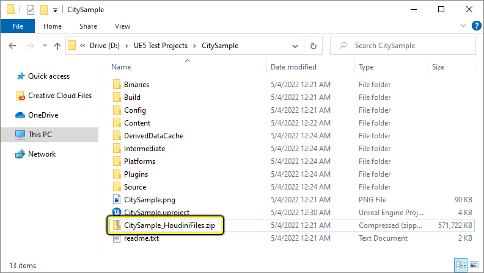
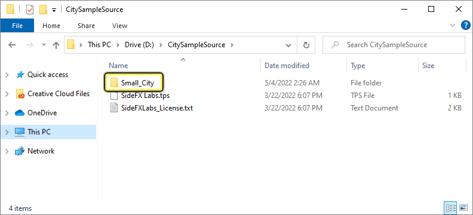
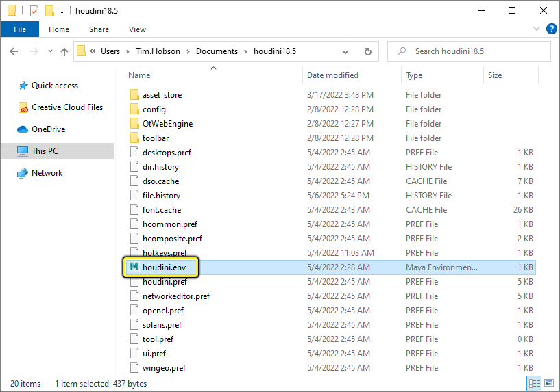
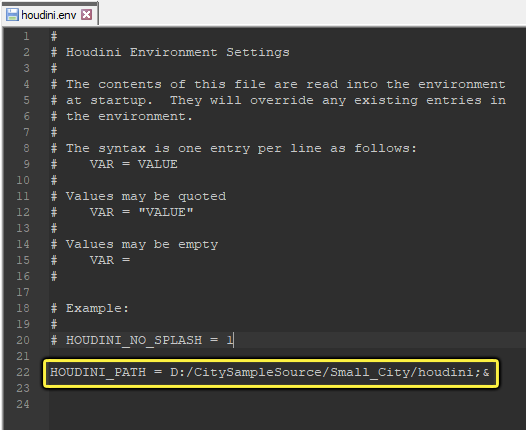
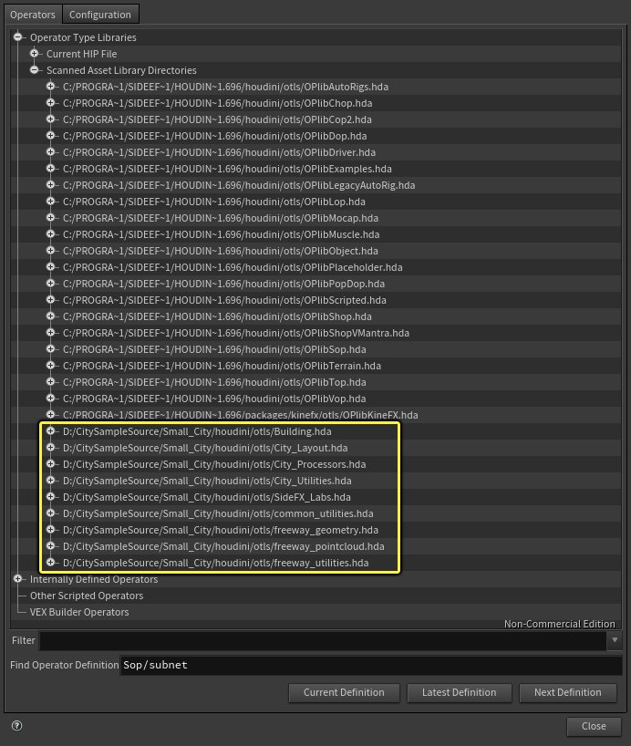
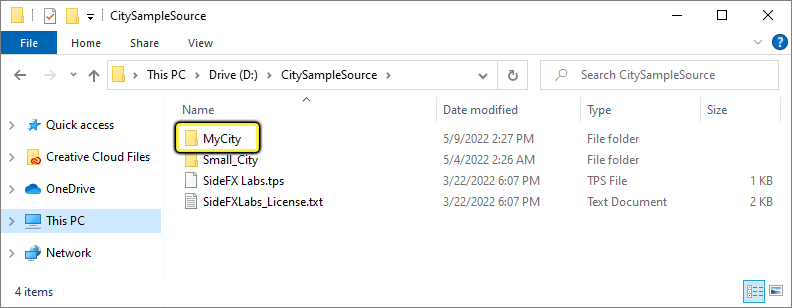
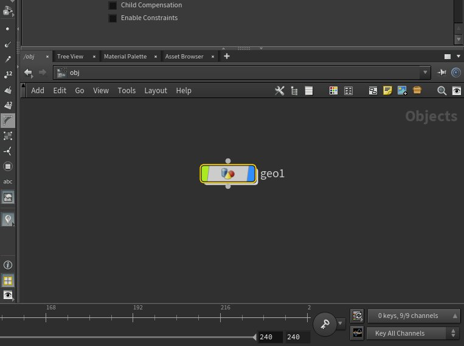
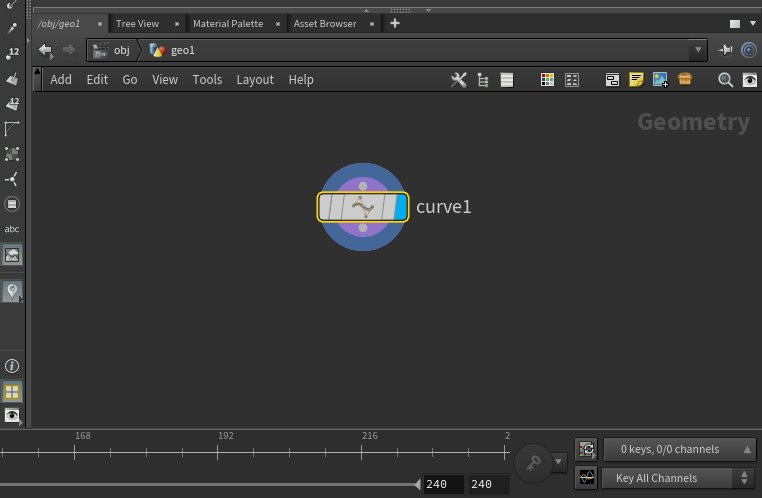

# "城市示例"快速入门 - 使用Houdini生成城市和高速公路

> 路径：虚幻引擎5.7文档 / 示例与教学 / 引擎功能示例 / 城市示例 / "城市示例"快速入门 - 使用Houdini生成城市和高速公路

> 原始页面：https://dev.epicgames.com/documentation/unreal-engine/city-sample-quick-start-for-generating-a-city-and-freeway-using-houdini

"城市示例（City Sample）"项目是一个技术演示，介绍如何在虚幻引擎5中使用SideFX的Houdini Engine中程序化生成的数据来创建初步的模拟世界。"城市示例"使用从Houdini生成的数据来填充资产，并以此驱动AI、交通和音效的模拟等等。

关于自行创建城市的教程系列分为两个部分，本指南是第一部分，在创建城市过程中，我们将用到Epic开发的工具以及Houdini Engine中的道路网络和高速公路系统。

在本指南中，你将学习如何：

- 访问Houdini源文件来创建你自己的城市。
- 使用提供的源文件设置和配置Houdini。
- 设置城市形状、规模和布局的基础。
- 指定区域并定义城市的轮廓。
- 创建支持高速公路系统的道路网络。
- 生成可以导出并准备好导入虚幻引擎5中的所有必要数据。

## 本指南的先决条件

- SideFX Houdini

  - 我们推荐你使用版本18.5.532，因为这是用于开发"城市示例"项目的版本。
  - 你需要运行Houdini一次，为必需的Houdini项目设置生成必要的启动文件。
- 至少2GB的可用硬盘空间，用于提取数据和生成小型城市。对于更大的城市，预计会使用5到10GB的空间。
- 参阅

  "城市示例"推荐的系统规格

  。
- 通过Epic Games启动程序下载

  "城市示例"

  虚幻引擎5项目。

### 关于本指南的附加说明

- 本指南假定你初步了解Houdini并使用过其工具。
- 本指南中使用的工作流程和文件适用于Windows 10操作系统。虽然虚幻引擎和Houdini支持Mac和Linux，但这些工作流程和源文件没有针对这些系统进行测试，我们无法保证它们会按预期运行。

## 第1步 - 必需的Houdini项目设置

若要有效使用Houdini开始生成你的城市，你首先需要在计算机上进行一些设置，包括要提取用来完成本指南所需的源文件。你还需要指定并创建本指南的后面部分使用的一些目录来存储城市的数据。

1. 在保存"城市示例"项目的根目录中，找到 **CitySample_HoudiniFiles.zip** 文件。它包含了完成本指南所需的Houdini源文件。

   
2. 创建用来保存源文件的新文件夹。就本指南而言，所使用的保存位置是 `D:\CitySampleSource` 。本指南的剩余部分假定你使用的是采用类似名称和位置的文件夹路径。
3. 将 **CitySample_HoudiniFiles.zip** 文件的内容提取到该文件夹。提取后，系统中将添加名为 **Small_City** 的文件夹。文件路径应该类似于 `D:\CitySampleSource\Small_City` 。

   
4. 在Windows系统的 **Documents** 文件夹下的 `C:\Users\{your_user_name}\Documents\houdini18.5` 中，使用文本编辑器打开名为 **houdini.env** 的文件。

   
5. 在houdini.env文件底部，添加以下新行：

   ```
        HOUDINI_PATH = D:/CitySampleSource/Small_City/houdini;&
   ```

   编辑后的内容应该类似于：

   

   > [!NOTE]
   > 确保将文件路径替换为你在提取Houdini源文件时使用的文件路径。此外，务必在文件夹路径中使用正斜杠（/），如以上示例所示。Windows默认使用反斜杠（\）。
6. **保存** **houdini.env** 文件。
7. 启动 **Houdini** 。

Houdini启动后，当你打开 **资产管理器（Asset Manager）** 时，应该会看到 **示例Houdini运算符（Sample Houdini Operators）** 列表。你可以在主菜单的 **资产（Asset）> 资产管理器（Asset Manager）** 下查看。展开 **运算符类型库（Operator Type Libraries）> 扫描的资产库目录（Scanned Asset Library Directories）** 可查看，它们位于底部，你应该会在本分段中指定的文件夹路径下看到 `.hda`（Houdini数字资产）文件列表。



## 第2步 - 为你的城市创建目录

在此步骤中，你将创建新文件夹，用来存储Houdini在整个指南中生成的城市数据。该文件夹还将包含"CitySample_HoudiniSource.zip"随附的文件的复制部分，这样你就不会在使用Houdini创建更多城市时无意中将其覆盖。

1. 在 **CitySampleSource** 文件夹中创建新文件夹，用来存储城市的数据。就本指南而言，该文件夹名为 **MyCity** ，位于 `D:\CitySampleSource\MyCity` 中。

   
2. 将位于 `D:\CitySampleSource\Small_City\houdini` 中的内容 **复制** 到 **MyCity** 文件夹。例如，`D:\CitySampleSource\MyCity` 。

现在，你已经将Houdini源文件复制到自己的具名城市文件夹，在本指南的剩余部分中，你将创建自己的城市并将其保存到该位置。

## 第3步 - 定义城市形状以开始城市创建过程

在Houdini中，你将使用专门为"城市示例"项目创建的City Layout运算符来创建和定义城市的形状。City Layout运算符将接受以下输入信息，一是城市形状、二是干线样条线，用于定义城市中主要直通道路，三是指定区域，用于在城市各个部分放置特定类型和高度的建筑物。

在此步骤中，你首先将使用Houdini几何体对象和Curve定义城市的形状。

1. 在 **网络（Network）** 窗格中，使用右键菜单创建 **几何体（Geometry）** 对象。

   
2. 双击 **几何体（Geometry）** 对象，打开图表，使用右键菜单添加 **Curve** 节点。

   

   选择 **Curve** 节点后，**左键点击** 视口，放置各个点来构成城市形状。在此介绍一下规模的概念，"城市示例"项目中的小城市大致为1千米（km）宽，大城市大致为5 km宽。

   > [!TIP]
   > 我们推荐在绘制城市形状时使用 **俯（Top）** 视图，并使用足够大的面积。
3. 在 **网络（Network）** 面板中，使用右键菜单将 **City Layout** 节点添加到图表中。将 **Curve** 节点的输出连接到图表中 **City Layout** 节点的第一个输入。这会使用绘制的曲线点生成街道布局。

   > 图片已省略：将Curve连接到City Layout

   > [!NOTE]
   > 如果 **City_Layout** 运算符在上下文菜单中不可见，请参阅[第1步：必需的Houdini项目设置](#%E7%AC%AC1%E6%AD%A5-%E5%BF%85%E9%9C%80%E7%9A%84houdini%E9%A1%B9%E7%9B%AE%E8%AE%BE%E7%BD%AE)，确保为你的项目正确设置了文件和路径。

   连接好输入之后，城市的布局会包含在绘制的曲线形状中。你可以随时重新选择Curve节点，并四处拖动各个点，直至实现城市布局的所需形状。输出会在视口中自动更新。
4. 在 **网络（Network）** 窗格中，选择图表中的 **City Layout** (1)节点。使用 **City Name** (2)的文本字段，为城市命名。就本指南而言，名称为"MyCity"。

   > 图片已省略：undefined

   点击查看大图。
5. 将场景 **保存** 到本指南前面部分创建的源文件夹。例如，`D:/CitySampleSource/MyCity/MyCity.hip` 。

在本步骤中，你执行了使用City Layout运算符创建城市形状的初始步骤。连入Curve后，城市街区大小的覆层可以让你了解城市中的道路交通。

## 第4步 - 创建城市干线

现在，你已经定义了城市的形状，可以着手创建穿过城市各个部分的主要道路。这些道路即为干线，你可以创建多条干线来划分城市。

在本步骤中，你将创建一个或多个样条线来定义穿过城市的主要道路，并探索City Layout运算符的道路网络选项，以确保实现干净的结果。

1. 在 **网络（Network）** 窗格中，使用右键菜单将 **Curve** 添加到图表中。选择 **Curve** 后，在 **视口（Viewport）** 中左键点击以绘制两个点。

   > 图片已省略：为穿过城市的道路干线添加曲线
2. 将 **Curve** (1)连接到 **City Layout** (2)节点的 **第二个输入（干线样条线）** 。

   > 图片已省略：将干线曲线连接到City Layout

   > [!TIP]
   > 重新选择第二个 **Curve** 节点，移动其两个点中的任意一个，会自动调整城市的布局。
3. [可选]添加更多Curve以创建更多干线样条线。将两个 **Curve** 连线到 **Merge** 节点，然后将 **Merge** 节点连线到 **City Layout** 节点的 **第二个输入** 。下面的示例使用了两个曲线，并表示了本指南其余部分所使用的内容。

   > 图片已省略：undefined

   点击查看大图。
4. [可选]选择用于定义城市形状的 **Curve** 节点，从而调整城市形状。选择其中的点，根据需要加以移动。

使用样条线为城市定义主要道路，在创建更自然的外观和交通之后，试着添加或移动位置，从而更改城市道路的动态。使用City Layout属性进一步探索你定义的城市形状中的道路布局。

> 图片已省略：City Layout属性

试着调整 **密度（density）** 以改变细分网格，为创建道路标线打下基础。调整 **角度（angle）** 属性，让城市街道上的交通更自然，更均匀。

> [!WARNING]
> 前往下一步之前，确保你的布局和道路网络没有出现错误。添加多个干线或采用独特的城市形状可能会导致问题。找出问题迹象，并相应调整。

## 第5步 - 调整道路网络选项

在本步骤中，你将继续优化城市，使用City Layout属性中的 **道路网络选项（Road Network Options）** 调整道路。你将学习如何使用完全预览模式，并尝试一些细微的改动，用以合并城市街区或合并十字路口附近的道路，创建更顺畅的交通。

1. 在 **网络（Network）** 窗格中，选择 **City Layout** 节点(1)。在网络（Network）窗格上方的窗格(2)中，你可以修改细节和节点属性。

   > 图片已省略：undefined

   点击查看大图。
2. 在 **preview_options** 分段中的 **城市布局（City Layout）** 属性窗格中，启用 **完全预览（full preview）** 的复选框。使用该属性，可以更准确地预览网络以及图表中发生的所有清理工作，但这也需要更多计算能力，因而会降低可交互性。

   > 图片已省略：城市布局启用完全预览选项

   > 图片已省略：完全预览已禁用

   > 图片已省略：完全预览已启用

   完全预览已禁用

   完全预览已启用
3. 点击 **道路网络选项（Road Network Options）** 选项卡，调整生成的道路网络的属性。请务必调整这些属性，让城市道路网中的交通顺畅，避免十字路口堵塞或者道路太短或彼此距离太近。

   > 图片已省略：城市布局道路网络选项

   > [!WARNING]
   > 注意不要创建单行道。你不应该采用直通大街，并且要使用道路长度最小值来确保交通良好。

在下面的示例中，城市使用了多个干线样条线来定义主要道路，实际上将城市分隔为四个象限。这会使得每个象限都有沿不同方向通行的道路，但也会导致某些区域有多条道路在十字路口交汇。探索使用道路网络属性来沿主要直通道路合并城市街区和城市街道。

| 列 1 | 列 2 |
| --- | --- |
| [undefined](https://d1iv7db44yhgxn.cloudfront.net/documentation/images/fb80a20d-767c-4c9f-9f17-d2967bef3145/5-road-network-options-default.png) | [undefined](https://d1iv7db44yhgxn.cloudfront.net/documentation/images/4220b212-d161-4760-b3d9-68e19d5010ec/5-road-network-options-adjusted.png) |
| 道路网络：默认设置 | 道路网络：调整的街区百分比和融合因子 |

点击查看大图。

## 第6步 - 绘制城市区域和调整城市风景

你的城市已经初步成型，有了多条干线道路，现在可以定义区域来更好地定义城市风景。在本步骤中，你将学习如何将City Zone运算符插入到City Layout节点，从而使用Curve定义单个区域。通过City Zone运算符属性，你可以使用图表上的多个点定义高度，并设置如何表示该曲线。

1. 在 **网络（Network）** 窗格中，使用右键菜单将 **Curve** 添加到图表中，以创建一个区域来定义在该城市区域中布置哪些类型的建筑物和结构。在 **视口（Viewport）** 中，在城市形状周围绘制你想定义为区域的范围。

   > 动图已省略：绘制城市区域形状
2. 在 **网络（Network）** 窗格中，使用右键菜单添加 **City_Zone** 运算符。将 **Curve** (1)连线到 **Zone** (2)节点。将 **Zone** (2)节点连线到 **City Layout** 节点的 **第三个输入（城市区域）** (3)输入。

   > 图片已省略：将城市区域连接到城市布局
3. 在 **网络（Network）** 窗格中，选择 **City Zone** 节点。其属性将显示在图表上方的窗格中。

   > 图片已省略：City Zone属性

   1. 高度（Height）

      定义了所定义区域的最大高度。
   2. 点编号（Point No.）

      用于在图表上的可用点之间进行选择。默认情况下，只有两个点，一个编号为0，另一个编号为1。单击图表将自动添加点。
   3. 位置（Position）

      和

      值（Value）

      用于将选定的点沿图表的X和Y轴移动，以定义区域形状的衰减和最大高度。
   4. 插值（Interpolation）

      定义了相对于位置（Position）和值（Value）应用于形状的曲线类型
4. 使用 **City Zone属性** 调整区域的属性。
5. [可选]重复之前的步骤，以添加更多区域并使用 **Merge** 节点将其连接到 **City Layout** 节点。

   > 图片已省略：定义了多个城市区域

   > [!TIP]
   > 选择 **City Layout** 节点后，启用 **preview_options** 分段下的 **preview_zones** 以显示定义的城市区域。

就本指南而言，城市中定义了两个区域。其中一个区域有更多高层摩天大楼，并且主要占据城市的一个象限，另一个区域的高度略低，分布于两个象限之中。在本指南后面部分，你将生成用来填充城市的建筑物体积。这些区域有助于定义城市风景的外观。

## 第7步 - 绘制穿过城市的高速公路通道

对于大部分城市，游历方式有很多种，比如驾车行驶在多车道高速公路上，绕过行人、人行横道和设有交通信号灯的十字路口。"城市示例"提供了一些工具和运算符，用于设置你自己的高速公路通道或环路，其中包含入口点和出口点。

在本步骤中，你将学习如何向你自己的城市添加带有入口点和出口点的高速公路通道，这些点将使用Curve and Freeway Util Curve Attribute运算符连接到干线道路（红色）。

1. 在 **网络（Network）** 窗格中，使用右键菜单添加 **Curve** 节点。在 **视口（Viewport）** 中，点击你想让高速公路通道经过的点。

   > 图片已省略：高速公路通道曲线

   > [!TIP]
   > 你可以选择使用 **Polywire** 和 **Merge** 节点，更好地可视化城市布局上的高速公路通道。选择 **Polywire** 节点后，使用属性将 **连线半径（Wire Radius）** 设置为足够高的值，以使通道清晰可辨。
   >
   > > 图片已省略：高速公路通道polywire组合
2. 使用右键菜单将 **Freeway Util Curve Attribute** 运算符添加到图表。

   选择 **Freeway Util Curve Attribute** 节点后，你可以修改两个属性：

   1. 车道数量（Number of Lanes）：

      你可以设置为4个或6个车道。
   2. 封闭式（Closed）：

      为你想设为闭环的高速公路通道启用该复选框。

   > [!WARNING]
   > 选择不自行闭环的高速公路通道时，请确保其端头连接到干线道路（红色），并且可在连贯的道路内通行。

设置高速公路通道或环路完成后，你可以从图表中删除 **Merge** 和 **Polywire** 节点，因为这些节点用于直观地显示道路，而现在不再需要了。将 **Curve** 节点连线到 **Freeway Util Curve Attributes** 节点以完成设置。

你可以使用Freeway Util Curve Attributes运算符创建多条高速公路通道，并决定是否让闭环或通道自带入口点和出口点，以便驶入和驶出下方城市街道。创建你自己的城市时，探索使用不同数量的车道以及从城市各个部分到高速公路的连接点。

## 第8步 - 在City Processor中组装你的输入

你已经为城市做了大量基础工作，定义了形状，设置了道路和高速公路系统，现在该使用 **City Processor** 运算符组装你的工作了。你在本指南之前的步骤中编译并设置的所有数据将在这里开始与各个区域、高速公路、干线道路等组合起来。

> 图片已省略：用于区域、干线和高速公路的Processed City

1. 使用编辑器窗口右下角的选择框，将Houdini设置为 **手动（Manual）** 模式。默认情况下，Houdini设置为自动烘焙内容。在本例中，最好将此内容的烘焙操作延迟到所有输入都已连接之后。
2. 在 **网络（Network）** 窗格中，使用右键菜单添加 **City Processor** 运算符。
3. 将 **City Layout** 节点(1)的第二个输出连线到 **City Processor** 节点(2)的第一个输入。

   > [!NOTE]
   > 你可以忽略City Processor节点上的警告，因为它将在下一步中解决。
4. 将 **Freeway Util Curve Attributes** 节点(1)连线到 **City Processor** 节点(2)的第二个输入。
5. 将Houdini设置回 **自动更新（Auto Update）** 模式，这会触发City Processor节点烘焙输入数据。

   > [!WARNING]
   > 重新启用 **自动更新（Auto Update）** 模式会触发处理City Processor，这可能需要几分钟才能完成。

处理完成后，你可以预览根据之前步骤中的所有输入数据所生成的城市。

在下面的示例中，你可以查看高速公路通道如何在城市的一个部分中放置，两条干线道路在整个城市中延伸，多个象限中的城市街道沿不同方向通行，城市中定义了两个区域，一个区域有更高的建筑物，另一个区域的建筑物在规模上呈现逐渐增加的态势，但建筑物没有那么高。

## 第9步 - 创建城市的高速公路连接点

城市已经处理完，并考虑了来自城市运算符的各种数据，现在高速公路需要将其通道连接到下方城市街道。

1. 在 **网络（Network）** 窗格中，双击 **City Processor** 节点打开其网络图表，然后访问图表的 **高速公路（Freeway）** 部分。

   > 图片已省略：undefined

   点击查看大图。
2. 在图表中名为 **FREEWAY OUTPUT（高速公路输出）** 的带注释（蓝色）分段中，查找 **FREEWAY** 节点。右键点击并从上下文菜单选择 **允许编辑内容（Allow Editing of Contents）** 。

   > 图片已省略：undefined

   点击查看大图。
3. 双击 **FREEWAY** 节点以查看其节点网络。在左侧名为 **处理高速公路、连接点和匝道（Process Freeway, Connections and Ramp）** 的蓝色注释下找到 **connections_blank** 节点。

   > 图片已省略：undefined

   点击查看大图。
4. 双击 **connections_blank** 节点访问其节点网络。找到 **all_connections** 节点并双击打开其图表。

   > 图片已省略：undefined

   点击查看大图。
5. 点击 **ROAD_REFERENCE** 节点上的 **显示（Display）** 。

   > 图片已省略：显示Road Reference的模板
6. 按住 **Ctrl** 键并选择 **ROAD_REFERENCE** 和 **merge_freeway** 节点。点击节点上的 **显示模板（Display Template）** （粉色）。

   > 图片已省略：为高速公路通道启用显示模板
7. 在图表中，选择 **connection_set_1** 节点，在其属性窗口中，启用 **预览模式（Preview Mode）** ，以在编辑时更快获得反馈。

   > 图片已省略：预览模式Connection Set 1
8. 在属性窗口中，点击 **连接点属性（Connections property）** 旁边的 **加号（+）** 按钮。这会添加用于将高速公路通道连接到街道的曲线。

   > 图片已省略：undefined

   点击查看大图。
9. 点击 **编辑曲线0（Edit Curve 0）** 。
10. 启用 **控点（Handle）** 工具后，点击两个点：一个点靠近高速公路通道，第二个点在你想连接到的街道上。你可以按住 **Ctrl + 左键点击** 建立街道连接点，或按住 **Shift + 左键点击** 建立高速公路连接点，对这两个点进行调整。

    > [!NOTE]
    > 确保街道和连接点有相同数量的车道。使用添加的连接曲线的 **车道数量（Number of Lanes）** 滑块更改此数量。

    点击最后一个适当的点之后，你应该会看到类似于下图的结果。
11. **重复** 上述步骤，根据需要向高速公路通道添加更多入口点和出口点。
12. 在图表中，选择 **connection_set_1** 节点，在其属性窗口中，完成与高速公路的连接后禁用 **预览模式（Preview Mode）** 。

connection_set_1属性提供了各种设置，用于调整高速公路与下方街道的连接方式。你可以在将新的连接元素添加到数组时探索可用的属性。查看 **插值（Interpolation）** 、 **海拔（Elevation）** 和 **倾斜（Banking）** 属性，调整连接点与街道交汇的方式。

## 第10步 - 调整城市风景和建筑物体积

你可以使用City Processor控制生成城市时的各个方面，以在本指南后面部分导出。**City_Lot_Processor** 运算符为地块和填充地块的建筑物提供了属性。你可以使用相应属性定义与大小、人行道缩进距离、建筑物风格、超出默认设置的变体等相关的属性。

在本步骤中，你将学习这些设置位于何处，并酌情调整。建议你试用不同的设置，使用这些属性创建不同的风格和变体。

1. 在 **网络（Network）** 窗格中，打开 **City Processor** 节点。在其网络图表中，检查 **3. LOTS** （橙色）并选择 **City_Lot_Processor** 节点（黄色圆圈）。

   > 图片已省略：undefined

   点击查看大图。
2. 选择 **City_Lot_Processor** 节点后，查看属性窗格，你可以在其中选择 **地块（LOTS）** 和 **建筑物（BUILDINGS）** 选项卡。

你可以使用City Lot Processor属性来调整所生成的地块和建筑物。对于地块，则包括地块大小、与高速公路之间的退移距离以及针对人行道的考虑。对于建筑物，你可以定义其风格、高度和大小。

探索其中每个面板中的设置，并针对你自己的城市试用不同的变体。

> [!WARNING]
> 更改这些属性会导致重新生成城市周围的建筑物体积和地块。每次更改完成重新生成之后，才能进行其他更改。如果城市很大，可能需要好几分钟的时间才能完成重新生成过程。

| 列 1 | 列 2 |
| --- | --- |
| CIty Processor Lots Properties | City Processor Buildings Properties |
| City Lot Processor属性：地块 | City Lot Processor属性：建筑物 |

## 第11步 - 生成城市缓存并导出数据

在这个最后的步骤中，你将使用 **City Processor** 属性窗格来设置你是否想将程序化依赖性图表（PDG）用于某个部分的所选处理选项。这样做将生成并导出必要的数据，稍后你可以将其导入虚幻引擎5中，以在其中创建你的城市。

1. 将Houdini设置为 **手动（Manual）** 模式，以在更改City Processor节点时延迟重新生成过程。
2. 在 **网络（Network）** 窗格中，选择 **City Processor** 节点。
3. 在 **City Processor** 属性窗格中，添加或删除 **使用PDG（use PDG）** 旁边的复选框，以选择是否要使用PDG生成城市缓存并导出数据。

PDG用于提高处理速度，具体取决于你的机器以及过程数量。考虑以下情况：

1. **使用PDG（With PDG）** 时，有三个子步骤需要处理。点击 **处理城市基础（process city base）** 、 **PDG过程（PDG process）** 和 **处理城市设施（process city furniture）** 的过程。PDG处理发生在建筑物生成阶段，在城市很大的情况下尤其有用，因为它与需要最多计算能力的建筑物生成过程并行发生。

2. **不使用PDG（Without PDG）** 时，点击 **不使用PDG处理城市（process city without PDG）** 以生成不同的缓存。

1. 处理完成后，根据 **使用PDG（use PDG）** 的状态执行以下操作：

   1. 如果启用，则点击

      EXPORT ALL PBC

      以导出几何体和Point Cloud Alembic（PBC）。

   1. 如果禁用，首先使用

      缓存和导出（Caches and Exports）

      选项卡确保你所看到的结果是从磁盘读取的。在底部的

      几何体和PBC导出（geometry and pbc export）

      分段下，点击

      导出所有PBC（EXPORT ALL PBC）

      。

在这个最后的步骤中，你现在已经处理并导出了所有必要的数据，可继续执行本指南系列的第二部分，你可以在其中使用"城市示例"项目将城市的Houdini数据导入虚幻引擎中。

继续学习["城市示例"：在虚幻引擎5中生成城市和高速公路](../city-sample-quick-start-for-generating-a-city-a-38ed3470/index.md)，自行完成城市开发，并在虚幻引擎中查看整体效果。

> 图片已省略：UE5中生成的城市

## 第12步 - 自行尝试！

你已经生成了所有必要的数据和文件，可在虚幻引擎的"城市示例"项目中完整实现你的城市，现在你可以继续探索如何使用Epic Games为Houdini Engine开发的程序化工具生成城市。

下面是关于自行尝试的一些建议：

- 回顾

  第3步

  ，探索如何使用不同的样条线形状为你的城市创建各种形状和大小。
- 回顾

  第4步

  ，将多条干线道路添加到你的城市。使用这些操作为你的城市创建有趣的形状和区域。
- 回顾

  第5步

  ，探索City Layout节点中的设置。你可以试一试为你的城市更改城市布局选项、道路网络选项和道路网络大小下的设置。
- 回顾

  第6步

  ，在城市周围设置和绘制不同的区域类型。这很适合用于创建高层建筑物区域，以及大小适中的建筑物区域。使用区域形状图表为每个区域定义曲线形状。
- 回顾

  第7步

  ，试一试不同类型的高速公路布局，例如绘制多条高速公路，以及采用闭环高速公路。本指南仅演示了单条线性高速公路。使用Freeway Util Curve Attribute节点来设置高速公路是否应该封闭，并尝试使用包含四条和六条车道的多条连通高速公路。
- 回顾

  第10步

  ，查看City Lot Processor属性，你可以在其中试一试不同的地块和建筑物设置。对于地块，你可以设置地块应该与高速公路相距的距离、其最小规模，控制影响人行道的方式等等。对于建筑物，你可以更精细地控制建筑物高度、道路之间的地块大小，应用一定数量的噪点，以改变第6步中设置的指定区域之外的建筑物大小，等等。试一试不同的设置，但请注意，每次更改都会自动处理并在Houdini视口中更新，完成所需时间可能很快，也可能需要几分钟。
