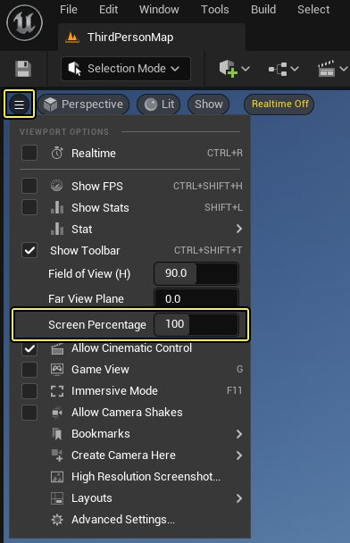
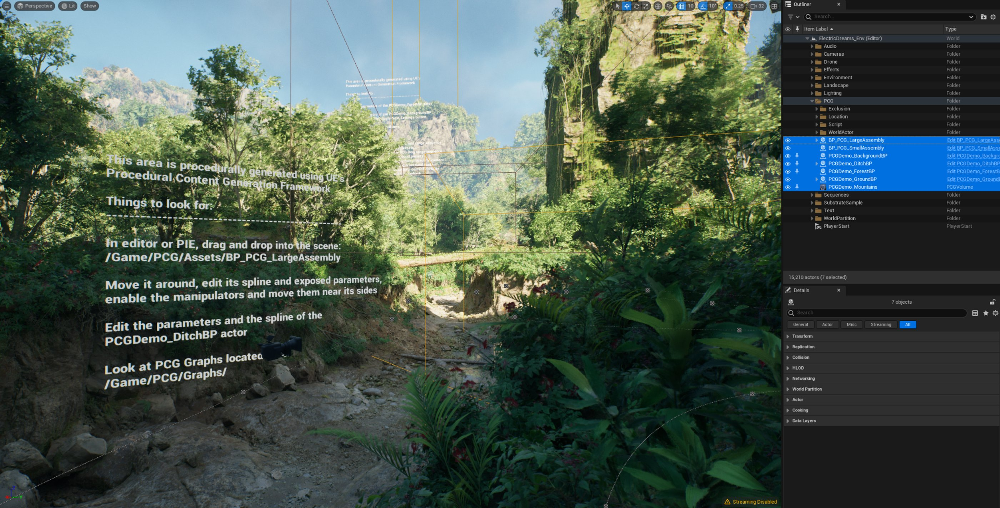

# Electric Dreams场景

> 路径：虚幻引擎5.7文档 / 示例与教学 / 引擎功能示例 / Electric Dreams场景

> 原始页面：https://dev.epicgames.com/documentation/unreal-engine/electric-dreams-environment-in-unreal-engine

在**Electric Dreams场景**示例项目中，你可以探索我们在2023年GDC大会上的State of Unreal主题演讲中展示的场景。 在该场景中，我们展示了虚幻引擎5.2中的一些全新试验性功能，包括：

- [程序化内容生成框架](https://dev.epicgames.com/documentation/assets/building-virtual-worlds/procedural-generation)（PCG）
- [Substrate材质编写系统](https://dev.epicgames.com/community/learning/courses/92D/unreal-engine-substrate-materials)
- 虚幻引擎物理系统的最新进展

场景还展示了虚幻引擎5的多个已有功能，包括：

- [Lumen](../../../building-virtual-worlds/lighting-the-environment/global-illumination/lumen-global-illumination-and-reflections/index.md)
- [Nanite](../../../designing-visuals-rendering-and-graphics/optimizing-and-debugging-projects-for-realtime-rendering/nanite/nanite-virtualized-geometry/index.md)
- [音景](../../../working-with-audio/soundscape/index.md)

本示例场景属于学习资源，旨在展示"Electric Dreams "虚拟世界是如何同时利用传统流程以及PCG流程构建的；整个场景都在虚幻引擎内直接搭建，并采用了PCG框架。 另外，你还可以探索其他功能，例如通过Opal材质示例了解Substrate功能、音频、流体模拟等等。

## 设置

要安装Electric Dreams环境示例项目，请按以下步骤操作：

1. 通过**Fab**访问[Electric Dreams场景示例](https://fab.com/s/7ee8c5704aaa)，点击**添加到我的库（Add to My Library）**，即可在**Epic Games启动器**中显示该项目文件。

   1. 或者，你也可以在启动程序的Fab中或UE的Fab插件中搜索该示例项目。
2. 在**Epic Games启动器**中，找到**虚幻引擎 > 库 > Fab库**以访问项目。

   > [!NOTE]
   > 只有在你安装了兼容的引擎版本时，示例项目才会出现在**Fab库**中。
3. 点击**创建项目（Create Project）**并按照屏幕上的提示下载示例并启动新项目。

要了解有关从Fab访问示例内容的更多信息，请参阅[示例与教程](../../index.md)。

## 推荐的系统规格

Electric Dreams场景包含大量图形内容，因此需要高性能显卡以确保帧率稳定。 我们推荐将该项目安装在固态硬盘（SSD）上。 [Nanite](../../../designing-visuals-rendering-and-graphics/optimizing-and-debugging-projects-for-realtime-rendering/nanite/nanite-virtualized-geometry/index.md)和[虚拟纹理](../../../designing-visuals-rendering-and-graphics/optimizing-and-debugging-projects-for-realtime-rendering/virtual-texturing/index.md)需要高速读取才能实现最佳效果。

推荐的硬件规格如下：

| 推荐的系统规格 | 最低硬件配置 |
| --- | --- |
| 12核CPU，3.4 GHz64 GB的系统RAMGeForce RTX 3080（相同性能或更高性能显卡）至少10 GB的VRAM | 8核CPU，3.6 GHz32 GB的系统RAMGeForce RTX 2080（相同性能或更高性能显卡）至少８ GB的VRAM |

> [!NOTE]
> Electric Dreams场景示例要求显卡支持DirectX 12，并将显卡驱动程序更新到最新。

使用较低配置的电脑时，你可以降低分辨率和视口屏幕百分比，从而提升性能和效果。 例如使用最低硬件配置时，我们推荐在显示较大场景时，采用1080p的分辨率和50%的屏幕百分比。 你可以使用编辑器视口左上角**视口选项菜单（Viewport Options Menu）**中的**屏幕百分比（Screen Percentage）**滑块来设置。

或者，你可以用控制台命令`r.ScreenPercentage`在运行时设置这个值。 例如，`r.ScreenPercentage 50`可将屏幕百分比设为50%。

## 漫游示例场景

打开Electric Dreams项目后，首先会打开启动（Startup）关卡。 启动关卡包含一张图片，显示了此示例的使用方法以及推荐硬件配置。

Electric Dreams场景包含多个关卡。 要打开其中一个关卡，请在**内容浏览器（Content Browser）**中找到**内容（Content）>关卡（Levels）**。

### 关卡

Electric Dreams场景示例中可用的关卡在下表中如下列示：

| 关卡名称 | 说明 |
| --- | --- |
| **ElectricDreams_Env** | 该关卡包含完整的Electric Dreams场景。 它包含人工创建区域以及用PCG框架以程序化方式创建的区域。 此外还包含：音景程序化环境音效流体模拟水坑Substrate材质球Demo序列**资源开销**：该关卡是一个禁用了流送功能的世界分区关卡，面积为4 x 4千米，并含有大量场景内容。**内容文件路径**：`/Game/Levels/ElectricDreams_Env` |
| **ElectricDreams_PCG** | 该关卡相当于一个仅包含程序化内容的Electric Dreams场景。**资源开销**：该关卡是一个禁用了流送功能的世界分区关卡，面积为4 x 4千米，并含有大量场景内容。**内容文件路径**：`/Game/Levels/PCG/ElectricDreams_PCG` |
| **ElectricDreams_PCGCloseRange** | 该关卡是从 ElectricDreams_PCG 提取的一张较小地图。 仅包含程序化生成的河床、溪流，以及大型峭壁结构。**资源开销**：该关卡的资源开销较少。**内容文件路径**：`/Game/Levels/PCG/ElectricDreams_PCGCloseRange` |
| **ElectricDreams_PCGLargeAssembly** | 该关卡包含我们在GDC演示中添加的大型峭壁结构，以及构建峭壁所需的所有组件。**内容文件路径**：`/Game/Levels/PCG/Breakdown_Levels/ElectricDreams_PCGLargeAssembly` |
| **ElectricDreams_PCGDitchAssembly** | 该关卡包含基于Spline的沟堑，以及构建沟堑的相关组件。**内容文件路径**：`/Game/Levels/PCG/Breakdown_Levels/ElectricDreams_PCGDitchAssembly` |
| **ElectricDreams_PCGForest** | 该关卡包含一小块地面，以及地面上的参数化PCG森林。**内容文件路径**：`/Game/Levels/PCG/Breakdown_Levels/ElectricDreams_PCGForest` |
| **ElectricDreams_PCGSplineExample** | 该示例演示了如何利用单个Assembly并将其应用于程序化生成的路径上 - 通过PCG图表逻辑来强化原始Assembly。**内容文件路径**：`/Game/Levels/PCG/Breakdown_Levels/ElectricDreams_PCGSplineExample` |

你可以通过以下方式，在上文所有关卡中操控PCG工具：

- 在**虚幻编辑器**中实时交互。
- **在编辑器中运行（Play-in-Editor）**（PIE）期间交互。
- 通过**内容浏览器（Content Browser）**中的**内容（Content）>PCG>图表（Graphs）**单独交互。

场景的主区域中还散布着一些说明用的文本Actor，用于介绍各个功能。

## Electric Dreams内置操作

### 无人机操控

在此示例的所有关卡中，无论是编辑器PIE模式还是编译好的可执行版本中，你都可以使用操控无人机漫游场景。 下表介绍了无人机的操控选项：

| 无人机操作 | 控制器（Controller） | 键盘和鼠标 |
| --- | --- | --- |
| **向前移动（Move Forward）** | 左摇杆 | W |
| **向后移动（Move Backward）** | 左摇杆 | S |
| **向左移动（Move Left）** | 左摇杆 | A |
| **向右移动（Move Right）** | 左摇杆 | D |
| **察看（Look）** | 右摇杆 | 鼠标移动 |
| **增加海拔（上升）（Altitude Up (Ascend)）** | 右扳机 | E |
| **降低海拔（下降）（Altitude Down (Descend)）** | 左扳机 | Q |
| **加速（Speed Up）** | 右肩键 | F |
| **减速（Slow Down）** | 左肩键 | R |

### 序列快捷方式

在漫游ElectricDreams_Env关卡时，你可以体验我们在GDC中演示的Electric Dreams影片序列。 这些序列可以通过以下键盘快捷键触发：

| 序列操作 | 键盘 |
| --- | --- |
| **飞过（Fly-Through）** | Shift+C |
| **PCG中距离（PCG Mid Range）** | Shift+V |
| **PCG长距离（PCG Long Range）** | Shift+Ｂ |
| **停止播放序列（Stop Playing Sequence）** | 空格键 |

## Electric Dreams中的程序化内容生成

进一步了解Electric Dreams场景示例如何在虚幻引擎中将传统流程和PCG流程相结合。

- [Electric Dreams中的程序化内容生成](procedural-content-generation-in-electric-dreams/index.md) - 了解"Electric Dreams"如何在虚幻引擎中整合传统工作流程和程序化工作流程。
