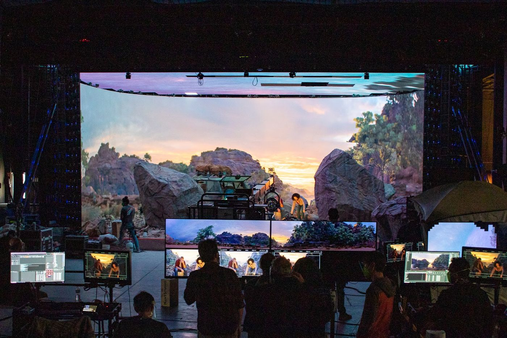
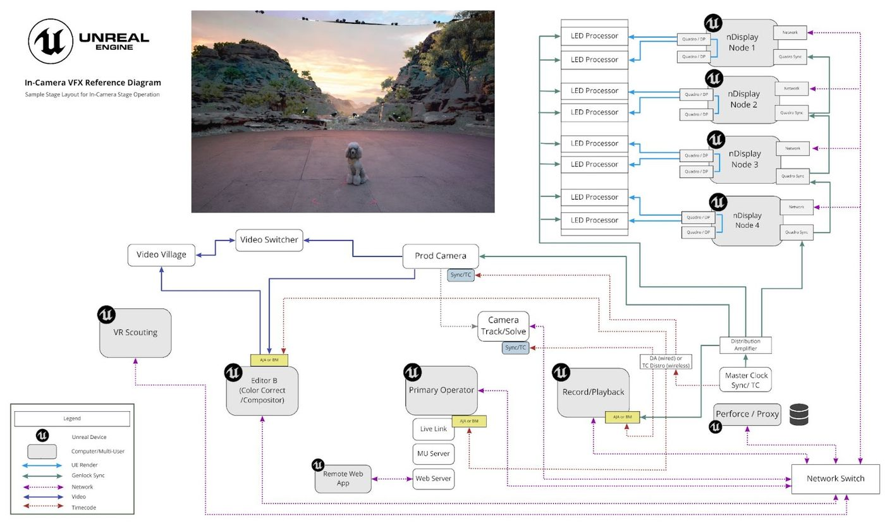
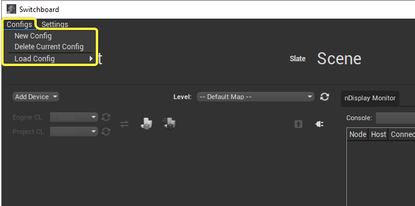
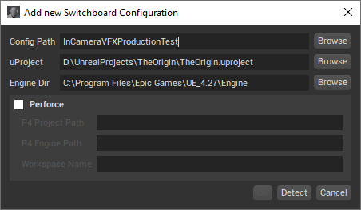
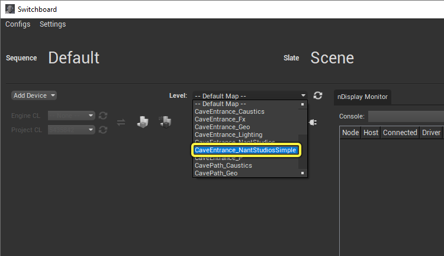
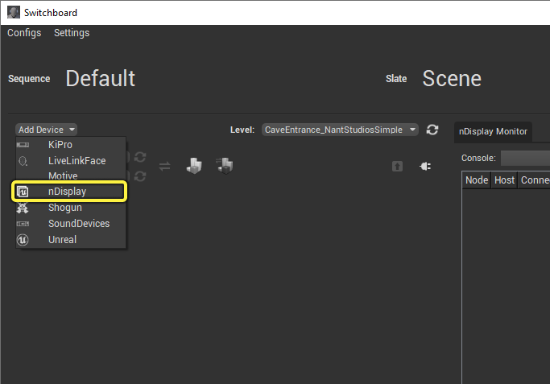
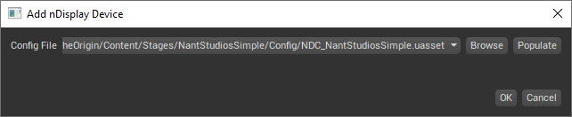
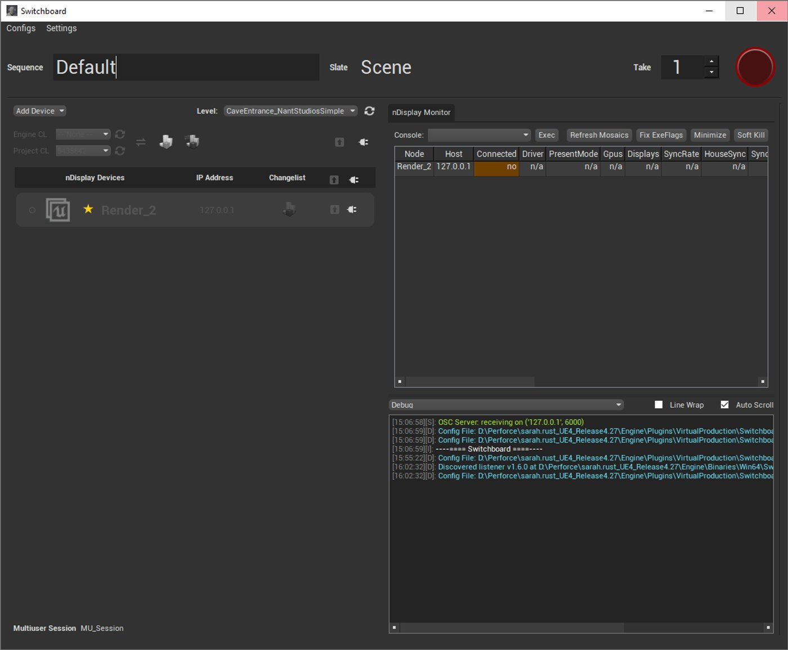

# ICVFX制片测试

> 路径：虚幻引擎5.7文档 / 示例与教学 / 引擎功能示例 / ICVFX制片测试

> 原始页面：https://dev.epicgames.com/documentation/unreal-engine/incamera-vfx-production-test-sample-project-for-unreal-engine

ICVFX制片测试是一个虚拟制片示例，它用到了虚幻引擎和LED摄影棚，涉及移动载具镜头、多像机设置、以及基于多用户设置的镜头间快速切换。 本示例由我们与电影人团体[Bullitt](https://bullittbranded.com/)合力制作。 该团队在洛杉矶[Nant Studios](https://www.nantstudios.com/)的LED舞台上，用时四天在摄像机内制作出最终成片。

短片基于此项目生成。

探究和修改此示例有助于了解以下知识：

- 构建你的虚拟制片项目，使多名美术师可以在制片期间合作，同时对场景进行处理。
- 使用GPU Lightmass和多用户设置在一台计算机上烘焙光照，并共享给会话中的所有计算机，更快实现光照变更。
- 在多屏幕nDisplay群集上使用mGPU渲染内部视锥体。
- 将颜色校正和OCIO配置文件应用至nDisplay渲染，以实现各个场景所需的外观。
- 编译远程控制Web应用程序的UI，以满足你的制片需求，并可通过平板电脑对片场进行快速更改。
- 应用控制台变量以提高项目性能。

本指南介绍制作团队如何在项目中使用虚幻引擎的各项功能来取得最终成果。 以此项目为例，设计你自己的制片流程。 如需了解镜头内视效的基础知识，请参阅[ICVFX快速入门](../../../working-with-media/integrating-media/icvfx/in-camera-vfx-quick-start/index.md)。 如需了解制片过程的幕后花絮，请参见[虚幻引擎聚焦](https://www.unrealengine.com/en-US/spotlights/taking-unreal-engine-s-latest-in-camera-vfx-toolset-for-a-spin)。

## 舞台设置和硬件

点击查看大图。

我们使用了四个nDisplay节点渲染以下体积，每个节点分配两个LED面板。

- **墙壁（Walls）**：**5**个LED面板，总分辨率**15312 x 2112**。
- **天花板（Ceiling）**：**3**个LED面板，总分辨率**4160 x 5280**。

此实际制片示例同时会占用大量CPU和GPU资源，因此它可以在这个大LED体积上以摄像机原本的分辨率渲染。 下图显示所有参与制片的设备以及舞台上各个设备之间的连接。 如需详细了解各个设备在拍摄期间的具体作用，请参阅[镜头内视效概述](../../../working-with-media/integrating-media/icvfx/in-camera-vfx-overview/index.md)。 如需详细了解推荐的ICVFX拍摄硬件，请参阅[ICVFX推荐硬件](../../../working-with-media/integrating-media/icvfx/recommended-hardware-for-in-camera-vfx/index.md)。

图片显示了用到了哪些设备以及它们在舞台上的通信方法。 点击查看大图。

## 入门指南

除了代表制片中所用真实舞台的拓扑结构的[nDisplay配置](../../../working-with-media/integrating-media/rendering-to-multiple-displays-with-ndisplay/ndisplay-configuration-file-reference/index.md)之外，项目另含一个简单的nDisplay配置，便于你在单个计算机上查看各个场景，而无需LED体积。 本节介绍如何使用此简单nDisplay配置在单个计算机上的多用户会话中渲染场景和进行更改。

按照以下步骤，在计算机上的多用户会话中通过nDisplay渲染器启动一个虚幻编辑器实例和一个虚幻引擎实例。

1. 通过**Fab**访问[ICVFX制片测试示例](https://fab.com/s/c9a039f679f8)，点击**添加到我的库（Add to My Library）**，即可在**Epic Games启动器**中显示该项目文件。

   1. 或者，你也可以在启动程序的Fab中或UE的Fab插件中搜索该示例项目。
2. 在**Epic Games启动器**中，找到**虚幻引擎 > 库 > Fab库**以访问项目。

   > [!NOTE]
   > 只有在你安装了兼容的引擎版本时，示例项目才会出现在**Fab库**中。
3. 点击**创建项目（Create Project）**并按照屏幕上的提示下载示例并启动新项目。

   1. 要了解有关从Fab访问示例内容的更多信息，请参阅[示例与教程](../../index.md)。
4. 转到计算机上的虚幻引擎文件夹，在计算机上运行Engine\Binaries\Win64\SwitchboardListener.exe以启动**SwitchboardListener**。 监听器会在启动时自动最小化其窗口，以避免nDisplay设备出现问题。 可以在操作系统的任务栏中找到该应用程序。

   以下是一个完整路径示例：`C:\Program Files\Epic Games\UE_4.27\Engine\Binaries\Win64\SwitchboardListener.exe`
5. 在虚幻引擎文件夹内，运行Engine\Plugins\VirtualProduction\Switchboard\Source\Switchboard\Switchboard.bat，以在计算机上启动**Switchboard**。 如果是首次运行Switchboard，则在打开应用程序窗口之前会安装所有必要的依赖项。

   以下是一个完整路径示例：`C:\Program Files\Epic Games\UE_4.27\Engine\Plugins\VirtualProduction\Switchboard\Source\Switchboard\Switchboard.bat`
6. 新建一个**Switchboard配置（Switchboard Configuration）**。

   - 如果你是首次运行Switchboard，启动Switchboard时会显示**新增Switchboard配置（Add New Switchboard Configuration）**窗口。
   - 如果不是首次运行，点击该窗口左上角的**配置（Configs）>新配置（New Config）**，打开**新增Switchboard配置（Add New Switchboard Configuration）**窗口。

     
7. 在**新增Switchboard配置（Add New Switchboard Configuration）**窗口中：

   1. 将**配置路径（Config Path）**设为要存放Switchboard配置文件的名称和路径。
   2. 将**uProject**设置为ICVFX制片测试示例项目文件`TheOrigin.uproject`的路径。
   3. 确保**引擎目录（Engine Dir）**指向虚幻引擎的**Engine**文件夹。
   4. 点击**确定（OK）**创建Switchboard配置。

      
8. 将**关卡（Level）**设为**CaveEntrance_NantStudiosSimple**。

   
9. 向Switchboard添加nDisplay设备：

   1. 点击**添加设备（Add Device）**并从下拉菜单中选择**nDisplay**。

      
   2. 在**添加nDisplay设备窗口（Add nDisplay Device window）**中，点击**浏览（Browse）**，导航至示例项目文件夹中的Content\TheOrigin\Content\Stages\NantStudiosSimple\Config\NDC_NantStudiosSimple.uasset。

      
   3. 点击**确定（OK）**可看到一个添加到Switchboard的nDisplay设备。

      
10. 向Switchboard添加虚幻设备：

    1. 再次点击**添加设备（Add Device）**并从下拉菜单中选择**虚幻（Unreal）**。

       > 图片已省略：添加虚幻设备
    2. 在**添加虚幻设备（Add Unreal Device）**窗口中，将**IP地址（IP Address）**设为本地计算机：**127.0.0.1**。

       > 图片已省略：设置虚幻设备本地IP地址
    3. 点击**确定（OK）**可看到一个添加到Switchboard的虚幻设备。

       > 图片已省略：添加到Switchboard的虚幻设备
11. 点击nDisplay **Render_2**设备的**连接监听器（Connect to Listener）**按钮，连接到SwitchboardListener。

    > 图片已省略：Switchboard中nDisplay设备的连接监听器按钮
12. 点击nDisplay **Render_2**设备的**启动虚幻（Start Unreal）**按钮，使用多用户会话中的nDisplay渲染器启动虚幻。

    > 图片已省略：Switchboard中nDisplay设备的启动虚幻按钮
13. 所有窗口自动最小化，全屏显示nDisplay渲染。 视图可能略暗，但可以在后续步骤中更改。
14. 打开最小化的Switchboard窗口，点击虚幻设备的**连接监听器（Connect to listener）**按钮以连接到SwitchboardListener。

    > 图片已省略：Switchboard中虚幻设备的连接监听器按钮
15. 点击虚幻设备的**启动虚幻（Start Unreal）**按钮，在多用户会话中启动虚幻编辑器的一个实例。

    > 图片已省略：Switchboard中虚幻设备的启动虚幻按钮
16. 在编辑器的工具栏上点击**打开关卡快照编辑器（Open Level Snapshots Editor）**。

    > 图片已省略：打开关卡快照编辑器
17. 在关卡快照编辑器辑器中，双击**CaveEntrance_NantStudiosSimple_SetupA**关卡快照，然后点击**恢复关卡快照（Restore Level Snapshot）**。

    > 图片已省略：恢复设置A的关卡快照
18. 在虚幻编辑器的**世界大纲视图（World Outliner）**面板中，选择nDisplay根Actor **NDC_NantStudios_Simple**以查看其更新位置。

    > 图片已省略：关卡快照恢复之前

    > 图片已省略：关卡快照恢复之后

    关卡快照恢复之前

    关卡快照恢复之后
19. nDisplay视图更新你在虚幻编辑器实例中所做的更改。

    > 图片已省略：nDisplay视图更新
20. 在nDisplay根Actor下选择**InnerCamera_A**，在场景中移动它，可以看到内部视锥体在nDisplay视图中移动。

这些步骤显示如何在单个计算机上运行项目。 可以使用类似步骤，修改代表真实舞台的nDisplay配置以测试你自己的LED体积。

## mGPU和多屏幕群集

> 图片已省略：正在进行的ICVFX制片测试拍摄

制片过程利用多GPU提高拍摄期间的性能。 它并不仅依赖一个GPU来渲染所有视口，还使用第二个GPU专门渲染摄像机内显示的内容，确保最重要的内容具有最高的保真度。 如需了解如何在项目中使用mGPU，请参阅[nDisplay概述](../../../working-with-media/integrating-media/rendering-to-multiple-displays-with-ndisplay/ndisplay-overview/index.md)。

> [!TIP]
> 虚幻引擎包括**舞台监视器（Stage Monitor）**工具，以便从一个应用程序中的所有nDisplay群集节点中接收与特定事件相关的报告。 可以在拍摄时让该工具进入临界状态，方便在出现影响你镜头的事件时提请你注意。 如需详细了解如何使用该工具，请参阅[舞台监视器](../../../working-with-media/communicating-with-media-components-from/stage-monitor/index.md)。

## 远程控制

利用[远程控制](../../../production-pipeline/scripting-and-automating-the-unreal-editor/remote-control/index.md)，片场上的制作团队可以从平板电脑上运行的Web应用程序动态地控制显示和虚拟环境。 项目已公布的功能按钮包括照明、显示的颜色分级，以及修改舞台在虚拟环境中的位置和旋转。

> 图片已省略：使用远程控制控制舞台

### 使用远程控制

在[入门指南](index.md)一节中，你用虚幻编辑器实例对场景做了修改，并立即在nDisplay渲染中看到了更新。 本节介绍如何用专为此项目设计的远程控制Web应用程序做到同样的事情。

按以下步骤查看专为此项目设计的远程控制Web应用程序，并远程移动nDisplay根Actor：

1. 在**内容浏览器（Content Browser）**中，转到**原点（TheOrigin）>内容（Content）> Tools > RemoteControl**，双击**RCP_NantStudios**，在**远程控制面板（Remote Control Panel）**中打开远程控制预设。

   > 图片已省略：在内容浏览器中打开远程控制预设
2. 远程控制面板显示[远程控制预设](../../../production-pipeline/scripting-and-automating-the-unreal-editor/remote-control/remote-control-presets-and-web-application/index.md)中的所有公开参数。 点击面板右上角的折角箭头图标，启动web应用程序。

   > 图片已省略：从远程控制面板启动Web应用程序

   > [!TIP]
   > 如果远程控制面板中没有用于启动web应用程序的选项，确保该web应用程序已正确编译。 你可能需要修改项目设置（Project Settings）的远程控制（Remote Control）部分，以在计算机上编译它。 在虚幻编辑器中扫描输出日志中的错误。
3. 你可能需要重新绑定属性，以使用你已打开的关卡和舞台。

   > 图片已省略：在远程控制面板中重新绑定属性
4. 切换到远程控制Web应用程序的**舞台（Stage）**选项卡。
5. 移动摇杆以更改nDisplay根Actor的位置。

### 设计Web应用程序

[Remote Control Web Interface](../../../production-pipeline/scripting-and-automating-the-unreal-editor/remote-control/remote-control-presets-and-web-application/index.md)插件为远程控制提供配套的Web应用程序。 该web应用程序包括一个UI编译器，以供创建和自定义你自己的web应用程序，而无需任何代码。

要切换到远程控制Web应用程序的UI编译器，将**控制（Control）**按钮切换到**设计（Design）**，并修改该项目的UI。 保存**远程控制预设资产（Remote Control Preset Asset）**，以保存对远程控制Web应用程序的UI设计的更改。

> 图片已省略：用于修改UI的远程控制设计模式

以下列表列示了专为此制片流程设计的远程控制Web应用程序的各个选项卡中公开的功能按钮。

- **舞台（Stage）：**包含用于设置关卡内的舞台位置和旋转的功能按钮。

  > 图片已省略：舞台功能按钮
- **视口设置（Viewport Settings）：**包含用于设置全局视口屏幕百分比和每视口屏幕百分比参数的功能按钮。

  > 图片已省略：视口设置功能按钮
- **颜色校正（Color Correction）**：包含用于设置全局颜色校正和每视口颜色校正参数的功能按钮。

  > 图片已省略：颜色校正功能按钮
- **发光板（LightCard）**：包含用于设置发光板的功能按钮。

  > 图片已省略：发光板功能按钮
- **快照（Snapshot）**：显示项目中的所有关卡快照，包括用于拍摄和应用关卡快照的功能按钮。 详见[关卡快照](../../../production-pipeline/collaboration-and-version-control/level-snapshots/index.md)。

  > 图片已省略：关卡快照功能按钮

## 颜色分级和OCIO

为了在整个管线中保持准确而一致的色彩，美术和舞台团队利用[OpenColorIO（OCIO）](../../../working-with-media/managing-color/color-management-with-opencolorio/index.md)将颜色空间转换标准化。 这些颜色空间转换导致了监视器、LED面板和制片摄像机之间的显示差异。

示例OCIO配置及其查找表(LUT)包括在OCIO插件中。 此项目有一个引用了此OCIO配置的OCIO配置资产示例，并分配到两个nDisplay配置资产。 可在**TheOrigin/Content/OCIO**中找到该OCIO配置资产。

> [!TIP]
> 要了解有关为你的显示创建OCIO配置和颜色空间转换的更多信息，请参阅ICVFX摄像机校准。

按以下步骤在项目中使用你自己的OCIO配置：

1. 在**内容浏览器（Content Browser）**中，右键点击并选择**其他（Miscellaneous）>OpenColorIO配置（OpenColorIOConfiguration）**，新建一个**OpenColorIO配置资产**。

   > 图片已省略：添加OCIO配置资产
2. 双击该新资产打开其编辑器。
3. 在资产编辑器的**配置（Config）**分段，将**配置文件（Configuration File）**字段设为你的OCIO配置文件在磁盘上的路径。

   > 图片已省略：设置OCIO配置文件的路径
4. 点击**重新加载和重新编译（Reload and Rebuild）**以加载OCIO配置。
5. 成功加载OCIO配置后，展开**颜色空间（Color Space）**分段。
6. 添加你要使用的源和目标颜色空间。 具体有哪些可用选项取决于你指定的OCIO配置。

   > 图片已省略：添加源和目标颜色空间
7. 要将此配置应用到你的nDisplay视口，打开包含**nDisplay配置资产（nDisplay Config Asset）**的关卡，在Actor的**细节（Details）**面板中搜索**OCIO**。 确保已将**启用视口OCIO（Enable Viewport OCIO）**设为true。
8. 展开**所有视口颜色配置（All Viewports Color Configuration）**：

   1. 指定要使用的配置资产。
   2. 设置源和目标颜色空间。

      > 图片已省略：设置源和目标颜色空间

这些步骤演示如何将你自己的OCIO配置添加到项目。 也可逐个视口在内部视锥体上单独进行OCIO配置。 详见[nDisplay中的颜色管理](../../../working-with-media/integrating-media/rendering-to-multiple-displays-with-ndisplay/color-management-in-ndisplay/index.md)。

## GPU Lightmass和多用户

制片团队使用新的[GPU Lightmass](../../../building-virtual-worlds/lighting-the-environment/global-illumination/gpu-lightmass-global-illumination/index.md)功能烘培场景的光照，从而减少制片时在多GPU和多用户环境下等待光照变化的时间。 光照烘培发生在单个多GPU工作站上，然后通过多用户会话分布到网络上。 这意味着场景可以快速烘培并重新加载到LED墙壁上，无需关闭和重启群集。

按以下步骤使用GPU Lightmass烘培场景光照：

1. 在**工具栏**中，点击**编译（Build）**旁的箭头，并从下拉菜单中选择**GPU Lightmass**。

   > 图片已省略：在编译下拉菜单中选择GPU Lightmass
2. 在**GPU Lightmass**窗口中，点击**编译光照（Build Lighting）**开始烘培。

   > 图片已省略：使用GPU Lightmass编译光照
3. 完成光照编译后，在主菜单中选择**文件（File）>全部保存（Save All）**，将更改传输到多用户会话中的其他计算机。

   > 图片已省略：全部保存以传输已烘培的光照

> [!TIP]
> 你还可选择要传输的更改，而非把所有更改都共享给多用户会话中的其他计算机。
>
> 1. 在主菜单中选择**文件（File）>选择要保存的文件……（Choose Files to Save…）**
>
>    > 图片已省略：选择要保存的文件
> 2. 仅选择要保存和传输的关卡和编译数据
>
>    > 图片已省略：选择要保存和传输的已烘培光照文件
> 3. 点击**保存选定项（Save Selected）**，将更改传输给多用户会话中的其他计算机。

如需详细了解可更改的Lightmass烘培设置，请参阅[GPU Lightmass](../../../building-virtual-worlds/lighting-the-environment/global-illumination/gpu-lightmass-global-illumination/index.md)。

> [!NOTE]
> 通过多用户会话传输GPU Lightmass烘培目前仅是一个实验性功能。 会生成大型BuildData文件的场景在此类传输过程中可能会遇到问题。 如果出现问题，可以：
>
> 1. 将更新的关卡和BuildData检入到源代码控制。
> 2. 通过源代码控制将更改同步到渲染节点，以分发更新的光照贴图。

## 关卡快照

制片团队使用[关卡快照](../../../production-pipeline/collaboration-and-version-control/level-snapshots/index.md)为每个场景保存Actor在关卡中的配置。 一旦创建了关卡快照，团队稍后即可将场景恢复成专门针对特定镜头所做的设置。 关卡快照还跟踪对nDisplay根Actor的更改，因此对内部视锥体和颜色分级的修改可以随时保存和应用到nDisplay渲染。

以下各节介绍如何使用项目中所含的筛选器和预设值。 如需了解如何创建自己的筛选器和工具中的其他功能，请参阅[关卡快照](../../../production-pipeline/collaboration-and-version-control/level-snapshots/index.md)。

### 使用关卡快照进行筛选

项目中包含一个**蓝图关卡快照筛选器（Blueprint Level Snapshot Filter）**示例，可用于按类筛选关卡快照更改中的Actor。 可在**TheOrigin/Content/Tools/LevelSnapshotFilters**中找到**LSF_FilterByClass**筛选器。 本节介绍如何在项目中使用此筛选器。

> 图片已省略：蓝图关卡快照筛选器

图片显示了用到了哪些设备以及它们在舞台上的通信方法。 点击查看大图。

按以下步骤筛选关卡快照更改并将其应用到你的项目：

1. 在虚幻编辑器的**内容浏览器（Content Browser）**中，转到**原点（TheOrigin）>内容（Content）> StageLevels > NantStudiosSimple > StageLevels**，双击**CaveEntrance_NantStudiosSimple**打开关卡。
2. 在**工具栏**中，点击**关卡快照（Level Snapshots）**按钮旁的箭头，从下拉菜单中选择**打开关卡快照编辑器（Open Level Snapshots Editor）**。

   > 图片已省略：打开关卡快照编辑器
3. 关卡CaveEntrance_NantStudiosSimple已创建了两个关卡快照。 双击**CaveEntrance_NantStudiosSimple_SetupA**，查看Actor在关卡快照中的保存方式与关卡当前状态有何差异。

   > 图片已省略：ICVFX制片测试关卡快照
4. 点击**筛选器组（Filter Group）**。

   > 图片已省略：选中的设置A关卡快照
5. 点击**添加筛选器（Add Filter）**，在下拉菜单中选择**蓝图筛选器（Blueprint Filters）>LSF按类筛选器（LSF Filter by Class）**。

   > 图片已省略：添加LSF按类筛选器蓝图筛选器
6. 点击筛选器组中的**LSF按类筛选器（LSF Filter by Class）**。

   > 图片已省略：点击筛选器
7. 在**默认（Default）**分段，点击**类（Class）**旁边的下拉菜单并搜索**发光板（Light Card）**。

   > 图片已省略：搜索发光板
8. 点击**刷新结果（Refresh Results）**按钮应用筛选器更改。

   > 图片已省略：刷新结果以应用筛选器
9. 现在仅显示对发光板Actor的更改。 要关闭筛选器，右键点击该筛选器并选择**忽略筛选器（Ignore Filter）**。

   > 图片已省略：仅显示对发光板Actor的更改
10. 点击**刷新结果（Refresh Results）**，nDisplay根Actor将重新显示在列表中。

    > 图片已省略：禁用筛选器意味着显示所有Actor

### 使用预设和关卡快照

利用关卡快照预设，你可以使用蓝图和C++筛选器设置逻辑，并将其另存为预设。 未来可以加载该预设，以再次使用此逻辑。 项目中包含一个关卡快照预设示例，位于**TheOrigin/Content/Tools/LevelSnapshotPresets**。

此预设可将**按类筛选（Filter by Class）**蓝图筛选器的多个实例与OR布尔值串接起来，因此仅显示与这些类匹配的Actor。 预设中使用的类有：LightCards、Stages、Cameras、SyncTestBall、ColorCorrectRegion和PostProcessVolume。

按以下步骤在项目中使用关卡快照预设：

1. 在**内容浏览器（Content Browser）**中，转到**原点（TheOrigin）>内容（Content）> StageLevels > NantStudiosSimple > StageLevels**，并双击**CaveEntrance_NantStudiosSimple**打开关卡。
2. 在**工具栏**中，点击**关卡快照（Level Snapshots）**按钮旁的箭头，从下拉菜单中选择**打开关卡快照编辑器（Open Level Snapshots Editor）**。

   > 图片已省略：打开关卡快照编辑器
3. 关卡CaveEntrance_NantStudiosSimple已创建了两个关卡快照。 点击**加载/保存筛选器（Load/Save Filter）**并选择**ExampleStagePreset**。

   > 图片已省略：加载示例舞台预设筛选器
4. 双击**CaveEntrance_NantStudiosSimple_SetupA**，查看Actor在关卡快照中的保存方式与关卡当前状态有何差异。

   > 图片已省略：加载的预设筛选器
5. 打开关卡快照后，仅显示与从预设中加载的筛选器匹配的Actor。

   > 图片已省略：按预设筛选的设置A关卡快照

## 项目结构

要查看如何构建虚幻项目来进行虚拟制片，摄像机内VFX制片测试就是一个良好的范例。 以下文件夹定义项目内容的整体结构，并将这些内容划分到相关类别。

- [资产](index.md#assets)
- [环境](index.md#environments)
- [OCIO](index.md#ocio)
- [舞台关卡](index.md)
- [舞台](index.md#stages)
- [工具](index.md#tools)

### 资产

此文件夹通常包含用于创建角色、环境和FX的所有资产。 此处不包含关卡资产。 以下列表显示此示例项目的资产是如何分类的。

- **图集**
- **贴花（Decals）**
- **FX**
- **IES**
- **地形（Landscape）**
- **材质**
- **MS_Presets**
- **道具**
- **岩石**
- **散射**
- **天空**
- **纹理**
- **植被**

### 环境

项目中包含三种拍摄环境：

- CaveEntrance

  > 图片已省略：洞穴入口环境
- CavePath

  > 图片已省略：洞穴路径环境
- SpaceJunkyard

  > 图片已省略：空间垃圾场环境

#### 环境结构

由于源码管理仅允许专门检出二进制资产（例如`.umap`文件），同时在一个环境中工作的每位美术师必须在自己的关卡中工作。 要解决这个问题，可以根据每个Actor的类型将一个环境划分成多个[子关卡](../../../understanding-the-basics/levels/managing-multiple-levels/index.md)。

例如，光照美术师可在光照子关卡中工作，而特效美术师则在FX子关卡。 常见的还有多个地理关卡将环境划分成多个区域，每个区域都由专门的美术师处理。 所用子关卡的数量和类型应取决于制片需求。

以下是此项目中各个环境所使用的文件夹：

- **关卡快照（LevelSnapshots）**：与关卡关联的关卡快照资产。
- **子关卡（SubLevels）**：在此项目中，各个关卡都被划分成焦散、FX、Geo和光照子关卡。
- **关卡资产（Level Asset）**：关卡资产采用{LevelName}_{Descriptor}结构。 后缀_P用于持久关卡，作为子关卡的容器。 打开此关卡资产以查看由所有子关卡组成的完整环境。

### OCIO

此文件夹包含OpenColorIO配置资产。 此项目有一个资产：ExampleOCIO。 如需详细了解如何在这个项目中使用OCIO，请参阅本文的[颜色分级和OCIO](index.md)小节。

> 图片已省略：OCIO资产示例

### 舞台关卡

此文件夹包含所有兼具环境Actor和舞台Actor的关卡资产。 需要使用nDisplay进行渲染时，可打开这些资产。 舞台关卡按关卡资产中使用的舞台进行分类。 此示例项目使用以下结构匹配舞台：

- NantStudios

  - CaveEntrance_NantStudios
  - CavePath_NantStudios
  - SpaceJunkyard_NantStudios
- NantStudiosSimple

  - CaveEntrance_NantStudiosSimple
  - CavePath_NantStudiosSimple
  - SpaceJunkyard_NantStudiosSimple

### 舞台

此文件夹包含描述LED体积的拓扑结构的nDisplay配置。 制片时所有镜头都使用了一个舞台：Nant Studios。 另外还提供了一个简易版舞台，以便在单个桌面上渲染前墙。

> 图片已省略：NantStudios LED舞台

点击查看大图。

#### NantStudios

- **配置（Config）**：舞台的nDisplay配置资产，用于定义LED体积的拓扑结构以及如何在其上进行渲染。

  > 图片已省略：NantStudios nDisplay配置资产
- **LEDMeshes**：静态网格体和材质，采用**nDisplay配置资产**中使用的LED面板分辨率。

  > 图片已省略：NantStudios LED网格体
- **LiveLinkPresets**：这些是之前为LiveLink创建的配置，需要在启动时在nDisplay节点上加载LiveLink源。 默认预设在**项目设置（Project Settings）> Live Link >默认Live Link预设（Default Live Link Preset）中指定。** 它们也可用于在编辑器环境下快速重新加载不同的源。
- **NantStudios_Stage**：仅包含代表舞台的Actor的关卡资产，例如**nDisplay根Actor（nDisplay Root Actor）**、**ICVFX摄像机（ICVFX Cameras）**和**发光板（Light Cards）**。

#### Simple Nant Studios

- **配置（Config）**：舞台的nDisplay配置资产，用于定义LED体积的拓扑结构以及如何在其上进行渲染。 拓扑结构看起来与Nant Studios配置相同，但仅两面前墙被设置为渲染。
- **NantStudiosSimple_Stage**：仅包含代表舞台的Actor的关卡资产，例如**nDisplay根Actor（nDisplay Root Actor）**、**ICVFX摄像机（ICVFX Cameras）**和**发光板（Light Cards）**。

### 工具（Tools）

此文件夹包含自定义蓝图功能按钮、关卡快照筛选器和预设，以及远程控制预设。 以下列表描述各个工具。

- **CaveMaterialControl**：场景中对象使用的各种材质参数集合的蓝图控制器。 包含用于诸如焦散速度、光束强度和全局岩石颜色偏移的功能按钮。
- **HierarchicalInstanceConverter**
- **HolePunch**：用于在洞穴几何体中创建孔洞的球形Actor。 它在拍摄当天用于创建额外的光束。
- **InnerFrustumCamera**：带LiveLinkComponent的CineCameraActor。 此蓝图不需要用户手动向场景actor添加实例化的LiveLinkComponent，从而简化了摄像机追踪。
- **LevelSnapshotFilters**：关卡快照的自定义蓝图筛选器。
- **LevelSnapshotPresets**：关卡蓝图的筛选器组预设。
- **RemoteControl**：远程控制预设。
- **SyncTestBall**：此工具可创建一个用于测试同步的弹跳红球。 将此球放置于场景中，使其显示在两面墙之间的接缝上。 如果同步功能未正常工作，接缝处就会出现明显的撕裂现象。

## 控制台变量

为了在舞台上使用nDisplay进行渲染时提高性能，制片团队使用下表中的控制台变量来调整设置。 可以在Switchboard的nDisplay会话期间设置控制台变量，并将它们应用到群集。

要在Switchboard中设置控制台变量：

1. 打开Switchboard。
2. 在**nDisplay监视器（nDisplay Monitor）**选项卡下的**控制台：（Console:）**文本框中，输入cvar和所需值（如果适用）。
3. 点击**Exec**。

> 图片已省略：nDisplay监视器控制台

> [!NOTE]
> 以下值用于摄像机内VFX制片测试。 根据项目中的内容和所需外观，你可能需要使用不同的值。

| 控制台变量 | 值（Value） | 说明 |
| --- | --- | --- |
| `r.ExrReadAndProcessOnGPU` | 不适用 | 在CPU和GPU之间切换EXR播放。 为GPU启用后，虚幻引擎4可以将大型的未压缩EXR文件直接加载到结构化缓冲区，并在GPU上处理它们。 |
| 光线追踪 |  |  |
| `r.RayTracing.ForceAllRayTracingEffects` | 0 | 强制打开或关闭所有光线追踪效果。 选项包括：-1：不强制（默认）0：禁用所有光线追踪效果1：启用所有光线追踪效果将此控制台变量设为0可关闭默认启用的所有其他光线追踪功能。 使用GPU Lightmass（需要用到光线追踪功能）时，你仍可使用基于GPU加速的光照烘焙。 此控制台变量也可用于计算启用光线跟踪后所需的性能。 |
| `r.RayTracing.Reflections.MaxRoughness` | 0.2 | 设置可见光线追踪反射的最大粗糙度（默认值 = -1（后期处理体积驱动的最大粗糙度））。 这保证了唯有粗糙度值低于0.2的材料才会发生光线追踪反射。 |
| `r.RayTracing.Reflections.MaxRayDistance` | 500 | 设置光线追踪反射光线的最大光线距离。 使用光线缩短功能时，天空盒将不会在RT反射通道中被采样，并将在稍后与本地反射捕获一起合成。 设置为负值将关闭此优化（默认值 = -1（无限光线））。 使用 -1 以外的数值有助于减少场景中的光线追踪数量。 |
| `r.RayTracing.Reflections.SortMaterials` | 0 | 确定反射材质在着色之前是否会被排列。 选项：0：禁用1：启用，使用追踪（Trace）>排列（Sort）>追踪（Trace）（默认） |
| `r.DiffuseIndirect.Denoiser` | 2 | 降噪选项（默认值 = 1） |
| `r.RayTracing.Reflections` | 0 | 在你的关卡中只关闭光线追踪反射。 如果你希望保留光线追踪阴影或其他光线追踪功能，但不希望产生光线追踪反射相关的开销，请使用此选项。 选项：-1：由后期处理体积驱动的值（默认）0：使用传统的光栅化SSR。1：使用光线追踪反射。 |
| `r.RayTracing.Geometry.Landscape` | 0 | 在光线追踪效果中包含地形（默认值 = 1（在光线追踪中启用地形）） 为了优化使用了光踪反射的关卡，我们禁用了地形光线追踪，因为它不会为最终效果带来明显提升，但禁用它则会让我们获得性能提升。 |
| `r.RayTracing.Reflections.ScreenPercentage` | 50 | 适用于光追反射的屏幕百分比数值（默认值 = 100）。 如果你的场景不包含非常锐利清晰的反射，你可以降低此值以提高一些性能。 |
| 超分辨率 |  |  |
| `r.ScreenPercentage` | 75 | 以较低分辨率渲染，然后在放大分辨率，以便获得更加性能（与可混合的后期处理设置结合使用）。 低锯齿低性能情况下，75是一个合适的值，请使用 'show TestImage' 验证。在百分比中，使用 >0 和 <=100，可能会出现更大的数值（超采样），但可以改善下采样质量。 数值 <0 视为 100。 |
| `r.TemporalAA.Algorithm` | 1 | 用于TAA的算法 选项：0：Gen 4 TAAU（默认）1：Gen 5 TAAU（试验性） 这回打开我们全新的Gen5 TAAU，以防需要用到分辨率上推（Resolution Upscaling）。 |
| `r.TemporalAA.Upsampling` | 1 | 是否使用TAA执行主屏幕百分比。 选项：0：独立于TAA执行空间放大通道（默认）。1：通过使用屏幕百分比方法，让TAA执行时序放大和空间放大。 |
| SSGI |  |  |
| `r.SSGI.Enable` | 0 | 禁用或启用SSGI 选项：0：禁用1：启用 关闭SSGI。 |
| `r.SSGI.HalfRes` | 1 | 是否以一半的分辨率执行SSGI。 选项：0：禁用（默认）1：启用 |
| `r.SSGI.Quality` | 1 | 品质相关的选项，调整用SSGI射出的光线数量，范围在1到4之间（默认值为4）。 |
| 体积雾 |  |  |
| `r.VolumetricFog.GridPixelSize` | 6 | 体素网格中单元的XY尺寸（单位是像素）。 较低值会提升体积雾品质，但会影响性能。 |
| `r.VolumetricFog.GridSizeZ` | 96 | Z轴中使用的体积雾单元的数量。 较高值可以提升精度并减少噪点，但会影响性能。 |
| `r.VolumetricFog` | 0 | 是否启用体积雾特性。 选项0：禁用1：启用 可以用来快速关闭体积雾，并确定它占用的性能开销。 |
| 渲染 |  |  |
| `ShowFlag.DirectLighting` | 0 | 可使用此控制台变量快速禁用直接光照，从而查看烘焙内容和未烘培内容，以及它们的性能开销。 选项：0：禁用showflag。1：启用showflag。2：不要覆盖此showflag（默认）。 |
| `r.SetNearClipPlane` | 150 | 设置近裁剪面（单位是厘米）。 此控制台变量允许你修改"近裁剪面"（Near Clip Plane），以便你快速移除摄像机面前的几何体。 |
| `r.TextureStreaming` | 0 | 设置是否启用纹理流送，可以实时更改。 选项0：禁用1：启用（默认） |
| `r.Streaming.PoolSize` | 3600 | -1：默认纹理池大小，数值单位为MB。 如果初始值太低，而硬件允许使用较高的值，则可使用此控制台变量在运行时增加纹理池大小，以允许加载更高等级的Mipmap。 |
| `r.DFShadowScatterTileCulling` | 1 | 是否使用光栅化器将对象散布到图块网格上，以便剔除。 选项0：禁用1：启用 |
| `r.ForceLOD` | 5 | 要使用的LOD等级，-1 表示禁用。 用于检测当场景使用某个LOD等级后，会获得多少性能增益或品质提升。 |
