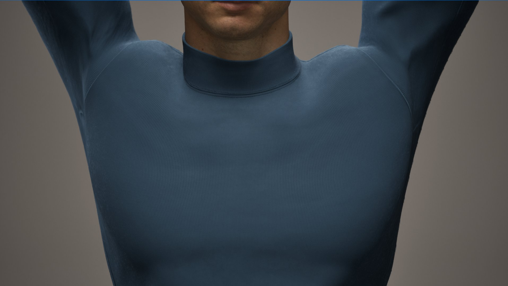
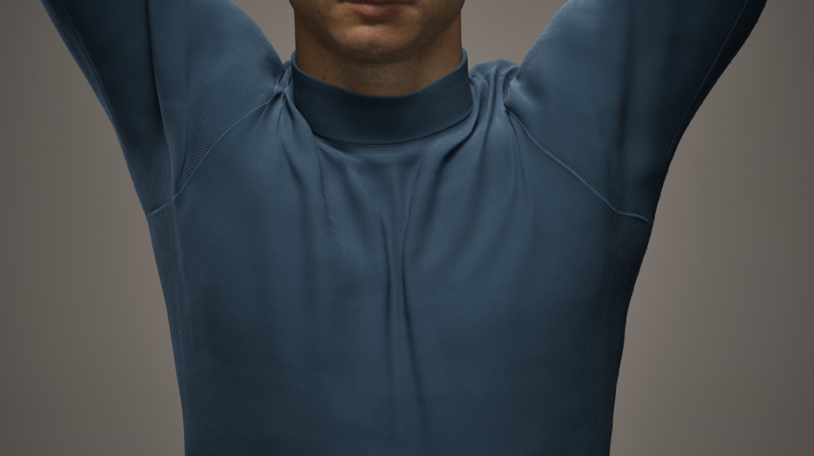
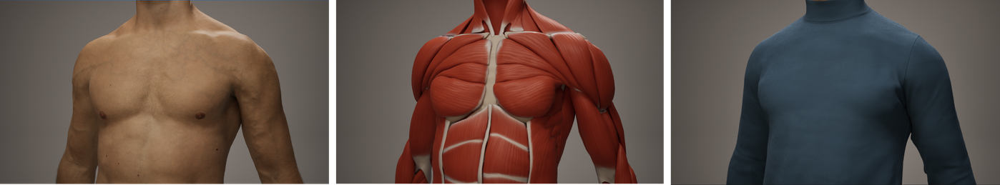
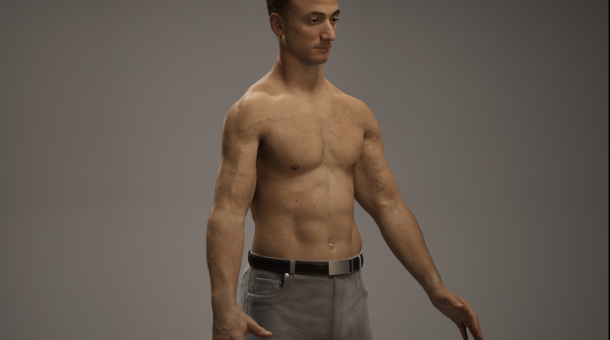

# ML Deformer示例

> 路径：虚幻引擎5.7文档 / 示例与教学 / 引擎功能示例 / ML Deformer示例

> 原始页面：https://dev.epicgames.com/documentation/unreal-engine/ml-deformer-sample-in-unreal-engine

机器学习（ML）变形器示例演示了如何使用虚幻引擎的机器学习（ML）技术创建高真实度的游戏角色，并介绍如何通过机器学习掌握离线肌肉、皮肤和布料模拟来驱动逼真的变形。 该示例使用了[ML Deformer](../../../animating-characters-and-objects/skeletal-mesh-animation-system/animation-workflow-guides-and-examples/how-to-use-the-machine-learning-deformer/index.md)插件。

示例中的这个主关卡是一段交互式的演示。 展示了在皮肤下隆起和滑动的肌肉以及衣服上形成的皱褶。 你还可以比较开启和关闭ML Deformer时的结果，并使用包含的ControlRig资产对模型制作动画。

## 下载示例

要使用ML变形器示例创建项目，请按以下步骤操作：

1. 通过**Fab**访问[ML Deformer示例](https://fab.com/s/fb59a5b662f2)，点击**添加到我的库（Add to My Library）**，即可在**Epic Games启动器**中显示该项目文件。

   1. 或者，你也可以在启动程序的Fab中或UE的Fab插件中搜索该示例项目。
2. 在**Epic Games启动器**中，找到**虚幻引擎 > 库 > Fab库**以访问项目。

   > [!NOTE]
   > 只有在你安装了兼容的引擎版本时，示例项目才会出现在**Fab库**中。
3. 点击**创建项目（Create Project）**并按照屏幕上的提示下载示例并启动新项目。

要了解有关从Fab访问示例内容的更多信息，请参阅[示例与教程](../../index.md)。

## 在场景中寻路

当场景在编辑器中播放时，你可以使用键盘或PlayStation游戏手柄功能按钮在场景中寻路。 这些功能按钮在`Content/Input/`文件夹中的`KeyboardGamepadMapping`文件中配置，你可以自定义。

### ML变形切换开关和层

当场景正在播放时，按住**M**键，或按住游戏手柄上的**十字方向键向左**按钮，以暂时禁用ML变形。

ML Deformer关闭

ML Deformer打开

按**向上**和**向下**箭头键或使用十字方向键**向上/向下**按钮，在布料、皮肤和肌肉层之间切换。

使用**N**键或**十字方向键向右**按钮在法线材质和黏土着色器之间切换。

黏土着色器开启

黏土着色器关闭

### 播放和HUD功能按钮

当场景在PIE中播放时，你可以使用以下播放功能按钮：

| 操作 | 键盘快捷键 | 游戏手柄快捷方式 |
| --- | --- | --- |
| 暂停播放 | 空格键 | X按钮 |
| 降低播放速度 | 逗号 | 正方形按钮 |
| 增加播放速度 | 句点 | 圆形按钮 |

你还可以启用两个单独的平视显示器（HUD）控件：

| 控件 | 键盘快捷键 | 游戏手柄快捷方式 |
| --- | --- | --- |
| 统计数据和性能控件 | H | L1按钮 |
| 快捷方式帮助程序控件（显示游戏手柄按钮快捷方式） | Tab键 | 特殊按钮（右） |

### 摄像机功能按钮

按**O**键或游戏手柄上的**三角形**按钮，以启用或禁用摄像机功能按钮。

启用摄像机功能按钮后，你可以使用以下键盘快捷方式：

| 操作 | 键盘快捷键 | 游戏手柄快捷方式 |
| --- | --- | --- |
| 向左/向右环绕摄像机 | A / D | 左控制杆（水平移动） |
| 移动车（缩放）进/出 | W / S | 左控制杆（垂直移动） |

## 角色和Rig详细信息

用于镜头的角色是高保真度数字人类，采用肌肉骨骼系统和逼真的面部和身体材质。

肌肉骨骼系统是通过组合MRI扫描时间、3D骨架扫描和手工制作的肌肉来创建的。 对于面部和身体材质，使用了3D面部和身体扫描以及一个参考拍摄。

示例包含一个Control Rig，可供你用于进一步探索ML变形如何与不同的角色姿势交互。 该Rig位于`Content/Characters/Emil/Rig`文件夹中，资产文件名为`CR_Emil`。 不同于MetaHuman rig，此示例中使用的rig是不对称的（即，关节位置不是完美镜像的）。 这会让变形尽可能逼真。

## 更多信息

2023年虚幻引擎GDC现状演示有一个片段深入介绍了此技术演示中的结果是如何实现的。 你可以了解整个过程，从扫描角色到训练ML模型，然后组合不同的软件和技术来实现最终结果。 点击[此链接](https://www.youtube.com/watch?v=teTroOAGZjM&t=19000s)在YouTube上观看完整片段。

如需详细了解ML Deformer插件，请参阅[ML Deformer](../../../animating-characters-and-objects/skeletal-mesh-animation-system/animation-workflow-guides-and-examples/how-to-use-the-machine-learning-deformer/index.md)页面。
