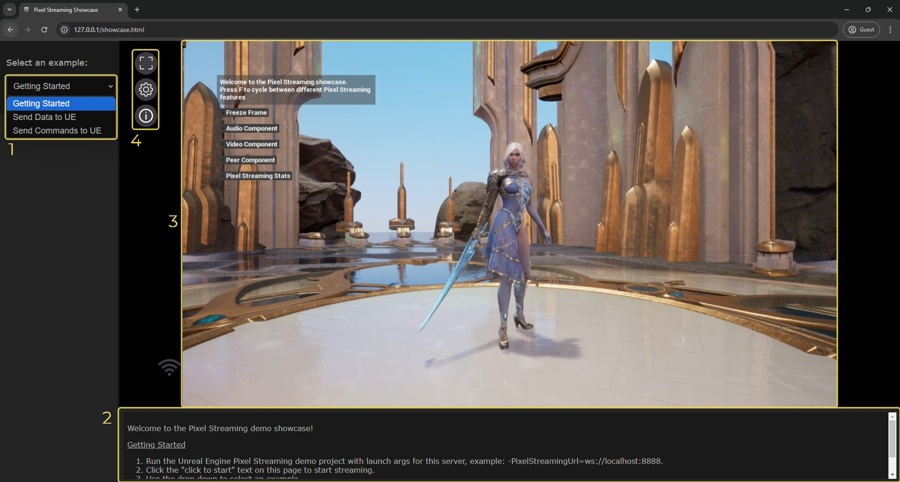
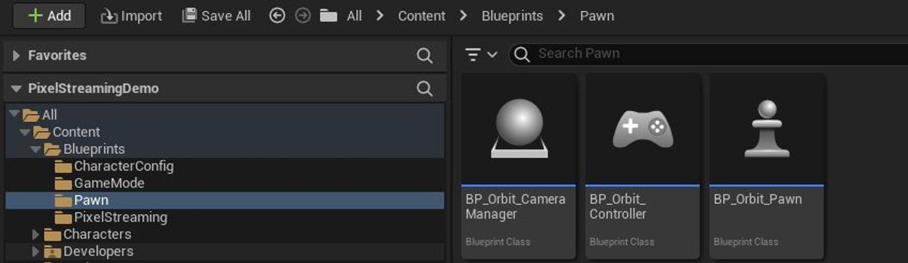
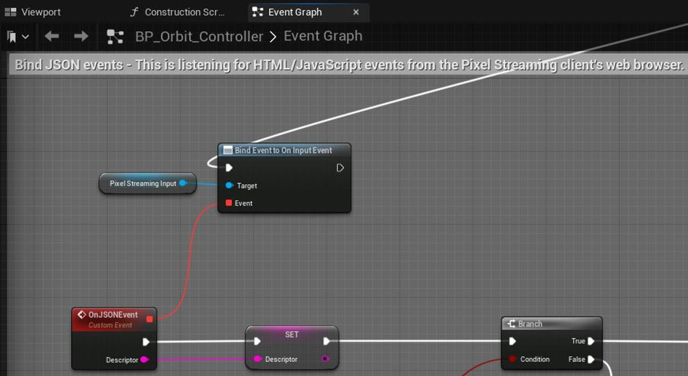
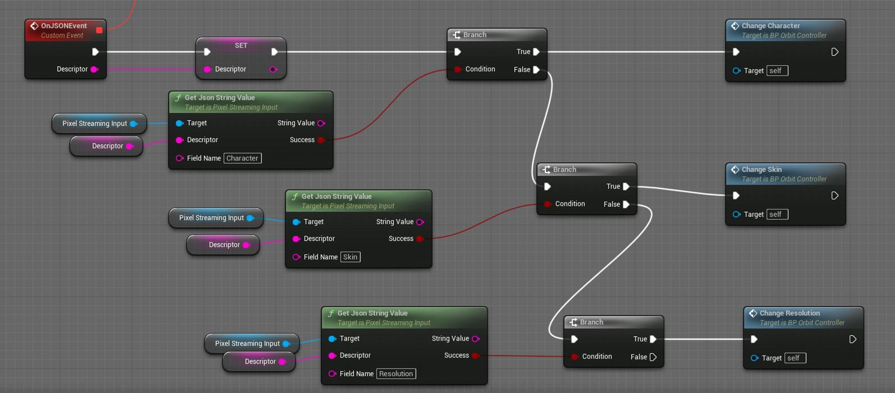

# 像素流送示例项目

> 路径：虚幻引擎5.7文档 / 示例与教学 / 引擎功能示例 / 像素流送示例项目

> 原始页面：https://dev.epicgames.com/documentation/unreal-engine/pixel-streaming-sample-project-for-unreal-engine

像素流送演示（Pixel Streaming Demo）展示了如何设计虚幻引擎5（UE5）内容，以便让用户在桌面或移动设备上使用Web浏览器时体验实时流送。 它包括：

- 一个HTML播放器页面，可以播放由UE应用程序生成的媒体流送，并提供用于远程控制引擎的自定义UI元素。
- 一个UE5项目，已经设置成使用像素流送插件（Pixel Streaming Plugin）生成媒体流送并响应从HTML播放器页面发出的自定义命令。

你可以将该示例用作一个模型来构建你自己的自定义HTML5播放器，与你的UE5内容进行交互。

> [!NOTE]
> **先决条件：**
>
> - 确保你了解[像素流送](../../../sharing-and-releasing-projects/pixel-streaming/index.md)系统的基础知识。
> - 至少按照[入门指南](https://dev.epicgames.com/documentation/assets/sharing-and-releasing-projects/pixel-streaming/getting-started/pixel-streaming-intro/)中的所有说明操作一次，确保你已完成所有必要安装，并使用默认的播放器页面。

## 入门指南

要使用像素流送示例，请按以下步骤操作：

1. 通过**Fab**访问[像素流送示例](https://fab.com/s/2cda21852427)，点击**添加到我的库（Add to My Library）**，即可在**Epic Games启动器**中显示该项目文件。

   1. 或者，你也可以在启动程序的Fab中或UE的Fab插件中搜索该示例项目。
2. 在**Epic Games启动器**中，找到**虚幻引擎 > 库 > Fab库**以访问项目。

   > [!NOTE]
   > 只有在你安装了兼容的引擎版本时，示例项目才会出现在**Fab库**中。
3. 点击**创建项目（Create Project）**并按照屏幕上的提示下载示例并启动新项目。

   1. 要了解有关从Fab访问示例内容的更多信息，请参阅[示例与教程](../../index.md)。
4. 确保你拥有[像素流送基础设施](https://github.com/EpicGamesExt/PixelStreamingInfrastructure/tree/master/)的相关分支

   > [!NOTE]
   > 拥有与虚幻引擎版本相匹配的基础架构版本至关重要，例如5.2到5.2。 如需详细了解该基础设施，请参阅[像素流送基础设施](../../../sharing-and-releasing-projects/pixel-streaming/pixel-streaming-web-interface/pixel-streaming-infrastructure/index.md)。
5. 在虚幻编辑器中打开`PixelStreamingDemo.uproject`文件。
6. 按照[像素流送入门](../../../sharing-and-releasing-projects/pixel-streaming/starter-guides-for-pixel-streaming/getting-started-with-pixel-streaming/index.md)页面中的说明执行以下操作：

   - 打包该项目，或者从虚幻编辑器将该项目作为独立游戏启动。
   - 启动信令服务器和Web服务器（使用如上所述的基础设施）
   - **备选方案**：使用像素流送工具栏启动信令服务器。
7. 打开Web浏览器，导航至由信令服务器和Web服务器托管的`showcase.html`播放器页面。 例如：`http://<your-server-ip-address>/showcase.html`

## 与展示HTML交互

该展示的自定义前端允许你控制场景中的各种元素。 左侧面板中的示例下拉菜单包含各种不同的功能选项，每个功能选项都展示了场景的不同元素以及像素流送本身。

- **将数据发送到UE（Send Data to UE）：**此分段允许你更改正在运行的应用程序中的角色和角色皮肤。
- **将命令发送到UE（Send Commands to UE）：**此分段包含你可以发送到UE5的命令，通过命令更改应用程序运行的分辨率，以及在屏幕上切换额外的统计信息。

> [!NOTE]
> 请参阅屏幕底部的细节面板，分别了解与"发送命令（Send Commands）"和"发送数据（Send Data）"类目相关的信息。

## 控制播放器页面

当你正确设置了像素流送系统，并使用支持的Web浏览器访问自定义的`showcase.html`播放器页面时，可以使用以下各个小节介绍的功能选项与正在运行的虚幻引擎应用程序进行交互。



1. 使用页面左侧的下拉菜单在不同的示例之间切换，例如向UE发送命令和发送数据。
2. 此细节面板提供有关当前选定示例的信息。
3. 查看器控件本身提供了对虚幻引擎应用程序的直接鼠标和触摸控制，以及有关当前像素流送功能的信息：

   | 控制方式 | 效果 |
   | --- | --- |
   | 点击并拖动，或者触摸并拖动 | 围绕当前角色旋转摄像机。 |
   | 鼠标滚轮 | 放大和缩小摄像机。 |
4. 点击这些按钮可切换到全屏、打开流送设置和打开流送信息。 这些按钮与默认界面中的按钮相同：

   | 控制方式 | 效果 |
   | --- | --- |
   | [进入全屏模式](https://dev.epicgames.com/community/api/documentation/image/8c14f9d3-487f-4d5b-86a9-85d396417b0f?resizing_type=fit) | 将查看器切换到全屏模式。 按**Esc**键退出。 |
   | [打开设置](https://dev.epicgames.com/community/api/documentation/image/1ef52c8a-2351-42cc-a88d-29631fdb9c80?resizing_type=fit) | 打开流送设置面板。 默认情况下，此面板随像素流送基础架构一起提供，用于对正在运行的流送进行广泛配置。 |
   | [打开流送信息面板](https://dev.epicgames.com/community/api/documentation/image/9c0c7e68-cfea-40a0-9f1c-1254b8d2a97b?resizing_type=fit) | 打开流送信息面板。 此面板包含流送的实时WebRTC会话统计信息，例如码率、数据包丢失和帧率。 |

## 了解自定义UI事件

自定义HTML播放器页面`showcase.html`使用`PixelStreamingInfrastructure/Frontend/implementations/EpicGames/src/`目录中的`showcase.ts`文件来控制其各种命令。

如需查看中继到虚幻引擎应用程序的鼠标、键盘和触摸事件的捕获情况，请导航到`PixelStreamingInfrastructure/Frontend/library/src/Inputs/`目录，如下所示：

播放器页面中的大多数UI元素都是通过调用`emitUIInteraction()`函数来实现的，该函数将不同的信息传递回虚幻引擎应用程序。 要了解任何UI部件在后台是如何工作的，请执行以下操作：

1. 首先，在`showcase.ts`文件中找到你想了解的UI项，然后查看设置了什么JavaScript函数在按下该按钮时触发。 例如，在以下代码块中，我们设置了一个按钮来更改为第一个角色皮肤。

   C++

   ```
   const skin1Btn = document.createElement("button");    skin1Btn.onclick = () => { this._onSkinClicked(0); }
   ```
2. 在`showcase.ts`文件中查看相应绑定函数的实现。 例如，`_onSkinClicked()`函数需要一个参数来设置我们希望使用的角色皮肤。 然后，它将以下JSON对象传递给`emitUIInteraction()`函数，如下所示：

   C++

   ```
   private _onSkinClicked(skinIndex : number) {    this._pixelStreaming.emitUIInteraction({ Skin: skinIndex });
   ```
3. 在虚幻引擎项目中，这些事件由*Blueprints/Pawn/Orbit_Controller*类响应。

   

   双击该类以打开其事件图表。
4. 在**绑定JSON事件（Bind JSON Events）**区域，你将看到每次在连接的浏览器中调用`emitUIInteraction()`时，如何使用**将事件绑定到OnPixelStreamingInputEvent（Bind Event to OnPixelStreamingInputEvent）**节点将**OnJSONEvent**事件注册为处理程序。

   
5. 每当**OnJSONEvent**事件触发时，蓝图会调用**获取Json字符串值（Get Json String Value）**来检查存储在由播放器页面传递给`emitUIInteraction()`函数的JavaScript对象中的键和值。 它使用这些值来决定应该触发哪些其他事件。 例如，当事件接收到包含**皮肤（Skin）**字段的输入时，它会调用**更改皮肤（Change Skin）**事件。

   

## 像素流送控件

游戏窗口左上角的像素流送功能控件旨在演示像素流送的一些有用元素。 以下功能很容易根据你自己的目的进行调整，并轻松包含在像素流送中。

通过在播放过程中按"F"键，控件将循环显示每个选项并说明如何测试每个功能。 这些功能如下：

- **冻结帧（Freeze Frame）**：在单个帧上冻结或解冻激活的像素流送。 请注意，应用程序仍在后台运行。
- **音频组件（Audio Component）**：允许你通过WebRTC流送你的麦克风音频输入，并通过UE5进行播放
- **像素流送统计数据（Pixel Streaming Stats）**：通过控制台切换`stat PixelStreaming`和`stat PixelStreamingGraphs`信息的显示。
- **视频组件（Video Component）**：允许你通过WebRTC将摄像机（网络摄像机）输入流送至流媒体，并通过UE5播放。
- **对等组件（Peer Component）**：允许你接收引擎中现有的流送，并通过UE5播放。 这独立于视频组件。 视频组件可以接收来自播放器（如浏览器）的视频流送，而对等组件接收完整的流送，如同它本身就是浏览器一样。
