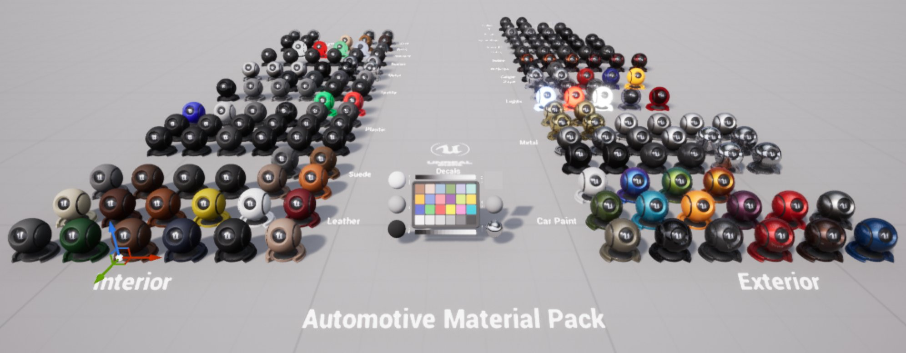
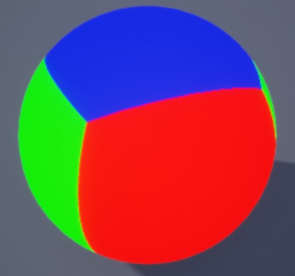
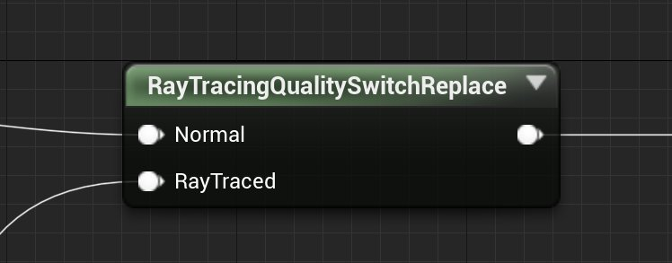
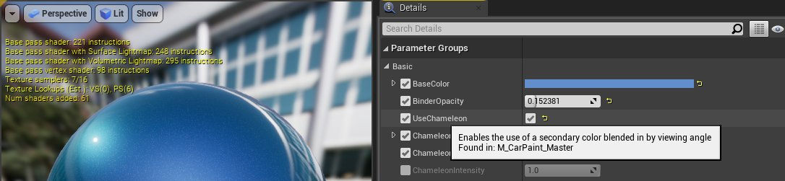
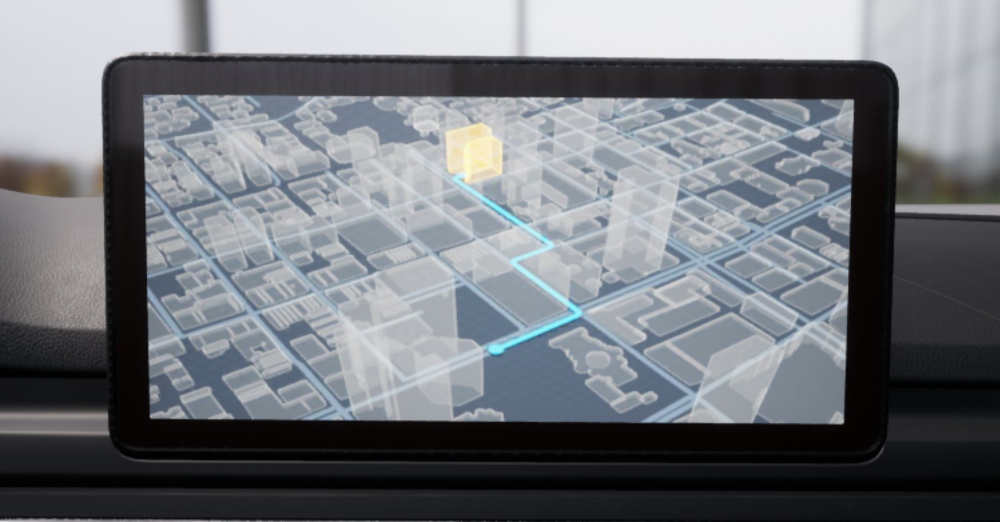
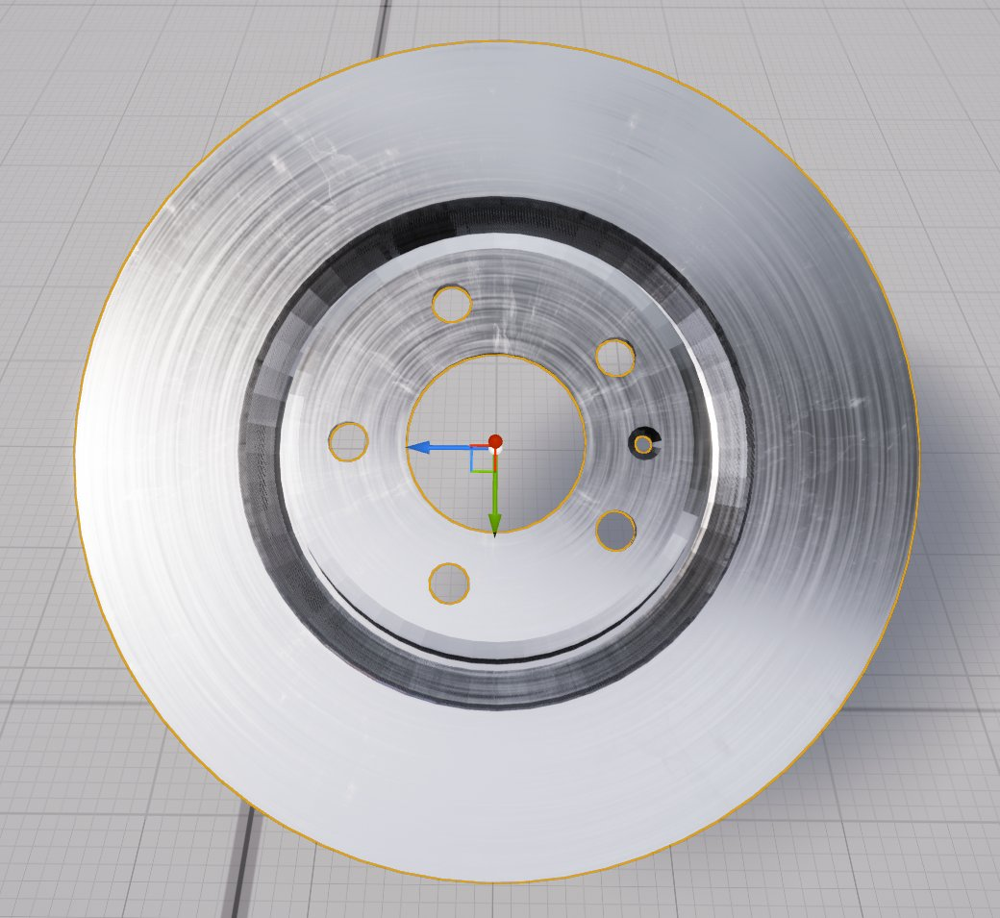
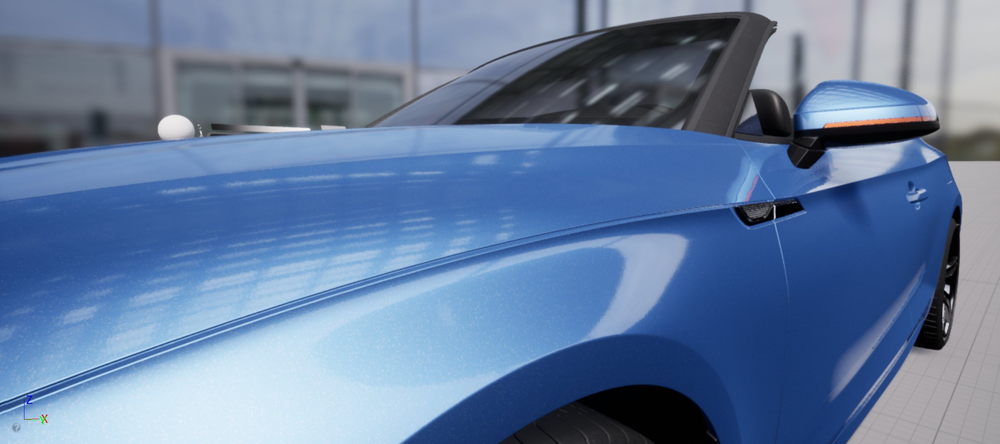
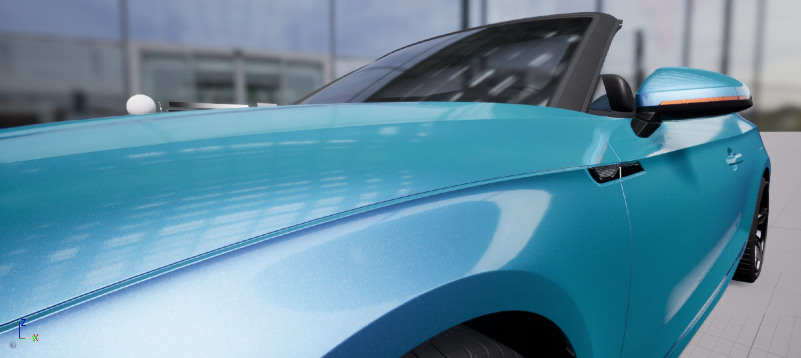

# 汽车材质包

> 路径：虚幻引擎5.7文档 / 示例与教学 / Epic Games免费内容 / 汽车材质包

> 原始页面：https://dev.epicgames.com/documentation/unreal-engine/automotive-materials-pack-in-unreal-engine

虚幻引擎的Fab提供了[汽车材质包](https://www.fab.com/listings/5dd132fe-ee32-4e8c-9cd3-7496547dfb29)，其中含有一系列汽车主题的[基于物理的材质](../../../designing-visuals-rendering-and-graphics/unreal-engine-materials/physically-based-materials/index.md)，可供你在虚幻引擎（UE）中使用。这个材质包采用开箱即用的设计理念，旨在渲染专业品质的汽车外观效果。它具有以下特点：

- 164种材质实例，由10种主材质生成。所有材质均基于PBR的最佳实践创建。
- 高品质4K纹理，采用基于手动扫描生成的2D和3D资产，全部取自Quixel Megascans素材库。
- 支持使用对象UV和三平面映射，即便模型的UV映射不完善也能支持。
- 完整支持所有光照方法，包括光线追踪。

## 概述

汽车材质包包含许多拥有尖端水准的主材质合集和示例内容，旨在为3D可视化领域的专业人士提供高品质的解决方案，以便制作出高水准的汽车材质。这些材质全都遵循基于物理渲染（PBR）的最佳实践，且易于使用。Quixel Megascans素材库中的4K纹理有助于实现令人惊叹的视觉真实度。此外，所有材质均设置为使用三平面映射，旨在最小化纹理拉伸和接缝。最后，每种材质都已针对各种光照解决方案优化，并且支持光线追踪。

> [!NOTE]
> 以下示例使用的车辆模型 **不包含** 在汽车材质包中。

### 主材质和材质实例

在 **虚幻引擎**（UE）中，材质实例可以在避免高昂编译开销的基础上，更改该材质的外观和属性。这些材质实例都通过主材质创建，其中，这些主材质的属性都被指定为参数。材质实例可看到这些参数，而且你可使用它们来快速创建主材质的多个变体。

在UE4中创建并使用主材质属于高级工作流程。有关材质及其用法的更多信息，请阅读以下文档：

- 材质输入
- 创建材质参数
- 实例化材质

在汽车材质包中，你将看到以下材质类型：

- Additive
- 刹车盘
- 车漆
- 贴花
- 自发光
- 玻璃
- 遮罩
- 不透明
- 织物
- 着色

### 基于物理的渲染

汽车材质包中的所有主材质均从头开始设计，旨在通过虚幻的[基于物理的渲染系统]（designing-visuals-rendering-and-graphics/materials/physically-based-materials/）实现最逼真、最精确的结果。例如，这意味着：

- 在实际场景中，几乎所有表面都呈现为金属或非金属（非传导性）表面。同样，此材质包中的所有材质均为全金属感或非金属感材质。这由由主材质中的节点决定，它作为单个

  IsMetallic

  复选框向材质实例公开。这确保了所有表面都反射物理精确比例的镜面光和漫反射光。
- 材质中不使用高光度输入。这样可避免引入与现实场景中的光行为不完全匹配的反射。高光度值通常保留为默认值0.5。
- 粗糙度贴图控制表面的光泽度。表面越光滑，粗糙度贴图越接近黑色，则反射越清晰、越集中。表面越粗糙，粗糙度贴图越接近白色，则反射越模糊、越不清楚。

> [!NOTE]
> 有关什么是基于物理的渲染以及如何在UE中使用它的详情，请参见[基于物理的材质](../../../designing-visuals-rendering-and-graphics/unreal-engine-materials/physically-based-materials/index.md)。

### 三平面映射

材质包包含一个能够高效实现三平面映射的材质函数。三平面映射是一种在对象上应用纹理贴图的方式，它不通过UV映射来将对象的3D表面映射到2D纹理空间。相反，三平面映射将纹理贴图映射应用到三个正交平面，然后将这三个平面投影到对象表面上。

这是此材质包中所有材质的默认行为。这意味着，你可在没有UV的对象上成功使用所有材质，对于CAD应用程序中的部件，情况常常如此。

三平面映射函数具有以下几项实用功能：

- 使用局部空间位置，以免纹理滑过对象表面。
- 缩放对象时材质保持相同的纹素比率。

下图演示了三平面映射如何使用沿X（红色）、Y（绿色）、Z（蓝色）轴投影的平面图来创建含最小接缝或拉伸的完整UV投影：

但是，由于计算使用局部空间位置，因此三平面UV取决于原始几何体以及对象几何体相对于其枢轴点的旋转度。为了获得最佳纹理应用效果，请编辑对象，以便平整表面靠近对象局部空间的XY、XZ和YZ平面。若静态网格体拥有UV，而且你希望将这些UV用于纹理贴图，请在材质实例上启用 **使用对象UV（Use Object UVs）** 选项。

### 光线追踪支持

通过使用 **RayTracingQualitySwitchReplace** 节点在第二次反弹时执行材质图表的不同分支，设置所有主材质以优化光线追踪的性能。

在第二次反弹中，所有表面法线被视为平坦的，而表面粗糙度被视为完全粗糙或完全反射。

## 常见公开参数

| **参数类别（Parameter Category）** | **设置（Settings）** |
| --- | --- |
| **底色（Base Color）** | 包括颜色（RGBA）、颜色贴图和着色选项的选项。 |
| **金属感（Metalness）** | 包括金属感设置的选项。开启IsMetallic将应用统一纹理来控制材质的金属感属性。你可应用不同金属感贴图来区分同一对象上的金属感和非金属感表面。 |
| **粗糙度（Roughness）** | 包括调整材质粗糙度的设置。粗糙度贴图可应用于创建特定磨损模式。最小值和最大值可用于随机化粗糙度程度。粗糙度可用于确定材质的光泽度。 |
| **法线（Normal）** | 将所选法线贴图应用于材质。法线强度利用值来控制效果。 |
| **瑕疵（Imperfections）** | 支持将污点、指纹和灰尘添加到材质。遮罩纹理可用于应用特定图案。 |
| **UV** | 允许使用对象自己的UV贴图。默认启用三平面映射。 |

> [!TIP]
> 如果你不确定特定参数是什么或如何使用，请将鼠标悬停在该参数上将显示更多信息。
>
> 

## 主材质

在 **主材质（Masters）** 文件夹内，你会找到几种主材质。

### Additive

Additive材质用于创建LCD屏幕、时钟、HUD和其他类型的显示屏幕，它具有的强度设置选项，能让摄像机正对显示屏幕时，屏幕更亮，而从侧面看时，亮度会降低。

| **参数类别（Parameter Category）** | **设置（Settings）** |
| --- | --- |
| **底色（Base Color）** | 控制屏幕上显示的内容。在中心附近观察时，正面强度会影响亮度。靠近边缘观察时，边缘强度会影响亮度。 |

在以下示例中，底色纹理贴图已更改为呈现GPS装置：

### 刹车盘

刹车盘材质旨在使用径向UV贴图，其中包含瑕疵（例如裂纹和污点）设置，以及使用金属感贴图添加生锈效果的功能。非常适合创建需要径向抛光的材质。

| **参数类别（Parameter Category）** | **设置（Settings）** |
| --- | --- |
| **底色（Base Color）** | 将颜色贴图或颜色色调应用于材质。 |
| **金属度（Metalness）** | 控制材质是否具有金属感。 |
| **粗糙度（Roughness)** | 用于应用磨耗图纹。也可决定材质的光泽度。 |
| **裂纹（Cracks）** | 将裂纹图案应用于材质。可控制比例和强度。 |
| **瑕疵（Imperfections）** | 支持污点瑕疵效果。 |

在下面，你可以看到使用该材质的刹车盘。已添加金属磨损线以及污点：

### 车漆

专为汽车外饰和制动钳而设计，车漆材质支持鳞片漆、桔形漆、变色效果、透明涂层和瑕疵效果。

| **参数类别（Parameter Category）** | **设置（Settings）** |
| --- | --- |
| **基本（Basic）** | 将颜色贴图或颜色色调应用于材质。包含变色效果设置，该设置支持选择第二种颜色。第一种颜色会根据视角逐渐变为第二种颜色。 |
| **透明涂层（Clear Coat）** | 将透明涂层应用到影响光泽度的材质。此效果强度可调整。 |
| **鳞片漆（Flakes）** | 将碎箔效果应用到油漆底漆。 |
| **瑕疵（Imperfections）** | 支持指纹和灰尘瑕疵效果。可控制比例和强度。 |
| **桔形漆（Orange Peel）** | 应用汽车涂层中经常看到的凹痕效果。 |

变色效果会基于视角将主要颜色与次要颜色混合：

停止使用变色参数

开启使用变色参数

可查看下图透明层功能示例：

> 图片已省略：透明层强度值为0

> 图片已省略：透明层强度值为1

透明层强度值为0

透明层强度值为1

鳞片漆参数模拟悬浮在油漆底漆中的金属碎箔，用于实现各种不同的饰面效果：

> 图片已省略：停止使用鳞片漆

> 图片已省略：开启使用鳞片漆

停止使用鳞片漆

开启使用鳞片漆

桔形漆参数可呈现在汽车喷漆过程中可能出现的瑕疵：

> 图片已省略：停止使用桔形漆

> 图片已省略：开启使用桔形漆

停止使用桔形漆

开启使用桔形漆

### 贴花

贴花材质可以被投射到表面上，并且能根据轮廓进行调整，因此非常适用于为车辆添加徽标、条纹和其他图案。

| **参数类别（Parameter Category）** | **设置（Settings）** |
| --- | --- |
| **底色（Base Color）** | 颜色贴图控制显示的贴花。着色选项控制贴花的最终颜色。 |

下图中可看到作为贴花应用到汽车引擎盖上的虚幻引擎徽标：

> 图片已省略：The Unreal Engine logo applied as a Decal

### 自发光

自发光材质可用于表现车头大灯、尾灯和LED灯，其颜色色调和强度设置可随视角变化而变化。

| **参数类别（Parameter Category）** | **设置（Settings）** |
| --- | --- |
| **光源（Light）** | 颜色色调用于确定材质的最终颜色。在中心附近观察时，正面强度会影响亮度。靠近边缘观察时，边缘强度会影响亮度。 |

下图中可看到应用于刹车灯的自发光材质：

> 图片已省略：An Emissive Material applied to a brake light

### 玻璃

玻璃材质可用于表现窗户、透明灯罩和挡风玻璃。 挡风玻璃在设置上稍微麻烦一些；它由以下2种网格体组成：内部网格体和外部网格体：

[使用两种网格体设置汽车挡风玻璃

| **数量** | **说明** |
| --- | --- |
| **1** | 使用内部玻璃材质的内部静态网格体。半透明排序优先级属性设置为0。 |
| **2** | 使用外部玻璃材质的外部静态网格体。半透明排序优先级属性设置为1。 |

内部网格体使用内部挡风玻璃材质，并且半透明排序优先级设置为0。而外部网格体使用外部挡风玻璃材质，并且半透明排序优先级设置为1。

在下图中，你可看到该技术的效果。挡风玻璃的外层模型会反射周围环境。

> 图片已省略：The exterior windshield relfects the environment

| **参数类别（Parameter Category）** | **设置（Settings）** |
| --- | --- |
| **玻璃（Glass）** | 包含玻璃颜色、粗糙度和边缘变暗的选项。 |
| **透明度（Transparency）** | 包含在挡风玻璃边缘应用遮阳罩的选项。 |
| **瑕疵（Imperfections）** | 支持灰尘、指纹或污点瑕疵效果。 |

### 遮罩

遮罩材质用于制作塑料和金属的穿孔或格栅图案。此材质非常适合扬声器盖等组件，并支持透明涂层和灰尘与指纹形式的瑕疵效果。

| **参数类别（Parameter Category）** | **设置（Settings）** |
| --- | --- |
| **底色（Base Color）** | 将颜色贴图或颜色色调应用于材质。颜色贴图包含遮罩纹理。 |
| **金属度（Metalness）** | 控制材质是否具有金属感。 |
| **粗糙度（Roughness）** | 应用粗糙度。可用于控制材质的光泽度。 |
| **透明涂层（Clear Coat）** | 应用有光泽的透明涂层。 |
| **瑕疵（Imperfections）** | 支持灰尘和指纹瑕疵效果。 |

> 图片已省略：An example of a speaker grill Material

### 不透明

不透明材质是一种灵活的主材质，可用于表现任何不透明或拥有涂层的材质，例如金属、碳纤维、皮革、塑料、木材、橡胶或反射镜。它提供透明涂层和瑕疵功能，还有各种颜色和粗糙度选项。

| **参数类别（Parameter Category）** | **设置（Settings）** |
| --- | --- |
| **底色（Base Color）** | 将颜色贴图或颜色色调应用于材质。 |
| **金属度（Metalness）** | 控制材质是否具有金属感。 |
| **粗糙度（Roughness）** | 应用粗糙度。可用于控制材质的光泽度。 |
| **透明涂层（Clear Coat）** | 应用有光泽的透明涂层。 |
| **瑕疵（Imperfections）** | 支持灰尘和指纹瑕疵效果。 |

下图是呈现该主材质灵活性的示例。座椅皮革、安全带尼龙带和内饰板塑料全部使用不透明的主材质制作：

> 图片已省略：The versatility of the Opaque Master Material

### 织物

可用于表现地毯、顶篷、绒面革、穿孔皮革或任何具有织物特性的物品，织物材质提供穿孔、柔软度和瑕疵选项。

| **参数类别（Parameter Category）** | **设置（Settings）** |
| --- | --- |
| **底色（Base Color）** | 将颜色贴图或颜色色调应用于材质。 |
| **粗糙度（Roughness）** | 应用粗糙度。可用于控制材质的光泽度。 |
| **柔软度（Softness）** | 以核心暗度、边缘亮度和次表面颜色的形式对材质应用柔软度效果。 |
| **磨耗（Wear）** | 将磨耗图案应用于材质。 |
| **穿孔（Perforation）** | 应用模拟穿孔的遮罩。你可将颜色色调添加到孔中。你也可控制深度和尺寸。 |

在下图示例中，我们可看到用于制作棕色绒面革的织物主材质：

> 图片已省略：Textile Master Material used to create a brown suede

### 着色

着色材质可用于设置尾灯，可以调节车灯并给车灯着色。与挡风玻璃类似，尾灯可由3个网格体共同设置而成：

> 图片已省略：Using the Tint Master Material to setup a taillight

| **数量** | **说明** |
| --- | --- |
| **1** | 玻璃材质 |
| **2** | 着色材质 |
| **3** | 自发光材质 |

| **参数类别（Parameter Category）** | **设置（Settings）** |
| --- | --- |
| **底色（Base Color）** | 仅控制着色颜色。当视角改变时，可具有更多用于混合的边缘着色。 |
