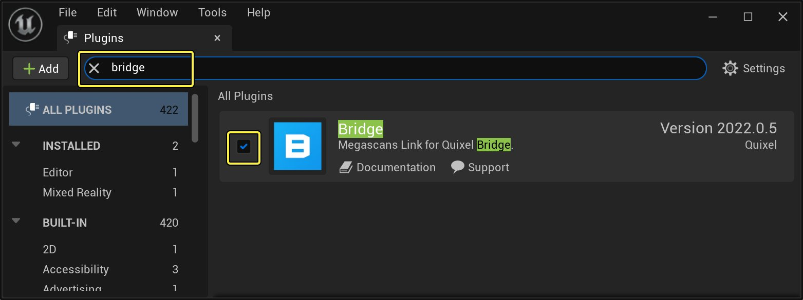
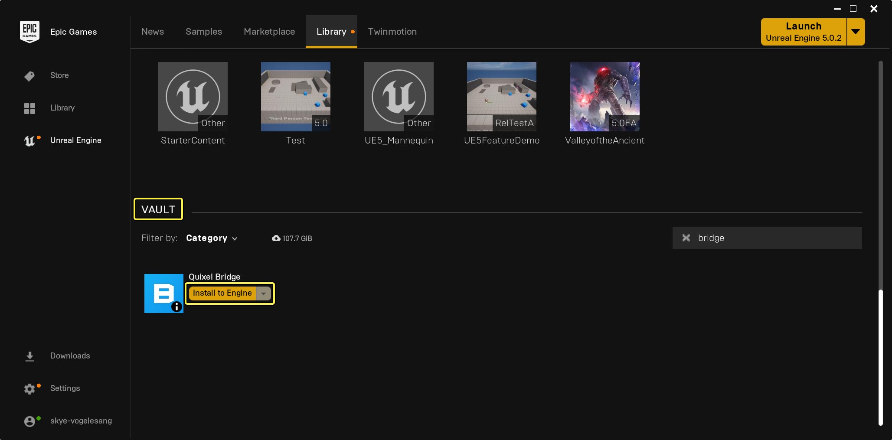
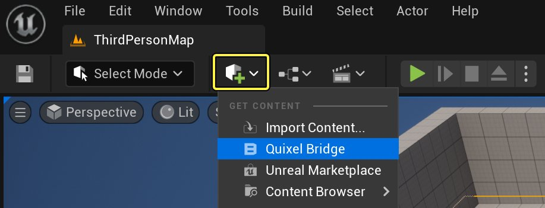
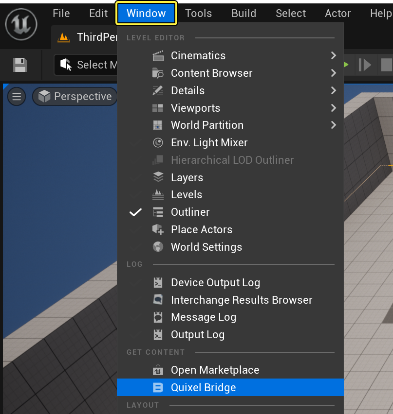
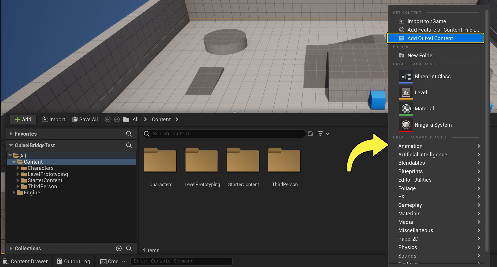
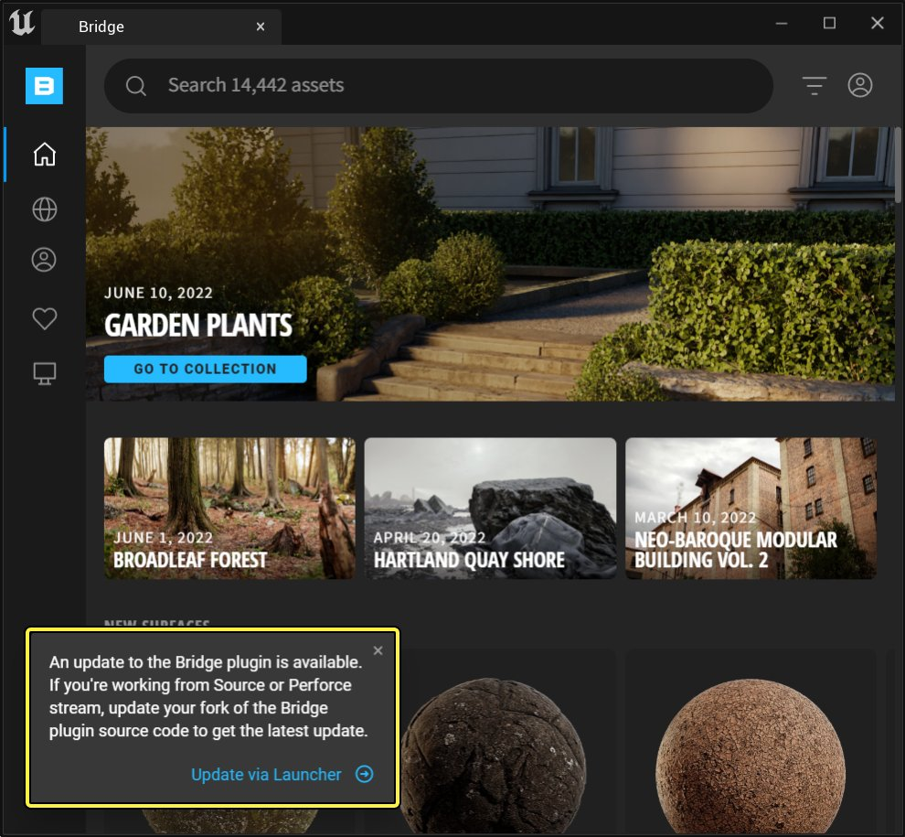
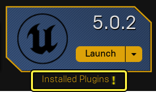

# 虚幻引擎Quixel Bridge插件

> 路径：虚幻引擎5.7文档 / 示例与教学 / Epic Games免费内容 / 虚幻引擎Quixel Bridge插件

> 原始页面：https://dev.epicgames.com/documentation/unreal-engine/quixel-bridge-plugin-for-unreal-engine

## 概述

借助**虚幻引擎（Unreal Engine）**的**Quixel Bridge**插件，你可以在关卡编辑器中访问**Megascans**库的所有功能。 你可以浏览资产包，搜索特定资产，并将资产添加到你的虚幻引擎项目中。

> [!WARNING]
> 通过Quixel Bridge访问的所有内容现在都可以从[Fab](https://www.fab.com/)获得，包括Epic Games启动器中的Fab选项卡，以及通过[UE中的Fab窗口](../../../understanding-the-basics/assets-and-content-packs/fab-window/index.md)。
>
> Quixel Bridge插件的所有功能将保留到应用程序下线为止，并且你保留通过Quixel获得的任何内容的权利。 更多信息， 请参阅[在Fab中购买和下载资产](https://dev.epicgames.com/documentation/fab/purchasing-and-downloading-assets-in-fab)页面的Quixel部分。

## 获取Bridge for Unreal Engine

Bridge for Unreal Engine是包含在虚幻引擎5安装中的插件。 要确保你的Quixel Bridge插件已启用，请选择**编辑（Edit）> 插件（Plugins）**。 在搜索栏中输入**bridge**，然后点击复选框以启用该插件。

点击查看大图。

如果此处未显示Quixel Bridge插件，你可能需要从**Epic Games启动器（Epic Games Launcher）**安装它。 打开Epic Games启动器，点击**库（Library）**，然后向下滚动到名为**保管库（Vault）**的分段。 在搜索栏中输入**Bridge**。 选择**安装到引擎（Install to Engine）**。 重新启动引擎时，可以按如上所述启用该插件。

点击查看大图。

## 在虚幻引擎中启动Bridge

Quixel Bridge可以从编辑器中的多个位置访问：

1. 点击工具栏中的**内容（Content）**下拉菜单，然后选择**Quixel Bridge**。

   

   点击查看大图。
2. 从顶部菜单，选择**窗口（Window）> Quixel Bridge**。

   

   点击查看大图。
3. 从**内容侧滑菜单（Content Drawer）**，右键点击并选择**添加Quixel内容（Add Quixel Content）**。

点击查看大图。

如果无法按照上面介绍的方式找到Quixel Bridge，则选择**编辑（Edit）> 插件（Plugins）**。 在搜索栏中输入**Bridge**，然后点击复选框以启用该插件。

> [!NOTE]
> 系统可能会提示你重启虚幻引擎，以使更改生效。

点击查看大图。

## 更新Bridge

启动虚幻引擎并打开Bridge选项卡时，你可能会看到一条消息，称Bridge已过期。

点击查看大图。

要更新Bridge，请关闭虚幻引擎，并返回Epic Games启动器。 在**虚幻引擎（Unreal Engine）> 库（Library）**选项卡中，找到你已安装的虚幻引擎版本。 在其下方，你会看到**已安装的插件（Installed Plugins）**。 如果已安装插件有新版本可用，你会看到感叹号。

点击**已安装的插件（Installed Plugins）**。 在弹出窗口的**Quixel Bridge**旁边，点击**更新（Update）**。

> 图片已省略：更新Quixel Bridge插件

现在可以重新启动虚幻引擎。

## 注册或登录Bridge for Unreal Engine

Bridge for Unreal Engine可使用你的Epic Games账号，目前支持**Unreal Unlimited**计划。

要登录，请点击Quixel Bridge面板右上角的用户图标，然后选择**登录（Sign In）**。

> 图片已省略：用户登录

点击查看大图。

你可以使用现有Epic Games账号登录，或注册新账号。 要获得Megascans库的免费无限访问权限，请确保加入了Unreal Unlimited计划。

### 什么是Unreal Unlimited计划？

Megascans对虚幻引擎的所有用户完全免费。 如果你有虚幻引擎许可证，请使用你的Epic Games账号登录，然后转至[quixel.com/pricing](https://quixel.com/pricing)以获得对Megascans库的无限制访问权限。 你还可以在Bridge和Mixer中无限制地下载。

> [!NOTE]
> 这种无限的Megascans访问权限仅限用于虚幻引擎和Twinmotion，并且仅将Megascans资产视为"虚幻引擎最终用户许可协议"规定的仅限UE内容。

更多详情请查看[Quixel Bridge FAQ页面](https://help.quixel.com/hc/zh-cn/sections/360000977797-Unlimited-Access-for-Unreal-Engine)。

## 使用Bridge for Unreal Engine

### 系统要求

适用于虚幻引擎的Quixel Bridge可在Windows、MacOS和Linux上运行。

Bridge要求连接有效的互联网才能显示和下载内容库。 如果你没有互联网连接可用，你可以浏览到左侧导航窗格中的**本地（Local）**选项卡，访问磁盘上的本地内容。

### 寻路

在Quixel Bridge面板左侧，有如下按钮可用于浏览到不同的选项卡：

- 首页
- 集合（Collections）
- MetaHuman
- 收藏夹
- 本地

#### 首页

**主页（Home）**选项卡分为多个分段，显示各个类别中最新的集合、趋势资产和最新的上传内容。

> 图片已省略：Quixel Bridge首页屏幕

点击查看大图。

左侧导航构造为一个类别树，其中包含不同级别的子类别。

> 图片已省略：Quixel Bridge左侧导航

点击查看大图。

所有可用资产类型在**主页（Home）**选项卡中列出。 你可以按类别和子类别筛选。

> [!NOTE]
> Bridge for Unreal Engine不支持图谱、置换和笔刷。

#### 集合（Collections）

**集合（Collections）**分段包含精心挑选的内容，其中包含不同生物群系的参考和渲染，以及必需品、建筑选择、教程资产和社区集合。

> 图片已省略：Quixel Bridge集合

点击查看大图。

#### MetaHuman

如果使用MetaHuman Creator应用来创建角色，那么可以在虚幻的Quixel Bridge的左侧导航面板我的MetaHuman（My Metahumans）中访问角色。

> 图片已省略：Quixel Bridge MetaHumans

点击查看大图。

#### 收藏夹

Quixel Bridge中的任意资产都可以标记为**收藏项（Favorite）**，方便以后快速访问。

> 图片已省略：Quixel Bridge收藏项

点击查看大图。

要将资产标记为收藏项，请将鼠标悬停在该资产上，然后点击**心形**图标。

#### 本地

**本地（Local）**分段显示你已经下载并可在机器上使用的所有资产。

> 图片已省略：Quixel Bridge本地文件

点击查看大图。

### 搜索和筛选

Megascans内容库中包含数千个资产，并且在持续增长。

要搜索资产或集合，请点击搜索栏。 开始输入时，建议的结果将显示在搜索栏下方。

> 图片已省略：Quixel Bridge搜索

点击查看大图。

如果其中一个建议的结果是你需要的项目，选择该结果即可找到资产。 要查看搜索查询的所有结果，请按**Enter/Return**键。 搜索结果将列出所有匹配的内容，包括热门资产、相关集合以及匹配资产类别的建议。

此外，你还可在筛选栏中使用特定的筛选器（例如资产类型、颜色、群系、状态、大小和其他条件）来细化搜索结果。 点击右上角的**筛选器（Filter）**图标可隐藏或显示筛选栏。

> 图片已省略：Quixel Bridge搜索筛选器

点击查看大图。

### 资产信息

要查看资产的更多信息，请选择该资产，打开其信息面板。

> 图片已省略：资产信息面板

点击查看大图。

图标将显示资产的相关信息，例如资产小或表面是否可平铺。 你还可以查看类似于当前资产的相关资产。

在资产右侧面板底部，选择下载分辨率，然后将资产下载或添加到你的项目。

点击**导出设置（Export Settings）**按钮，调整如何将资产导入场景中。

## 下载设置

### 偏好设置

默认情况下，你从Bridge for Unreal Engine下载的所有资产都放在磁盘上的以下位置：

- **Win:**`C:\Users\user\Documents\Megascans Library`
- **Mac:**`~/Documents/Megascans Library`
- **Linux:**`~/Documents/Megascans Library`

要更改此路径，请点击Bridge窗口右上角的用户图标，然后选择**偏好设置（Preferences）**。

> 图片已省略：Bridge用户首选项

点击查看大图。

在**首选项（Preferences）**对话框中，输入你希望用于保存资产的**库路径（Library Path）**，然后点击**保存（Save）**。

> 图片已省略：Quixel Bridge库路径

点击查看大图。

### 格式和分辨率

资产的下载设置在资产的信息面板中。

Bridge for Unreal Engine中的所有3D资产以UAsset格式下载，并提供以下分辨率：

- Nanite
- 高（High）
- 中
- 低（Low）

其他所有资产类型，例如表面、3D植物、贴花和瑕疵，都提供以下分辨率：

- 最高
- 高（High）
- 中
- 低（Low）

### Nanite

现在，适用于虚幻引擎5的Bridge为3D资产提供Nanite全方位标准功能。 这些资产可以下载为预先转换的Nanite网格体，能够在导入时加载到项目中。

这些资产开箱即用，不需要提前配置项目设置。

### 导出设置

资产的导出设置在资产的信息面板中。 点击**导出设置（Export Settings）**按钮即可打开。

> 图片已省略：导出设置按钮

点击查看大图。

在导出设置（Export Settings）对话框中，可以指定参数来控制资产导出或资产添加到项目中的方式。 必须在配置之后才能将资产添加到场景中。

> 图片已省略：导出设置对话框

点击查看大图。

- **自动填充植被绘制器（Auto-Populate Foliage Painter）**：启用此选项将使用最新导入的资产来自动填充项目中植被编辑器的资产列表。 此设置在导出资产之前必须进行检查，仅适用于散射和植物资产。
- **应用至选项（Apply to Selection）**：启用此选项将会把导出的材质应用到场景中的选定对象。
- **主材质覆盖（Master Material Overrides）**：在该分段中，你可以选择自己的自定义主材质，而不是插件提供的默认主材质。
- **材质混合设置（Material Blend Settings）**：在该分段中，你可以使用内容浏览器中已经导入的材质来混合材质。 插件随附了顶点混合着色器，可用于材质混合。

## 将资产添加到项目

有多种方法可以下载资产并将其添加到UE项目。

1. 拖放。
2. 下载并添加到场景。

下文详述了这两种方法。

### 拖放

你可以将一个或多个资产拖放到场景中。

要将资产添加到场景，请在Bridge面板中选择该资产。 将其拖入视口中。

> 图片已省略：拖拽资产到视口

点击查看大图。

如果资产之前未下载，将自动发起下载。 系统将按资产的信息面板中指定的分辨率下载。

资产下载的过程中，你的场景中将显示资产的预览。 在整个资产完成下载之前，此预览是占位符。

如果这是你首次在Bridge for Unreal Engine中下载内容，系统将在你的内容浏览器中创建以下新文件夹。

- **Megascans**：这是资产将在UE项目中保存的位置。
- **MSPresets**：这包含用于在场景中渲染所下载资产的所有模板主材质。

资产下载完成后，将替换场景中的预览。

所有表面、瑕疵和贴花都会在拖放到视口中时，显示在球体网格体上。

### 下载并添加到场景

你还可以分两个步骤，下载资产，然后将其添加到场景。

#### 下载到项目

下载资产的一种方式是将鼠标悬停在网格中的资产上，然后点击绿色**快速下载（Quick Download）**按钮。

> 图片已省略：将鼠标悬停并下载资产

点击查看大图。

或者，选择资产以打开**资产信息（Asset Information）**面板，然后点击**下载（Download）**。 你可以选择按哪种分辨率下载资产。

> 图片已省略：从信息面板下载资产

点击查看大图。

下载之后，所有资产都可从**本地（Local）**选项卡访问。

> 图片已省略：Bridge本地资产

点击查看大图。

要前往资产在磁盘上的位置，请右键点击下载的资产，然后选择**转至文件（Go to Files）** 。

> 图片已省略：右键点击并选择转至文件

点击查看大图。

在编辑器中，下载的资产显示在**内容侧滑菜单（Content Drawer）**中的**内容（Content）> Megascans**文件夹中。

> 图片已省略：内容侧滑菜单中的Megascans文件夹

点击查看大图。

#### 添加到场景

下载之后，可以通过两种方式添加到场景。 第一种方式是将鼠标悬停在下载的资产上。 点击蓝色的**快速添加（Quick Add）**按钮。

> 图片已省略：将鼠标悬停并点击快速添加按钮

点击查看大图。

另一种是，选择资产以打开"资产信息（Asset Information）"面板。 然后，点击面板底部的"添加（Add）"按钮。 你可以选择按哪种分辨率导出资产。

> 图片已省略：从资产信息面板添加

点击查看大图。

> [!TIP]
> 确保你设置了"导出设置（Export Settings）"，然后再将资产添加到场景。 这将确保下载和添加的资产适合项目的分辨率。

## 更新到最新版本

Quixel Bridge经常有新版本更新可用。 这些包括功能改进和漏洞修复。

要检查你使用的是什么版本或者是否有更新可用，请点击**用户（User）**按钮，然后点击**关于Bridge（About Bridge）**。

> 图片已省略：点击用户按钮并选择关于Bridge

点击查看大图。

将有对话框显示有关当前版本的信息，以及是否有更新可用。

> 图片已省略：关于Bridge对话框

点击查看大图。

如果你已使用**Epic Games启动器（Epic Games Launcher）**安装了虚幻引擎，还可以确保你在其中安装了最新版本。 从**库（Library）**选项卡，找到你所使用的已安装引擎版本。 在它下面，点击**已安装的插件（Installed Plugins）**，查看你已安装到该引擎版本的所有插件的列表。 如果有更新可用，请点击**更新（Update）**来安装。

源代码的实时更改可通过GitHub获取。 你可以[通过GitHub](https://www.unrealengine.com/ue4-on-github)访问C++源代码。
