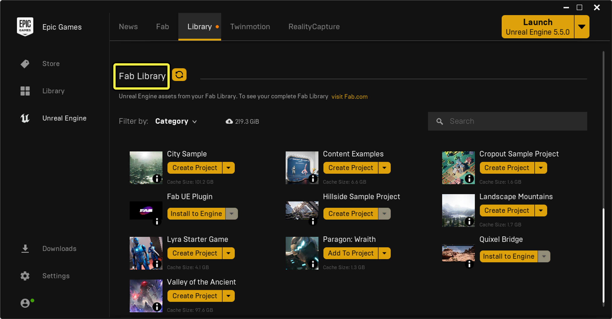

# 示例与教学

> 路径：虚幻引擎5.7文档 / 示例与教学

> 原始页面：https://dev.epicgames.com/documentation/unreal-engine/samples-and-tutorials-for-unreal-engine

为了帮助你了解虚幻引擎（UE）的多种使用方法和你能够用它创建的各类资产，Epic Games准备了一系列学习资源供你下载、试玩和分析。

## 虚幻引擎模板

在新建一个虚幻引擎项目时，你可以选择使用现成的UE模板作为游戏或应用程序的基础。 虚幻引擎模板中包含角色控制器、蓝图和其他不需要额外配置即可运行的功能。

- [模板参考](../understanding-the-basics/working-with-projects-and-templates/template-reference/index.md) - 虚幻引擎中的模板与模板的用法

## 学习资源项目

Epic Games提供了各种示例项目以突出和详解各项引擎功能和工作流程。 你可以从[Fab.com](https://www.fab.com/)、Epic Games启动器的Fab选项卡或虚幻引擎的Fab插件获取项目。 然后，你就可以在**Epic Games启动器**的**虚幻引擎（Unreal Engine）> 库（Library）> Fab库（Fab Library）**中访问文件了。

Epic Games启动器中的Fab库。

> [!NOTE]
> 只有安装了兼容的引擎版本后，**Fab库**中才会有示例项目。

虚幻引擎的Fab插件，或称"Fab集成"，对5.3及以上版本的引擎可用。 如果你已经安装了虚幻引擎5.3或5.4，必须从Epic Games启动器的**Fab库**中单独下载插件才能使用它。 而新安装或更新的引擎会自动包含Fab插件。

安装完成后，你可以通过以下方法在虚幻引擎内访问插件：

- 在菜单栏中点击**窗口（Window） > Fab**。
- 打开**内容侧滑菜单**，然后在工具栏中点击**Fab**。

无论点击哪个选项，都会在新窗口中打开插件。 你可以在**探索（Discover）**页面的**虚幻引擎示例（UE Samples）**分段中找到最新的示例项目。 使用搜索栏即可找到其他项目。

> 图片已省略：虚幻引擎中的Fab插件

Fab插件中的UE示例。

如需详细了解如何搜索、购买及访问Fab产品，请参阅[购买和下载素材](https://dev.epicgames.com/documentation/zh-cn/fab/purchasing-and-downloading-assets-in-fab)。

- [引擎功能示例](engine-feature-examples/index.md) - 用各种场景展示引擎的某个特定功能，或者为某个特定效果的实现方式。

- [内容示例](content-examples-sample-project/index.md) - 展示了虚幻引擎中的各种概念和技术的示例项目。

- [游戏示例项目](sample-game-projects/index.md) - 用于展示各种不同类型游戏的完整示例项目。

- [Epic Games免费内容](free-epic-games-content/index.md) - Epic在Fab中发布的免费内容的配套文档。
