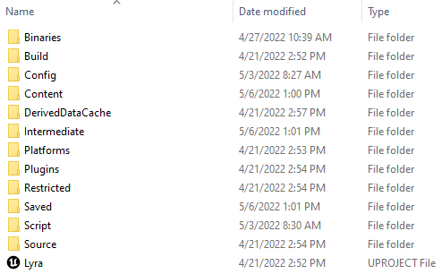
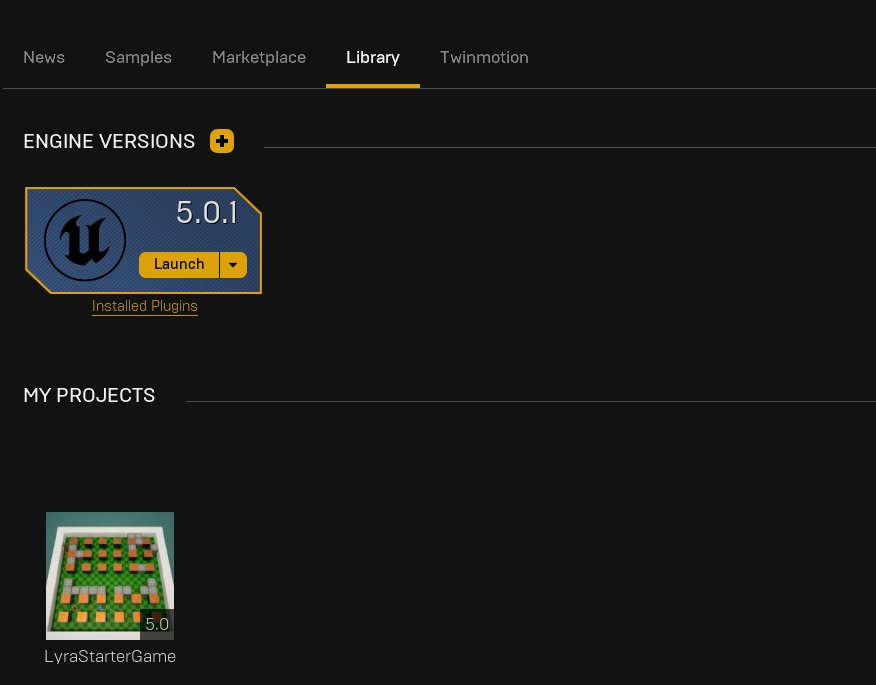
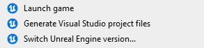
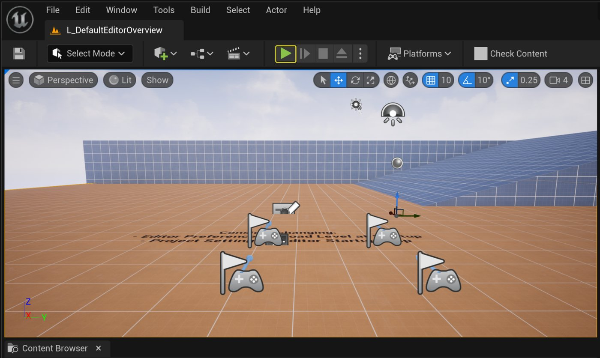
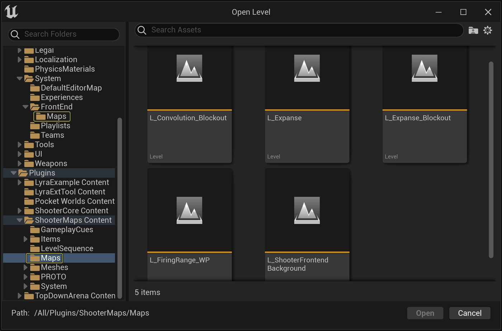
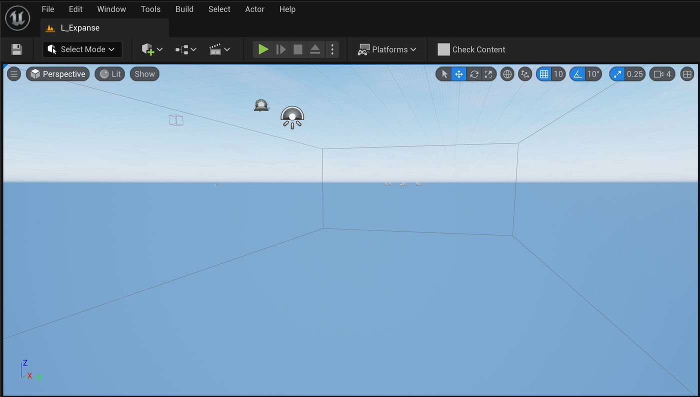
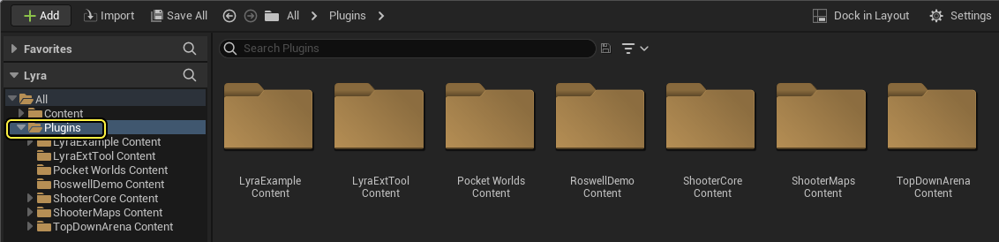
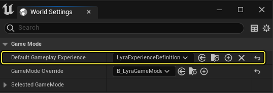

# Lyra示例游戏

> 路径：虚幻引擎5.7文档 / 示例与教学 / 游戏示例项目 / Lyra示例游戏

> 原始页面：https://dev.epicgames.com/documentation/unreal-engine/lyra-sample-game-in-unreal-engine

**Lyra**是一款供你学习用的游戏示例，可以帮助你理解虚幻引擎5（UE5）的框架。 其架构设计为模块化形式，包含一个核心系统和一些插件，它们会随着UE5的开发而定期更新。

- 跨平台兼容性和可扩展性。
- 对Epic在线服务和主机在线子系统的在线多人玩家和跨平台游戏支持。
- 可在三种不同的游戏模式之间选择：淘汰（团队死亡竞赛）、控制（捕获控制点）和爆炸器（自上而下的派对游戏）。
- 自定义的Gameplay技能系统。
- Niagara FX。
- 项目的Gameplay概念的虚幻示意图形（UMG）控件类和UI图标，包括菜单设置、手柄按键摇杆，以及生命值、法力和武器的显示。 这些UI功能是以模块化方式设计的，因此你可以独立于Lyra在自己的游戏中使用其系统。
- 优化的手工制作内容，包括移动动画资产、声音以及与Pawn兼容的武器系统。
- 新的UE5人体模型Manny和Quinn。 这些人体模型是可操作角色，拥有与MetaHuman相同的核心骨架层级，并带有兼容的动画系统。

## 下载游戏

要安装Lyra初学者游戏示例项目，请按以下步骤操作：

1. 通过**Fab**访问[Lyra初学者游戏示例](https://fab.com/s/3fe3f994dd6d)，点击**添加到我的库（Add to My Library）**，让项目文件出现在**Epic Games启动器**中。

   1. 或者，你也可以在启动程序的Fab中或UE的Fab插件中搜索该示例项目。
2. 在**Epic Games启动器**中，找到**虚幻引擎 > 库 > Fab库**以访问项目。

   > [!NOTE]
   > 只有安装了兼容的引擎版本后，**Fab库**中才会有示例项目。
3. 点击**创建项目（Create Project）**并按照屏幕上的提示下载示例并启动新项目。

要了解有关从Fab访问示例内容的更多信息，请参阅[示例与教程](../../index.md)。

## 下载适用于引擎源构建的Lyra

你可以下载虚幻引擎的源构建，具体方法请参阅[下载虚幻引擎源代码](https://dev.epicgames.com/documentation/assets/programming-and-scripting/development-environment-setup/downloading-unreal-engine-source-code)。

完成虚幻引擎源构建的下载之后，需要下载Lyra并安装到自定义构建引擎的顶层目录中。 在选择顶层目录之后，系统将会创建一个LyraStarterGame子目录，然后创建一个包含源代码和内容的LyraStarterGame.uproject文件。

要启动你安装的示例副本，可以双击`.uproject`，或者直接从启动程序的“库（Library）”选项卡中直接启动示例。

如果你使用的是自定义构建版本的引擎，那么可以重新创建项目文件，并在源代码编辑器中（例如Visual Studio）将Lyra作为项目进行启动。

> [!NOTE]
> 如果右键点击`LyraStarterGame.uproject`文件，并且安装了多个副本，那么可以选择将其与其他已安装的引擎版本相关联，或者生成项目文件以便使用源代码编辑器编译。
>
> 

## 运行游戏示例

在启动Lyra时，**DefaultEditorOverview**关卡将会加载为**默认地图（Default Map）**。 在编辑器中，点击在**编辑器中运行（Play In Editor）**（**PIE**）可以启动默认关卡。

在PIE中时，你的玩家控制器将控制Lyra Pawn。 在关卡中，将有多个门户加载到**体验（Experience）**。

> 动图已省略：主游戏选择

下方表格简要介绍了每个地图：

| 游戏模式地图 | 说明 | 内容文件路径 |
| --- | --- | --- |
| **控制** | 和队友一起保护控制点，以提高得分并获胜。 | `/ShooterMaps/Maps/L_Convolution_Blockout` |
| **淘汰** | 在这个经典的正面交锋团队竞赛中寻找并淘汰足够的敌人以获胜。 | `/ShooterMaps/Maps/L_Expanse` |
| **前端** | 包含Lyra示例游戏的主菜单。 | `/Game/System/FrontEnd/Maps/L_LyraFrontEnd` |
| **默认地图** | 面向用户的地图的基本示例。 | `/Game/System/DefaultEditorMap/L_DefaultEditorOverview` |
| **射击训练场** | 用于测试ShooterCore插件功能的小型测试关卡。 | `/ShooterCore/Maps/L_ShooterGym` |
| **爆炸装置** | 在这个自上而下的派对游戏中摧毁路障，收集强化道具，避免被炸死。 | `/TopDownArena/Maps/L_TopDownArenaGym` |

依次点击**文件（File）> 打开关卡（Open Level）**并找到上面列出的内容文件路径，可以在编辑器中直接加载每种游戏模式的地图。

大部分地图都位于游戏功能插件内部。 在首次加载**广阔区域（Expanse）**等地图时，**编辑器视口（Editor Viewport）**将会是空的，因为它是**世界分区（World Partition）**地图。

要查看关卡Actor，在右下角的**世界分区（World Partition）**详细信息面板中点击并拖动，从而选择**世界分区网格单元** ，然后右键点击并选择**加载选定单元格（Load Selected Cells）**以加载地图的这一部分。

如果走入了默认地图上的相应门户，则在某个游戏模式关卡打开时使用PIE将会加载适当的游戏模式。

如需获得Lyra游戏地图和菜单的更多信息，请参阅[Lyra简介](tour-of-lyra/index.md)参考页面。

## Lyra框架系统

Lyra中利用了各种**Gameplay功能插件**，这意味着内容文件夹仅包含常规资产和主大厅，但是，插件文件夹包含用于创建Lyra新手游戏的不同核心元素。

在大厅中选择游戏体验时，游戏将会加载所需的插件。 例如，选择**广阔区域（Expanse）**团队死亡竞赛_地图将会为Pawn和机制加载**ShooterCore**，为关卡加载**ShooterMaps**。

| 插件文件夹名称 | 说明 |
| --- | --- |
| **Lyra示例内容（Lyra Example Content）** | 包含共享的材质，例如网格。 |
| **射击游戏核心内容（Shooter Core Content）** | LyraShooterGame体验的核心元素。 其中包括用于游戏模式的Gameplay逻辑、特定Gameplay能力（例如"猛冲"）以及适用于各种Actor的蓝图，例如传送点和手雷、机器人、武器和用户界面元素。 |
| **ShooterMaps元素（ShooterMaps Content）** | LyraShooterGame（广阔区域和盘旋）使用的地图，具有关联的材质和内容。 |
| **TopDownArena内容（TopDownArena Content）** | TopDownArena体验的内容，包括从地图生成器到道具的各种内容。 |

体验是使用**LyraExperienceDefinition**类进行定义的。 找到**工具栏（Toolbar）**> **窗口（Window）**> **世界设置（World Settings）**> **游戏模式（Game Mode）**，可以在世界设置中访问**默认Gameplay体验（Default Gameplay Experience）**。

你可以将体验视为游戏模式的高级版本。 插件中可以存在多种体验，例如“团队死亡竞赛”和“控制点”都使用ShooterCore插件，从同一个父类（**B_LyraShooterGameVase**，这是LyraExperienceDefinition的子类）派生出来。

这些类包含Lyra的输入和gameplay机制中使用的信息。 但是，其他选项则包含得分系统等信息（对于团队死斗，基于杀敌数量得分；而对于控制点，则基于占领事件得分）

## 主题

- [通用用户插件](common-user-plugin-in-unreal-engine-for-lyra-sample-game/index.md) - 通用用户插件在C++、蓝图脚本和在线子系统（OSS）或其他在线后端提供了一个通用接口。
- [Lyra中的技能](abilities-in-lyra/index.md) - 介绍Lyra如何将GAS系统用于游戏玩法。
- [Lyra中的动画](animation-in-lyra-sample-game/index.md) - 关于Lyra中动画系统的概述
- [Lyra游戏设置](lyra-sample-game-settings/index.md) - Lyra游戏示例的游戏设置概述。
- [Lyra中的几何体工具](lyra-geometry-tools/index.md) - 概述如何在Lyra中使用几何体工具在蓝图中创建参数化关卡设计几何体对象，以及关卡设计师用于通过这些工具构建关卡的工作流程。
- [Lyra输入设置](lyra-input-settings/index.md) - 关于Lyra如何使用其输入设置系统解决许多常见输入配置设置的概述。
- [Lyra物品栏和装备](lyra-inventory-and-equipment/index.md) - 探索Lyra示例游戏中使用的物品栏和装备系统。
- [Lyra可扩展性和设备描述](scalability-and-device-profiles-in-lyra-sample-game/index.md) - 虚幻引擎的Lyra示例游戏中的可扩展性和设备描述
- [Lyra之旅](tour-of-lyra/index.md) - 虚幻引擎Lyra示例的参考页面
- [将Lyra初学者游戏包升级到最新引擎版本](upgrading-the-lyra-starter-game-to-the-latest-e-b8444531/index.md) - 记录每个引擎版本对Lyra所做的主要更改，并载明信息来帮助你升级现有游戏，以便利用最新版本虚幻引擎5。
- [将Epic在线服务用于Lyra](https://dev.epicgames.com/documentation/unreal-engine/using-lyra-with-epic-online-services-in-unreal-engine) - 详细介绍如何通过Lyra示例游戏使用Epic在线服务。
- [Lyra Interaction System](lyra-sample-game-interaction-system/index.md) - An overview of the Lyra Interaction System for the Lyra Game sample.
