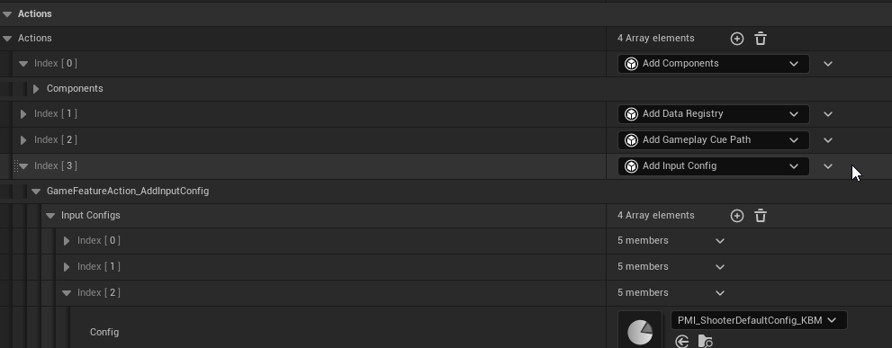
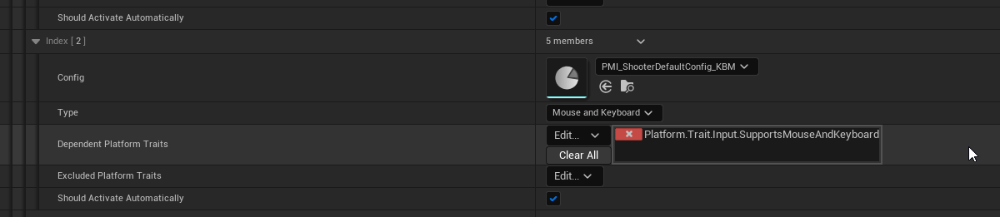

# Lyra输入设置

> 路径：虚幻引擎5.7文档 / 示例与教学 / 游戏示例项目 / Lyra示例游戏 / Lyra输入设置

> 原始页面：https://dev.epicgames.com/documentation/unreal-engine/lyra-input-settings-in-unreal-engine

Lyra的 **输入设置系统（Input Settings System）** 旨在解决游戏中遇到的许多常见的输入配置设置问题。它基于[增强输入系统](../../../../gameplay-systems/input/enhanced-input/index.md)。

## UGameFeatureAction_AddInputConfig

**UGameFeatureAction_AddInputConfig** 是一种 **游戏功能操作（Game Feature Action）** ，负责注册增强输入 **PlayerMappableInputConfig** 数据资产。PlayerMappableInputConfigs包含要添加到本地玩家的输入映射，例如按"W"键以将角色前移。

这意味着，每个游戏功能插件都会注册自己的一组用于其体验的键绑定。每当加载游戏功能插件时，都会注册输入映射，这意味着用户可以为了获得任意体验而更改键绑定，即使当前未激活也不例外，例如在主菜单上。

输入映射只有在关联的游戏功能激活之后才会对玩家"激活"。仅当满足平台条件时映射才会激活。例如，鼠标和键盘映射仅当有关联的 `SupportsMouseAndKeyboard` 平台特征时才会激活。

这些平台特征有助于定义特定于平台的输入映射，尤其是在可能有可变输入的平台上。例如，相比于主机平台上控制器的物理按钮，某个现代移动设备平台中可使用的物理按钮更少。

**类型（Type）** 字段很适合用于扩展现有功能，以在输入设备更改时更改映射配置。你还可以使用公共输入子系统的 `OnInputMethodChanged` 委托执行此操作。

## ULyraSettingsLocal

在游戏功能注册了输入配置后，这些配置会存储在游戏设置中。这些设置知道所有输入映射以及哪些映射当前已激活。 `ULyraInputComponent` 将使用这些已注册的配置在玩家初始化时将映射添加到增强输入。

这些设置包含在激活或停用映射配置时执行的回调，这样带有本地玩家的所有对象都可以访问该信息，这在Gameplay情况中以及更新设置菜单时都很有用。

这些设置不仅保存当前注册的输入映射和自定义键绑定，还可供你声明对其体验的修改，例如瞄准灵敏度、反转视轴，等等。然后，这些设置可以由输入修饰器用于实现所需的输入行为。

### Lyra输入修饰器

输入修饰器是预处理器，能够修改原始输入值，然后再将其发送到输入触发器上。这就是Lyra应用设置的方式，例如游戏手柄灵敏度、死区，甚至是瞄准辅助。例如，我们可以看一看如何基于用户的设置 `ULyraInputModifierGamepadSensitivity` 来应用游戏手柄灵敏度。

首先，我们已经为"瞄准灵敏度"定义了数据资产，即 `ULyraAimSensitivityData` 。这会将游戏手柄灵敏度枚举映射到关联的浮点标量值。因为它采用数据资产的形式，所以我们能够在多个地方复用，此外，设计师或Gameplay程序员也能轻松访问这些值。

`ModifyRaw_Implementation` 函数负责执行所有输入操控。由于该函数接受 `const UEnhancedPlayerInput*` 参数，你可以将其用于获取所属本地玩家。找到所属玩家后，你就可以获取该玩家的关联设置。在这里，你可以获取当前的游戏手柄灵敏度设置，并在我们的瞄准灵敏度数据资产中查找，以获取作为缩放比例的浮点值。
