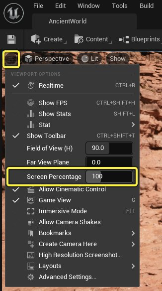
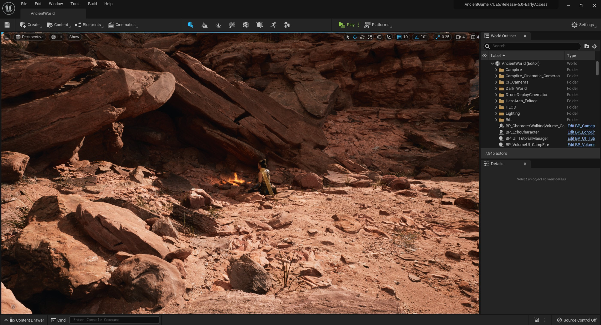
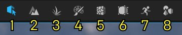
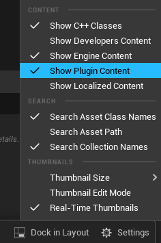
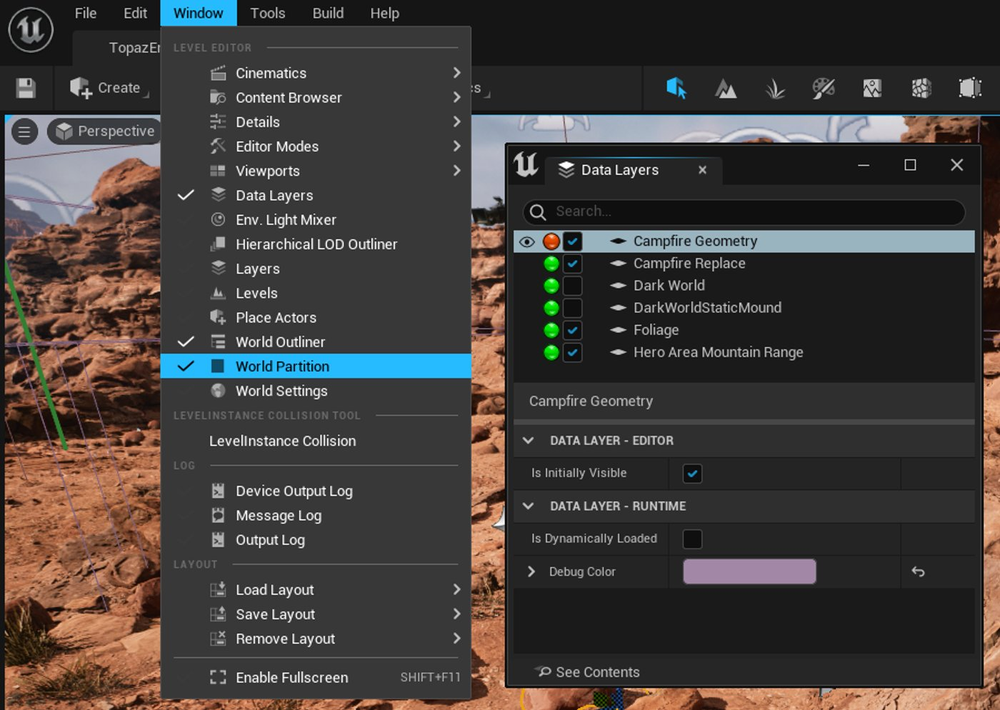
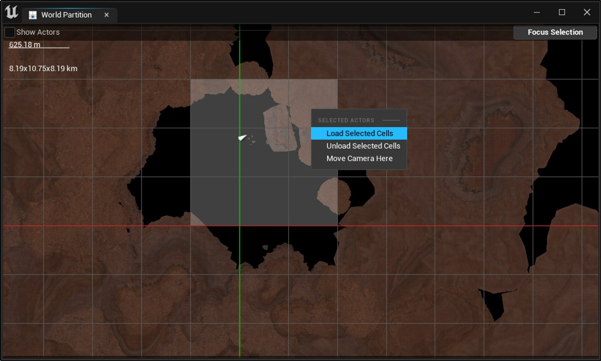
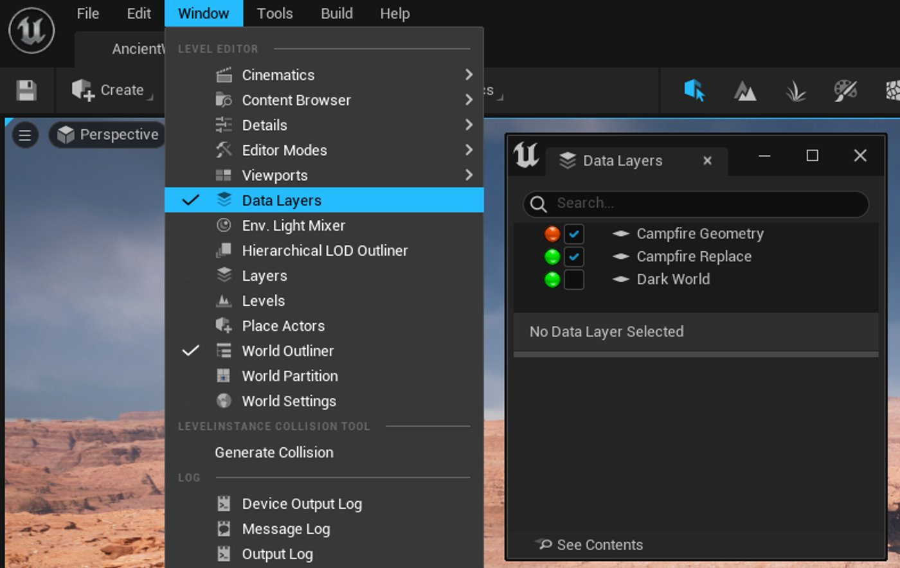
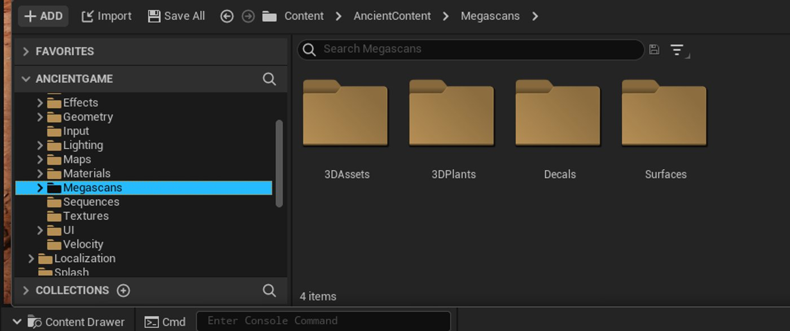

# 《古代山谷》示例

> 路径：虚幻引擎5.7文档 / 示例与教学 / 游戏示例项目 / 《古代山谷》示例

> 原始页面：https://dev.epicgames.com/documentation/unreal-engine/valley-of-the-ancient-sample-game-for-unreal-engine

**《古代山谷》（Valley of the Ancient）**是一个简短的游戏示例，展示了虚幻引擎5（Unreal Engine 5）的诸多最新功能。 玩家可以控制UE5宣传片中的主角Echo，跟随她探索干旱的峡谷地形，寻找通往神秘暗黑世界的传送门。 一路上，她将穿越众多障碍，并与强大的远古巨人交战。 在这个示例中，你将一窥UE5在使用体验上的优化、渲染效果上的强化、以及工作流程中的创新。

本文将带领你领略这些令人兴奋的新功能，展示Epic Games团队如何利用这些功能突破实时渲染技术的极限，同时最大程度简化高真实度开放场景的创建流程。

## 概述

《古代山谷》的亮点包括：

- 基于Nanite和Lumen的高端渲染效果。
- 基于Megascans资产库和全新几何体工具创建的大型世界。
- 基于改良后的Chaos破裂工作流创建的可破坏资产。
- 全新的关卡文件和Actor组织范例，让基于同一地图的团队协作更方便。
- 基于全身逆向运动学（Full Body IK）和运动扭曲的实时可调节动画，使角色动作实时匹配游戏体验。
- 可在运行时完整加载和卸载的模块化Gameplay系统。
- 基于全新MetaSounds系统创建的程序化音效。
- 基于Quartz同步游戏体验和音乐的动态音乐系统。

## 获取《古代山谷》示例

要安装古代山谷示例项目，请按以下步骤操作：

1. 通过**Fab**访问[《古代山谷》示例](https://fab.com/s/a38f8ea9c116)，点击**添加到我的库（Add to My Library）**，让项目文件出现在**Epic Games启动器**中。

   1. 或者，你也可以在启动程序的Fab中或UE的Fab插件中搜索该示例项目。
2. 在**Epic Games启动器**中，找到**虚幻引擎 > 库 > Fab库**以访问项目。

   > [!NOTE]
   > 只有安装了兼容的引擎版本后，**Fab库**中才会有示例项目。
3. 点击**创建项目（Create Project）**并按照屏幕上的提示下载示例并启动新项目。

要了解有关从Fab访问示例内容的更多信息，请参阅[示例与教程](../../index.md)。

### 推荐的系统规格

此示例拥有大量的高品质图形内容，因此需要高性能显卡才能以稳定帧率运行。 我们还建议将示例项目安装在固态硬盘中，因为Nanite和虚拟纹理需要高速读取才能实现最佳效果。 推荐的硬件规格如下：

|  |  |
| --- | --- |
| 推荐系统配置 （100%屏幕百分比） | 最低系统配置 （50%屏幕百分比） |
| 12核CPU，3.4 GHz64 GB的系统RAMGeForce RTX 2080 / AMD Radeon 5700 XT 或更高型号 | 12核CPU，3.4 GHz32 GB的系统RAMGeForce GTX 1080 / AMD RX Vega 64 |

> [!NOTE]
> Nanite仅支持Nvidia的Maxwell GPU和AMD的GCN GPU（或更高版本）。 请确保你的显卡安装了最新的驱动程序。

假如系统配置较低，你可以调整视口屏幕百分比来获得更好的性能。 在最低配置下，我们建议你设置成50%或更低。 你可以使用编辑器视口左上角**视口选项菜单（Viewport Options Menu）**中的**屏幕百分比（Screen Percentage）**滑块来设置。

或者，你可以用控制台命令`r.ScreenPercentage`在运行时设置这个值。

## 初识UE5编辑器

UE5的**虚幻编辑器（Unreal Editor）**保留了虚幻引擎4编辑器的所有功能，同时也对工作流程和用户体验进行了大量改进。在探索《古代山谷》前，大家不妨先熟悉一下。

### 内容侧滑菜单

**内容侧滑菜单（Content Drawer）**位于编辑器的左下角。 你可以点击内容侧滑菜单（Content Drawer）按钮，也可按**CTRL+空格键（CTRL+Spacebar）**打开或关闭它。

> 图片已省略：UE5内容侧滑菜单

点击**停靠在界面中（Dock in Layout）**可以创建一个持续停靠在界面中的内容浏览器，显示效果就和UE4中的内容浏览器一样。 停靠中的内容浏览器和内容侧滑菜单可以同时使用。你也可以点击主工具栏中的**内容（Content）**下拉菜单来管理内容浏览器。 这提升了内容浏览器的灵活性，还能让你在必要时隐藏内容浏览器，从而增加编辑器视口的可用画面。

内容浏览器本身的布局也有所修改——左侧会固定显示一个文件夹树，右侧则有一个全新的**设置（Settings）**菜单。你可以在设置菜单中配置资产的显示方式，包括视图类型、缩略图大小和内容过滤器。

### 选择编辑器模式

现在你能点击主工具栏中的图标来切换**编辑器模式（Editor Modes）**。

除了UE4用户熟悉的传统模式，其中还包括一些强大功能的新模式。 具体如下所示：

| 编号 | 编辑器模式 | 说明 |
| --- | --- | --- |
| 1 | 选择（Select） | 默认编辑模式，用于在游戏场景中选择资产并编辑细节。 |
| 2 | 地形（Landscape） | 雕刻、绘制和管理地形。 |
| 3 | 植被 | 绘制并调整场景中的植被。 |
| 4 | 网格体绘制（Mesh Painting） | 用于在场景网格体上绘制顶点的工具。 支持绘制颜色、权重或纹理。 |
| 5 | 破裂（Fracture） | 基于Chaos破坏系统的工具，用于让静态网格体产生破裂效果。 |
| 6 | 笔刷编辑（Brush Editing） | 经典的笔刷几何体编辑器。 使用笔刷工具在正交视口下绘制内容，然后根据需要使用其他工具微调内容。 |
| 7 | 动画 | 用于控制Control Rig、快速添加姿势和简单设置Tween的工具。 |
| 8 | 建模 | 一个完整的多边形几何体编辑套件。 允许你使用基本图元来建模或修改场景中的单个网格体。 |

## 漫游示例场景

项目打开后，它会首先打开**启动（Startup）**地图。 《古代山谷》的大部分内容都包含在**AncientWorld**地图中，在**AncientContent** > **地图（Maps）**文件夹中可以找到这张地图。

场景的大部分相关文件都在游戏的内容（Content）目录中，但是"Hover Drone"和"Ancient One"的资产位于游戏功能插件（Game Feature Plugins）中，与游戏的基本项目是相互独立的。 “Hover Drone”的资产位于**HoverDrone Content**目录中，而光镖技能以及与“Ancient One”的战斗素材位于**AncientBattle Content**目录中。 要显示这些目录，请在内容侧滑菜单中点击“设置（Settings）”按钮，然后勾选**显示插件内容（Show Plugin Content）**。

这个场景是游戏的默认场景。尽管《古代山谷》是一个大型场景，但并没有像UE4那样使用关卡流送来流送子关卡。 相反，它使用**世界分区（World Partitions）**和**数据层（Data Layers）**将场景划分成可独立编辑的部分。

要查看整个场景，请点击**窗口（Window）> 世界分区（World Partition）**。这会打开世界分区（World Partition）窗口，窗口中是世界场景的简化地图。

你可以用鼠标滚轮来放大场景的不同区域，也可以点击并拖动地图中的单元格来选中某片区域。 选中某片单元后点击右键，再点击**加载所选单元（Load Selected Cells）**，就能将所选区域加载到主视口中。 同样，你可以使用**卸载所选单元（Unload Selected Cells）**移除你不想显示的单元，降低电脑的工作负担。

> [!NOTE]
> 我们建议你不要同时加载所有的世界场景单元，而是只加载希望查看或编辑的区域。 单元的加载数量取决于系统的可用内存大小。 如需了解该系统，请参阅下文中的[世界分区](index.md)章节。

要查看游戏中暗黑世界或光明世界相关的数据层，请点**击窗口（Window）> 数据层（Data Layers）**，打开数据层（Data Layers）窗口。

你可以用此窗口启用或禁用场景的某个数据层。 要查看暗黑世界，请启用**暗黑世界（Dark World）**数据层。 要查看光明世界，请启用**Campfire Replace**、**植被（Foliage）**和**主区域山脉（Hero Area Mountain Range）**数据层。 **Campfire Geometry**数据层应该始终打开。 试着开启/关闭这些数据层，感受两种场景的不同效果。

有关这些系统的详情、它们的实现方式，以及它们为开发流程带来的好处，请参阅[协同构建大型开放世界](index.md)。

## 视效更高端、迭代更快

虚幻引擎5的目标不仅是打造高真实度视效的新标杆，同时也是为各行各业提供最易使用的实时高分辨率应用创建平台。 在本节中，我们将详细介绍UE5的新渲染功能是如何丰富《古代山谷》中的细节，并介绍开发团队在制作该示例时享受到的高效和便捷性。

### 直接导入Quixel Megascans资产

> 图片已省略：犹他州Megascans资产

在古代山谷使用的场景类静态网格体和纹理中，从犹他州莫阿布收集的Quixel Megascans资产约占环境中资产的90%。 这些内容位于内容侧滑菜单的**AncientContent** > **Megascans**文件夹中。

所有这些资产都可在[犹他州峡谷（Canyons of Utah）](https://quixel.com/megascans/collections?category=environment&category=natural&category=canyons-of-utah)Megascans资产包中获得。 此外，Quixel Bridge现在直接集成到了虚幻编辑器中。在导入或管理Megascans资产时，你无需使用任何外部程序。 UE5会自动生成所需的材质实例和网格体，它们可以在游戏中直接使用。 在下文中，你将感受到UE5在处理高分辨率资产时的高效，还将了解到UE5工具赋予场景美术团队在地形编辑上的灵活性。

### Nanite虚拟几何体

场景中的资产无一使用了传统的LOD技巧，也没有进行额外优化。 相反，它们启用了**Nanite**。 Nanite从磁盘流送静态网格体资产，然后用虚拟几何体表示它们；它会根据用户的视口分辨率动态调整多边形数量。 虚拟纹理在纹理细节上也会产生类似的效果。 随着用户在场景中移动，场景细节会实时更新。 距离近的对象接收的细节较多，距离远的对象接收的细节较少，但屏幕上的总体细节水平大致不变。

> 图片已省略：Nanite流送细节

得益于Nanite，《古代山谷》的场景直接使用了数百个拥有海量多边形的Megascans资产，并且没有做任何准备工作。 即使是场景中的峭壁——使用了多达数千万个多边形和超大分辨率纹理——也可以即时渲染，技术美术师无需进行任何设置。 你甚至可以直接在游戏中使用Zbrush中的高模雕刻模型。

如需实时查看Nanite效果，请点击**查看模式（View Mode）**下拉菜单，并将其从光照（Lit）更改为**Nanite可视化（Nanite Visualization）> 三角形（Triangles）**。

> 图片已省略：在“查看模式”下拉菜单中选择“三角形”可视化

引擎将实时显示Nanite输出的三角形效果。

> 图片已省略：标准渲染

> 图片已省略：Nanite三角形可视化

标准渲染

Nanite三角形可视化

Nanite不支持变形，所以它只能用于静态网格体。 不过仅凭这一点，它就足以让场景开发流程变得大为简化。 此外，尽管Nanite无法用于骨骼模型变形，但在最后表现耸立的远古巨人时，我们通过将静态网格体绑定到骨骼网格体上，从而让巨人盔甲展现出Nanite级别的超高分辨率。

> 图片已省略：标准渲染

> 图片已省略：Nanite三角形可视化

标准渲染

Nanite三角形可视化

有关Nanite的详细用法和设置信息，请参阅[Nanite](https://dev.epicgames.com/documentation/assets/designing-visuals-rendering-and-graphics/rendering-optimization/nanite)文档。

### Lumen全局光照

峡谷中的光照细节十分丰富。这一切得益于虚幻引擎5的全动态全局光照和反射系统——Lumen。 Lumen能渲染出动态、逼真的场景。场景中的间接光照能够根据直接光照和几何体的变化实时进行调整。通过结合新旧技术，Lumen得以实现高品质的实时效果。 Lumen专为次世代主机和高端电脑设计，目标是在UE5.0发布时能在这些平台上实现30到60FPS的帧率。

> 图片已省略：采用GI/天光

> 图片已省略：不采用GI/天光

采用GI/天光

不采用GI/天光

Lumen是可扩展的，并且支持在各种DX11和DX12硬件上运行软件光追模式和硬件光追模式。 《古代山谷》使用软件光线追踪模式在场景中生成间接光照，该模式混合使用了**屏幕追踪（Screen Traces）**（或屏幕空间追踪）与**表面缓存（Surface Cache）**。 Lumen使用屏幕追踪来掩盖低品质表面缓存可能引起的不一致。此类不一致是由各个网格体的有向距离场（Signed Distance Field）导致的。 你可以使用**显示（Show）**>**可视化（Visualize）**> **Lumen场景（Lumen Scene）**来显示表面缓存。 表面缓存只适用于前200米，超过200米后会改为使用屏幕追踪。

Lumen功能强大，它提供了大量质量设置，使它既能用于渲染Nanite虚拟化几何体，也能用于渲染传统的静态网格体；它的屏幕追踪功能还能让蒙皮网格体接收并影响间接光照（但仅限于屏幕空间）。 在编辑器视口中点击**显示（Show）**> **可视化（Visualize）**> **Lumen全局光照（Lumen Global Illumination）**，能够显示Lumen采用的各种技术。

> 图片已省略：标准渲染

> 图片已省略：Lumen GI可视化

标准渲染

Lumen GI可视化

Lumen能够处理所有的可移动光源，包括作为光源的自发光材质。 天光使用Lumen的最终采集（Final Gather）来处理天空阴影，这使得室内区域能比室外区域暗得多，有助于突显能够反射更多光线的浅色表面。

> 图片已省略：不同光照下的篝火效果，从左到右分别是：启用Lumen/天光、禁用Lumen、同时禁用Lumen/天光。

**不同光照下的篝火效果，从左到右分别是：启用Lumen/天光、禁用Lumen、同时禁用Lumen/天光。**

由于Lumen兼顾了品质和渲染速度，并拥有"所见即所得"的特点，因此开发团队能够直观地为宏大的山谷地貌打光，无需费心调整传统流程中的各种光照选项。 有关Lumen的更多信息及其工作原理详情，请参阅[Lumen全局光照和反射](../../../building-virtual-worlds/lighting-the-environment/global-illumination/lumen-global-illumination-and-reflections/index.md)和[Lumen技术细节](../../../building-virtual-worlds/lighting-the-environment/global-illumination/lumen-global-illumination-and-reflections/lumen-technical-details/index.md)。

### 使用新建模工具定制网格体

> 图片已省略：建模编辑器示例

场景中的许多Megascans网格体都不是直接从素材库中导入的原始网格体，而是在虚幻编辑器中进行了更改，以便适应地形的独特需求。 《古代山谷》的场景美术师通过UE5的全新**建模编辑器模式（Modeling Editor Mode）**实现了这一点。

你可以像使用DCC工具一样使用建模编辑器来从头创建网格体；你也可以选中场景中的静态网格体或实例化静态网格体然后修改其外观。 考虑到逐个编辑多边形会很麻烦，建模（Modeling）模式提供了许多变形工具和雕刻工具，允许你对大量网格体进行快速更改。

例如，假设你有一个像`SM_umshejnga_High2`这样的悬崖表面资产，但你需要一个弯曲的版本。 你可以切换建模编辑器模式，在视口中选择该网格体，然后对其应用**弯曲（Bend）**形变器。 只需略作调整，你就可以将变形效果添加到网格体上。

|  |  |  |
| --- | --- | --- |
| [初始网格体](https://dev.epicgames.com/community/api/documentation/image/62a149bc-0d75-4cfc-b2c1-1f01e93da5c7?resizing_type=fit) | [激活弯曲形变器](https://dev.epicgames.com/community/api/documentation/image/9794c5bf-464e-473d-b301-b2f6075965d3?resizing_type=fit) | [结果](https://dev.epicgames.com/community/api/documentation/image/c6027f4d-7751-4854-ad14-8844e73fb719?resizing_type=fit) |
| 初始网格体 | 启用弯曲形变器后 | 采用弯曲形变器后的最终效果 |

*点击查看大图。*

只需一个高分辨率网格体，你就能衍生出各种独特的网格体，并且无需重做任何UV，而且品质和原来的网格体相当。 这就使美术师能发挥出资产的最大作用，无需离开关卡编辑器就能根据需求实现各种美术概念。

### 使用打包的关卡实例来填充地形

古代山谷非常宏大，如果一个个去放置Megascans资产，那么即便是使用上文中提及的这些工具，也需要耗费很久才能创建出精细的效果。 因此，《古代山谷》的场景美术团队使用**打包关卡实例（Packed Level Instances）**来组装大规模场景。

关卡实例本质上是一种可以嵌套的关卡，可以添加到任何采用世界分区系统的游戏世界中。 尽管世界分区系统并非必须使用关卡实例，但关卡实例是非常优秀的工具，能将场景内容分割成可复用的部分，或者将关卡拆分成更易管理的区域，以便在主关卡外部编辑。

要创建关卡实例，请在场景中选中一组对象，点击右键，然后点击**根据选中项进行创建（Create From Selection）**。

> 图片已省略：“根据选中项进行创建”示例

这将打开**新建关卡实例（New Level Instance）**菜单，选择你要创建的关卡实例类型。

> 图片已省略：“新建关卡实例”选项

点击**确定（OK）**之后，即可将新关卡实例保存为项目中的关卡文件，同时生成一个对应的蓝图资产。 你选中的所有Actor都会被替换为一个包含着它们的关卡实例Actor。 你可以使用关卡实例对应的关卡文件来编辑该实例，并使用关卡实例的蓝图资产来放置实例副本。

> 图片已省略：放置关卡实例

操作关卡实例和操作关卡中的其他Actor一样简便。 你还可以直接编辑关卡实例的组件。 在关卡实例的**细节（Details）**面板中，点击**关卡实例编辑（Level Instance Editing）**中的**编辑（Edit）**按钮，即可将焦点对准该关卡实例。 然后，你就能对照着游戏场景并编辑关卡实例的组件。

> 图片已省略：编辑关卡实例

完成后，点击**提交更改（Commit Changes）**来结束调整并返回游戏场景。 此时会询问你是否保存更改。保存后，该关卡实例的所有副本都会应用更改效果。

> 图片已省略：关卡实例的提交更改

古代山谷主要是由打包后的关卡实例组建的。 这类关卡实例不同于标准关卡实例，它们会忽略非静态网格体类型的Actor，然后将静态网格体转换成实例化静态网格体，以此减少组件资产产生的绘制调用次数。

此工作流使得场景美术团队可以独立构建出由许多大型场景区域构成的场景库，并以非破坏性的方式编辑它们。 这不同于那些构成玩家周围可观察地形的小型多功能资产，以及可以构建很大一片远距离地形的巨型地理形状。 尽管其中的很多场景区域都是由编辑器中的静态网格体资产组成的，但其中一些由团队以Megascans资产为基础定制的。 这就为环境美术团队提供了一条灵活的场景搭建流程，可以在短短几周内对4平方公里的陆地进行逼真化细节处理。

你可以在**AncientGameContent/Maps/MASS**文件夹中找到这些组装体的地图文件，可以在**AncientGameContent/Geometry**文件夹中找到与其对应的关卡实例Actor。 有关如何使用这类工具的更多信息，请参阅[关卡实例](../../../building-virtual-worlds/world-partition/level-instancing/index.md)。

### Chaos破坏系统工作流

在为《古代山谷》创建可破坏网格体时，例如在创建暗黑世界中的立柱以及巨人从中升起的土丘时，我们对UE5的**Chaos破坏系统（Chaos Destruction）**工作流进行了大量改进。 改进后的工作流结合了新的建模模式和**破裂（Fracture）**编辑器模式。

破坏系统的开发团队在准备网格体、创建目标破裂效果时大量使用了建模工具。 **简化（Simplify）**、平面切割（**PlnCut**）、**偏移（Offset）**和**置换（Displace）**（添加一个噪点更多的表面）等工具使团队可以通过原始网格体雕刻出初始的破裂碎块。 随后，可以使用破裂工具中的网格体破裂（Mesh Fracture）工具把这些网格体设置为目标。我们使用**布尔（Boolean）**工具来删除所有彼此穿透的重叠网格体，仅在表面保留几何体。 游离的多边形或几何体“孤岛”则用**TriSel**工具剔除。

> 图片已省略：使用网格体工具在台地中创建平面切割

在破裂编辑模式下，团队使用**网格体破裂（Mesh Fracture）**工具将可破坏网格体分成较大的碎块。 本质上，这个工具是用另一个网格体来"咬掉"几何体的一部分，作用类似于布尔减法工具，只不过会将网格体的各个部分留在原地。 此工具创建的碎块将用作可破坏对象的主要碎块，并且能对对象破碎时的外观和方式进行一定程度的控制。 在创建这些碎块后，团队使用更为传统的Voronoi破裂法（使用**均匀（Uniform）**或**群集（Cluster）**破裂工具），将块分解成更小的碎片。

|  |  |  |
| --- | --- | --- |
| [添加网格体剪切效果](https://dev.epicgames.com/community/api/documentation/image/5ebfc93a-5f09-48d0-90d7-1f96314ff4d6?resizing_type=fit) | [网格体剪切结果](https://dev.epicgames.com/community/api/documentation/image/48cc5885-d26c-4169-8145-b897b6b3f717?resizing_type=fit) | [添加Voronoi破裂效果](https://dev.epicgames.com/community/api/documentation/image/fdcc26de-49e2-4ecb-a2d1-04ca4b7a110d?resizing_type=fit) |
| 在立柱上添加网格体剪切 | 添加网格体剪切效果后的立柱 | 添加Voronoi破裂效果 |

*点击查看大图。*

得益于UE5中推出的**噪点（Noise）**设置，这些碎块看起来更自然并且拥有不均匀的边缘。

> 图片已省略：破裂模式的AutoUV工具

团队使用**AutoUV**工具为破裂资产的内部表面生成UV。 这个工具会根据网格体的深度生成一张纹理（映射到梯度）。 这样就能将材质融合到一起，并让破裂截面根据深度拥有不同的表面材质，从而形成更自然的外观。 例如，横截面较深处的网格体看起来更干燥，而靠近表面的部分颜色更深，风化程度也更深。

最后，团队使用了**Chaos缓存管理器（Chaos Cache Manager）**来缓存资产的物理模拟效果。 这个系统可以记录编辑器中的模拟数据并在游戏中回放，从而让你每次都能触发相同的模拟效果。 这样一来，在游戏中展示复杂破坏效果的同时，还能节省处理资源，并且让破坏效果满足特定的关卡设计需求。 例如，确保Echo破坏的第一根柱子倒下时不会挡住入口，或者避免巨人坟冢留下的碎片妨碍Echo穿越竞技场。 在用缓存管理器记录模拟后，在关卡中放置它的副本将放置所有与之相关的其他资产。

> 图片已省略：Chaos缓存管理器

这些资产的原始模拟设置已经在项目的最终版本中剥离。 但是，这些资产的几何体集合以及缓存管理器位于**AncientBattle内容（AncientBattle Content）** > **地图（Maps）** > **破坏（Destruction）**中。 你可以在**c_Destruction** > **3_Lt_Hand**中检查这些集合，查看用于定向破裂的资产示例，还可以查看**L_AncientBattle_Gameplay**关卡，查看暗黑世界中使用的所有缓存管理器。

目前，我们仍在对工作流的灵活性进行改善。 同时，古代山谷中的内容也体现了我们在UE5中从品质、操作性和灵活性等方面提升Chaos破坏效果的理念。

### 使用天空大气和体积Niagara效果来设置场景氛围

在创建《古代山谷》的大气效果时，我们使用了最新的**天空大气（Sky Atmosphere）**系统。

> 图片已省略：天空大气第三人称宽阔视图

将天空大气Actor放置在场景后，你就可以设置星球的模拟信息，例如地面半径（公里）、大气物理参数、以及美术设计。 此系统使用**定向光源（Directional Light）**作为**大气太阳光（Atmosphere Sun Light）**，还用到了**天空光照（Sky Light）**。 将所有这些元素放置到位后，天空大气系统就能在全局范围内生成逼真的大气环境、体积云和雾气。 得益于天空光照的实时捕获和卷积处理，此场景中的环境光照是完全动态的。

> 图片已省略：启用了天空大气

> 图片已省略：禁用了天空大气

启用了天空大气

禁用了天空大气

在《古代山谷》中，光明世界使用了天空大气Actor，以便让大气效果更加细致并真实的尘土效果。 它还用到了动态体积云，它们会被光线实时照亮。 与此同时，暗黑世界则使用更为传统的天空球来呈现更加风格化、奇幻的景象。

|  |  |
| --- | --- |
| [光明世界场景](https://dev.epicgames.com/community/api/documentation/image/8178d14d-5f31-4bd2-9a2f-584cbc350692?resizing_type=fit) | [暗黑世界场景](https://dev.epicgames.com/community/api/documentation/image/37ae5f08-3bb4-4a33-9cf7-3d64a51d44de?resizing_type=fit) |
| 光明世界场景 | 暗黑世界场景 |

*点击查看大图。*

在进行最终润色时，比如表现岩石表面的薄雾和风沙效果时，团队使用了Niagara粒子与**体积绘制（volumetric paint）**数据，以便指引它们在场景中变化。

> 动图已省略：吹过地面的尘土条带

你可以在暗黑世界的数据层中找到这些粒子系统的Actor：**BP_NiagaraPainted_FarFog**、**BP_NiagaraPainted_FogDetail**和**BP_NiagaraPainted_SandStripe**。

> 图片已省略：暗黑世界Niagara蓝图

每个Actor都使用了两种Niagara数据接口（Niagara Data Interface）纹理：**VolumetricPaintingDensityMap**和**VolumetricPaintingVelocityMap**。

> 图片已省略：Niagara数据接口纹理

密度贴图使用RGB信息和alpha通道来确定粒子相对于地面的高度和密度，而速度贴图则确定了这些粒子的移动方向。 团队使用了一个自己开发的体积绘制工具，以便在场景中绘制这些图层并输出纹理。 在下图中，覆盖在地面上的网格表示密度贴图，而箭头表示方向贴图。 BP_NiagaraPainted_FogDetail（雾的序列视图）以相同的3D密度放置在BP_TerrainFogMaster（体积雾）之上，以便增加细节。

> 图片已省略：密度贴图网格和流向贴图箭头覆层

借助这种方法，古代山谷仅用了三个Niagara系统，就在暗黑世界的地形上模拟出了超过10万个GPU粒子。 所有的Niagara系统都能融入场景以及体积雾（使用了相同的体积绘制数据），从而让细节完美契合场景。 虽然体积绘制工具仍在开发中，这个场景足以证明了它与Niagara结合使用后，在性能和可用性方面带来的价值。

## 协同构建大型开放世界

过去，用户需要将一个关卡划分成多个子场景，然后使用关卡流送或世界场景合成（World Composition）系统将它们流送到固定关卡中。 这种情况下，文件结构会比较难管理，而且用户难以协作。此外，为了避免版本冲突，通常一次只能有一个用户修改场景。

在虚幻引擎5中，我们重新实现了用户与关卡文件的交互方式。整个过程会更简洁、更直观。 你不仅能在单个关卡文件中编辑大型场景，还能与其他一众开发人员协同编辑，并将冲突降到最低。 本节将详细介绍实现此功能的工具，并介绍开发《古代山谷》时它们为团队带来的便利。

### 一Actor一文件

《古代山谷》整体上采用了UE5的**一Actor一文件（OFPA）**新系统。 启用后，关卡中的每个Actor实例都有一个单独的写入文件，而不是将所有数据写入单个地图文件中。

用户操作关卡编辑器时，工作流程不会有任何改变。 编辑关卡时，你依然要在编辑器中点开单个关卡文件。 不过，由于底层文件系统会将每个Actor作为单独的文件进行跟踪，因此关卡设计师和场景美术师可以同时编辑关卡的不同区域或图层，并且在提交更改时，很少、甚至几乎不会遇到冲突。

《古代山谷》整体采用了OFPA。 你可以在**世界设置（World Settings）**高级分类的**世界（World）**参数中找到此设置，标签是使用**外部Actor（Use External Actors）**。

> 图片已省略：世界设置-使用外部Actor

你可以选择为单个Actor启用此功能，也可以为整个项目启用此功能。 更多信息请参阅[一Actor一文件](../../../building-virtual-worlds/one-file-per-actor/index.md)文档。

得益于此系统，《古代山谷》的开发人员可以全天候提交更改，并在编辑器中快速了解彼此的改动效果，无需担心版本冲突问题。 由于可以对游戏脚本和场景美术进行不断调整，迭代变得更快，同时场景美术流程变得更加协作化。

### 世界分区

大型开放世界类游戏一般会将地图划分成多个子地图，然后在玩家穿越地形时适时地加载或卸载地图，因为通常无法将数公里大的地图一次全部加载出来。 在以往的工具集中，开发人需要手动将地图划分成子地图，并细心管理地图的加载和卸载机制。 在上下文中查看世界的不同分段往往很难实现。

新的**世界分区（World Partition）**系统极大简化了这个过程。 在为关卡启用世界分区系统后，系统会自动根据场景对象的网格位置将它们划分到单元格中，随着你在关卡编辑器中调整场景，这些单元格的内容会自动更新，因此你不需要将对象手动分配到单元格中。 在游戏期间，世界分区可以根据玩家的位置自动加载和卸载单元格，而不需要手动管理或指定流送体积。

你可以在**世界设置（World Settings）**的**世界分区设置（World Partition Setup）**中为AncientWorld场景启用该系统。

> 图片已省略：世界设置-世界分区设置

你可以点击**窗口（Window）> 世界分区（World Partition）**，以此打开世界分区（World Partition）窗口。 你能以拖选方式来选中单元格，并根据编辑需求加载或卸载它们。 你还可以将摄像机移到某个单元，以便在编辑器中快速导航。

> 图片已省略：世界分区窗口

你可以在**细节（Details）**面板的**世界分区（World Partition）**分段中查看各个Actor的世界分区设置。 也可以在蓝图编辑器的类默认值中编辑该选项。

> 图片已省略：世界分区的各个Actor设置

默认情况下，大多数场景Actor都是通过它们在世界分区系统中的网格位置来确定归属哪个单元。 Echo被设置为始终加载，因为她是玩家操纵的角色。

可以看到，世界分区系统大幅简化了大型世界的创建过程。 尽管它在后台仍需管理类似于子关卡的文件，但借助自动化细节处理，它解放了美术师和设计师，让他们能专注于场景设计和用户体验的打造。 如需详细了解如何在游戏中配置世界分区，请参阅[世界分区文档](https://dev.epicgames.com/documentation/assets/building-virtual-worlds/world-partition)。

### 数据层

**数据层系统（Data Layers）**允许你将场景对象划分到单独的层级中，并按需加载或卸载这些对象。 这个系统为子关卡提供了另一种替代方案，旨在与世界分区系统协同工作。 它为你的项目提供了额外的管理途径和游戏驱动逻辑，让你对场景拥有更多的掌控方式。

点击**窗口（Window）> 数据层（Data Layers）**，打开数据层（Data Layers）窗口。 你可以使用此菜单在编辑器中创建、组织、加载或卸载数据层。

> 图片已省略：数据层窗口

你可以滚动至**细节（Details）**面板的**数据层（Data Layers）**分段，查看Actor的数据层信息。 你可以使用此处的下拉菜单更改Actor的数据层，或点击数据层后将其从数据层窗口拖放到其中一个条目。

> 图片已省略：数据层的各个Actor设置

你还可以将世界大纲视图中的多个Actor拖放到数据层中，以便同时将多个Actor分配给数据层。

> 图片已省略：将多个Actor拖动到数据层

《古代山谷》使用数据层驱动光明世界和暗黑世界的过渡。 当Echo激活传送门后，它会卸载代表光明世界的多个数据层，然后加载代表暗黑世界的另一套设置。

|  |  |
| --- | --- |
| [光明世界](https://dev.epicgames.com/community/api/documentation/image/6c001b98-c18c-4f2e-8f28-f0084cd9b95d?resizing_type=fit) | [暗黑世界](https://dev.epicgames.com/community/api/documentation/image/8d6c41fa-36e0-4efe-8206-41b25b3ea25b?resizing_type=fit) |
| 光明世界 | 暗黑世界 |

*点击查看大图。*

这些（数据层）可以通过游戏中的事件激活或关闭，而事件由暗黑世界Rift对象触发。 两者设置都在同一关卡文件中构建，并且位于相同的空间；虽然是同一个世界，但产生了截然不同的版本。

篝火的数据层在两个世界中都有用到，所以当Echo从一个世界切换到另一个世界时，篝火相当于玩家在场景中的固定参照物。 整个场景没有必要打造多个版本，唯一改变的就是光明和暗黑世界中使用的大气和光照。

> 图片已省略：篝火：光明世界

> 图片已省略：篝火：暗黑世界

篝火：光明世界

篝火：暗黑世界

开发期间，数据层还能让游戏逻辑和场景设置元素分离开来，环境美术师可以在自己的数据层中单独工作，不会受到触发器或游戏逻辑对象的影响，而设计师可以专注处理游戏事件相关的对象。

如需更多信息，请参阅[数据层](../../../building-virtual-worlds/world-partition/world-partition---data-layers/index.md)页面。

## 灵活的实时动画

UE5还对骨架网格体的实时动画进行了多项改良，其中重点改进了角色以及角色与世界的交互方式。 《古代山谷》中，Echo以及她遇到的远古巨人都用到了这些改良内容。

### 运动扭曲

全新**运动扭曲（Motion Warping）**系统能让动画基于场景中的扭曲点位置来动态调整根骨骼运动。 这样用户可以在不同情境中灵活复用同一个动画，从而降低处理复杂场景交互的工作量。

例如，在《古代山谷》中，Echo会在暗黑世界中翻越各种碎砾和障碍物。

> 动图已省略：运动扭曲翻越动作

在传统的工作流中，要实现此类游戏动画，开发团队要么必须严格遵循障碍物的物理参数要求，为特定障碍物创建特定动画，要么需要将这些动作分解为组件动画，对动作的播放方式以及播放时间设定复杂的规则。

然而，在此项目中，Echo的翻越动作完全由**VaultOver_Montage**资产处理。

> 图片已省略：编辑器中的VaultOver_Montage资产

此资产使用新的**MotionWarping通知状态（MotionWarping Notify States）**标记动画片段，角色的根骨骼运动可以动态调整，以便适应场景。 每个都对应环境中某个**同步点（Sync Point）**。 在本示例中，同步点分别为FrontEdge、BackEdge和BackFloor，分别对应可翻越对象上的不同参考点。 FrontEdge是Echo翻越障碍物时手触摸的位置，BackEdge是她起身跳跃的位置，BackFloor是她另一侧落脚的位置。

这些点在一个名为**GA_Vault**的GameplayAbility中设置。GA_Vault会基于**BP_EchoCharacter**中的**VaultingTriggerVolume**触发翻越行为。 尽管蓝图内置了节点来设置运动扭曲的同步点，但这个技能使用了一个自定义节点来读取可跨越障碍物的数据，并一次性计算出所有同步点。

> 图片已省略：设置蒙太奇蓝图节点的翻越动作同步点

将这三个点提供给Echo的**MotionWarping**组件后，VaultOver_Montage会在运行时自动将她的根骨骼运动对齐到这些点。 这会影响MotionWarpingd的通知状态，也会影响这些片段的运动扭曲的表现方式。

借助此系统，Echo只需一个动画就可以轻松翻过场景中的各种障碍物。 无论障碍物有多高，她的动画都会以自然的方式自我调整，以适应每个目标点位置。 这样，开发人员只需少量动画素材就能获得极大的扩展效果。

有关如何实现运动扭曲的更多信息，请参阅[运动扭曲](../../../animating-characters-and-objects/skeletal-mesh-animation-system/animation-assets-and-features/locomotion/motion-warping/index.md)文档。

### Control Rig改进

Echo和高耸的远古巨人都用到了虚幻引擎的**Control Rig**功能，因此它们的动画都可以直接在编辑器中制作。 在UE5中，我们对Control Rig的工具进行了扩充，新功能包括：

- **姿势库（Pose Library）**：能保存可重复使用的姿势，以便你在创建动画时快速指定给模型。
- **Tween工具（Tween Tool）**：可以生成中间关键帧，并根据周围关键帧的信息进行加权。
- **对齐工具（Snapper Tool）**：可以将Control Rig的某些部分对齐到游戏场景对象上。

这些工具提升了操作体验，让创建动画素材变得更简便。 在古代山谷中，远古巨人的动画完全由虚幻编辑器的Control Rig和Sequencer制作完成。该巨人的模型和动画由Aaron Sims创意团队设计。

> 图片已省略：Control Rig编辑器

远古巨人和Echo都用到了Control Rig。试着探索这些新功能。 你可以在**AncientContent** > **角色（Characters）** > **Echo** > **Rig**中找到Echo的绑定，可在**AncientBattle内容（AncientBattle Content）** >**角色（Characters）** > **AncientOne** > **Rig**中找到远古巨人的Control Rig。

> 图片已省略：Control Rig内容文件夹

有关UE5中的Control Rig改进信息，请参阅[Control Rig](https://dev.epicgames.com/documentation/assets/animating-characters-and-objects/ControlRig)文档。

### 全身IK解算器

两个角色都使用了全新的**全身IK（FBIK）解算器（Full-body IK (FBIK) Solver）**，这为他们响应场景提供了额外的层级。 FBIK作为**Control Rig**资产的**Forwards Solve**图表中的一个节点应用。 在处理完网格体的所有标准动画后，这个解算器会在后期处理层中对模型应用校正。

> 图片已省略：Control Rig资产中的全身IK解算器

举个例子，当远古巨人使用能量束攻击时，其手臂在指向Echo时的位置是由蓝图控制的，FBIK解算器会在发射光束时校正身体其余部分的位置。

> 动图已省略：远古巨人发射光束gif

再举一个例子，Echo在崎岖路面上走动时，她会使用FBIK来适应场景中的路面变化，根据地面坡度调整脚和臀部的位置。 这样就能实现更加丰富自然的移动效果，尤其是行走在斜坡上或翻越障碍物时。

> 动图已省略：Echo在斜坡上行走gif

有关如何实现全身IK的更多信息，请参阅[全身IK文档](../../../animating-characters-and-objects/control-rig/rigging-with-control-rig/control-rig-full-body-ik/index.md)。

## 构建模块化Gamplay

UE5还提供了一个模块化构建Gameplay的框架，而《古代山谷》在切换到暗黑世界时就利用了这些系统。 发生变化的不仅是Echo身边的环境，还有输入绑定和其他机制。

### 利用游戏功能插件来扩展Gameplay

> 图片已省略：Echo投掷光镖

在光明世界中，Echo使用远程控制的光源粒子鸟瞰周围的环境。 在暗黑世界中，她可以掷光镖摧毁障碍物并对敌人造成伤害。 每个系统都是一个单独的**游戏功能插件（Game Feature Plugin）**。 此系统受《Fortnite》启发，能让开发者开发相互独立的功能，然后根据需要整合到游戏主体中。 你甚至可以在运行时加载和卸载插件。

要创建新游戏功能，请打开**插件（Plugins）**窗口并点击**创建插件（Create Plugin）**。 你可以选择"游戏功能"（Game Feature）作为基础插件类型。

> 图片已省略：创建游戏功能插件

然后，你可以在项目的插件目录找到该插件。

在使用标准插件时，游戏本体可以引用插件中的类和资产，但插件无法看到游戏代码或资产。 但对于游戏功能（Game Feature）类型的插件来说，这种依赖关系是反过来的。 游戏功能可以访问游戏本体，但游戏本地无法引用游戏功能中的类或函数。 这就使它们类似于游戏模组，能够扩展或修改游戏本体中的元素。

在《古代山谷》中，光镖和远古巨人都包含在名为**AncientBattle**的游戏功能插件中。 Echo在获取和使用特殊技能时所需用到的基本系统已经包含在她的Actor中，但光镖是一种特殊实现。 远古巨人和其他能够响应破坏效果的Actor也包含在此游戏功能插件中，这就让战斗系统完全封装在此模块中。 此功能的内容位于**AncientBattle内容（AncientBattle Content）**文件夹中。

如需在内容侧滑菜单中查看此游戏功能的内容，请点击**设置（Settings）**按钮，然后选择**显示插件内容（Show Plugin Content）**，找到**AncientBattle内容（AncientBattle Content）**文件夹。

> 图片已省略：AncientBattle内容文件夹

与光镖相关的所有资产都位于此文件夹中，包括动画、视觉效果、UI元素和蓝图。 在文件夹的根目录，有一个AncientBattle**游戏功能数据（Game Feature Data）**资产。

> 图片已省略：AncientBattle游戏功能数据资产

此资产包含插件在加载和卸载后会如何运行的指令。 光镖插件包含了专门的指令，用以实现如何为Echo添加LightDart Gameplay技能、如何为她设置激活技能的输入、以及如何为她添加所需的组件。

在Gameplay期间，当场景切换成暗黑世界时，这些功能会在**BP_DarkWorldRift**蓝图中切换。

> 图片已省略：BP_DarkWorldRift蓝图

游戏本体中的代码或资产无需额外引用LightDart。 将它添加给Echo后，得益于游戏功能数据中的指令，它的所有组件都可以使用。

此系统使开发人员能够轻松控制给定时间内哪些功能处于激活状态。 这在处理只在有限时间内运行的机制时尤其有用。 这里，我们用它来切换Echo在不同世界之间的光镖效果，但游戏功能插件的应用不止于此，它还可以用于在线游戏中的某些事件，用于简短的过场动画片段，或用于游戏玩法中的主要模式变化。

有关游戏功能插件以及如何在项目中使用的更多信息，请参阅[游戏功能插件文档](https://dev.epicgames.com/documentation/unreal-engine/game-features-and-modular-gameplay-in-unreal-engine?application_version=5.7)。

### 基于增强输入系统的灵活操控

UE5采用了全新的**增强输入系统（Enhanced Input System）**，在《古代山谷》中用于Echo的控制。 该系统不仅能处理Echo的移动操作和技能施放，还提供了多种办法来处理输入中与当前场景有关的元素，例如与特定控制有关的情境元素，以及根据玩家状态来添加或删除输入。

UE4中的输入系统通过Actor事件图表中的事件来处理原始输入，而增强输入模型则采用**输入操作（Input Actions）**的方式进行控制，这些操作用内容侧滑菜单中的资产来表示。 《古代山谷》的大部分输入操作都位于**内容（Content）> AncientGameContent > 输入（Input）**。 与暗黑世界有关的输入操作位于**AncientBattle_Content > 输入（Input）**中，与悬停无人机有关的输入操作位于**HoverDrone_Content > 输入（Input）**中。

> 图片已省略：内容侧滑菜单中的输入操作

它们不仅包括常见的控制，例如**IA_MoveForward**和**IA_MoveRight**，还包括高度情景化的控制，例如**IA_SitStand**（Echo从篝火旁站起来时使用）。 你可以打开"输入操作"来配置它们返回的数值类型，包括不同类型的方向轴数值。 此外，你还可以提供一组**触发器（Triggers）**，用于添加上下文要求来激活输入，或添加**修饰符（Modifiers）**，用于处理输入的数值，然后再将其传递到Gameplay中。

> 图片已省略：输入操作详情

触发器和修饰符使得系统能够处理死区、响应曲线、或用于激活输入的情境操作，所有这些都不需要在Actor的Gameplay代码中手动筛选输入数据。 你可以在项目中添加更多的触发器或修饰符，只要将其定义为蓝图或C++类即可。

在内容侧滑菜单中定义输入操作之后，就能通过蓝图中的事件来访问它。 控制Echo的输入操作是在BP_EchoCharacter中处理的。

> 图片已省略：BP_EchoCharacter蓝图中的输入操作

虽然这些事件类似于标准输入事件，但可以提供与输入操作相关的更多上下文信息，包括操作开始、完成、进行中或被强制取消的时间信息，以及操作的激活时间。 输入事件的数值是由输入操作资产中列出的**数值类型（Value Type）**定义的。 在输出此数值之前，为输入操作列出的所有修饰符都会被应用。

**输入映射上下文（Input Mapping Contexts）**负责将输入操作映射到实体控制器上。 你可以在输入操作旁边找到这些资产。 **IM_ThirdPerson_Controls_InputMapping**包含Echo的大部分控制，而**IM_LightDartInputMappings**包含为光镖技能和慢跑添加的控制。

> 图片已省略：输入操作映射

这些操控选项的界面类似于UE4输入系统中的操作映射和轴映射界面；除了将输入操作映射到物理输入上，它们还可以将修饰符和触发器应用到特定的控制实现上。 例如，Echo需要读取IA_MoveForward来确定向前和向后运动。 虽然W键没有添加修饰符，但S键使用**负号（Negate）**修饰符，该修饰符可以将输入读取为负输入。

输入映射上下文（Input Mapping Context）的一个优势在于，可以在运行时为个体玩家添加和删除。 例如，AncientBattle游戏功能插件会在加载时添加IM_LightDartInputMappings。

> 图片已省略：光镖输入映射详细信息

此游戏功能操作是专门用C++为此项目创建的。 你可以在**HoverDroneControlsComponent**（HoverDrone Gameplay功能中的一个C++类，继承自**EnhancedInputComponent**）中查看运行时添加和删除输入映射的另一个示例。

这个示例展示了增强输入系统如何为游戏的输入管理提供可高度扩展且灵活的框架。 在开发过程中，你可以对游戏输入轻松地进行扩展和改进，而不需要对游戏逻辑代码进行破坏性的更改，并且该系统还提供了许多针对情境输入或特殊输入的工具。 如需更多信息，请参阅增强[输入系统文档](../../../gameplay-systems/input/enhanced-input/index.md)。

## 动态交互音频

除了提供各类视觉效果、游戏机制和游戏场景的创建工具外，虚幻引擎5还提供了全新的音频系统，能让你可以更好地控制游戏音效。 本节将演示古代山谷如何利用这些新工具，为Echo与远古巨人的最后遭遇战营造激烈氛围的。

### MetaSound

**MetaSounds**是虚幻引擎5的全新高性能音频系统，为音效设计师提供了功能完善的动态信号处理（DSP）图表。 该系统可以从零开始合成程序化音效和音乐，并提供了一套蓝图接口，允许设计师根据事件和游戏数据来控制音效。 这使得音效设计师能在开发期间获得更多灵活性，实现快速迭代并设计出复杂、动态的音效，还能轻松根据游戏设计变化来调整音效。

假如你希望通过示例查看MetaSounds的强大功能和多功能性，可以查看**音频（Audio）** > **MetaSounds**下的**AncientBattle内容（AncientBattle Content）**文件夹中的**sfx_Golem_RobotBlast_Meta**。

> 图片已省略：MetaSounds图表

MetaSound综合使用了程序化生成的音效和.wav采样来创建远古巨人的光束充能音效。 第一批分段处理主充能音效的批量合成和调制，这个阶段是完全程序化的。

> 图片已省略：MetaSounds图表缩放

**前摇（Intro Wave）**和**发射（Shot Waves）**部分，再加上一些补充性.wav文件，共同为音效添加了一层额外质感。 光束开始充能时，会触发前摇部分。 光束开始充能时，会触发发射部分中的一个音效；充能音效全部播放后，还有一些组件会触发。

> 图片已省略：前摇和发射部分

图表的中间部分负责处理这些不同部分之间的混合和过滤，合成为最终的**立体声混音（Stereo Mix）**，然后传递给**输出（Output）**节点来播放最终音效。

> 图片已省略：立体声混音和输出图表

输入包括触发器、参数和.wav文件，随后MetaSounds流程图会根据DSP节点处理这些信息，并将其混合成最终的音效输出。 这个系统允许音效设计师能像编辑材质一样去灵活地编辑音效，并能灵活采用常见音效参数和游戏内数据，让设计师能和游戏开发团队在同一个音效设计环境中紧密高效工作。

例如，在开发战斗序列时，很多迭代时间都花费在调整远古巨人光束充能的时间长度上。 在传统音效设计流程中，需要根据游戏逻辑的变化重新编写音效，这就让工作更加繁琐。 然而，sfx_Golem_RobotBlast_meta MetaSound使用名为**ChargeDuration**的**时间（Time）**输入来确定音效的播放时间长度。 由于主充能音效是完全程序化的，因此可以根据给定的输入来自动调整时间长度。

要查看实际效果，请在**输入（Inputs）**列表中选择ChargeDuration，将默认值4.0秒更改为其他数值，然后尝试播放音效。

> 图片已省略：ChargeDuration时间输入

得益于此功能，游戏设计团队可以随意更改远古巨人的充能时长，而不必重新编写音效。

此外还有很多其他输入参数可以使用，包括可以在游戏代码中通过音频参数接口激活的触发器。 你可以使用这些输入参数创建MetaSound并让它们程序化地完成开始、停止和中间事件。 例如，像开枪这样的操作，以前需要多个音效来实现开枪、停止和循环开火，而这个系统可以将所有音效压缩到一个MetaSound中。

> 图片已省略：StopBeam事件

你还可以使用此API操控其他音频参数。 这使得MetaSounds能将复杂音效的音效播放逻辑封装起来，并提供标精确到采样的计时（sample-accurate timing）。

MetaSounds除了具备设计灵活性和近乎无限的拓展性以外，还拥有显著的性能提升。 MetaSounds图表是异步渲染的（类似于单个音效的正常解码方式），在处理CPU资源时具有更高的灵活性。 更重要的是，由于MetaSounds是真正的音频渲染系统，无论多么复杂，每个MetaSound都代表一个游戏内声音。 这意味着，你在MetaSounds编辑器中听到的回放将和游戏内音效始终相同。相比于以前的系统，而游戏内的声音管理会更加可预测。 这也让评估音频性能的工作流更加简短，因为未来在UE5中，可以单独分析某个MetaSounds的性能。

有关MetaSounds的更多深入信息，请参阅[MetaSounds](../../../working-with-audio/sound-source/metasounds/index.md)文档。

### Quartz音频同步

正常情况下，由于游戏逻辑线程和音频线程在处理方式上存在差异，导致很难以精确的计时在它们之间同步事件。 **Quartz**提供了一个时钟，可以根据Gameplay事件来调度并播放采样精确的音频。 使用Quartz调度音频时，可以根据与调度音效有关的计时来设置委托。 **Quartz时钟（Quartz Clock）**会为该音效的播放提供事件委托，以便Gameplay预测预计时间，并适时同步其他Gameplay事件。 这样就可以创建出精确到采样的动态音乐系统，以及与音频保持高度同步的游戏系统。

《古代山谷》在其名为**Underscore Subsystem**的动态音乐系统中用到了Quartz，Underscore Subsystem可以根据音乐节拍和小节来调度事件。 可以看到，远古巨人在和Echo决战时，会根据音乐计时来发射激光。 此系统的类包含在**Underscore C++类（Underscore C++ Classes）**中。

> 图片已省略：内容侧滑菜单中的Quartz Underscore Subsystem

此系统的音乐包含在名为**UnderscoreCue**的特殊数据资产中，该数据资产包含音乐的拍号数据、不同音乐片段数据、转换数据、以及与音乐状态和事件有关的其他信息。 远古巨人战斗时的战斗音乐包含在**Arena_Battle_Cue**资产中，该资产位于**AncientContent** > **音频（Audio）** > **UnderscoreCues**中。

> 图片已省略：Arena_Battle_Cue资产详情

它包含构成音乐提示的片段引用，以及音乐的**BPM**和**拍号（Time Signature）**。 该数据是对音乐的说明，音乐系统使用它来设置Quartz时钟并管理每个分段之间的计时转换。 序曲设置为转换成战斗音乐的主体，而主体分成几个不同的状态。 这些状态会根据不同的游戏事件发生。最后，音乐以一个与节拍同步的结尾来结束。 得益于Quartz，所有这些动作都以无缝的标杆级精准度发生。

如需查看这些片段如何与游戏内事件相关联，你可以查看**BP_Laser**和**BP_AncientOne**（位于**AncientBattle内容（AncientBattle Content）**目录中）中的钩子连接方式。 除了激光本身的逻辑外，BP_Laser还负责将事件绑定到Underscore Subsystem，以便音乐触发激光。

> 图片已省略：图表中激光的UnderScore Subsystem音乐提示

它还会调用Underscore Subsystem，目的是告知音乐何时过渡到歌曲的其他分段，包括光束何时完成发射以及何时击败远古巨人。

> 图片已省略：UnderScore Subsystem音乐过渡提示

这只是Underscore子系统使用Quartz来促进动态音乐系统以及游戏与音频之间精确互动的几个例子。

## 最后提示

> 图片已省略：Echo使用光镖攻击远古巨人

可以看到，虚幻引擎5提供了一系列不可思议的工具，使创建宏伟的高真实度场景比以往任何时候都更容易。 《古代山谷》融合了这些工具，通过实例展示了它们的实际开发作用，并演示了它们如何有助于简化游戏的开发流程。 有了UE5，开发人员能以更简单的方式实现更高品质的视觉效果和更宏大的场景，以及更加丰富的交互效果和场景细节。
