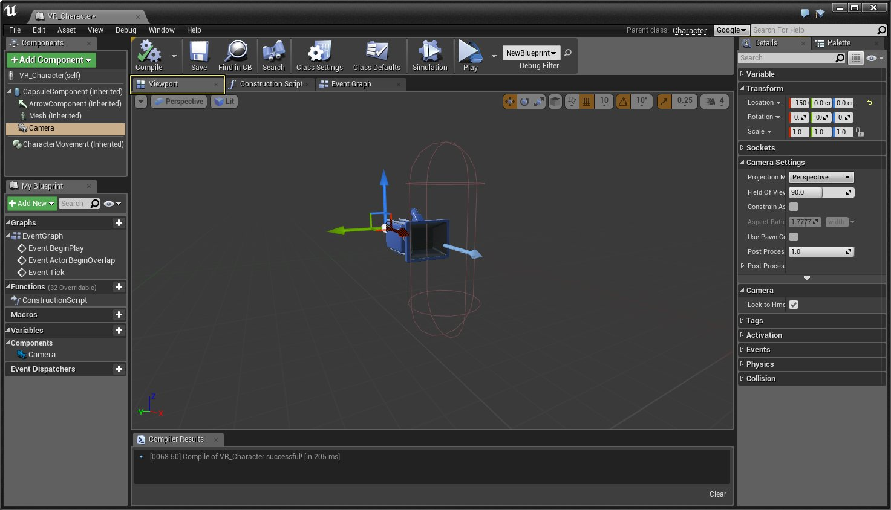
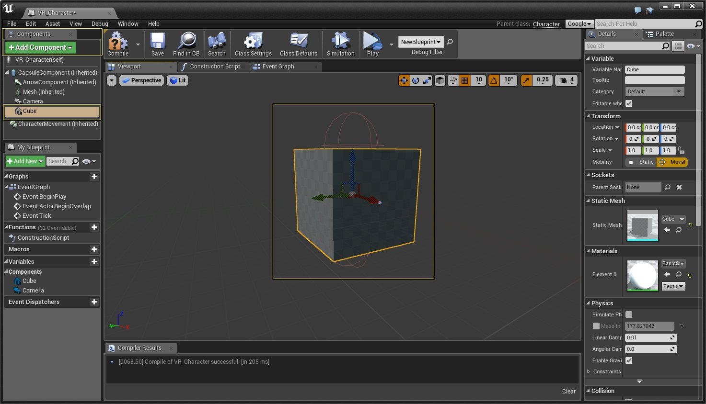

# 在HMD中添加显示内容

> 路径：虚幻引擎5.7文档 / 分享和发布项目 / XR开发 / 为XR体验设计UI / 在HMD中添加显示内容

> 原始页面：https://dev.epicgames.com/documentation/unreal-engine/attaching-items-to-the-hmd-in-unreal-engine

虚幻引擎4（UE4）提供了一种标准方法，以便在HMD中添加显示内容。无论你针对哪款头戴式显示器（HMD）进行开发，都可以使用该方法。该方法不仅可用于任何HMD，而且通过该方法添加的内容，将与HMD保持完全同步。在以下文档中，我们将介绍在HMD中添加内容所需的全部知识。

> [!NOTE]
> 现在，如果你希望获取玩家在世界场景中的位置，你只能获取摄像机Actor的位置。

## 设置对象使它们跟随HMD

你可以对静态网格体、粒子效果、UI元素和许多其他项进行设置，以使它们跟随HMD移动，方法如下。

1. 首先，打开Pawn蓝图并导航至 **视口（Viewport）** 选项卡。

   

   点击查看大图。
2. 在 **组件（Component）** 选项卡中，单击 **添加组件（Add Component）**，然后在搜索框中输入 **Cube** 并单击显示的 **立方体（Cube）** 网格体，以将它添加为组件。

   

   点击查看大图。
3. 选中该立方体（Cube）静态网格体并将它拖到摄像机（Camera）上，以使摄像机（Camera）成为该立方体（Cube）静态网格体的父项。
4. 现在，编译蓝图，然后使用UE4编辑器中的VR预览选项启动项目。当你戴上HMD，然后转动头部时，你连接的立方体（Cube）将紧随你的头部移动，如以下视频中所示。

## HMD和玩家世界场景位置

你也可以通过使用以下蓝图设置获取摄像机（Camera）组件的位置，从而快速获取玩家及其HMD的准确世界场景位置。

在上图中，只要用户在键盘上按下T键，摄像机在世界场景中的X、Y和Z位置就将输出到屏幕及日志窗口中。
