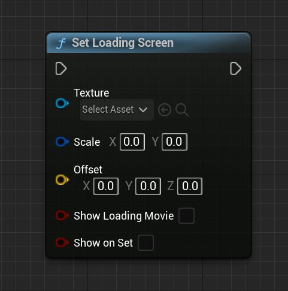
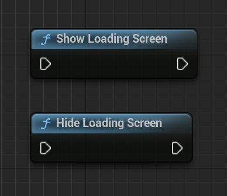
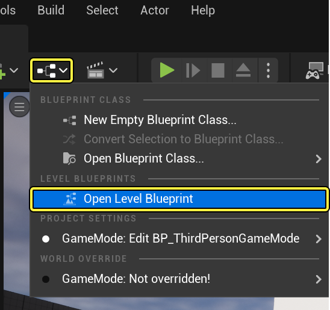
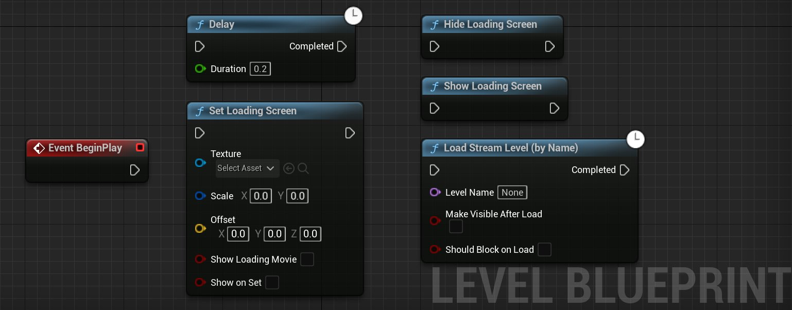
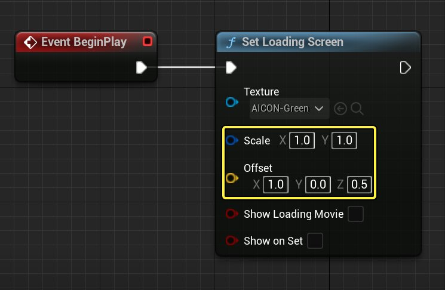
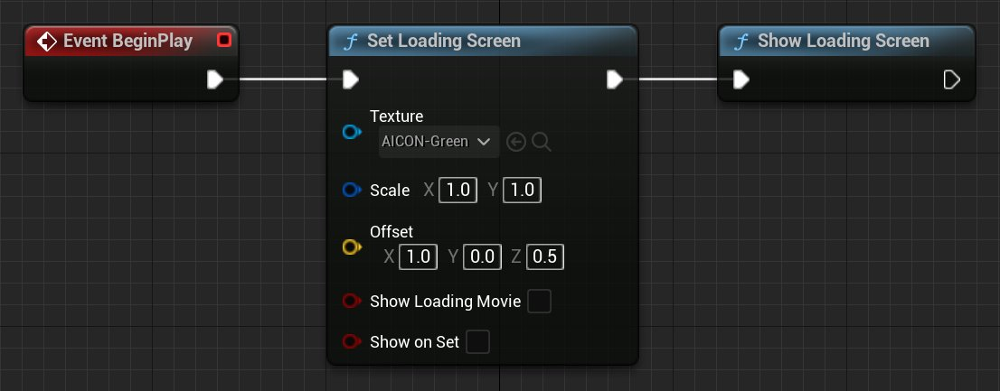
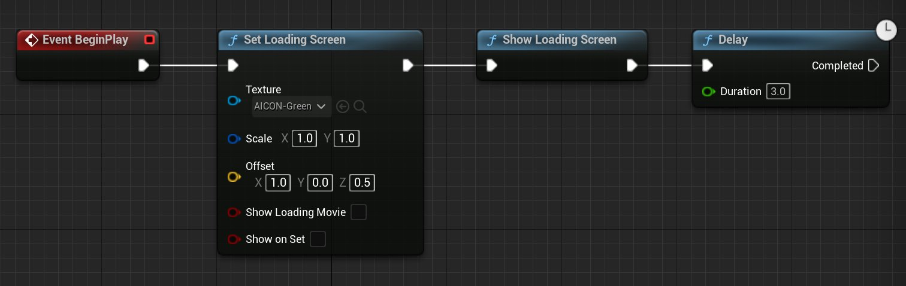
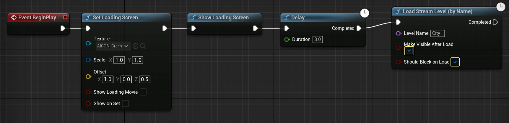

# OpenXR加载界面

> 路径：虚幻引擎5.7文档 / 分享和发布项目 / XR开发 / 为XR体验设计UI / OpenXR加载界面

> 原始页面：https://dev.epicgames.com/documentation/unreal-engine/openxr-loading-screens-in-unreal-engine

在为头戴式显示设备（HMD）开发应用时，你可以在关卡之间添加基于纹理的加载界面作为过渡效果。完成本指南后，你将了解哪些蓝图节点可用于实现加载界面以及它们的用法。

## Set Loading Screen节点

你必须先指定要加载的内容，然后才能在HMD中显示它。

在 **Set Loading Screen** 节点上，你可以从 **纹理（Texture）** 引脚的选择资产（Select Asset）下拉菜单中，选择你要用于加载屏幕的纹理。

然后，调整 **偏移（Offset）** 向量来指定纹理相对于HMD位置的位置。

> [!NOTE]
> XR中的加载屏幕目前不支持通过[媒体框架](../../../../working-with-media/integrating-media/media-framework/index.md)播放媒体。

## Show Loading Screen和Hide Loading Screen节点

创建Set Loading Screen节点后，将其输出引脚连接到 **Show Loading Screen** 节点的执行引脚，以便在HMD中显示它。

如果要隐藏加载屏幕，可以将其连接到 **Hide Loading Screen** 节点的执行引脚。

> [!NOTE]
> 有时，你可能需要在Show Loading Screen节点后使用Delay节点，增加一些延迟感，确保在进入下一阶段或关卡时加载屏幕仍然可见。

## Using Loading Screen节点

在下例中，我们使用[关卡流送](../../../../building-virtual-worlds/level-streaming/index.md)加载一个张新地图。

一般而言，你可以参照下述步骤为项目添加加载屏幕：

1. 在虚幻编辑器（Unreal Editor）中，在关卡编辑器中打开你的地图。
2. 点击 **蓝图（Blueprints）>打开关卡蓝图（Open Level)** **Blueprint**。

   
3. 在事件图表（Event Graph）中，添加以下节点：

   - Delay
   - Set Loading Screen
   - Show Loading Screen
   - Load Stream Level
   - Hide Loading Screen

   
4. 将 **Event BeginPlay** 节点的输出引脚连接到 **Set Loading Screen** 节点的输入。
5. 在

   Set Loading Screen

   节点上：

   1. 从

      纹理（Texture）

      下拉列表中选择纹理。
   2. 将

      缩放（Scale）

      2D向量设为

      (1.0, 1.0)

      （非零值），以查看该纹理。
   3. 将加载屏幕的

      偏移（Offset）

      3D向量设为

      (1.0, 0.0, 0.5)

      。加载屏幕应在HMD中显示在你面前，但具体位置会随头戴式设备而异。

   
6. 将 **Set Loading Screen** 节点的输出引脚连接到 **Show Loading Screen** 节点的输入。

   
7. 将 **Show Loading Screen** 节点的输出连接到 **Delay** 节点的输入。Delay节点将设置显示加载屏幕的特定时长。
8. 将 **Delay** 节点的 **时长（Duration）** 参数设置为 **3.0** 秒，这样你启动应用程序时加载屏幕至少会显示三秒。

   
9. 将 **Delay** 节点的输出引脚连接到 **Load Stream Level** 节点的输入。
10. 在 **Load Stream Level** 节点上：

    1. 在

       关卡名称（Level Name）

       中输入项目中另一个关卡的名称。
    2. 启用

       加载后可见（Make Visible After Load）

       。
    3. 启用

       加载时应阻止（Should Block on Load）

       。

    
11. 将 **Load Stream Level** 节点连到 **Hide Loading Screen** 节点。将Hide Loading Screen节点放置在Load Stream Level节点之后，确保关卡在可见前已加载完成。

    > 图片已省略：Level Blueprint where the Load Stream Level node is connected as an input to the Hide Loading Screen node
12. 在你的HMD上启动关卡，当关卡变化时会显示加载屏幕。

> [!NOTE]
> 你也可以在下一张关卡的关卡蓝图中的Event BeginPlay后面调用Hide Loading Screen，以确保下一张关卡完成加载后才隐藏加载屏幕。如果这样做，你就无需在Load Stream Level节点中启用加载时应阻止（Should Block on Load）。|
