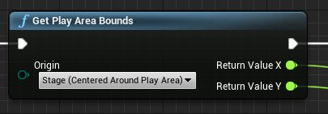
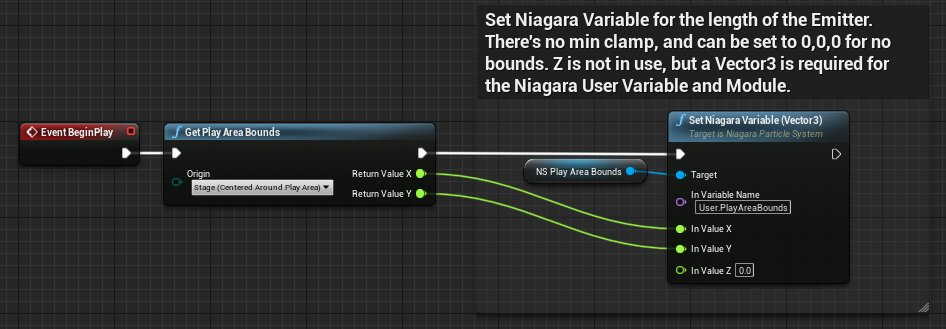
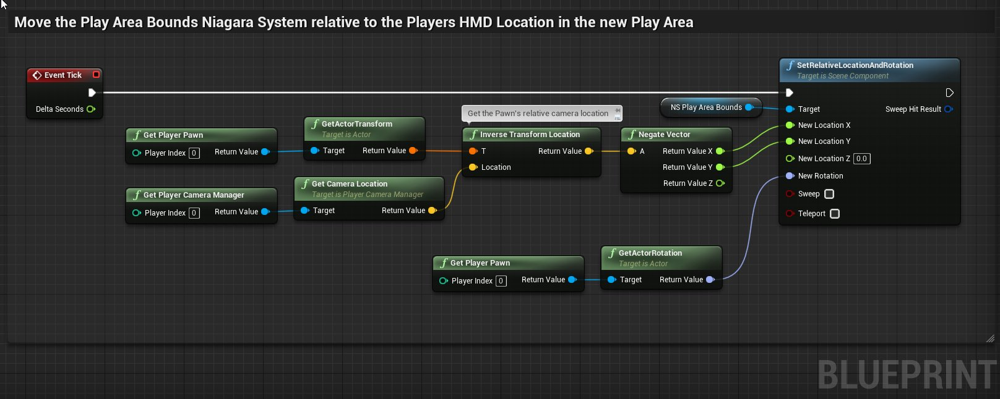

# 游戏区域边界可视化

> 路径：虚幻引擎5.7文档 / 分享和发布项目 / XR开发 / 为XR体验设计UI / 游戏区域边界可视化

> 原始页面：https://dev.epicgames.com/documentation/unreal-engine/visualizing-play-area-bounds-in-unreal-engine

用户可以在自己的设备上指定游戏区域的边界，有时称为 *舞台（stage）*。你可以使用[OpenXR API](../../developing-for-head-mounted-experiences-with-openxr/index.md)在虚幻引擎中访问这些边界。

在Oculus设备上，当用户靠近时会出现守卫边界。

此页面介绍了你可以如何将项目中的游戏区域边界可视化。要在你的设备上设置游戏区域边界，请参阅你设备的文档。

## 游戏区域边界可视化

`Get Play Area Bounds` 函数将返回可以在你的游戏区域内找到的最大矩形的长度。当用户接近边界时，你的OpenXR兼容运行时会将游戏区域边界可视化。当用户靠近应用程序中的自定义可视化边界时，通知用户也很有用。

`Get Play Area Bounds` 函数具有三个可以返回的参考空间：**齐眼高度（Eye Level）**、**地面高度（Floor Level）** 和 **舞台（Stage）**。这三个空间分别映射到OpenXR参考空间 **视图（View）**、**局部（Local）** 和 **舞台（Stage）**。在大多数情况下，我们建议你返回 **舞台（Stage）** 参考空间。有关OpenXR参考空间的更多详细信息，请参阅[OpenXR规范](https://www.khronos.org/registry/OpenXR/specs/1.0/html/xrspec.html#%E5%8F%82%E8%80%83-%E7%A9%BA%E9%97%B4)。

> [!NOTE]
> 如果 `Get Play Area Bounds` 函数没有返回数据，则你使用的OpenXR运行时可能没有实现用于游戏区域边界的OpenXR功能。

## 传送可视化

将游戏区域边界可视化的一个例子为传送可视化。[VR模板](../../getting-started-with-xr-development/vr-template/index.md)在传送过程中提供了这种可视化的实现。

传送可视化在位于 **Content/VRTemplate/Blueprints** 的蓝图 **VRTeleportVisualizer** 中定义。下面是对边界可视化逻辑的描述。

**On Begin Play：**

1. 蓝图会使用舞台参考空间调用 `Get Play Area Bounds`。
2. 然后，蓝图将X和Y数据分配给[Niagara系统](../../../../visual-effects/index.md)中的用户变量 **NS_PlayAreaBounds**。
3. NS_PlayAreaBounds会使用从Get Play Area Bounds返回的X值和Y值动态地绘制矩形。

**On Tick：**

1. 蓝图相对于传送位置移动NS_PlayAreaBounds，由 **NS_TeleportRing** 标识。
2. 这会对玩家在传送后相对于游戏区域边界所处的位置进行准确地可视化。

