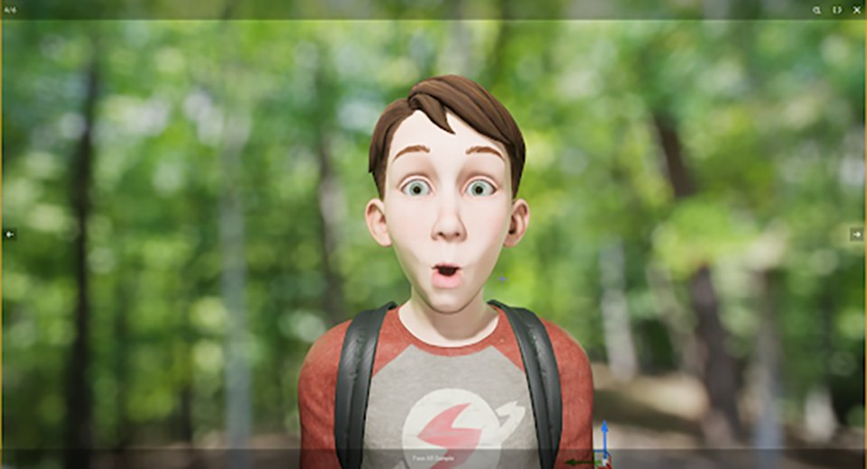
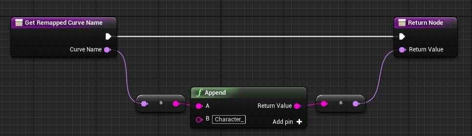
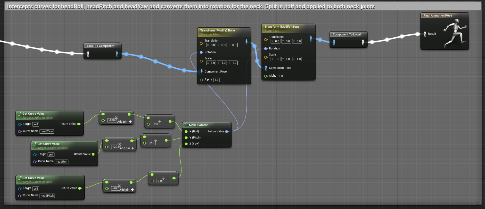
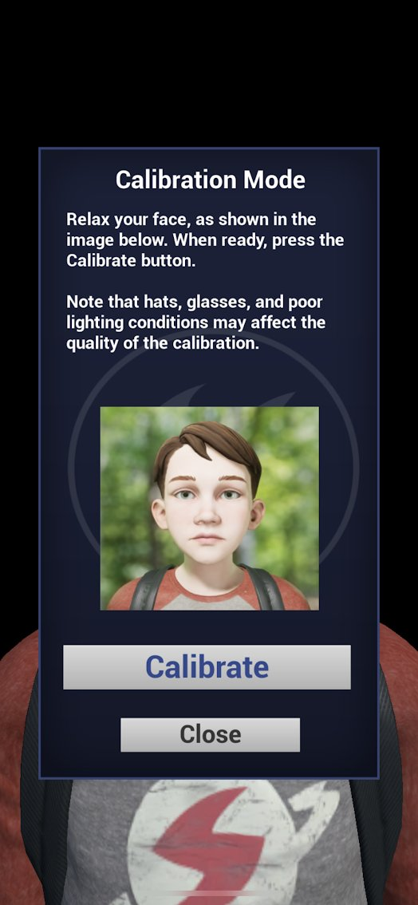
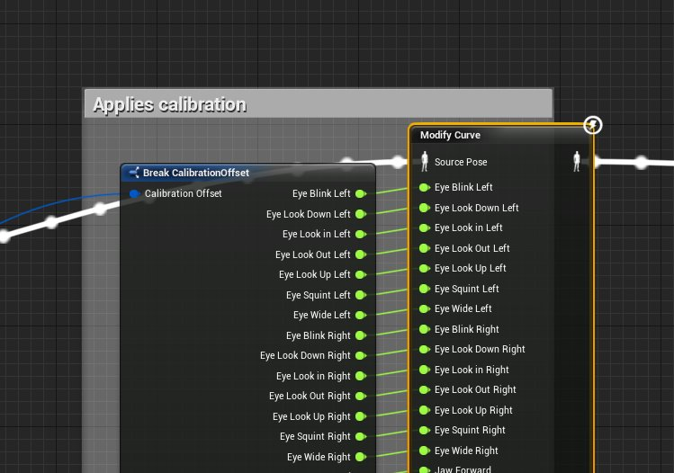
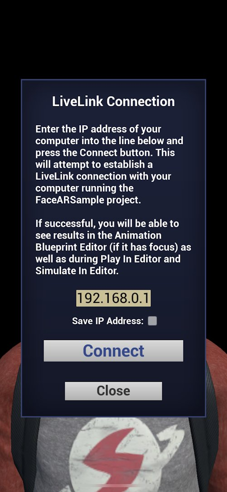
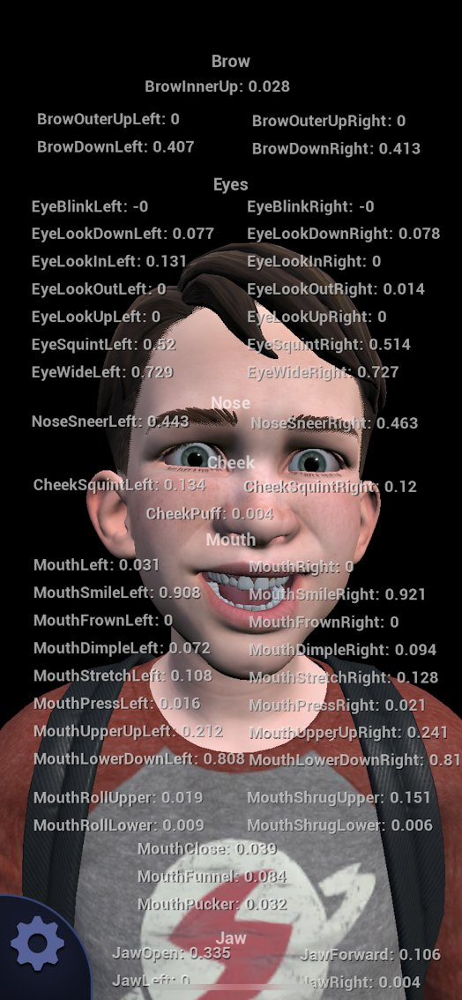
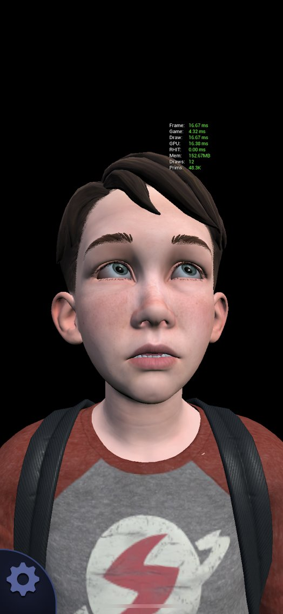

# 面部AR示例

> 路径：虚幻引擎5.7文档 / 分享和发布项目 / XR开发 / 为手持式设备开发增强现实体验 / 面部AR示例

> 原始页面：https://dev.epicgames.com/documentation/unreal-engine/face-ar-sample-in-unreal-engine



> [!NOTE]
> **面部AR示例** 项目展示了虚幻引擎内的Apple的ARKit面部追踪功能。你可以从 **Epic Games启动器** 的 **学习（Learn）** 选项卡下下载 **面部AR示例** 项目。

虚幻引擎支持Apple的ARKit面部追踪系统。该API使用前置TrueDepth相机，使用户能够追踪他们的面部运动，并在虚幻引擎中使用该运动。追踪数据可以用来驱动数字角色，也可以用于用户认为合适的任何用途。另外，虚幻引擎ARKit实现可以让你通过[Live Link插件](../../../../animating-characters-and-objects/skeletal-mesh-animation-system/live-link/index.md)将面部追踪数据直接发送到引擎中，包括当前的面部表情和头部旋转。通过这种方式，用户可以利用手机作为动作捕捉设备来操纵屏幕上的角色。

> [!NOTE]
> **面部AR示例** 项目是一个功能齐全的样本，但也提供了一些设置和配置信息以便用户探索项目。请记住，苹果的ARKit和Epic的OpenXR仍在不断升级，某些项目实现细节可能会发生变化。

有关Apple ARKit面部追踪的更多信息，请参阅Apple官方文档：[创建基于面部的AR体验](https://developer.apple.com/documentation/arkit/creating_face_based_ar_experiences)

> [!NOTE]
> 移动端的面部动画采集系统只能iOS设备上运行，且需要配合前置TrueDepth相机，如iPhone X、iPhone XS、iPhone XS Max、iPhone XR、iPad Pro（11英寸）和iPad Pro（第三代，12.9英寸）。

## 面部AR捕捉概述

在高层次上，ARKit的面部捕捉系统使用Apple TrueDepth摄像机来追踪用户面部的运动。在此过程中，它将面部的姿势与51个单独的面部姿势进行了比较。这些姿势都是Apple ARKit SDK自带的，每个姿势都针对面部的特定部分，如左眼、右眼、嘴角等。当用户面部的某一部分接近某个姿势的形状时，该姿势的值介于0.0和1.0之间。例如，如果用户闭上左眼，LeftEyeBlink姿势将从0.0混合到1.0。当用户的面部运动时，所有51个姿势都由SDK评估并赋值。虚幻引擎ARKit集成捕捉来自51个混合面部姿势的传入值，并通过[Live Link插件](../../../../animating-characters-and-objects/skeletal-mesh-animation-system/live-link/index.md)将这些值输入引擎。这51个姿势值可以驱动实时角色的面部运动。所以，你真正需要的是利用面部捕捉来动画化一个角色的头部，以确保角色内容设置为使用来自这51个形状的数据。因为这些形状每个反馈一个0.0到1.0的值，因此它们非常适合驱动角色上的混合形状列表的运动。

如果在虚幻角色上创建的混合形状的名称与Apple官方形状列表中的形状完全相同，则连接是自动的。但是，如果Apple网格体和虚幻角色之间的形状名称不同，那么必须使用一个重新映射资产。有关重新映射混合形状名称的详细信息，请参阅 [在LiveLinkRemap资产中重新映射曲线名称](#%E5%9C%A8livelinkremap%E8%B5%84%E4%BA%A7%E4%B8%AD%E9%87%8D%E6%96%B0%E6%98%A0%E5%B0%84%E6%9B%B2%E7%BA%BF%E5%90%8D%E7%A7%B0)部分。

有关Apple ARKit带来的混合形状的完整列表，请参阅Apple官方文档：[ARFaceAnchor.BlendShapeLocation](https://developer.apple.com/documentation/arkit/arfaceanchor/blendshapelocation)

## 面部AR捕捉设置

建立一个面部捕捉系统，以使用ARKit动画化角色的面板，这需要几个步骤：

1. 设置角色混合形状并将角色导入虚幻引擎。

   1. 使用基于混合形状的面部动画创建角色，采用[Apple的ARKit指南](https://developer.apple.com/documentation/arkit/arfaceanchor.blendshapelocation)中定义的51个混合形状。理想情况下，这些混合形状的几何体的名称应该与Apple列出的函数名称相同（*eyeBlinkLeft、eyeLookDownLeft* 等）。然而，这里有一些余地，因为如果必要的话，可以重新映射。
   2. 将该角色导入引擎，确保在导入选项中导入混合形状。
2. 将下列命令行添加到你的 *DefaultEngine.ini* 中以启用面部追踪。（*DefaultEngine.ini* 文件位于项目的Config文件夹内。）

   ```
       [/Script/AppleARKit.AppleARKitSettings]    bEnableLiveLinkForFaceTracking=true
   ```
3. 在你的项目中创建并应用数据资产，以启用面部追踪。

   1. 右键单击内容浏览器并选择 *杂项（Miscellaneous）> 数据资产（Data Asset）*。
   2. 从显示的 **选择数据资产类（Pick Data Asset Class）** 窗口中，选择 *ARSessionConfig* 并单击 *选择（Select）*。
   3. 双击该新资产以打开它，并设置以下选项：

      - **世界场景对齐（World Alignment）**：摄像机（Camera）
      - **会话类型（Session Type）**：面部（Face）
      - **水平面检测（Horizontal Plane Detection）**：关闭（Off）
      - **垂直面检测（Vertical Plane Detection）**：关闭（Off）
      - **启用自动对焦（Enable Auto Focus）**：关闭（Off）
      - **光源评估模式（Light Estimation Mode）**：关闭（Off）
      - **启用自动摄像机覆层（Enable Automatic Camera Overlay）**：关闭（Off）
      - **启用自动摄像机追踪（Enable Automatic Camera Tracking）**：关闭（Off）
      - **候选图像（Candidate Images）**：忽略（Ignore）
      - **同时追踪最大图像数（Max Num Simultaneous Images Tracked）**：1
      - **环境捕捉探头类型（Environment Capture Probe Type）**：无（None）
      - **世界场景贴图数据（World Map Data）**：忽略（Ignore）
      - **候选对象（Candidate Objects）**：忽略（Ignore）
   4. 在面部追踪关卡的关卡蓝图中，从开始运行（Start Play）开始，调用

      Start AR Session

      函数，并将会话配置（Session Config）属性设置为刚刚创建的ARSessionConfig数据资产。
4. 创建使用LiveLinkPose节点的动画蓝图，主题名称（Subject Name）设置为

   iPhoneXFaceAR

   。这将把ARKit的面部值输入到虚幻引擎动画系统中，从而驱动角色的混合形状。

## AR面部组件

ARKit面部追踪系统使用一个内部的面部网格体，将其包裹到用户的面部，并作为模仿表情的基础。在虚幻引擎中，该网格体由 *AppleARKitFaceMesh* 组件公开。这可添加到现有的蓝图中，并设置为可视化ARKit SDK所看到的内容，帮助你将其与你角色的面部动作关联起来。

*AppleARKitFaceMesh* 组件属性：

| 名称 | 说明 |
| --- | --- |
| **想要碰撞（Wants Collision）** | 如果启用，该属性将碰撞几何体添加到面部网格体。就性能而言，该属性的成本非常高，应该只在应用程序需要根据网格体进行追踪的情况下使用。例如，如果需要把东西贴在面部上，或者在面部上找到一个位置。 |
| **自动绑定到本地面部网格体（Auto Bind to Local Face Mesh）** | 如果启用，该属性将自动将该组件绑定到设备上的本地ARKit面部几何体。然后，ARKit将在每次tick时更新该组件并处理追踪丢失。 |
| **变形设置（Transform Setting）** | **仅组件：（Component Only:）**仅使用组件的变换。仅在不打算追踪面部时才使用该属性。 **组件位置追踪旋转：（Component Location Tracked Rotation:）**使用组件位置，但在使用应用程序时追踪用户头部的旋转。 **组件与追踪：（Component with Tracked:）**将组件和追踪数据的变换串联在一起。 **仅追踪：（Tracking Only:）**忽略组件的变换，仅使用追踪数据。 |
| **翻转追踪的旋转（Flip Tracked Rotation）** | 如果启用，反转追踪的旋转。如果想要对你的角色产生镜像类型的效果，该属性是非常有用的。 |
| **面部材质（Face Material）** | 给AppleARKitFaceMesh组件的面部网格体应用一个材质。默认情况下，AppleARKitFaceMesh组件是不可见的。我们通常建议你添加一个无光照线框材质到该属性，使网格体很容易看到，就像在 **面部AR示例（Face AR Sample）** 项目中所做的那样 |
| **Live Link主题名称（Live Link Subject Name）** | 用作唯一标识符，属于Live Link动画管道的一部分。 |

## 使用面部捕捉驱动关节

游戏或实时项目中的大多数角色面部并不是单独使用混合形状来动画化的。一般来说，还有一些面部骨架帮助控制面部部分的运动。虽然ARKit中人脸捕捉的Live Link实现可以自动驱动面部混合形状，但在姿势资产的帮助下，你还可以驱动面部关节。

> [!NOTE]
> 需要注意的是，在使用ARKit进行面部动画化时，无需进行骨骼设置。如果你的面部设置已经有关节，或者已知你需要它们，这里就会记录下来。

## 校正性混合形状与关节

在某些情况下，例如在使用关节动画化面部时，你可能会发现还需要同时触发一个混合形状，以使运动看起来比较适当。这种混合形状通常被称为 *校正性混合形状*。

例如，看这张图像，图中风筝男孩的颌部打开时只有关节旋转，观察它是如何通过在上面叠加一个校正性混合形状层来改进的。

| kiteboy1.png | kiteboy2.png | kiteboy3.png |
| --- | --- | --- |
|  |  |  |

左边是男孩的嘴张开，只有关节旋转。注意颌下部看起来太宽了。中间部分显示颌打开时关节会旋转，但现在其上有一个校正性混合形状分层。颌适度拉伸，看起来更自然。右边是校正性混合形状本身，它收缩嘴和下巴，以辅助拉伸过程。我们的看法是，这两个系统，即关节旋转和校正性混合形状，将永远协同工作；两者缺一不可。

## 更多校正性混合形状

在 **面部AR示例（Face AR Sample）** 的动画蓝图中，你将在动画图表中注意到一个刚添加了校正性混合形状的部分。这用于进行特殊的校正，如当眼睛注视对角线方向（例如左下方）时。这些姿势通常是通过ARKit提供的原始列表中未包含的其他混合形状来处理的，并根据标准形状的值来混合它们。

举个例子，如果你有一个右眼斜向左下看的特殊校正性混合形状，则可以用你的动画蓝图读取 *eyeLookDownRight* 和 *eyeLookInRight* 的值，并使用这些数据来激活一个完全独立的混合形状。这可以在 **面部AR示例（Face AR Sample）** AnimBP中看到。

## 为面部动画创建姿势资产

要创建必要的姿势资产，以从ARKit数据驱动面部动画，请执行以下操作：

1. 在你的DCC应用程序中创建一个动画，其中： 1.第一帧是休息姿势，在无更改的情况下将其关键帧化。

   1. 对于第2帧及之后的帧，每个帧都应该是一个关键帧化的不同骨骼姿势，以实现Apple ARKit列表中的姿势。例如，帧2可以是 *eyeBlinkLeft*，帧3可以是 *eyeLookDownLeft*，以此类推。
   2. 你不需要创建ARKit列表要求的每一个单独的姿势，只需要那些需要关节为你的绑定移动的姿势。例如，对于我们的 **面部AR示例（Face AR Sample）** 文件，*jawOpen* 是通过关节旋转来处理的。然而，还有一个混合形状，即在颌部张开的时候，把脸压扁一点，这样看起来更自然。

   > [!NOTE]
   > 你可以在 **面部AR示例（Face AR Sample）** 项目中看到这个动画的示例，动画资产名称为 *KiteBoyHead_JointsAnim*。
2. 你必须保存一个列表，其中列出动画中的姿势，以及它们出现的顺序。我们建议你用电子表格做这个列表，以便稍后可以轻松地将这些名称粘贴到虚幻引擎中。
3. 将动画导入虚幻引擎，确保它与角色的骨架相关联。
4. 右键单击虚幻引擎中的动画，并选择 *创建（Create）> 创建姿势资产（Create Pose Asset）*。
5. 该资产将为动画的每一帧提供一个姿势列表。你可以直接从电子表格复制和粘贴一个名称列表来重命名它们。

> [!NOTE]
> 特别感谢[3Lateral](http://www.3lateral.com/)的团队，他们在为风筝男孩面部设置绑定时提供了巨大的帮助。

## 在LiveLinkRemap资产中重新映射曲线名称

1. 在我的蓝图（My Blueprint）面板的函数组中，选择覆盖（Override）并选择获取重新映射的曲线名称（Get Remapped Curve Names）。
2. 这将打开一个包含输入和输出的函数图表。我们的目标是使用此图表将Apple SDK中的预期名称列表中的传入名称更改为与角色上的混合形状名称相对应的名称。例如，如果你有一个角色，其混合形状已适当命名，但是附加了"Character_"，那么你将使用如下图表：

   

   单击显示全图。

   > [!NOTE]
   > 注意，它接受来自Apple SDK的传入名称，在名称前面附加"Character_"，并输出结果。

## 处理头部旋转

对于某些项目，你可能需要访问追踪面部的旋转。在ARKit的虚幻引擎实现中，我们将旋转数据与面部形状值一起传递。在 *KiteBlyHead_JointsAndBlends_Anim* 动画蓝图中，你将会看到一个部分，其中数据被细分，并通过Modify Bone节点应用于颈部和头部的关节，如图所示：



单击显示全图。

数据通过三条曲线的形式发出：HeadYaw、HeadPitch 和 HeadRoll。

## 部署到iPhone X

**面部AR示例（Face AR Sample）** 项目应部署到iPhone X，以充分探究其特性集。部署文档现已到位，请参阅[iOS游戏部署](../../../../mobile-development/ios-ipados-and-tvos-support/index.md)，你可能会发现，使用项目启动器可以更轻松地将 **面部AR示例（Face AR Sample）** 项目部署到你的设备上。

1. 打开 **项目启动器（Project Launcher）**（使用主工具栏 **启动（Launch）** 按钮右侧的小箭头）。
2. 在窗口底部，单击 **自定义启动描述文件（Custom Launch Profiles）** 对面的+按钮，以创建一个新的描述文件。
3. 进行以下设置：

   - **构建配置（Build Configuration）**：开发（Development）
   - **你想要如何烘焙内容：（How would you like to Cook Content:）**按照书本（另请检查构建列表中的iOS）
   - **烘焙的贴图（Cooked Maps）**：FaceTrackingMap_Simplified（不建议部署FaceTrackingMap2，因为它没有针对移动渲染进行优化）
   - **你想要如何打包构建（How would you like to package the build）**：不打包
   - **你想要如何部署构建（How would you like to deploy the build）：复制到设备（Copy to Device）**：All_iOS_On_（在Mac上，你可能会看到你的特定设备 - 如果看到，选择它）
4. 完成后，单击 **返回（Back）**。
5. 插入你的设备，确保iTunes可以看到它。
6. 单击

   启动此描述文件（Launch This Profile）

   按钮获取新描述文件。

## 项目功能

**面部AR示例（Face AR Sample）** 项目应部署到iPhone X，以进行适当的研究。在设备上，用户可以测试系统的所有功能，包括：

- 校准
- Live Link广播
- 显示/隐藏调试和统计数据
- 镜像控制

### 校准

默认情况下，角色的面部可能不会模仿你自己的面部。在很多情况下，期望的姿势和最终的姿势之间存在细微的差异，这通常是由SDK到角色的数据解释造成的。如果用户在使用应用程序时采用一个中性的姿势，且嘴巴闭合时，这很容易被看作是风筝男孩嘴唇的轻微分离。

为了解决这个问题，该应用程序有一个校准系统。在应用程序中，可以通过左下角的设置按钮打开校准系统，进入校准模式。之后，该应用程序将指导你完成流程。



在编辑器中，**面部AR示例（Face AR Sample）** 项目也有一个校准流程。

1. 在编辑器中模拟时，选择场景中的风筝男孩。
2. 你将在 **细节面板** 中看到 *编辑器内校准（In Editor Calibration）* 事件按钮。单击该按钮以与应用程序相同的方式进行校准。

在这两种情况下，项目都记录SDK接收到的当前面部捕捉值，并将其扩展到新的0。采集这些值的函数位于不同的位置，这取决于你是在设备上还是在编辑器中（应用程序中的pawn中，或是编辑器中的风筝男孩蓝图中）。完成采集后，将使用一个Modify Curve节点在动画蓝图中处理这些值，并将其应用模式（Apply Mode）设置为重新映射曲线（Remap Curve）。



### Live Link广播

除了用于娱乐之外，**面部AR示例（Face AR Sample）** 还展示了如何将iPhone X和ARKit用作强大的数字傀儡操纵和动作捕捉设备。这是在标准的Live Link工作流程之外完成的，但是在应用程序上已经进行了简化。

> [!WARNING]
> 重要的是，设备和计算机在同一个物理网络内 - 检查你的iPhone上的WiFi设置以确保这一点。



1. 在应用程序内，点击 **设置（Settings）** 按钮。
2. 点击 **Live LInk连接（Live LInk Connection）** 按钮。
3. 在提供的行中输入你的IP地址。
4. 放松你的面部，如图所示。
5. 点击 **连接（Connect）**。

你可以选择保存你的IP地址。这将在会话之间保存你的IP地址。但是，我们故意不保存 **保存IP地址（Save IP Address）** 复选框的状态，所以你必须在每次重新启动应用程序时确认设置。

### 显示标记复选框

**面部AR示例（Face AR Sample）** 应用程序包含了一些功能复选框，可以启用和关闭这些复选框来显示特定的功能。

- 显示调试网格体（Show Debug Mesh）
- 显示调试值（Show Debug Values）
- 显示单元统计数据（Show Unit Stats）

#### 显示调试网格体

该复选框显示和隐藏Apple的ARKit调试网格体。这是SDK用来追踪用户面部运动的网格体。在应用程序中，这是用非常简单的无光照线框材质渲染的。

> [!TIP]
> 如果使用 **面部AR示例（Face AR Sample）** 应用程序作为面部动作捕捉木偶操纵设备，建议只显示调试网格体。这更快，性能更好，对设备温度影响较小。这一点很重要，因为如果设备过热，性能会下降。

#### 显示调试值

显示调试值（Show Debug Values）可以直接显示从ARKit传递到虚幻引擎的数值浮点数据。这些值独立于任何已就位的校准偏移量。使用调试值帮助诊断传入的ARKit数据与应用程序中的预期结果之间的差异。



#### 显示单元统计数据

显示单元统计数据（Show Unit Stats）与在应用程序的控制台中输入"STAT UNIT"相同。这只会打开引擎中的标准单元统计数据，因此你可以看到设备上的性能数字。



### 帮助和关于

**帮助和关于（Help & About）** 屏幕是 **面部AR示例（Face AR Sample）** 的应用程序内概述，类似于你在此页面上看到的内容。

### 将应用程序连接到你的计算机

**面部AR示例（Face AR Sample）** 项目的一个更令人兴奋的特性是，它可以用作你计算机上的一个动作捕捉设备。该应用程序经过了精简，使这一过程尽可能轻松，但在开始之前，请验证设备和计算机是否在同一物理网络上。

> [!WARNING]
> 重要的是，设备和计算机在同一个物理网络内 - 检查你的iPhone上的WiFi设置以确保这一点。

1. 在计算机上启动 **面部AR示例（Face AR Sample）** 项目。
2. 在编辑器中打开 **FaceTrackingMap2** 贴图，导航到角色正前方的查看位置。
3. 按编辑器中的 **模拟（Simulate）**（位于 **在编辑器中运行（Play in Editor）** 按钮旁的箭头下）。
4. 在你的设备上，启动 **面部AR示例（Face AR Sample）** 应用程序。
5. 数秒后，设置按钮显示在左下角。点击它。
6. 从 **设置（Settings）** 面板选择 **LiveLink连接（LiveLink Connection）**。
7. 在提供的行中输入你计算机的IP地址。
8. 点击 **连接（Connect）**。
