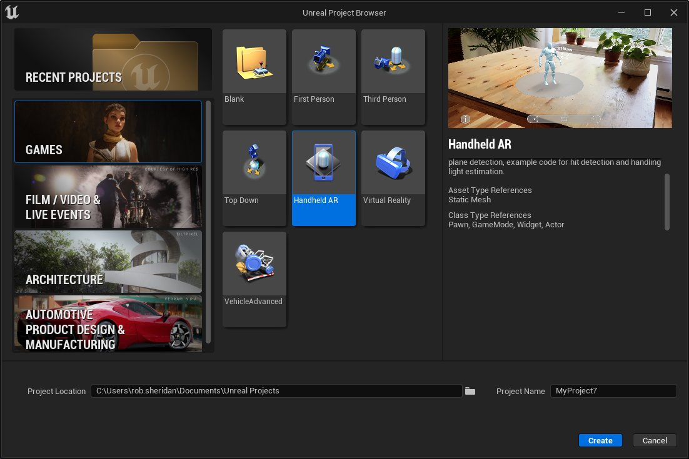
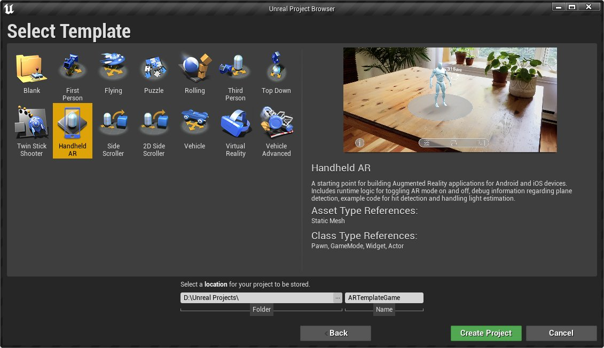
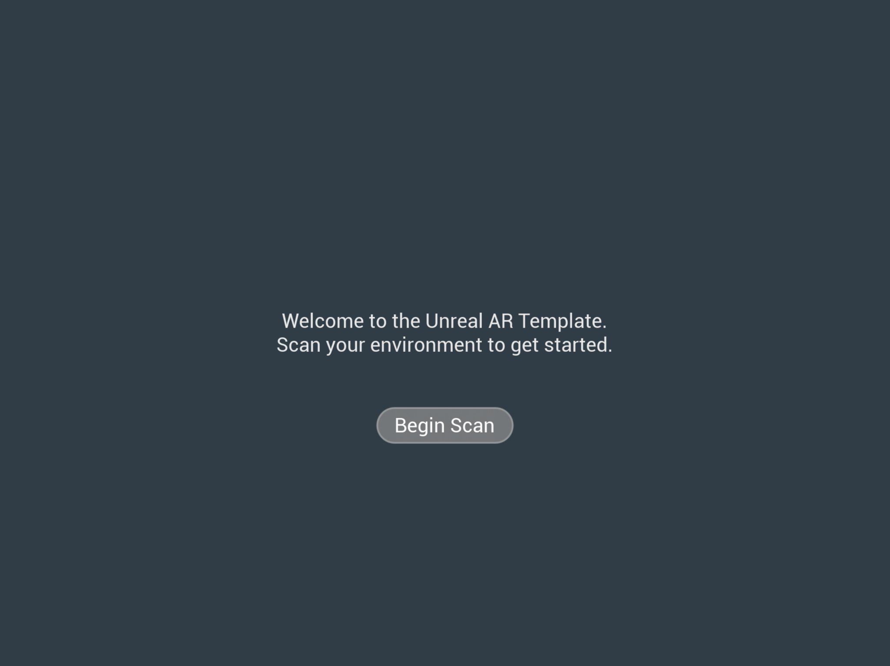
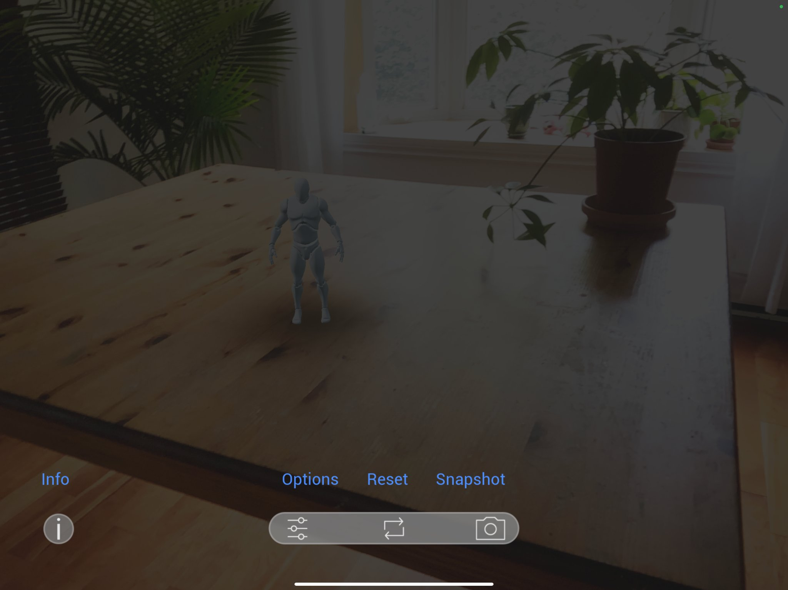
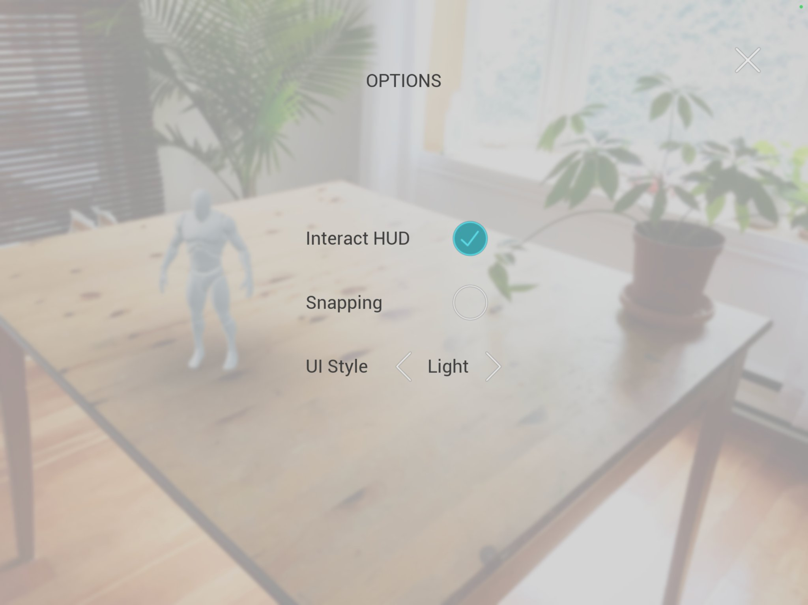
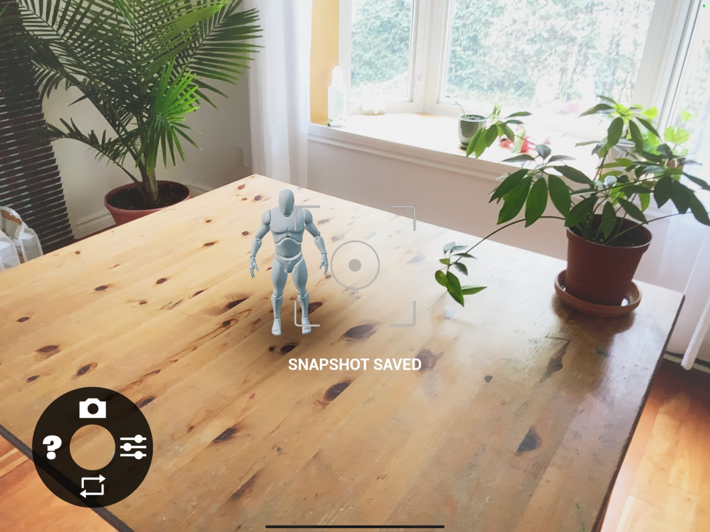
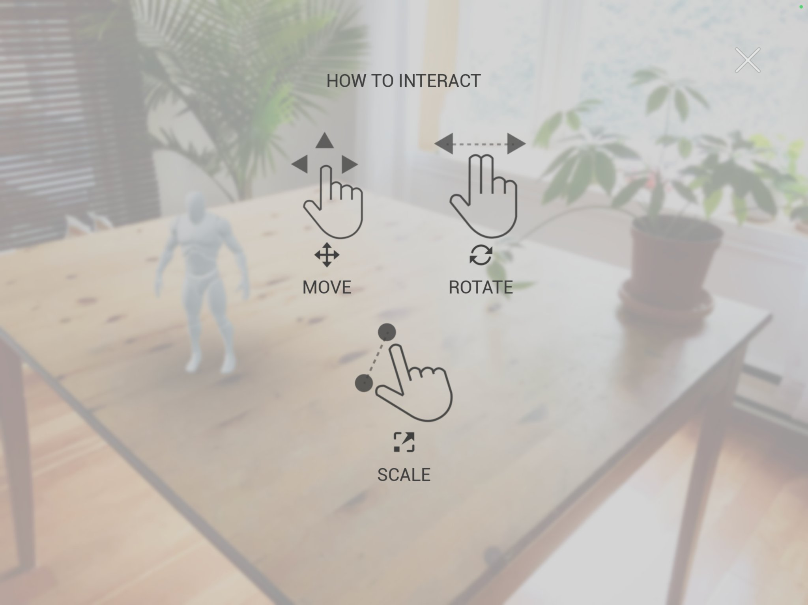

# 手持类AR项目模板快速入门

> 路径：虚幻引擎5.7文档 / 分享和发布项目 / XR开发 / 为手持式设备开发增强现实体验 / 手持类AR项目模板快速入门

> 原始页面：https://dev.epicgames.com/documentation/unreal-engine/handheld-ar-template-quickstart-in-unreal-engine

手持类AR模板适用于使用UE 4.27或更高版本创建的虚幻引擎项目。此模板为基于Android和iOS设备的增强现实项目提供了一个简易模板，允许你在此基础上进行修改。

本指南将介绍AR模板中的功能，如何在移动设备上打开和操作模板项目，以及如何在虚幻编辑器中找到各项功能，从而创建你自己的手持类AR应用。

## 1. 用户体验旅程和功能概述

AR模板是一款简单的手持AR应用程序，其中包含的用户体验旅程涵盖以下步骤：

1. 用户打开应用程序。
2. 应用程序会提示需要扫描环境。用户必须提供摄像机权限才能继续。
3. 用户在提示中点击确认之后，应用程序就会通过用户的摄像机扫描环境，然后将平面添加到环境中来定义虚拟场景。
4. 应用程序将提示用户选择要进行交互的平面。
5. 用户选择平面之后，就可以在平面上放置虚拟对象。
6. 放置虚拟对象之后，用户就可以使用多种平移工具来操控对象。HUD提供多种配置选项，允许获取AR场景快照，并提供重置选项，允许重新选择平面。

此模板展示了以下功能：

- 通过简单的状态机来控制应用程序流。
- 扫描环境，收集数据，以进行如下操作：

  - 定义虚拟场景中的交互式平面。
  - 提供光照和场景深度信息。
- 使用UMG控件来显示从摄像机捕获的环境。
- 在虚拟场景中进行基于触摸屏的交互。

  - 操控虚拟对象。
  - 选择由用户环境定义的平面。
- 使用基于手势的触摸输入来执行不同类型的交互。
- 提供基本UI，其中包含针对不同类型应用程序的不同样式选项。
- 从充分复合的AR场景中捕获图像，并保存到摄像机图库中。

## 2. 兼容性

设备满足以下要求，手持AR模板即可工作：

- 设备必须受到虚幻引擎的支持。
- 设备必须支持ARKit (iOS)或ARCore (Android)。

如需当前版本虚幻引擎支持的设备列表，请参阅[iOS设备兼容性](https://dev.epicgames.com/documentation/404)和[Android设备兼容性](https://dev.epicgames.com/documentation/404)页面。

如需了解哪些iOS设备支持ARKit，请参阅[Apple开发者ARKit文档](https://developer.apple.com/documentation/arkit/verifying_device_support_and_user_permission)

如需了解哪些Android设备支持ARCore，请参阅[Google开发者AR文档](https://developers.google.com/ar/devices)。

## 3. 设置模板

要使用AR模板，你首先要以模板为基础创建项目，然后对项目进行设置，以便安装到所需的移动设备上。本小节将引导你完成所需的步骤。

1. 打开

   虚幻编辑器（Unreal Editor）

   。在

   选择或创建新项目（Select or Create New Project）

   菜单中，向下滚动到

   新项目类别（New Project Categories）

   ，然后选择

   游戏（Games）

   ，然后点击

   下一步（Next）

   。

> [!NOTE]
> AR模板也可以在建筑、工程、施工、汽车、产品设计和制造业中使用。

1. 在

   选择模板（Select Template）

   菜单中，选择

   手持AR（Handheld AR）

   模板。为你的项目选择

   名称（Name）

   和

   位置（Location）

   。在此示例中，项目名为

   ARTemplateGame

   。完成设置之后，点击

   创建项目（Create Project）

   。

完成这些步骤之后，项目将在虚幻编辑器中打开，并将 **HandheldARBlankMap** 作为默认地图。

## 4. 打包并部署到你的设备

要完成项目设置，你需要对项目进行准备，以便打包到你的移动设备。Android和iOS在你的项目设置中均需要不同的设置步骤。

### Android设置

要为Android准备你的手持AR项目，请完成以下步骤：

1. 在你的计算机上安装所需的 **Android Studio** 版本。
2. 在你的引擎文件夹中运行 **AndroidSetup** 脚本，确保你的计算机上安装了所需的SDK和NDK组件。根据你的操作系统，你可能需要重新启动计算机才能使更改生效。
3. 在你的 **项目设置（Project Settings）** 中，找到Android设置并点击APK打包下的 **立即配置（Configure Now）** 按钮，以便针对Android平台配置你的项目。如果你尚未接受Android SDK许可证，那么还需要点击 **接受SDK许可证（Accept SDK License）** 按钮。
4. 将你的设备设置为 **开发人员模式（Developer Mode）**，并且接受与你的计算机进行USB连接。

你可以在[Android设置小节](../../../../mobile-development/android-support/getting-started-and-setup-for-android-projects/index.md)中找到这些步骤的详细信息。

### iOS设置

要为iOS准备你的手持AR项目，请完成以下步骤：

1. 在你的Mac上安装最新版本的 **Xcode**。
2. 从Apple开发人员门户上获取适用于项目的 **预配配置文件（provisioning profile）** 和 **签名证书（signing certificate）**。

   - 该预配配置文件应该有权使用你设备的摄像机。
3. 打开你的 **项目设置（Project Settings）** 并导入预配配置文件和签名证书。

你可以在[iOS设置小节](../../../../mobile-development/ios-ipados-and-tvos-support/packaging-and-publishing-android-projects/index.md)中找到这些步骤的详细信息。

### 打包和启动

在执行必要的设置来支持你的移动设备之后，你可以点击 **文件（File） > 打包项目（Package Project）** 并为相应的设备选择打包选项来打包你的项目。这将创建一个打包版本，稍后你可以将它部署在设备上。

你还可以点击主工具栏中的 **启动（Launch）** 下拉菜单，然后从显示的设备列表中选择你的设备，从而直接在设备上启动。你可以在 **设备管理器（Device Manager）** 菜单中检查设备的状态，验证设备已经连接。引擎然后会将项目自动打包，并自动推送到你的设备，然后启动。

## 5. 在应用程序中导航

本小节将为手持AR模板开箱即用的配置提供用户体验旅程详细介绍。

### 扫描和对象放置

手持AR模板启动时将使用设备的摄像机来显示周围的环境。此时系统将出现提示，要求你扫描周围的环境。

点击 **开始扫描（Begin Scan）** 按钮开始扫描。这将收集为虚拟对象构建3D场景所需的数据。

> [!NOTE]
> 应用程序将要求你授予拍摄照片和录制视频的权限。摄像机需要这些权限才能扫描和显示环境。

移动设备完成扫描之后，应用程序将显示若干 **平面** 并提示你点击屏幕来选择一个平面。平面在显示时表面会有彩色波纹。为减少视觉效果噪点，应用程序每次仅显示一个平面，并且会将距离最近的平面设置为可见。

在选择平面之后，底部工具栏UI将会出现，而你可以放置虚拟对象。

模板一次可以放置一个虚拟对象，但是用来放置此对象对象的工作流也可以用来在你自己的应用程序中放置其他平面。

### 操控对象

在手持AR模板中，你可以使用触摸屏 **平移**、**缩放** 或 **旋转** 虚拟对象。

要平移对象，请点击它并沿着你要放置对象的地面拖动。单指触摸即可显示平移HUD。对象只能它所在平面的边界内移动。开始平移对象时，HUD上将显示边界。

要缩放对象，可以使用拇指和食指缩小或放大对象。模板可以识别与屏幕的水平方向垂直的大部分缩小操作。在缩放对象时，UI将以毫米为单位来显示对象的新大小。

要旋转对象，请将两根手指放在屏幕上并向左或向右滑动。系统可以识别在要旋转的屏幕上处于水平方向的大部分滑动和拖动操作。这将显示旋转HUD，其中包含对象底部周围的圆圈及其当前世界旋转刻度（以度数表示）。

### 导航UI和菜单

默认情况下，手持AR模板的UI显示在屏幕的底部。这包括工具栏以及左下角的浮动 **信息（Info）** 按钮。

#### 快照

**快照（Snapshot）** 按钮将获取一张包含屏幕上显示的虚拟对象的图片，并将其保存到你的摄像机图库。一条显示 **快照已保存（Snapshot Saved）** 字样的提示将确认快照已成功获取。

> [!NOTE]
> 从4.27开始，手持AR模板会将截屏保存到Android上的摄像机图库，但在iOS上不会保存。

#### 重置

**重置（Reset）** 按钮将会移除虚拟对象，并重新提示用户选择平面。

#### 选项菜单

**选项（Options）** 按钮将会打开用于提供配置选项的菜单。

在平移或缩放时，切换 **对齐（Snapping）** 将会使虚拟对象以1厘米的增量离散。旋转将会对齐到5度角。

在与屏幕交互之前，切换 **交互HUD（Interact HUD）** 将会关闭HUD。这就提供了一种方式来制作清晰的截屏。

**UI样式（UI Style）** 选择器提供了三种UI样式。明亮（Light）和黑暗（Dark）样式将显示默认UI，工具栏在屏幕底部。**游戏（Game）** 样式则显示更具特色的HUD，所有工具排成一圈，而不是横向排列。游戏（Game）样式支持与明亮（Light）和黑暗（Dark）样式完全相同的函数和流程，但使用时展示不同的布局。

#### 信息菜单

**信息菜单（Info Menu）** 将显示简单的视觉指南，列明用于操控虚拟对象的手势。

## 6. 模板快速参考

手持AT模板的所有资产都位于内容浏览器中的 **手持AR（Handheld AR）** 文件夹中。手持AR模板主要依赖于以下资产：

| 资产名称 | 路径 | 摘要 |
| --- | --- | --- |
| BP_ARGameMode | HandheldAR/Blueprints/GameFramework/BP_ARGameMode | 手持AR模板中使用的游戏模式。初始化AR Pawn。 |
| BP_ARPawn | HandheldAR/Blueprints/GameFramework/BP_ARPawn | 手持AR模板的Pawn类。初始化HUD，处理虚拟场景的设置以及用户的输入。 |
| BP_MainMenu | HandheldAR/Blueprints/UI/BP_MainMenu | 手持AR模板的主UI。控制其他菜单，以及初始化摄像机中的AR场景。 |
| BP_Plane | HandheldAR/Blueprints/Placeable/BP_Plane | 可以在其中放置可放置对象的平面。这些平面在扫描环境之后由AR Pawn设置。 |
| BP_Placeable | HandheldAR/Blueprints/Placeable/BP_Placeable | 用户可以与其交互的可放置对象的基础蓝图类。 |

如需这些Actor以及在何处查找关键功能的更多信息，请参阅[手持AR模板参考](../handheld-ar-template-technical-reference/index.md)页面。

## 7. 自行尝试

现在你已经设置了手持AR模板，而且可以在你的移动设备上探索模板。你可以将此模板作为起点，开发你自己的手持AR应用了。如需了解此模板中的类以及如何修改这些类，请查阅手持AR模板参考页面。
