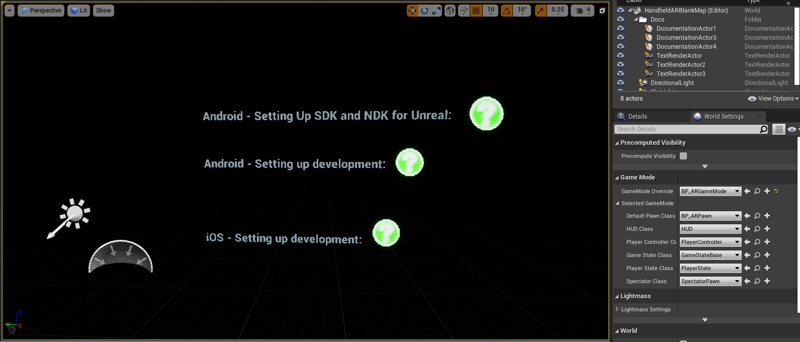
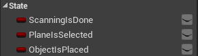
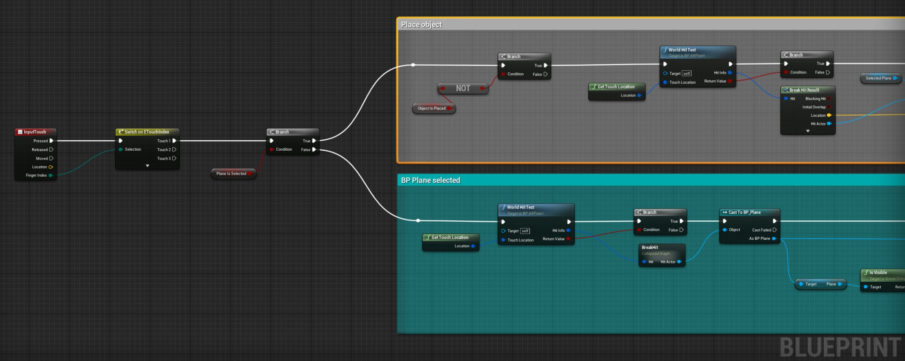
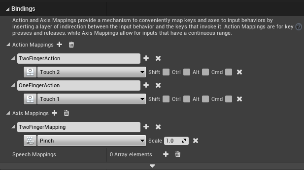
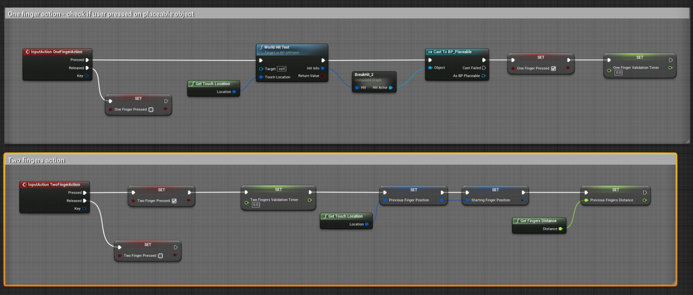
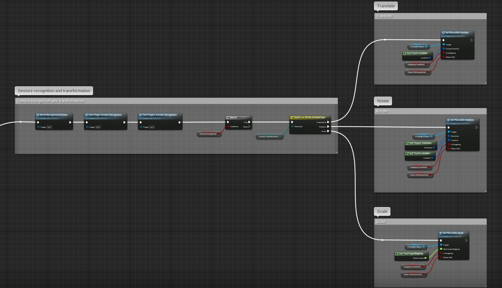
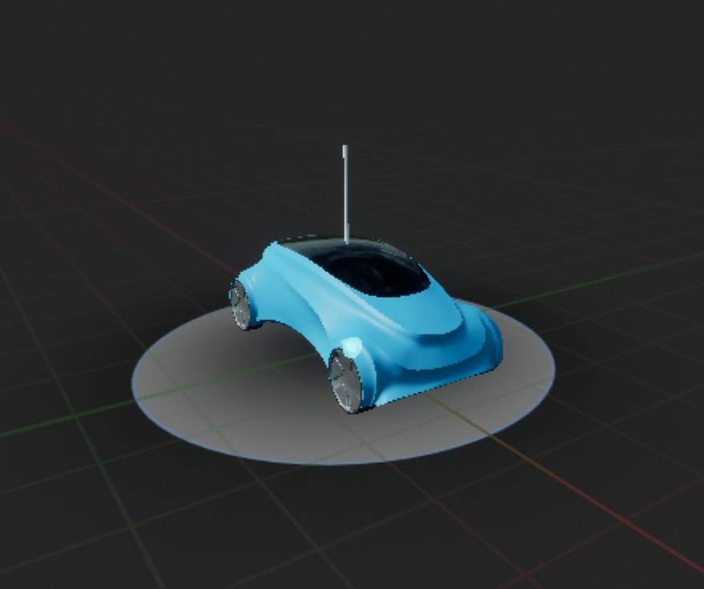
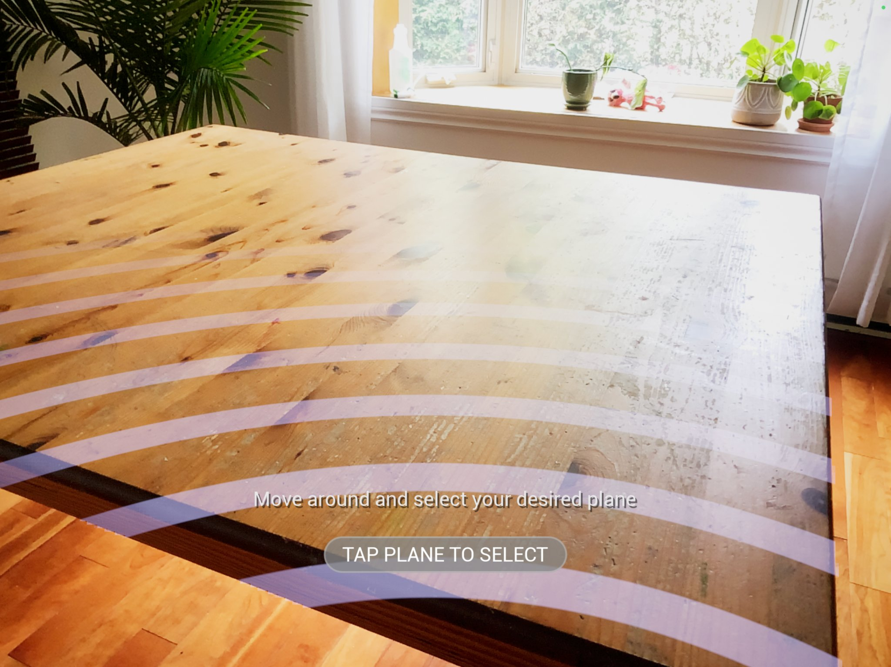

# 手持类AR模板技术参考

> 路径：虚幻引擎5.7文档 / 分享和发布项目 / XR开发 / 为手持式设备开发增强现实体验 / 手持类AR模板技术参考

> 原始页面：https://dev.epicgames.com/documentation/unreal-engine/handheld-ar-template-technical-reference

你可以将手持AR模板作为你的iOS和Android设备的AR项目起点。[手持AR模板快速入门](../handheld-ar-template-quickstart/index.md)将介绍设置模板并将其部署在移动设备上的步骤，而本指南将提供更多的技术指导来介绍模板的工作方式、实现关键功能的位置以及如何修改功能。

## 基础知识

手持AR模板分为两部分显示画面：

- 用户摄像机拍摄的实时画面。
- 由虚幻引擎生成的 *3D虚拟场景*。

用户在启动 **AR会话** 后，应用会自动拍摄画面，然后在摄像机画面上叠加虚拟场景。[Pawn](../../../../gameplay-systems/gameplay-framework/controllers/player-controllers/index.md)相当于用户的化身，它包含在虚拟场景中与对象进行交互的逻辑，这类交互对象包括初次扫描中定义的平面以及可放置对象。在用户看到的增强现实合成画面上，还会叠加一层HUD，用于显示各种配置选项和其他工具。

如需了解手持AR模板中用户体验旅程的详情，请参阅[手持AR模板快速入门](../handheld-ar-template-quickstart/index.md)。

## 应用程序中的流程

在编辑器和应用中打开手持AR模板后，会直接打开 **HandheldARBlankMap**。除了一些用于提示参考文档的辅助Actor，此地图没有其他Actor。它的主要功能是将游戏模式重载为 **BP_ARGameMode**，以便应用程序使用[游戏框架](../../../../gameplay-systems/gameplay-framework/index.md)类。该类将负责运行应用程序和设置虚拟场景。

在 BP_ARGameMode 中，**BP_ARPawn** 用于表示玩家，并通过将 **BP_MainMenu** 绑定到用户视口来初始化UI。BP_MainMenu 设置完毕后，它会提示用户开始扫描环境。然后会开启一个 **AR会话** 并显示用户的摄像机拍摄画面，指示BP_ARPawn根据环境中可用的平面来定义一系列平面。

BP_ARPawn使用简单的状态机来跟踪应用当前处于用户体验旅程的哪个步骤上。此状态机会跟踪以下元素：

- 用户是否扫描了环境并在虚拟场景中设置了平面？
- 用户是否选择了要交互的平面？
- 用户是否将对象放在了选定的平面上？

根据用户在用户体验旅程中的进度，Pawn会调整应用程序对用户输入的响应，并且会在HUD中显示提示来引导用户完成设置步骤。

## Actor

### AR Pawn

手持AR模板将使用名为 **BP_ARPawn** 的自定义 Pawn。此Pawn负责初始化、构建和更新虚拟场景并处理用户输入。

#### 初始化

AR Pawn会在BeginPlay中将BP_MainMenu添加到用户的视口中。BP_MainMenu负责设置AR场景，并根据应用当前状态显示提示。

#### 状态控制

AR Pawn实现了一个简单的状态机，来支持上文中提到的各个用户体验旅程步骤。状态是由 **状态（State）** 类别下的一系列布尔值控制的。

包括：

- **ScanningIsDone**：初始扫描流程完成，平面已放置到虚拟场景中。
- **PlaneIsSelected**：用户已经选择了一个平面。
- **ObjectIsPlaced**：用户已将虚拟对象放置到平面上，现在可以与其交互。

用户根据HUD中的提示操作时，这些布尔值会从false变为true，从而触发应用程序进入用户体验旅程的下一步。在处理触控输入以及处理用于更新场景的Tick事件时，Pawn会引用这些对象。

#### 摄像机深度场景纹理

AR Pawn还负责获取摄像机深度场景纹理，以便在虚拟场景中放置对象。在用户授予应用程序使用摄像机的权限后，且在应用程序完成AR扫描前，系统会获取此信息。深度纹理存储在 **CameraDepthTexture** 中，随后在Pawn更新平面的视觉效果时在 **Create Plane Candidate** 函数中使用。如果CameraDepthTexture不可用，它将使用 **CameraDepthFallback**。

#### 光源强度估算

在Tick函数中，AR Pawn会调用 **Feed Light Estimate** 函数。该函数能从AR会话获取当前的光源估算数据。如果数据有效，将会更新地图中的定向光源和天空光源，其颜色和强度设置将取决于摄像机的拍摄画面。这样，虚拟场景中的光照效果能大致匹配真实世界中的光照效果。

#### AR平面创建

在AR会话完成环境扫描后，AR Pawn就会开始更新虚拟场景中的 **PlaneCandidate** Actor。此过程将检查环境中是否存在符合有效 **AR平面几何体（AR Plane Geometry）** 的跟踪对象。通常情况下，设备的传感器可以检测5到20个对象。

此后，Pawn会调用 **Create Plane Candidate** 来生成 **BP_Plane** Actor，并将其放到虚拟场景中的合适位置。候选平面每秒更新一次。为了降低屏幕上的视觉复杂性，此过程设置为让AR Pawn在给定的时间仅跟踪一个候选平面，从而让AR会话跟踪距离最近的对象。用户在环境中移动时，将会看到不同的候选平面显示和消失。

用户选择候选平面时，BP_Plane会锁定到 **SelectedPlane** 所在的位置。

#### 手势处理和操控虚拟场景

AR Pawn是唯一使用输入信息的蓝图，因此负责所有手势识别。

**InputTouch** 事件会根据用户是否选择了平面来处理单次点击输入，从而选择平面或放置虚拟对象。由于双指手势和滑动在用户选择虚拟对象之前不适用，所以此触摸输入非常简单，不需要任何特殊的输入操作。

在用户放置平面和选择虚拟对象之后，**OneFingerAction** 和 **TwoFingerAction** 输入操作和名为 **TwoFingerMapping** 的输入轴将会处理输入。这些操作是在 **项目设置（Project Settings） > 输入（Input）** 下的输入绑定中定义的。

OneFingerAction和TwoFingerAction输入操作是使用AR Pawn事件图表中的事件呈现的。在与平面和对象交互时，这些事件不会触发任何函数，而是会记录数据，AR Pawn可以使用这些数据来挑选哪些类型的手势在常规输入处理期间是合适的。

Tick函数将调用 **Reset Recognized Gesture** 来清除此前的手势信息，然后调用 **One Finger Gesture Recognition** 和 **Two Finger Gesture Recognition** 函数来处理输入操作事件收集的数据。这包括触摸输入的位置、方向和移动距离的变化。

这些函数会为相应的手势设置枚举，名为 **当前变换（Current Transformation）**。当前变换上的开关随后选择是否对选中的可放置对象应用平移、旋转或缩放函数。对象自行处理这些变换函数。

### 可放置对象

**BP_Placeable** 蓝图是手持AR模板中所有可放置对象（包括平面）的基类。它将封装与可放置虚拟对象相关的所有内容：视觉效果、变换逻辑以及与控件组件之间的HUD交互逻辑。在BeginPlay上，可放置对象将根据你使用 **Assign Product Asset** 函数创建的产品类型来选择资产。所选的模型取决于你在设置模板时选择的类别。

| 应用程序类别 | 模型 |
| --- | --- |
| 游戏 | 游戏可放置对象 |
| 汽车、产品设计和制造业 | 汽车可放置对象 |
| 建筑、工程和施工 | 建筑可放置对象 |

#### 控制视觉效果

可放置对象使用 **Set Visuals** 函数来控制模型材质和随着材质出现的UI控件的显示。此函数是从 **设置可放置位置（Set Placeable Position）**、**设置可放置旋转（Set Placeable Rotation）** 和 **设置可放置缩放（Set Placeable Scale）** 调用的。

如果交互处于激活状态，更新函数事件将调用 **Update Interaction**。此函数将根据用户移动、旋转和缩放对象的方式，使用新信息更新可放置对象的UI控件。系统提供了多种工具函数来获取适用于每种变换的文本。

#### 将对象放置在AR平面上

AR Pawn将根据输入触摸事件来生成BP_Placeable Actor，并将其分配到 **可放置对象（Placeable Object）** 变量。

### AR平面

手持AR模板使用BP_Plane Actor来呈现虚拟平面。这些虚拟平面是AR Pawn使用 **Update Plane Candidate** 和 **Create Plane Candidate** 函数创建的。Create Plane Candidate随后又调用 **Initialize Plane**，此函数将处理 BP_Plane的材质和颜色设置。

连接到BP_Plane的静态网格体是由两个三角形构成的简单平面，并且开启了复杂碰撞，将 **碰撞预设（Collision Presets）** 设置为了 **BlockAllDynamic**。这让系统能够检测出具有任何追踪类型的平面表面。

BP_Plane actor的默认状态是其未选择的状态。在此状态中，它会将 **DM_Scan** 用作材质实例，显示波纹来指明设备当前正在扫描环境。

根据用户使用的是Android还是iOS设备，**Get Platform Scan Material** 函数会将DM_Scan设置为 **ScanMaterial01** 或 **ScanMaterial02**。

Initialize Plane函数将会尝试使用AR Pawn获取的摄像机场景深度来设置DM_Scan，以便在视觉上将其切割，使其更好地适应环境。它还会使用AR Pawn中的 **Get Plane Color** 来设置颜色。此函数将获取AR几何体索引并使用该索引选择颜色。如果AR工具包在环境中找到新的几何体，颜色可能会改变。

用户选择了一个要放置对象的平面时，AR Pawn将会调用 **已选择BPPlane（BPPlane Is Selected）** 事件分发器。主菜单将使用此事件切换到放置对象状态。用户将对象放置在平面上时，平面将会隐藏，从而创建更具沉浸感的显示。理想情况下，平面将会尽最大可能匹配用户环境中扫描到的对象，即使不显示平面，也可以让交互的感受更加直观。

用户在可放置对象上使用平移函数时，AR Pawn将会调用 **Switch to Material Translate** 函数，将平面的材质实例更改为 **DM_Plain**，此实例相较于DM_Scan将会显示干扰性更低的轮廓。这让用户能够更轻松地看到对象的移动边界。

## HUD和UI控件

本小节针将提供手持AR模板中HUD构成元素的参考。下面的信息解释了UI类的划分方式以及这些类如何提供关键功能，例如样式设置和模式更改。

### UI样式和BP_StylizedUI

手持AR模板中的所有菜单都使用BP_StylisedUI作为父类。此类将封装在明亮、黑暗和游戏主题之间切换UI样式时需要使用的所有函数以及相关数据。这些主题包含在 **DT_Styles** 数据表中，其中包含常用UI颜色、字体和图标的信息。

> 图片已省略：DT_Styles数据表

**Get Style Data** 函数将获取与当前选择的样式有关的信息，并输出此信息以便在其他函数中使用。

> 图片已省略：Get Style Data函数的示例

**BP_MainMenu** 使用 **Call Switch Style** 函数在其每个子菜单中触发样式切换。

> 图片已省略：从主菜单中调用的Call Switch Style函数

这些绑定事件用于将UI更改为 **切换样式（Switch Style）** 事件分发器，而事件分发器是在BP_StylizedUI中定义的。

> 图片已省略：切换样式事件分发器

其他控件（例如 **UI_CapsuleButton**）将定义自己的 **Change Style** 函数，这些控件是通过父菜单手动调用的。

> 图片已省略：手动Change Style函数的示例

此设计不但提供由数据驱动的方法来定义UI样式，还确保提供最低限度的必要复制功能来支持UI样式和布局的大规模更改。

### 主菜单

BP_MainMenu是所有其他菜单的容器和管理器。在AR Pawn将它添加到视口之后，它就会初始化所有其他菜单，绑定它们的事件分发器，此外还会绑定与用户体验旅程中特定步骤对应的事件分发器。它还负责启动AR会话。由于它本身没有可以设计样式的任何视觉效果元素，因此可以扩展基本用户控件类，而不是BP_StylizedUI。

#### 初始化和事件绑定

在 **初始化时（On Initialized）** 事件期间，主菜单将会初始化UI，将默认UI样式设置为 **明亮（Light）**，然后绑定所有UI主函数的事件分发器。这包括此模板的用户体验旅程中可以显示初始教程弹窗的步骤，以及用于获取截屏或在其他子菜单之间进行过渡和确认设置更改的流程。

> 图片已省略：主菜单中的On Initialized事件

这是可以高度扩展的事件图表，但可以考虑将其用作子菜单中的视觉元素和应用程序主功能之间的连接器。

#### 启动AR会话

当用户按下 **BP_StartMenu** 以开始扫描时，将会启动AR会话。

> 图片已省略：启动AR会话

### 处理状态更改

主菜单的更新函数随后将会侦听AR会话以进入 **正在运行（Running）** 状态。进入此状态之后，它会指示BP_StartMenu进入扫描状态，该状态会触发针对UI的多项外观更改，以帮助突出显示状态变化。

> 图片已省略：通过更新函数进行跟踪的状态变化

同样地，更新函数还会侦听用户在何时开始放置对象。这些更改与可以AR Pawn中找到的状态机相对应。

### 子菜单

主菜单中嵌入了多个子菜单。这些菜单主要处理外观元素和布局，听从事件分发器处理功能，但不包括内部样式设置目的。所有子菜单都根据BP_StylizedUI来提供常见函数，以支持样式更改。

#### 开始菜单

> 图片已省略：UMG中显示的开始菜单

BP_StartMenu是在用户启动应用程序时最初显示的菜单，将处理用于引导用户完成用户体验旅程的覆层和提示信息，进而在用户切换到下一个步时提供反馈。 开始菜单覆盖在整个屏幕上，针对每个离散的用户体验旅程状态纳入了单独的覆层。例如，当用户正在扫描环境来构建平面时，开始菜单将会显示 **UI_Scanning**，而当用户已经选择平面并准备好在平面中放置对象之后，开始菜单就会显示 **UI_PlaceObject**。

#### 底部菜单

> 图片已省略：UMG中显示的底部菜单

用户逐步完成用户体验旅程并放置对象时，**BP_BottomMenu** 将会显示在屏幕底部，其中提供了对Options Menu、Info Menu、Snapshot、Reset函数的访问权限。

底部菜单具有明亮和黑暗主题所使用的的横向布局的单独覆层，以及游戏主题中使用的圆形布局。为避免发生重复，这些布局的按钮版本都会绑定相同的自定义事件。

> 图片已省略：绑定同一按钮的两个不同版本的事件

#### 选项菜单

**BP_OptionMenu** 是在用户点击底部菜单中的选项按钮时显示的菜单。此菜单提供一系列配置选项，包括用于切换UI样式的功能。此菜单中的UI按钮绑定到主菜单中的功能，为AR Pawn提供更好的可见性以及需要在UI的其他部分中触发的其他函数。

#### 信息菜单

**BP_InfoMenu** 在用户点击底部菜单中的信息按钮时显示。这将显示用于处理可放置对象的手势。

### 按钮

**UI_CapsuleButton** 和 **UI_ToggleButton** 可供所有菜单使用。它们进行了定制，能够支持各种类型的常见函数，包括样式更改和特定按钮行为，例如切换。
