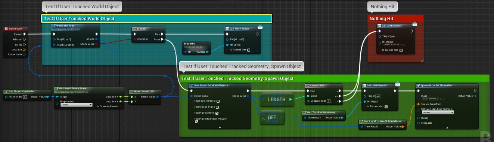
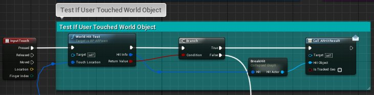
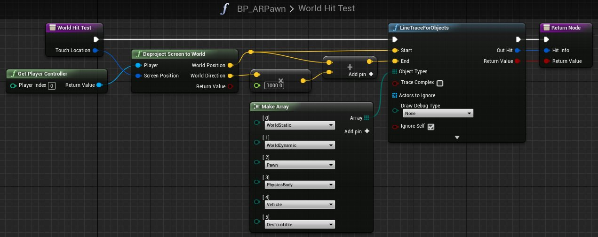
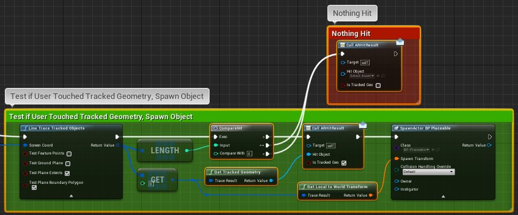

# 如何在AR中进行命中检测

> 路径：虚幻引擎5.7文档 / 分享和发布项目 / XR开发 / 为手持式设备开发增强现实体验 / 如何在AR中进行命中检测

> 原始页面：https://dev.epicgames.com/documentation/unreal-engine/how-to-perform-ar-hit-testing-in-unreal-engine

> [!NOTE]
> 对于本指南，我们使用 **手持式AR** 模板。

在下方的方法中，我们将查看由 **手持式AR** 模板创建的示例项目如何演示标准命中测试和跟踪对象命中测试。命中测试（轨迹追踪）对虚幻引擎或蓝图来说并不新鲜。然而，重要的是要认识到，虚幻世界中的命中测试和增强现实中的命中测试需要采用不同的方法。示例项目包含手持式设备上的虚幻世界和增强现实中的标准命中测试模式。

> [!TIP]
> 其他类型的AR设备（例如AR头显）所用方法将与下文中的方法不同。

## 步骤

### 新建手持式AR项目

1. 打开项目浏览器（Project Browser）并新建

   手持式AR

   蓝图项目，或打开现有增强现实项目。

   如需帮助新建增强现实项目，参见

   手持类AR项目模板快速入门

   文档。
2. 打开

   BP_ARPawn

   蓝图类。
3. 选择

   事件图表（Event Graph）

   选项卡。

### 对被追踪的几何体与世界对象进行命中检测

示例项目演示 **对象轨迹追踪** 和 **轨迹追踪的对象** 在正常工作流程中的用法。**对象轨迹追踪** 将用于检查对虚幻世界对象的命中，而 **轨迹追踪的对象** 将用于检查对被追踪对象的命中（增强现实被追踪的几何体）。轨迹追踪是虚幻引擎的旧有功能，而新功能 **轨迹追踪的对象** 可以检测世界中的其他被追踪的几何体。

> [!TIP]
> 如下例所示，我们先查看世界对象。之所以这样做，是因为生成的世界对象通常呈现得更接近轨迹追踪的原点，因此用户将在看到被追踪的几何体之前看到它们。如果我们先测试被追踪的几何体，那么我们会错过我们每次尝试触碰的东西。

点击查看大图。

- **测试用户是否碰触了世界对象** 这是 **对象轨迹追踪** 功能的标准用法（在 **世界命中测试** 中），检查潜在的虚幻世界对象数组，并返回"真"或"假"。在这种情况下，如果返回值为"真"，将调用 **AR命中结果**，更新其中一个 **调试菜单** 项目。如果返回值为"假"，则执行路径将移动至新的增强现实功能 **轨迹追踪的对象**。

  

  点击查看大图。

  

  点击查看大图。
- **测试用户是否碰触了被追踪的几何体、生成的对象** **轨迹追踪的对象** 是一个新的增强现实功能，用于对被追踪对象（增强现实追踪系统发现的几何体）进行轨迹追踪测试。**轨迹追踪的对象** 返回按与摄像机的距离排序的结果列表。在这种情况下，如果返回值 *大于0*（我们命中一个被追踪的对象），则将调用 **AR命中结果**，更新其中一个 **调试菜单** 项目，并调用 **生成可放置 Actor BP**，在命中的"被追踪"位置创建Pawn。如果返回值不包含命中结果（未命中被追踪的对象），将调用 **AR命中结果**，更新其中一个 **调试菜单** 项目。

  

  点击查看大图。

> [!TIP]
> 尽管这个项目的很多操作最终都会更新应用程序的 **调试菜单**，但这种情况只特定于这个项目。当然，您可通过任何需要的方式来使用轨迹追踪中的命中数据。这里的不同之处在于，**轨迹追踪的对象** 能够检测增强现实被追踪的几何体，并对其做出反应。

### 探索其他AR功能

探索基于 **手持式AR** 蓝图模板的项目，可让您有机会检查各种增强现实功能在上下文中的实际用法。还有几十个新的增强现实功能，因此请花些时间深入研究一下这个项目，探索实施细节。

> [!TIP]
> 要探索此项目和新的增强现实功能，可以通过以下方式开始：打开 **内容浏览器（Content Browser）**，导航至 **内容\手持式ARBP\蓝图\UI**，然后在 **蓝图编辑器（Blueprint Editor）** 中打开 **BP_DebugMenu** 资产。
