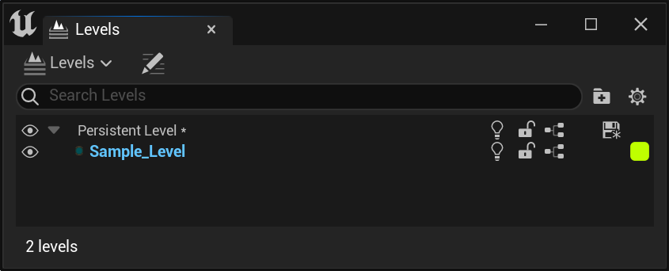
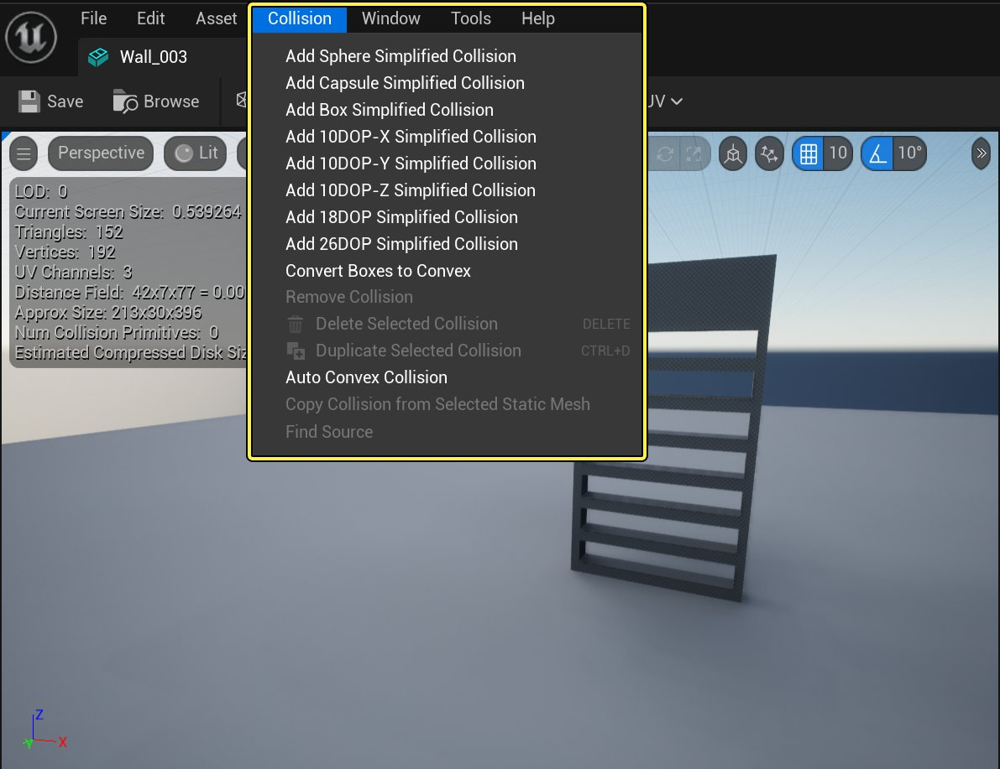
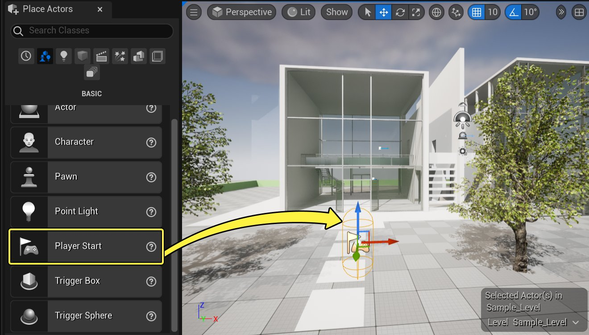
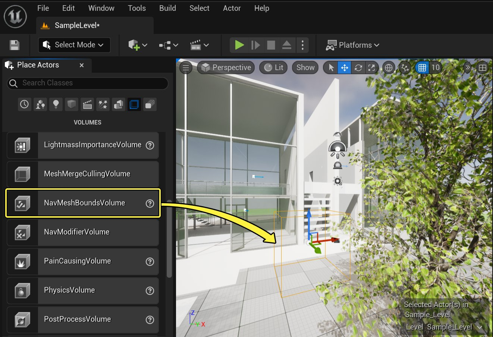
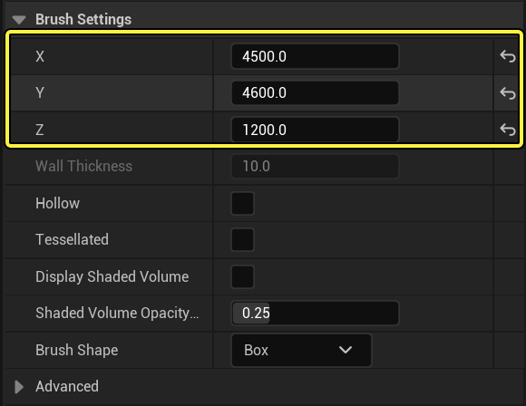
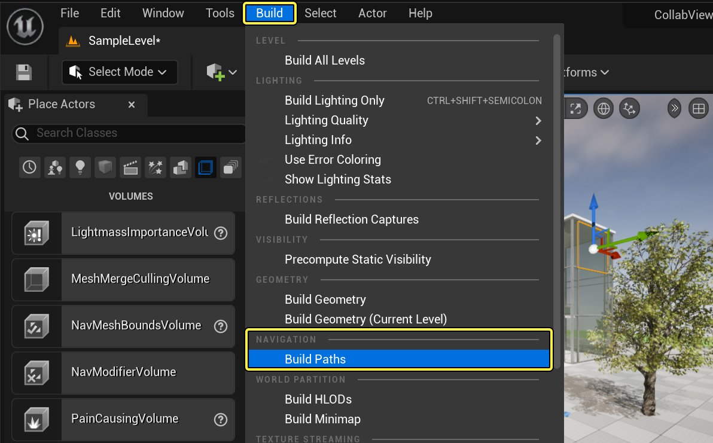
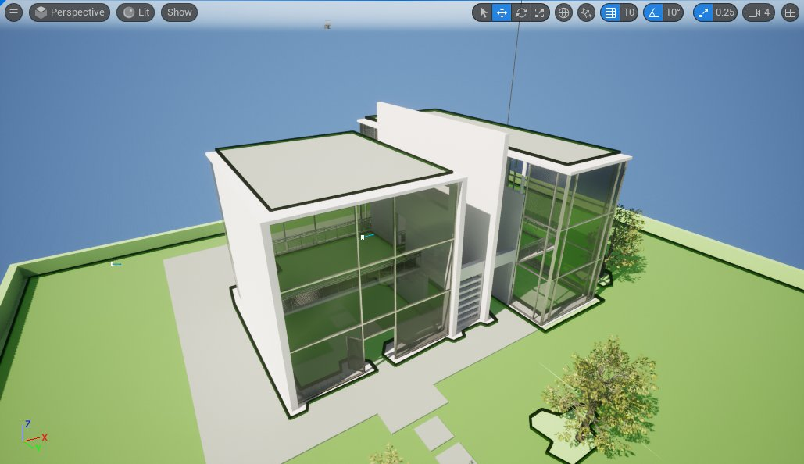
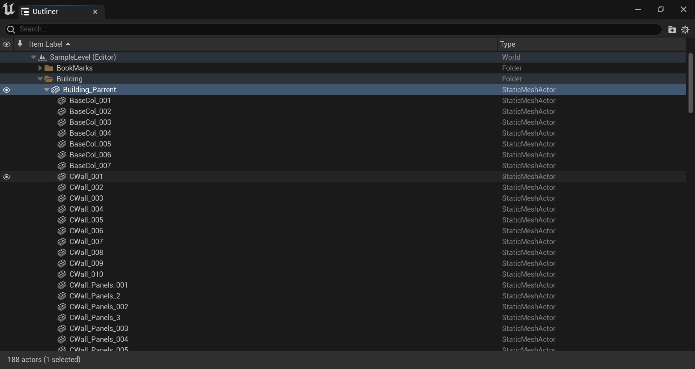

# 向协作查看器（Collab Viewer）添加自己的内容

> 路径：虚幻引擎5.7文档 / 分享和发布项目 / XR开发 / XR开发入门 / 协作查看器（Collab Viewer）模板 / 向协作查看器（Collab Viewer）添加自己的内容

> 原始页面：https://dev.epicgames.com/documentation/unreal-engine/adding-your-own-content-to-the-collab-viewer-in-unreal-engine

协作查看器（Collab Viewer）模板随附一些预设内容，便于用户立即使用此内容开始操作，请参阅[快速入门](../collab-viewer-template-quick-start/index.md)了解分步说明。熟悉协作查看流程后，你就会想希望试一试自己的内容。

本页介绍如何执行一些最常见的相关任务：

- 在模板中加入自己的3D模型，进行设置使其与内置导航模式兼容。参阅

  使用自己的3D模型

  。
- 利用协作查看器（Collab Viewer）模板中的内置交互工具来控制内容的行为。参阅

  控制变换和X射线行为

  。
- 修改协作查看器（Collab Viewer）模板，不再从包含默认预设内容的关卡开始，而是从其他关卡开始。参阅

  更改初始关卡

  。
- 在运行时加载你的Datasmith内容。请参见

  在运行时加载Datasmith文件

  .

## 使用自己的3D模型

协作查看器（Collab Viewer）模板随附一些预设内容，因此可立即使用此内容开始操作，但你可能需要替换成自己的模型，以便在相同的协作查看体验中使用自己的模型。

在此过程中需要牢记，玩家仅能传送到拥有碰撞网格体和导航网格体的表面并在上方行走。如果希望玩家能探索各个地板或表面，那么它们均须拥有相关的碰撞体积和导航网格体。

### 步骤

要在协作查看器（Collab Viewer）模板的默认关卡中使用自己的内容，需要执行以下概念步骤：

1. 从此关卡移除3D模型、光源等现有内容，然后添加自己的内容。 建筑、齿轮组件、树木等示例资源安放在一个名为 **SampleLevel** 的子关卡中。

   

   若要从零开始创建关卡，只需删除现有的这个子关卡，并将自己的内容放入主固定关卡（或新建的子关卡）即可。若要保留示例场景中的一些场景元素，如天空球体和光源，可以将此类项目移至主固定关卡。也可以选择并删除不再需要的项目，例如 **大纲视图（Outliner）** 中的 **Building**、**Gears** 和 **Trees** 文件夹。
2. 在打包应用程序中放置并布置自己的内容，让其他人完全按照你所预想的方式来观看内容。
3. 如果希望玩家可以传送到各个表面或在上方行走，则须对其设置碰撞网格体。 你也许可以在创建几何体模型的3D设计应用程序中实现这一点。具体取决于内容导入的方式。另外，还可以在静态网格体编辑器中打开静态网格体并使用 **碰撞（Collision）** 菜单中的工具来执行此操作。

   

   点击查看大图。

   若要自动进行碰撞设置，可参阅[设置与静态网格体的碰撞](../../../../../working-with-content/static-meshes/setting-up-collisions-with-static-meshes/index.md)或[在蓝图和Python中设置与静态网格体的碰撞](../../../../../production-pipeline/scripting-and-automating-the-unreal-editor/unreal-editor-scripting-tutorials/setting-up-collisions-with-static-meshes-in-blu-428d6644/index.md)。

   > [!TIP]
   > 也可以使用 **阻挡体积** 在关卡中添加不可见的盒形碰撞体积。这种方法可以在关卡中轻松实现碰撞，无需修改静态网格体。但由于此类体积没有附加到静态网格体，若要在关卡中移动几何体，则可能需要手动移动。
4. 确保关卡中至少有一个 **玩家出生点（Player Start）** Actor。若需更多，可从 **放置Actor（Place Actors）** 面板的 **基础（Basic）** 选项卡中将更多 **玩家出生点（Player Start）** Actor拖入视口。

   

   点击查看大图。

   新玩家加入会话时，其将从随机选择的 **玩家出生点（Player Start）** Actor所在的位置开始。关卡中至少应存在一个 **玩家出生点** Actor，其位置应是合理的新玩家初始位置。最好将Actor放在可行走表面上，这样玩家切换到行走模式时便不会落到地面以下。

   > [!TIP]
   > 最好在同一位置周围添加几个这种Actor，降低新玩家加入会话时与其他玩家的出生位置发生重叠的可能性。
5. 如果希望玩家能传送到各个表面，则需要将其纳入一个导航网格体包围体，使其拥有导航网格体。默认固定关卡已有一个导航网格体（可调整大小使其覆盖3D模型），也可以自行创建。可酌情为关卡创建所需数量的体积。

   要创建导航网格体，请执行以下步骤：

   1. 若关卡尚无导航网格体边界体积，可从 **放置Actor（Place Actors）** 面板的 **体积（Volumes）** 选项卡将一个此类体积拖入视口。

      

      点击查看大图。
   2. 在视口或

      世界大纲视图

      中选择导航网格体边界体积，并在视口中将变换小工具移至要覆盖区域的近似中心。
   3. 在 **细节（Details）** 面板中，利用 **笔刷设置（Brush Settings）** 更改体积大小和形状。

      

      点击查看大图。
   4. 点击工具栏中的 **构建（Build）** 图标可重新构建关卡的预计算数据，也可以选择 **构建（Build）> 导航（Navigation）> 构建路径（Build Paths）**，仅重新构建导航数据。

      

      点击查看大图。
   5. 按 **P** 查看生成的导航网格体，确保已覆盖所需区域。它被渲染为绿色表面，略高于与此体积相交的碰撞网格体。

      

      点击查看大图。
6. 必要时可以构建光照。
7. 依照

   快速入门

   页面的说明重新打包和发布项目。

### 最终结果

执行上述所有步骤之后，即可让多个用户接入同一设计查看会话，且大家都能看到你在关卡中添加的自定义内容。

## 控制变换和X射线行为

对内容进行各种设置即可影响运行时变换和X射线交互的行为。

- 每个Actor的 **移动性（Mobility）** 设置将决定在运行时是否可以使用变换交互来移动对象。若要能在运行时移动对象，请将 **移动性（Mobility）** 设为 **可移动（Movable）**。若需要高亮显示并选择对象，但不能在空间中移动此对象，请将 **移动性（Mobility）** 设为 **静态（Static）**。
- **世界大纲视图** 中的父和子Actor的层级能同时影响变换和X射线交互。

  - 在运行时利用变换交互移动对象时，此对象的所有子项会自动随父项移动，同时保持当前与父项的偏移量。

    举例而言，在本例中，变速器的各个部分均是 **Transmission_Main_Part** （中心黑条）的子项。

    

    点击查看大图。

    因此在运行时移动黑条也会移动其子Actor。但仍可单独移动每个子Actor。下次移动父项时，子项将维持其新的偏移量。

    将子Actor重设到原始位置将重置到与父Actor的原始偏移量，不会重置场景空间中的原始位置和旋转角度。将父Actor重置到原始位置会移动所有子项，保持与父项的当前偏移量。
  - 使用X射线隔离交互模式并在场景中选择了一个对象时，与所选对象处于同一层级的所有其他对象都将自动隐藏。

    举例而言，在默认场景内容下，构成变速器总成的所有对象均在层级中的一个顶层父项之下。因此，使用X射线隔离选择变速器的任意部分时，变速器的所有其他部分（即同一个顶层 **齿轮（Gears）** 项之下的所有子actor）将隐藏。构成建筑的所有Actor均位于层级中一个顶层 **Building** 项之下，因而它们不受影响。

    > 图片已省略：A building Actor isolated

    点击查看大图。

    因为树木和外部地形不在 **Building_Parent** 层级之下，所以不受影响。
- 对于希望能使用X射线或变换命令进行交互的Actor，必须关闭 **模拟物理（Simulate Physics）** 设置。可在 **物理（Physics）** 部分下的 **细节（Details）** 面板中找到此设置。

  > 图片已省略：Disable Simulate Physics

  点击查看大图。

## 更改初始关卡

协作查看器（Collab Viewer）模板的主菜单被设为用户完成主菜单时加载 **CollaborativeViewer_P** 关卡。但你可能想要创建一个新的关卡来保存内容，并让主菜单初始启动你自己的关卡。若要如此，则需更改主菜单中的逻辑，以便其在用户加入会话时打开你的关卡。

### 步骤

要设置协作查看器（Collab Viewer）的初始关卡，请执行以下步骤：

1. 在 **内容浏览器** 中，在 *CollaborativeViewer/UMG/MainMenu* 文件夹中找到 **Widget_MainMenu** 资源。

   > 图片已省略：Main Menu widget

   点击查看大图。
2. 双击此资源将其打开，然后点击 **图表（Graph）** 以打开控件蓝图视图。

   > 图片已省略：Graph

   点击查看大图。
3. 找到标记 **提交用户选择（Commit user selections）** 的组。在此组中，找到名为 **开始创建会话（Begin hosting a session）** 的子组。

   > 图片已省略：Begin hosting a session

   点击查看大图。
4. 将 **OpenLevel** 节点上的 **关卡名称（Level Name）** 输入改为需要观看者在连接到会话时启动的关卡的名称。

   > 图片已省略：OpenLevel node

   点击查看大图。
5. **编译** 并 **保存** 控件，然后重新打包项目。

### 最终结果

下次启动项目并设置完主菜单时，则会初始出现在上述步骤设置的自定义关卡中。

## 在运行时加载Datasmith文件

> [!WARNING]
> 该功能还处于实验阶段。目前，它只适用于单人游戏应用，在多人游戏中会被禁用。

你现在可以在运行时加载Datasmith文件。目前仅限于 `.udatasmith` 文件格式。

> 图片已省略：undefined

从主菜单加载的Datasmith运行时。

> 图片已省略：undefined

弹出窗口，用于选择要在Collab Viewer中导入的文件。

- 点击

  +（添加）

  按钮来添加一个新的目标槽，来导入新文件。
- 要删除已导入的Actor，你应该先选择相应的目标路径，然后点击

  垃圾箱（bin）

  图标。
- 源（Source）

  按钮会弹出一个资源管理器窗口，提示选择要导入的文件格式。
- 位置（location）行允许用户改变导入层级的根位置。
