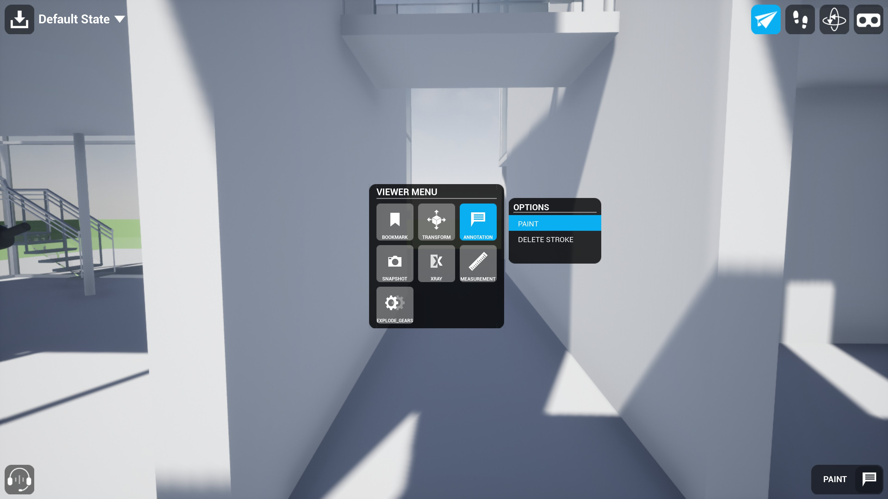
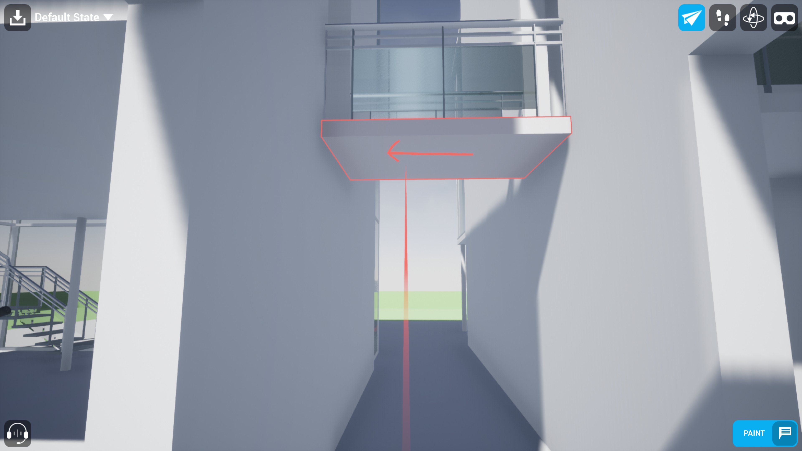
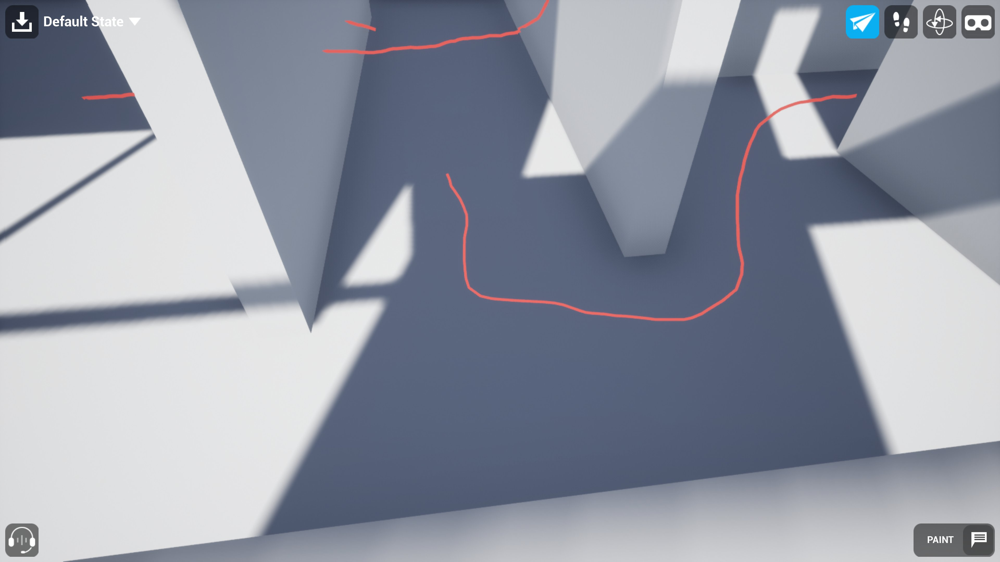
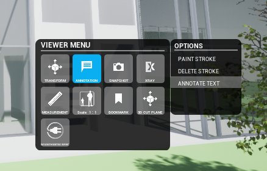
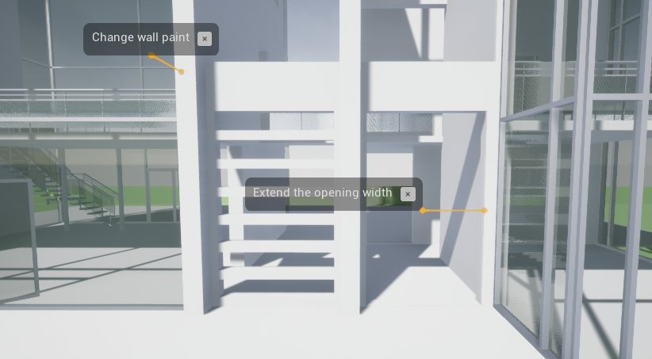
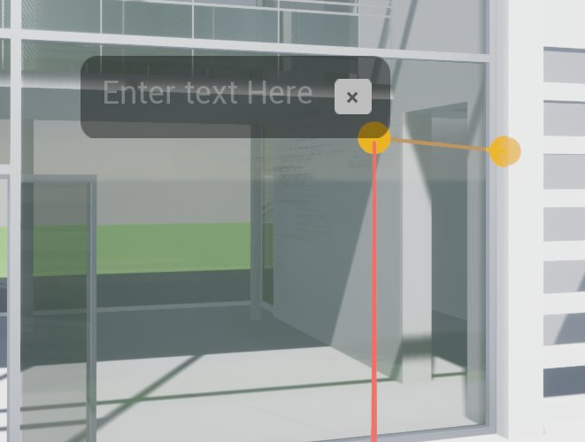
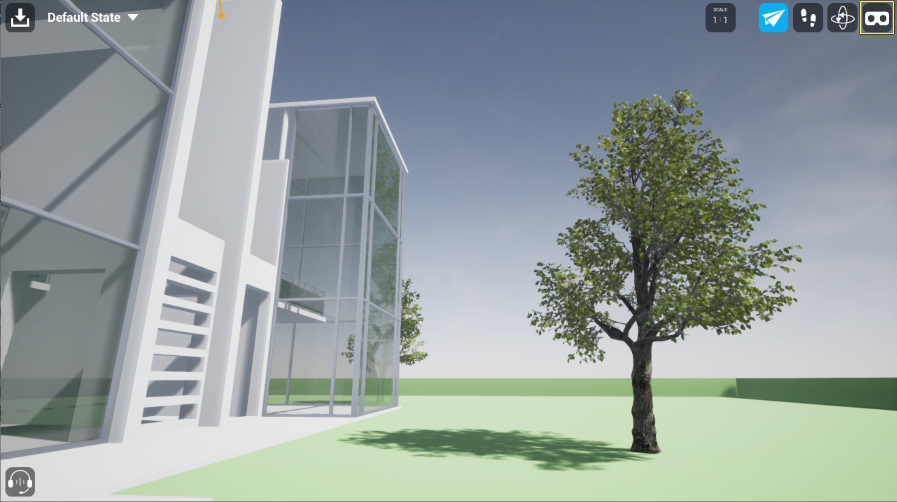
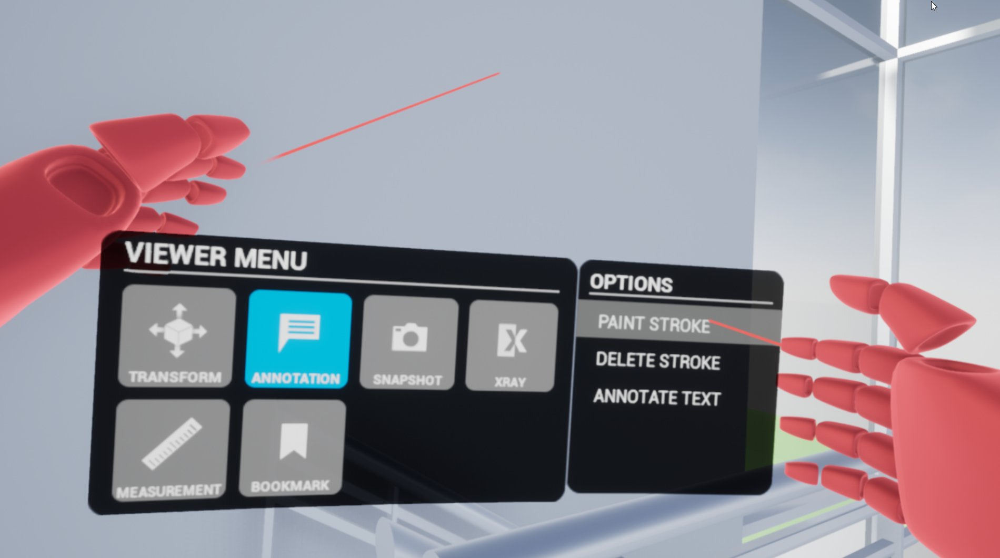

# 在协作查看器（Collab Viewer）中进行注释

> 路径：虚幻引擎5.7文档 / 分享和发布项目 / XR开发 / XR开发入门 / 协作查看器（Collab Viewer）模板 / 在协作查看器（Collab Viewer）中进行注释

> 原始页面：https://dev.epicgames.com/documentation/unreal-engine/annotating-in-the-collab-viewer-in-unreal-engine

当你与其他参与者在协作类视图中操作时，注释便于你快速做记录。 你可以在任意水平或垂直平面上编写或绘制注释。

## 在桌面模式下添加注释

### 绘制笔划

要用激光笔绘制笔划，请执行以下步骤：

1. 启动或加入团队协作视图，并移至要注释区域旁边的位置。
2. 按 **空格键** 打开交互菜单，高亮显示 **注释（Annotation）**，然后选择 **绘制笔划（Paint Stroke）**。

   

   点击查看大图。
3. 正对要绘制的区域，使用鼠标左键来绘画。开始绘画时，你绘画的表面的边缘会高光下显示。

   

   点击查看大图。
4. 每次单击并释放按钮时，都会创建一个新的笔画。

   

   点击查看大图。

### 文字注释

要添加文字注释，请执行以下步骤：

1. 启动或加入团队协作视图，并移至要注释区域旁边的位置。
2. 按 **空格键** 打开交互菜单，高亮显示 **注释（Annotation）**，然后选择 **文字注释（Annotate Text）**。

   
3. 正对要添加文字的区域，点击鼠标左键。一个空白的2D标签将会连接到光标所在的几何体。每点击一次便会创建一个新的标签。

   
4. 可以选择单个标签来用键盘输入文本。
5. 可以选择标签上或者连接到几何体上的黄色圆圈来移动标签。

   

## 在VR模式下进行注释

### 绘制笔划

要用控制器绘制笔划，请执行以下步骤：

1. 启动或加入团队协作视图，并移至要注释区域旁边的位置。
2. 从工具栏中选择 **VR模式（VR mode）** 或者按下键盘上的 **P** 键来激活VR模式。

   
3. 用VR控制器打开交互菜单：:

   - Oculus Touch:

     按下右控制器的A按钮或者左控制器的X按钮来打开菜单。
   - Valve Index 控制器:

     按下任意控制器的A按钮来打开菜单。
   - HTC Vive 控制器:

     按下任意控制器的菜单按钮来打开菜单。
4. 在交互菜单中，用光标高亮显示 **注释（Annotation）> 绘制笔划（Paint Stroke）**，然后用扳机确认选择。

   
5. 按右控制器上的扳机进行绘制，然后释放触发器以终止笔划。

   > 图片已省略：VR模式中绘画

### 文字注释

要用控制器添加文字注释，请执行以下步骤：

1. 启动或加入团队协作视图，并移至要注释区域旁边的位置。
2. 从工具栏中选择 **VR模式（VR mode）** 或者按下键盘上的 **P** 键来激活VR模式。
3. 用VR控制器打开交互菜单：:

   - Oculus Touch:

     按下右控制器的A按钮或者左控制器的X按钮来打开菜单。
   - Valve Index 控制器:

     按下任意控制器的A按钮来打开菜单。
   - HTC Vive 控制器:

     按下任意控制器的菜单按钮来打开菜单。T
4. 在交互菜单中，用光标高亮显示 **注释（Annotation）> 文字注释（Annotate Text）**，然后用扳机确认选择。

   > 图片已省略：VR模式交互菜单文字注释
5. 按下控制器上的扳机来在光标指示的位置放置标签。每按下一次扳机就会创建一个新的标签。

   > 图片已省略：VR模式放置文字标签
6. 可以选择单个标签来用虚拟键盘输入文本。

   > 图片已省略：用VR键盘添加文字注释
7. 可以选择标签上或者连接到几何体上的黄色圆圈来移动标签。

## 删除注释

### 绘制笔划

要删除绘制的笔划，请执行以下步骤：

1. 打开交互菜单。
2. 高光显示 **注释（Annotation）**，然后选择 **删除笔划（Delete Stroke）**。
3. 将激光指向笔划，然后选中它进行删除。

   > 图片已省略：undefined

   点击查看大图。

### 文字注释

要删除文字注释，请执行以下步骤：

点击想要删除标签上的X按钮。光标移至该按钮上时按钮会变红，用来指示哪个标签将被删除。

> 图片已省略：删除文字注释
