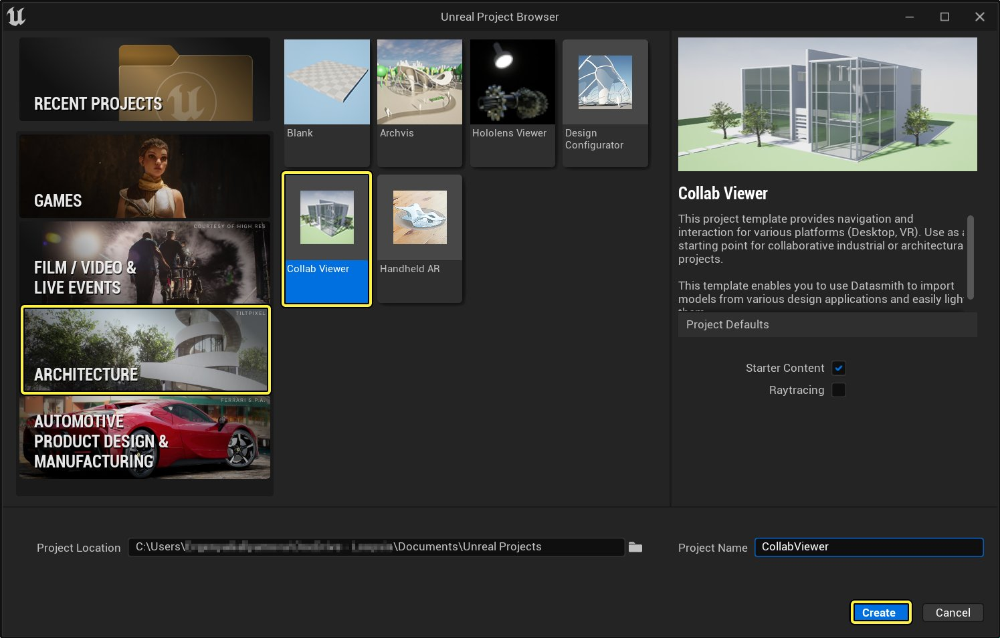
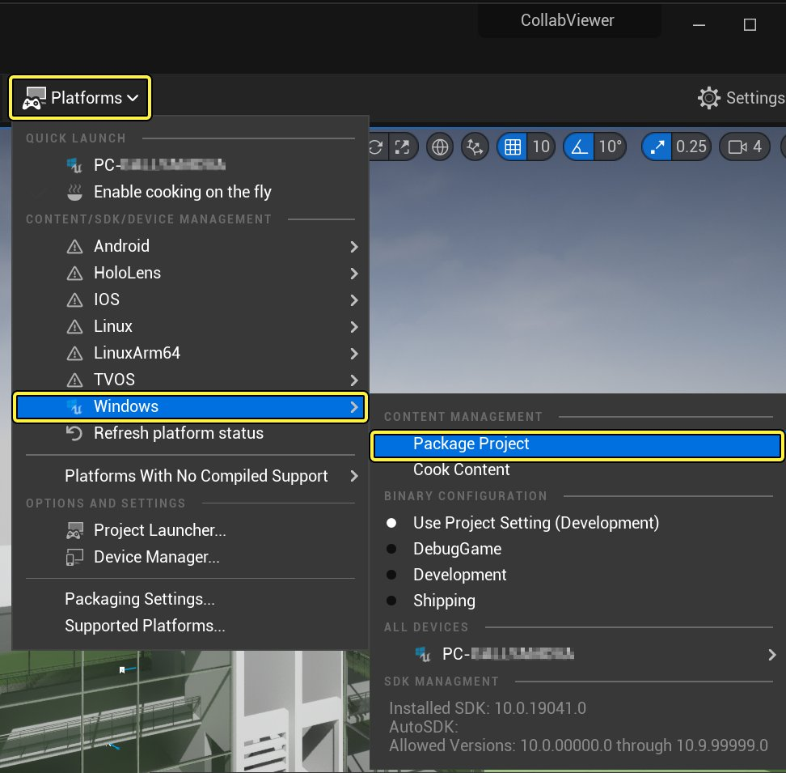
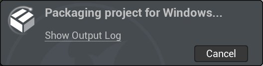
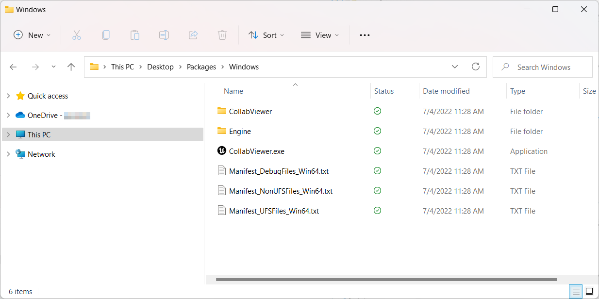
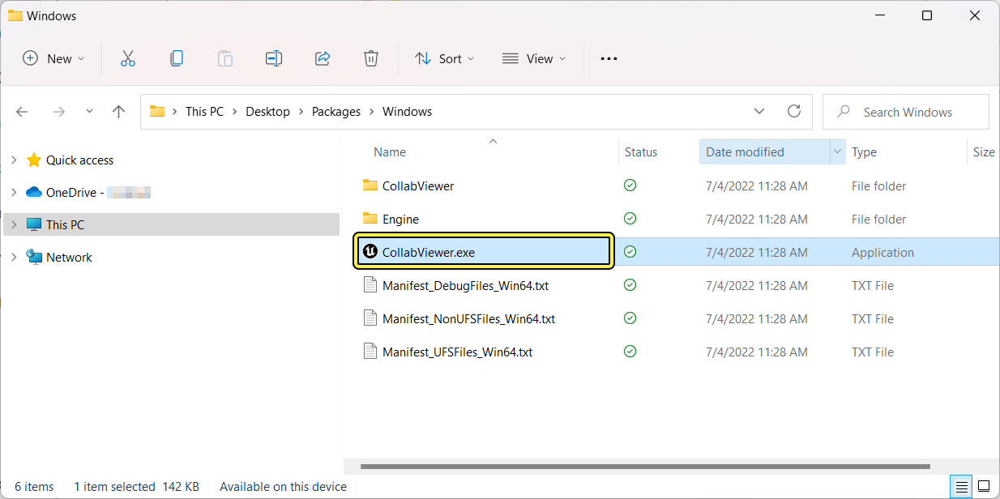
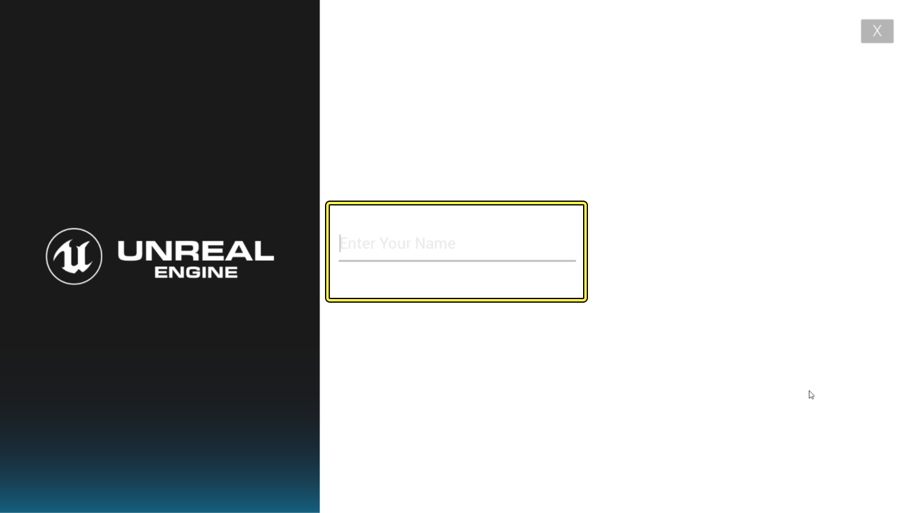
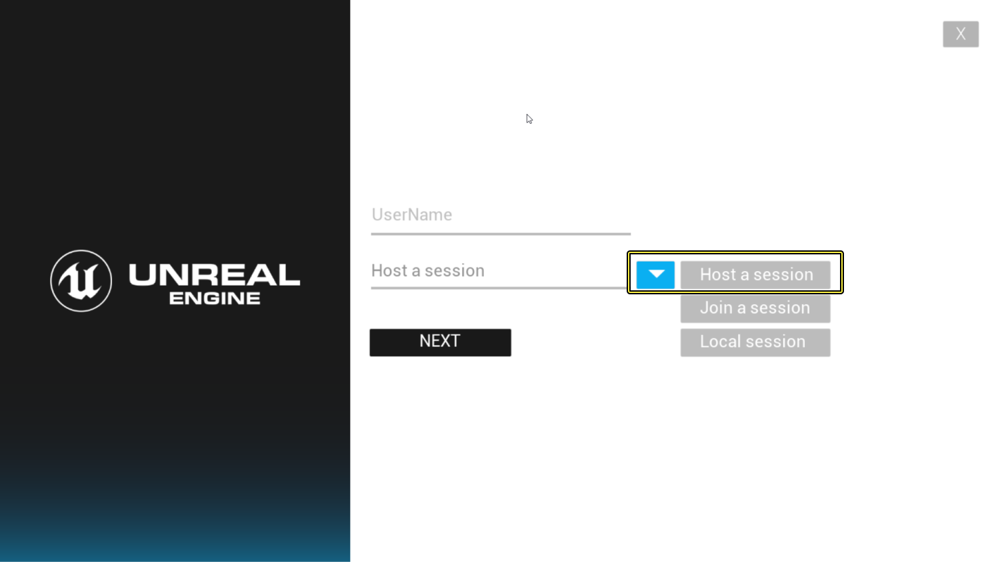
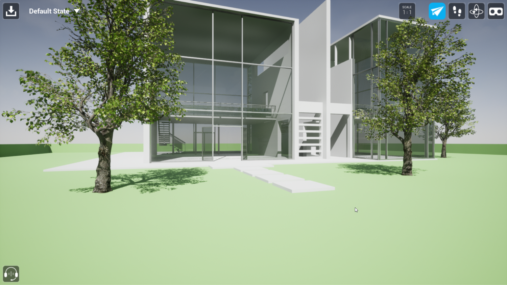

# 协作查看器（Collab Viewer）模板快速入门

> 路径：虚幻引擎5.7文档 / 分享和发布项目 / XR开发 / XR开发入门 / 协作查看器（Collab Viewer）模板 / 协作查看器（Collab Viewer）模板快速入门

> 原始页面：https://dev.epicgames.com/documentation/unreal-engine/collab-viewer-template-quick-start-in-unreal-engine

本页详细介绍在本地网络上运行协作查看器（Collab Viewer）模板（使用默认内容）的各个步骤。本指南结束时，您将了解如何开启协作查看器（Collab Viewer）模板提供的运行时体验，有哪些方法可以用来在场景中进行互动和移动，以及如何让网络上的多名其他用户加入共享体验。

> [!NOTE]
> 本文中的流程以AEC的Collab Viewer模板为例，但同样适用于 OEM/Manufacturing 模板。

- 1 - 打包与发布
- 2 - 一人启动服务器
- 3 - 其他人加入
- 4 - 自行尝试

## 1 - 打包与发布

要利用协作查看器（Collab Viewer）模板的所有功能，首先需要将项目打包成一个 *.exe* 文件。若要多人连接到单个会话，每人都需要用该打包 *.exe* 文件的副本运行应用程序。因此，团队中须有一人从虚幻编辑器打包项目，然后将该 *.exe* 文件发布给需要加入该会话的其他成员。

要打包并共享项目，请执行以下操作：

1. 从协作查看器（Collab Viewer）模板创建新项目（如尚未创建），并在虚幻编辑器中打开。
2. 选择一个模板类目。

   

   Click for full image.
3. 选择

   协作查看器

   模板。
4. 选择

   创建项目

   。
5. 从主工具栏中，选择 **平台菜单（Platforms Menue）> 窗口（Windows）> 打包项目（Package Project）**。

   

   Click for full image.
6. 用虚幻编辑器浏览至计算机上用于放置项目打包版本的文件夹，并单击 **选择文件夹（Select Folder）**。 Select a folder

   虚幻编辑器开始打包进程。

   
7. 打包进程结束时，前往上述步骤3中选择的文件夹。可找到一个名为

   WindowsNoEditor

   的文件夹，内容类似如下：

   

   所有要在协作查看器（Collab Viewer）中加入同一会话的用户本地计算机上的此文件夹中需要包含所有这些文件。可选择您认为最合适的方式来实现这一点。

   例如，可打包此文件夹中的文件，将其放在本地网络的共享位置。然后其他用户可将文件复制到其计算机。

> [!TIP]
> 欲详细了解打包以及流程的配置放置，另请参阅[打包项目](https://dev.epicgames.com/documentation/404)。

> [!NOTE]
> 每次更改项目中的内容时，**必须** 遵循此打包和分发流程。关卡中的3D模型不会自动在联网用户之间复制；而是会被编译到打包应用程序中。所有人必须使用同一版本的打包应用程序，会话中的所有人才能能看到最新内容。

## 2 - 一人启动服务器

这一步将启动服务器——此服务器是其他人可连接的协作查看器（Collab Viewer）应用程序的特殊实例。

1. 双击打包应用程序的

   .exe

   文件。 下例中，项目名为

   CollabProject

   ，其打包应用程序随之名为

   CollabProject.exe

   。

   
2. 在欢迎屏幕中为自己设置一个显示名称。此名称显示在化身头部上方，同一会话中的其他人可以看到。

   

   Click for full image.

   单击箭头转至下一步。
3. 下一个设置保留默认值 **创建会话（Host a session）**。

   

   Click for full image.

   单击箭头完成服务器设置。

   > [!TIP]
   > 若只想使用协作查看器（Collab Viewer）模板创建单人体验，不含其他联网用户加入的功能，可选择此处的 **单人会话（Single Session）** 选项。它提供与以主机身份启动时完全相同的运行时体验，唯一区别是应用程序对网络中的其他人不可见。

将从主示例关卡启动。

Click for full image.

使用[桌面功能按钮](../interacting-with-the-collab-viewer/index.md#%E6%A1%8C%E9%9D%A2%E5%8A%9F%E8%83%BD%E6%8C%89%E9%92%AE)或[VR功能按钮](../interacting-with-the-collab-viewer/index.md#vr%E5%8A%9F%E8%83%BD%E6%8C%89%E9%92%AE)在场景中移动并进行交互。

- 可按 **空格** 键（或VR中的摇杆键）打开交互菜单，用其中的选项使选定对象变为透明（**Xray**），传送至预设 **书签** 位置，在3D空间中移动对象，或播放变速器总成在建筑内的预设"爆炸"动画。

  > 图片已省略：Interaction Menu

  Click for full image.
- 也可利用右上角菜单在不同移动模式之间切换（飞行、行走、环绕），若已设置兼容的VR头戴设备，可切换至VR模式。

  > 图片已省略：Toolbar

更多详情请参阅：

- 与协作查看器进行交互
- 在Collab Viewer中进行测量
- 在协作查看器（Collab Viewer）中进行注释
- 保存和加载会话

操作时，自己的计算机作为服务器，对网络中的其他计算机可见。其他人加入会话时，会显示各自的化身。

## 3 - 其他人加入

本步骤中，每个加入会话的人都会在其计算机上启动打包应用程序的单独实例，这些单独实例都连接到同一服务器。

所有人都应遵循以下说明加入会话：

1. 双击打包应用程序的

   .exe

   文件。例如，此例中项目名为

   CollabProject

   ，打包应用程序随之名为

   CollabProject.exe

   。

   > 图片已省略：Packaged executable
2. 在欢迎屏幕中为自己设置一个显示名称。此名称显示在化身头部上方，同一会话中的其他人可以看到。

   > 图片已省略：Set a display name

   Click for full image.

   单击箭头转至下一步。
3. 将下一设置更改为 **加入会话（Join a session）**。

   > 图片已省略：Choose Join a session

   Click for full image.

   单击箭头转至下一步。
4. 应用程序扫描网络，并列出所有可用服务器。

   > 图片已省略：Select a server to join

   Click for full image.

   - 若在列表中看到所需服务器，点击名称加入会话。

     > 图片已省略：Click the server name
   - 若未找到所需服务器，尝试按 **刷新（Refresh）** 按钮重新扫描网络寻找服务器。

     > 图片已省略：Refresh the list of servers
   - 如应用程序找不到该服务器，但已知其IP地址，可开启 **手动指定IP地址（Manually specify an IP Address）** 开关。

     > 图片已省略：Switch to manual IP mode

     在提供的域中输入IP地址，单击 **加入（Join）**。

     > 图片已省略：Enter server IP Address and join

     Click for full image.

将从主关卡启动。可看到服务器运行者的化身，以及所有加入会话的人员各自的化身：

> 图片已省略：collabviewer-client-joined.png

Click for full image.

各用户的化身略有不同：

- 每个化身都伴有用户在欢迎菜单中输入的显示名称。
- 每个化身将随机指定一种颜色。
- 行走或VR模式中的用户化身类似于上图右侧的人形。其他导航模式下的用户由上图左侧的摄像机表示。
- 用户移动并环顾四周时，所有对应化身都会在场景中移动和旋转，可了解其他用户在关注何处。

使用[桌面功能按钮](../interacting-with-the-collab-viewer/index.md#%E6%A1%8C%E9%9D%A2%E5%8A%9F%E8%83%BD%E6%8C%89%E9%92%AE)或[VR功能按钮](../interacting-with-the-collab-viewer/index.md#vr%E5%8A%9F%E8%83%BD%E6%8C%89%E9%92%AE)在场景中移动并进行交互。

## 4 - 自行尝试

了解运行协作查看器（Collab Viewer）模板以及与其他人互连的方式后，变可以开始使用同样的运行时体验来查阅自己的内容了。若要了解如何将自定义内容添加到项目以及如何设置自定义内容以获取相同的运行时体验，请继续阅读[向协作查看器（Collab Viewer）模板添加自定义内容](../adding-your-own-content-t-3d309f29/index.md)指南。
