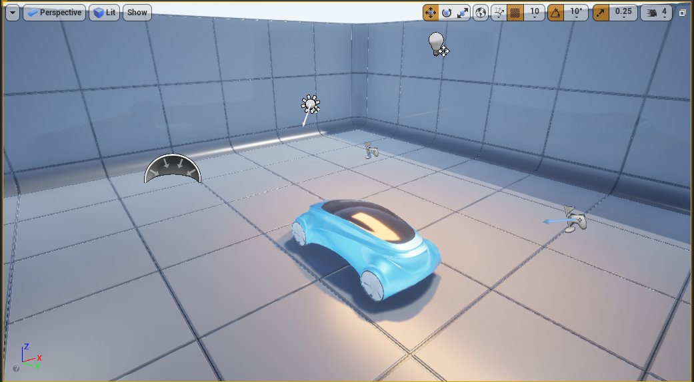
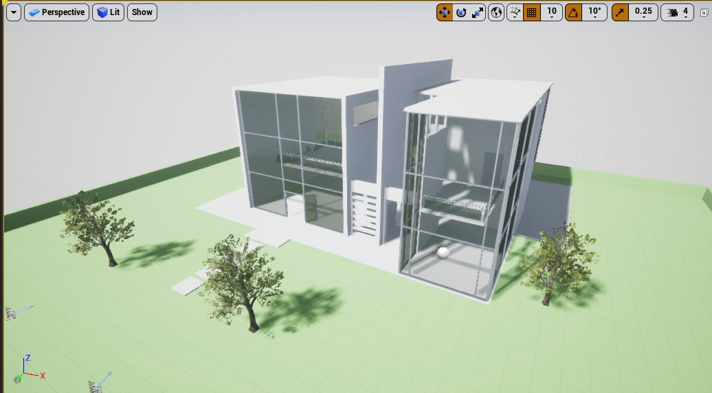
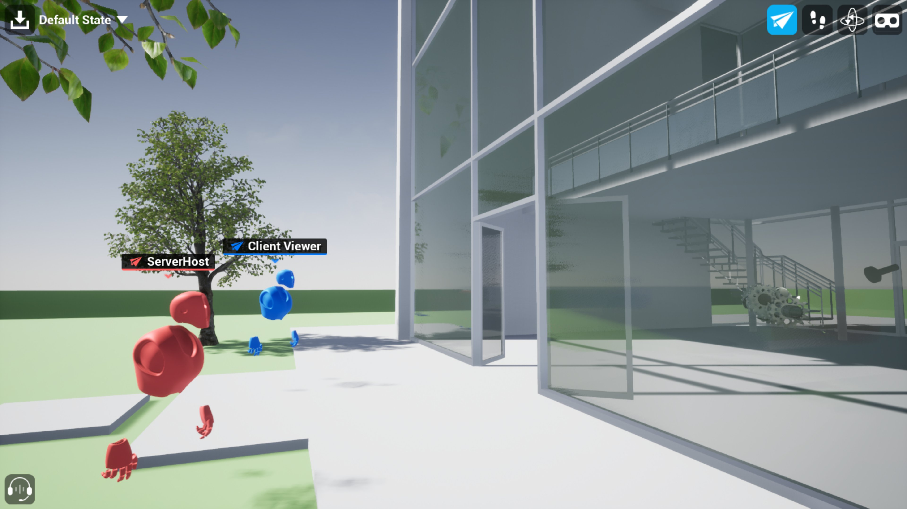

# 协作查看器（Collab Viewer）模板

> 路径：虚幻引擎5.7文档 / 分享和发布项目 / XR开发 / XR开发入门 / 协作查看器（Collab Viewer）模板

> 原始页面：https://dev.epicgames.com/documentation/unreal-engine/collab-viewer-templates-in-unreal-engine

协作查看器（Collab Viewer）模板能让多个用户同时体验同一个3D内容。团队可以使用此模板更轻松快捷地对设计进行实时查阅和交流，提高发现问题和迭代内容的效率。

## 行业模板

虚幻引擎提供了两种协作查看器模板，分别为不同用户定制。

- OEM/制造业：该模板为汽车设计而定制。它包括中的不同类型的场景灯光，可以演示不同条件的汽车表面效果。

  

  点击查看大图。
- AEC：该模板有为建筑、工程和施工准备的定制内容，包括一个示范建筑的样本，以演示如何设置建筑模型。

  

  点击查看大图。

在协作查看器（Collab Viewer）会话中，每个参与者都可以使用配备标准鼠标和键盘的计算机，或使用配备VR头戴显示器和运动控制器的计算机。该模板拥有多种内置工具，可以在运行时与场景内容进行交互。每个参与者都可以执行以下操作：移动对象，将对象改为X射线透明材质，播放动画来演示将内容"炸"成不同的空间排列，等等。每个人都可以在会话中看到彼此的化身，还可以用激光笔工具指出场景的特征：

点击查看大图。

协作查看器（Collab Viewer）模板能够处理多查看者体验固有的大多数疑难问题，其中包括在多台计算机之间建立连接和复制状况信息。从该模块开始体验设计查阅，在联网设置上少花时间，将更多时间投入到设计构思上。在团队协作中，它非常适用于评估和交流设计。此外它还拥有充足的交互和导航控制，即使对3D内容单人体验而言也是一个很好的起点。

所有交互和导航控制均由项目中的蓝图类提供，所以可自定义、参考借鉴，甚至可以复制到自己的项目中。欲详细了解蓝图用法，请参阅[蓝图可视化脚本编写](../../../../blueprints-visual-scripting/index.md)。

本页全面介绍协作查看器（Collab Viewer）模板入门指南，以及如何将其用于自己的内容。

> [!TIP]
> 我们准备了一段视频来演示文中所述的协作查看器模板的相关概念和操作流程。具体内容，请参阅下方的网络研讨会录制视频：

## 工作流程

协作查看器（Collab Viewer）模板的常规使用模式如下：

1. 使用模板创建新项目，或将模板内容引入自己的现有项目。
2. 在项目中设置要与其他人共享的内容。

   这通常涉及数据导入和查看开发任务，在其他虚幻引擎项目中也需要执行这类操作。欲详细了解设置内容时要牢记的具体注意事项（如碰撞和导航网格体），请参阅

   向协作查看器（Collab Viewer）添加自己的内容

   。
3. 用虚幻编辑器内置的工具将项目打包到可执行文件。
4. 将此文件共享给参与协同查阅的人员。
5. 一位用户启动虚幻引擎打包应用程序并以服务器模式启动。
6. 要参与此查阅会话的所有其他用户在各自计算机上启动此应用程序，并加入服务器会话。

欲了解用模板默认内容完成上述步骤的详细教程，请参阅[快速入门](collab-viewer-template-quick-start/index.md)。

## VR支持

协作查看器模板默认使用OpenXR插件来支持VR头盔的交互功能。各平台（如Oculus VR和Steam VR）的自定义插件仍会受到支持，并且在必要时可以重新启用。

## 入门指南

- [协作查看器（Collab Viewer）模板快速入门](collab-viewer-template-quick-start/index.md) - 设置和运行协作查看器（Collab Viewer）模板的详细分步指南。

## 操作指南

- [在协作查看器（Collab Viewer）中进行注释](annotating-in-the-collab-viewer/index.md) - 介绍如何在运行时在协作查看器（Collab Viewer）模板中快速做记录。

- [在Collab Viewer中进行测量](measuring-in-the-collab-viewer/index.md) - 介绍运行时如何在Collab Viewer模板中添加测量。

- [保存和加载会话](saving-and-loading-a-session/index.md) - 介绍如何保存（然后重新加载）会话，包括注解、测量值和透明度

- [向协作查看器（Collab Viewer）添加自己的内容](adding-your-own-content-t-3d309f29/index.md) - 介绍如何将自己的模型添加到协作查看器（Collab Viewer）模板中。

- [在协作查看器（Collab Viewer）模板中使用书签](working-with-bookmark-in-9e39bfdb/index.md) - 介绍如何在关卡中放置书签提供预设视点，以及如何将此类书签指定到热键。

- [设置爆炸动画](setting-up-xr-explode-animations/index.md) - 介绍如何设置某个总成或一组对象的

- [在协作查看器（Collab Viewer）中进行注释](annotating-in-the-collab-viewer/index.md) - 介绍如何在运行时在协作查看器（Collab Viewer）模板中快速做记录。

- [在Collab Viewer中进行测量](measuring-in-the-collab-viewer/index.md) - 介绍运行时如何在Collab Viewer模板中添加测量。

- [保存和加载会话](saving-and-loading-a-session/index.md) - 介绍如何保存（然后重新加载）会话，包括注解、测量值和透明度

- [向协作查看器（Collab Viewer）添加自己的内容](adding-your-own-content-t-3d309f29/index.md) - 介绍如何将自己的模型添加到协作查看器（Collab Viewer）模板中。

- [在协作查看器（Collab Viewer）模板中使用书签](working-with-bookmark-in-9e39bfdb/index.md) - 介绍如何在关卡中放置书签提供预设视点，以及如何将此类书签指定到热键。

- [设置爆炸动画](setting-up-xr-explode-animations/index.md) - 介绍如何设置某个总成或一组对象的

- [在协作查看器（Collab Viewer）中进行注释](annotating-in-the-collab-viewer/index.md) - 介绍如何在运行时在协作查看器（Collab Viewer）模板中快速做记录。

- [在Collab Viewer中进行测量](measuring-in-the-collab-viewer/index.md) - 介绍运行时如何在Collab Viewer模板中添加测量。

- [保存和加载会话](saving-and-loading-a-session/index.md) - 介绍如何保存（然后重新加载）会话，包括注解、测量值和透明度

- [向协作查看器（Collab Viewer）添加自己的内容](adding-your-own-content-t-3d309f29/index.md) - 介绍如何将自己的模型添加到协作查看器（Collab Viewer）模板中。

- [在协作查看器（Collab Viewer）模板中使用书签](working-with-bookmark-in-9e39bfdb/index.md) - 介绍如何在关卡中放置书签提供预设视点，以及如何将此类书签指定到热键。

- [设置爆炸动画](setting-up-xr-explode-animations/index.md) - 介绍如何设置某个总成或一组对象的

## 参考

- [与协作查看器进行交互](interacting-with-the-collab-viewer/index.md) - 介绍在运行时如何在协作查看器（Collab Viewer）模板中控制摄像机并与内容交互。

- [协作查看器（Collab Viewer）联网要求](networking-requirements-f-fd0d899e/index.md) - 介绍将多台计算机接入设计查阅体验时应考虑的要求和注意事项。
