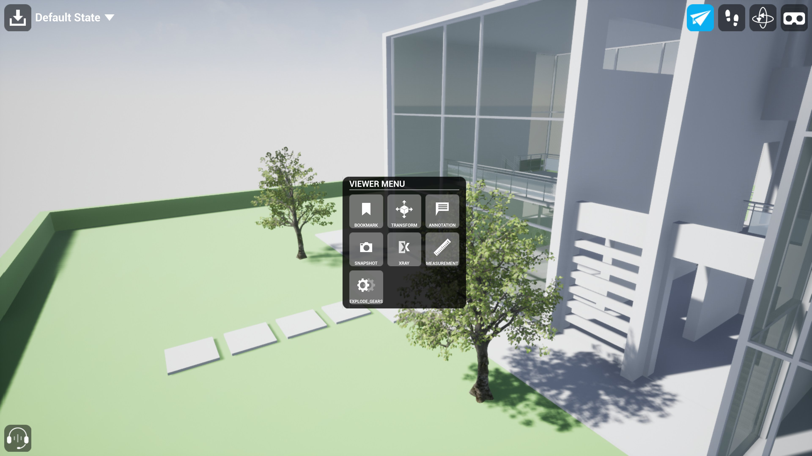
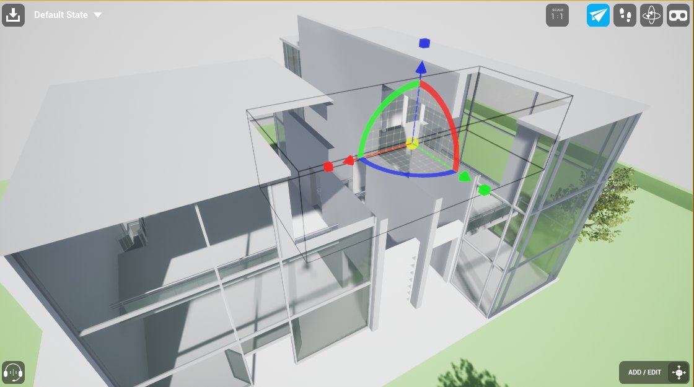
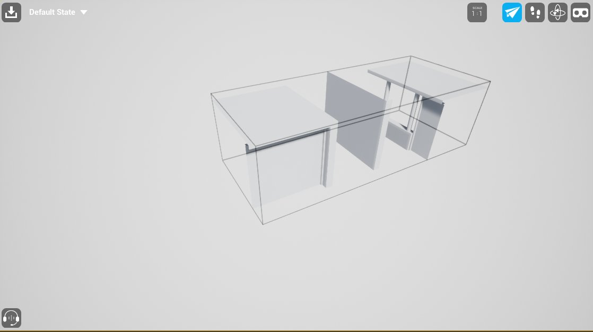
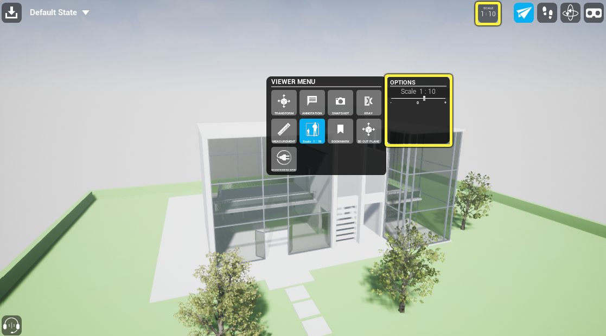
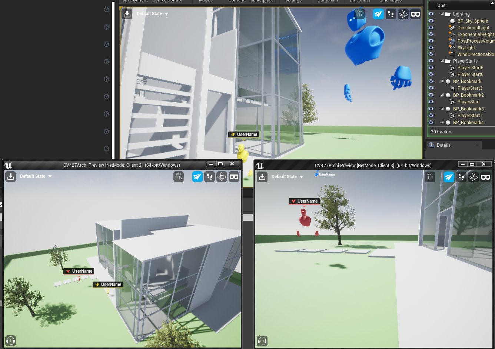
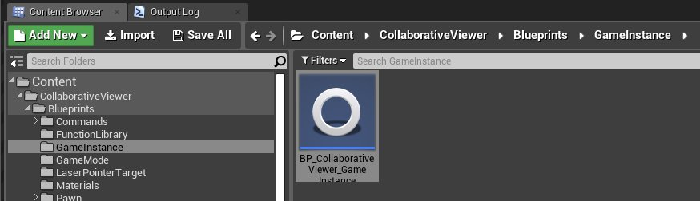
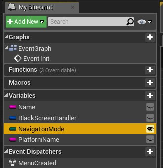
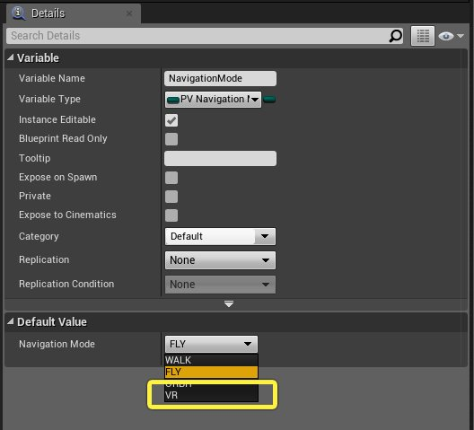

# 与协作查看器进行交互

> 路径：虚幻引擎5.7文档 / 分享和发布项目 / XR开发 / XR开发入门 / 协作查看器（Collab Viewer）模板 / 与协作查看器进行交互

> 原始页面：https://dev.epicgames.com/documentation/unreal-engine/interacting-with-the-collab-viewer-in-unreal-engine

本文介绍了运行时状态下，在协作查看器（Collab Viewer）模板中控制摄像机并与内容交互的不同方式（适用于[桌面](#%E6%A1%8C%E9%9D%A2%E5%8A%9F%E8%83%BD%E6%8C%89%E9%92%AE)和[VR](#vr%E5%8A%9F%E8%83%BD%E6%8C%89%E9%92%AE)模式）。

## 桌面功能按钮

### 工具栏

可使用窗口上方的工具栏进行传送，切换导航模式，并保存当前会话。

| 图标 | 说明 |
| --- | --- |
| 打开书签列表 | 打开含有当前关卡中所有书签的列表。选择任何书签，即可传送至对应视口。另可参阅[使用书签](../working-with-bookmark-in-9e39bfdb/index.md)。 |
| 启动飞行模式 | 启动飞行模式。飞行模式下，可在场景中向各个方向自由飞行。此模式下将穿过任何几何体，无视Actor的碰撞设置。参阅[飞行模式功能按钮](#%E9%A3%9E%E8%A1%8C%E6%A8%A1%E5%BC%8F%E5%8A%9F%E8%83%BD%E6%8C%89%E9%92%AE)。 在飞行模式下返回行走模式后将重新启用重力。将自由落体直至地面，或吸附至最接近的地面，具体取决于所在位置。 |
| 启动行走模式 | 启动行走模式。行走模式下，角色将受重力影响落在地面上。在场景中四处走动时会与关卡中设有碰撞体积的对象发生碰撞。参阅[行走模式功能按钮](#%E8%A1%8C%E8%B5%B0%E6%A8%A1%E5%BC%8F%E5%8A%9F%E8%83%BD%E6%8C%89%E9%92%AE)。 |
| 启动环绕模式 | 启动环绕模式。环绕模式下，将在关卡中选择一个目标点。然后，在旋转摄像机时以目标点为屏幕中心进行环绕轨道运动。参阅[环绕模式功能按钮](#%E7%8E%AF%E7%BB%95%E6%A8%A1%E5%BC%8F%E5%8A%9F%E8%83%BD%E6%8C%89%E9%92%AE)。 |
| 启动VR模式 | 若安装了支持的VR头戴设备并可正常运行，则启用VR控制模式。参阅[VR功能按钮](#vr%E5%8A%9F%E8%83%BD%E6%8C%89%E9%92%AE)。 |
| 保存 | 保存查看器当前状态，包括注解和测量值。参见[保存和加载会话](../saving-and-loading-a-session/index.md) |

> [!TIP]
> 使用以下快捷键快速切换模式：
>
> - 在键盘上按下
>
>   U
>
>   来启用飞行模式。
> - 在键盘上按下
>
>   I
>
>   来启用行走模式。
> - 在键盘上按下
>
>   O
>
>   来启用环绕模式。
> - 在键盘上按下
>
>   P
>
>   来启用VR模式。

### 常用桌面功能按钮

以下功能按钮在所有桌面移动模式下作用皆相同：飞行模式、行走模式和环绕模式。

| To... | Do... |
| --- | --- |
| 启动激光指针 | 将鼠标光标移至要高亮显示的对象上，然后点击左键。 |
| 打开交互式菜单 | 按 **空格** 键。欲知使用本菜单中各个项目的详情，请参阅[交互式菜单](#%E4%BA%A4%E4%BA%92%E5%BC%8F%E8%8F%9C%E5%8D%95)。 |
| 移至预设书签位置 | 按已映射至特定书签位置的任意数字键（0-9）。请参阅[在协作查看器（Collab Viewer）模板中使用书签](../working-with-bookmark-in-9e39bfdb/index.md)。 |
| 退出应用程序 | 按 **Esc**。 |

### 飞行模式功能按钮

除了[常用桌面功能按钮](#%E5%B8%B8%E7%94%A8%E6%A1%8C%E9%9D%A2%E5%8A%9F%E8%83%BD%E6%8C%89%E9%92%AE)，以下功能按钮也适用于飞行模式。

| To... | Do... |
| --- | --- |
| 从当前位置环顾四周 | 点击右键并拖动。 |
| 从当前位置前移、左移、后移或右移 | 按住鼠标右键，并按 **W**、**A**、**S** 和 **D**。 |
| 直上直下移动（沿世界的全局Z轴） | 按住鼠标右键，并按 **Q** 和 **E**。 |

### 行走模式功能按钮

除了[常用桌面功能按钮](#%E5%B8%B8%E7%94%A8%E6%A1%8C%E9%9D%A2%E5%8A%9F%E8%83%BD%E6%8C%89%E9%92%AE)，以下功能按钮也适用于行走模式。

| To... | Do... |
| --- | --- |
| 从当前位置环顾四周 | 点击右键并拖动。 |
| 从当前位置前移、左移、后移或右移 | 按住鼠标右键，并按 **W**、**A**、**S** 和 **D**。 |

### 环绕模式功能按钮

除了[常用桌面功能按钮](#%E5%B8%B8%E7%94%A8%E6%A1%8C%E9%9D%A2%E5%8A%9F%E8%83%BD%E6%8C%89%E9%92%AE)，以下功能按钮也适用于环绕模式。

| To... | Do... |
| --- | --- |
| 摄像机环绕目标点 | 点击右键并拖动。 |
| 将摄像机目标点更改为新位置，保持当前缩放等级 | 单击中键。 |
| 选择新目标点，缩放至适应视口中选定对象 | 双击中键。 |
| 缩放当前目标点 | 转动鼠标滚轮。 |
| 摄像机上下左右平移 | 单击中键并拖动。 |

## VR控制选项

| 目标 | 方法 |
| --- | --- |
| 传送至新位置 | **Oculus Touch:** 按住右控制器的B按钮或者左控制器的Y按钮。 **Valve Index控制器:** 按住任意控制器上的B按钮。 **HTC Vive控制器:** 按住任意控制器上的握把按钮。 你可以看到控制器上发出弧线，以及地面上的目标指示。目标指示表示你的传送位置。挥动控制器来将指示放置在你想要移动的地方。 标记指针代表传送后的朝向。转动手腕即可控制朝向。松开面孔按钮或次要扳机键即可完成传送。 |
| 启动激光指针 | 按任一控制器上的主扳机键，在真实世界空间中移动控制器。 |
| 打开交互式菜单 | 前推或后拉控制器右摇杆。用摇杆高亮显示要启动的选项，并按摇杆键确认选择。欲知使用本菜单中各个项目的详情，请参阅[交互式菜单](#%E4%BA%A4%E4%BA%92%E5%BC%8F%E8%8F%9C%E5%8D%95)。 |
| 退出应用程序 | 按计算机键盘上的 **Esc**。 |

## 交互式菜单

交互式菜单提供多个命令和模式，用于在运行时与场景中内容交互。

> [!TIP]
> 在任意桌面模式下按 **空格** 键，或在VR模式下按任一摇杆键即可打开交互式菜单。

| 命令 | 说明 |
| --- | --- |
| **变换（Transform）** | 使用 **变换（Transform）** 子菜单中的选项在场景中移动选定对象。 |
| **变换（Transform）>移动（Move）** | 启动 **变换移动（Transform Move）** 模式。用激光指针在场景中选择对象时，可拖动激光指针在3D空间中移动选定对象。 |
| **变换（Transform）>重置（Reset）** | 启动 **变换重置（Transform Reset）** 模式。用激光指针在场景中选择对象时，立即将选定对象重置为原始位置和旋转状态。 |
| **变换（Transform）>全部重置（Reset All）** | 立即将场景中所有对象重置为原始位置和旋转状态。 |
| **注解（Annotation）** | 使用 **注解（Annotation）** 子菜单中的选项来添加或移除注解。详情参考 [在协作查看器（Collab Viewer）中进行注释](../annotating-in-the-collab-viewer/index.md)。 |
| **注解（Annotation） > 绘制（Paint）** | 启用 **注解绘制（Annotation Paint）** 模式。启用时，可以在坐标中进行绘制。 |
| **注解（Annotation） > 删除笔画（Delete Stroke）** | 启用 **注解删除笔画（Annotation Delete Stroke）** 模式。启用时，可以用激光指针选中笔画来删除。 |
| **注解（Annotation） > 文字注解（Annotate Text）** | 启用 **文字注解（Annotate Text）** 模式。启用时，可以放置、编辑以及删除2D文本标签。 |
| **快照（Snapshot ） > 拍摄（Take）** | 选择该项来拍摄快照。快照在协作查看包的 `YourProjectName/Saved/Snapshot` 子文件夹下保存为.PNG 文件。 |
| **X射线（Xray）** | 使用 **X射线（Xray）** 子菜单中的选项将透明材质应用于场景中选定对象，或删除该透明材质。 |
| **X射线（Xray）>应用（Apply）** | 启动 **X射线应用（Xray Apply）** 模式。此模式启动时，用激光指针在场景中选择的对象将应用透明材质。 |
| **X射线（Xray）>隔离（Isolate）** | 启动 **X射线隔离（Xray Isolate）** 模式。此模式启动时，如果用激光指针在场景中选择项目，则透明材质将应用于所选Actor层级中的所有 *其他* Actor。 |
| **X射线（Xray）>全部重置（Reset All）** | 立即删除关卡中所有对象上的透明材质，恢复原始材质。 |
| **测量值（Measurement）** | 使用 **测量（Measurement）** 子菜单中的选项添加和移除测量值。参见[在Collab Viewer中进行测量](../measuring-in-the-collab-viewer/index.md)。 |
| **测量值（Measurement）> 添加（Add）** | 激活 **测量值添加（Measurement Add）** 模式。此模式激活后，将在所选的每对点之间绘制测量值。 |
| **测量值（Measurement）> 删除（Delete）** | 激活 **测量值删除（Measurement Delete）** 模式。此模式激活后，可用激光指针选择测量值并将其删除。 |
| **测量值（Measurement）> 使用厘米（To Centimeter）** | 选择该选项来将你的测量单位设为厘米。 |
| **测量值（Measurement）> 使用米（To Meter）** | 选择该选项来将你的测量单位设为米。 |
| **缩放（Scale）** | 使用 **缩放（Scaling）** 模式来调整世界大小。默认为1:1。 |
| **书签（Bookmark）** | 打开含有当前关卡中所有书签的列表。选择任意书签，即可传送至对应视口。另可参阅[使用书签](../working-with-bookmark-in-9e39bfdb/index.md)。 |
| **书签（Bookmark） > 创建书签（Create Bookmark）** | 选用该选项来在运行时创建新的书签。 |
| **3D切割平面（3D Cut Plane）** | 选用 **3D切割平面（3D Cut Plane）** 子菜单中的该选项来选择移除一部分几何体 |
| **3D切割平面（3D Cut Plane） > 添加/编辑（Add/Edit）** | 选用该选项来放置或变换3D切割体积。 |
| **3D切割平面（3D Cut Plane） > 移除（Remove）** | 选用该选项来移除3D切割体积。 |
| **3D切割平面（3D Cut Plane） > 包含/排除（Include / Exclude）** | 选用该选项来切换移除3D切割体积之内还是之外的几何体。 |

> [!TIP]
> 启动某个交互模式（如 **X射线应用（Xray Apply）**）时，该模式名称显示在视口右下角。

## 3D切割操作

你可以基于3D立方体体积来切割几何体，并且可以选择是保留体积以内还是以外的几何体。 3D立方体可用位移、旋转和缩放。它还同几何体在运行时一同加载，几何体与体积重叠的材质会暂时变更为自定义的灰色材质，更加便于操作。

移除切割体积内的几何体。

切割体积仅显示体积内的几何体。

## 世界缩放比例

每个参与者现在可以选择他们自己的世界显示大小。可以将比例调大来与真实比例模型进行模拟交互，也可以将比例调小来进行精准的操作并观察细节。 缩放比例还会影响参与者的体积和他们的显示方式。 缩放功能可以直接在HUD或菜单中使用。

点击查看大图。 可以使用菜单中的滑块或者直接用键盘给HUD输入来调节缩放大小。

点击查看大图。 左下角的参与者（蓝色）的缩放比例是世界和其它参与的的10倍。

## 在虚幻编辑器中VR模式下进行测试

在计算机上设置VR后，启动打包或standalone版本的协作（Collab）模板时，可使用工具栏中的图标切换到VR模式。

但若要在虚幻编辑器中测试项目时使用VR功能按钮，则需要遵循以下步骤：

1. 在内容浏览器中，在 *CollaborativeViewer/Blueprints/GameInstance* 下找到 **BP_CollaborativeViewer_GameInstance** 资源。

   
2. 双击该资源，在蓝图编辑器中打开。
3. 在 **我的蓝图（My Blueprint）** 面板中，选择 **NavigationMode** 变量。

   
4. 在 **详细信息（Details）** 面板的 **默认值（Default Value）** 部分下，选择 **VR** 作为 **导航模式（Navigation Mode）** 选项。

   
5. **编译** 并 **保存** 蓝图。
6. 在工具栏中使用播放按钮旁的下拉箭头选择 **VR预览（VR Preview）**，启动预览。

   > 图片已省略：VR Preview

> [!NOTE]
> 切记，在打包应用程序前须关闭此设置！否则生成的包无法正常运行。
