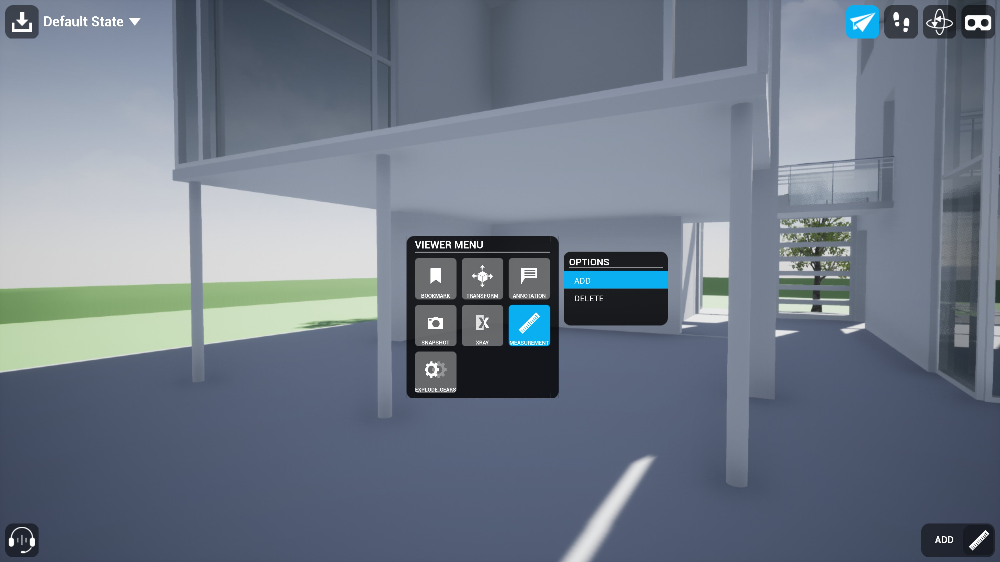
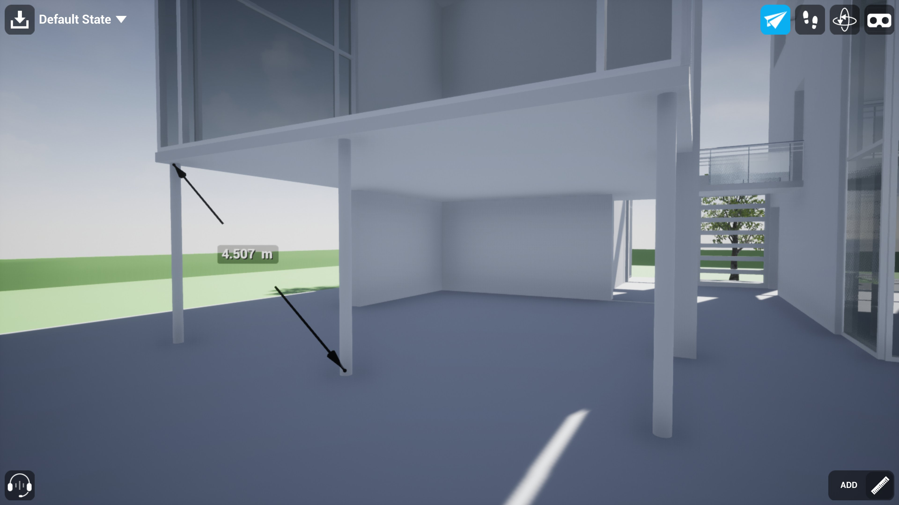
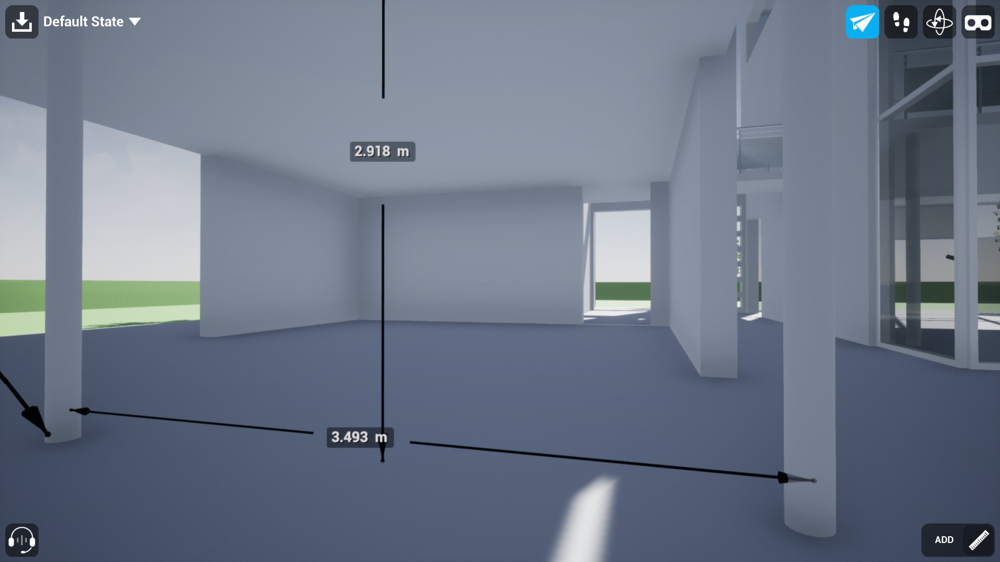
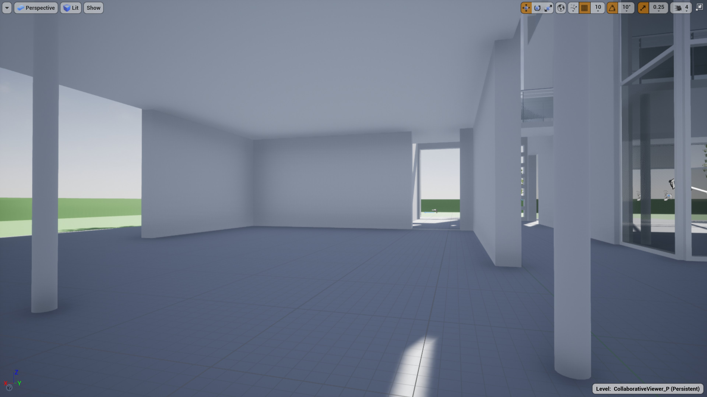

# 在Collab Viewer中进行测量

> 路径：虚幻引擎5.7文档 / 分享和发布项目 / XR开发 / XR开发入门 / 协作查看器（Collab Viewer）模板 / 在Collab Viewer中进行测量

> 原始页面：https://dev.epicgames.com/documentation/unreal-engine/measuring-in-the-collab-viewer-in-unreal-engine

您与团队中的其他人可以在协作视图中进行测量。 可用 **Shift** 键将测量沿x轴、y轴或z轴对齐。

## 测量

要进行测量，请执行以下步骤：

1. 启动或加入团队协作视图，并移至要测量区域旁边的位置。
2. 打开交互菜单。（在桌面模式下，按 **空格键**。 在VR模式下，按右控制器上的侧肩按钮。）
3. 在交互菜单中，高亮显示 **测量（Measurement）**，然后选择 **添加（Add）**。

   

   点击查看大图。
4. 选择测量的起点，然后选择测量的终点。

   

   点击查看大图。

### 沿轴测量（桌面模式）

若希望测量沿x轴、y轴或z轴对齐，在释放鼠标按钮以放置第二个端点的同时按住 **Shift** 键。

Measurements snapped to the x-axis and z-axis in the collaborative view

The position axes shown in the Unreal Editor

此选项仅在桌面模式下可用。

### 用X射线测量被遮挡对象

要测量被其他对象遮挡的对象，开始测量前，在交互菜单中高亮显示 **X射线（Xray）**，然后选择 **应用（Apply）**。选择要用作终点的对象所被遮挡的对象。

## 删除测量

要删除测量，请执行以下操作：

1. 打开交互菜单。（在桌面模式下，按 **空格键**。在VR模式下，按右控制器上的侧肩按钮。）
2. 高亮显示 **测量（Measurement）**，然后选择 **删除（Delete）**。
3. 将激光指向要删除的测量，然后选中它。
