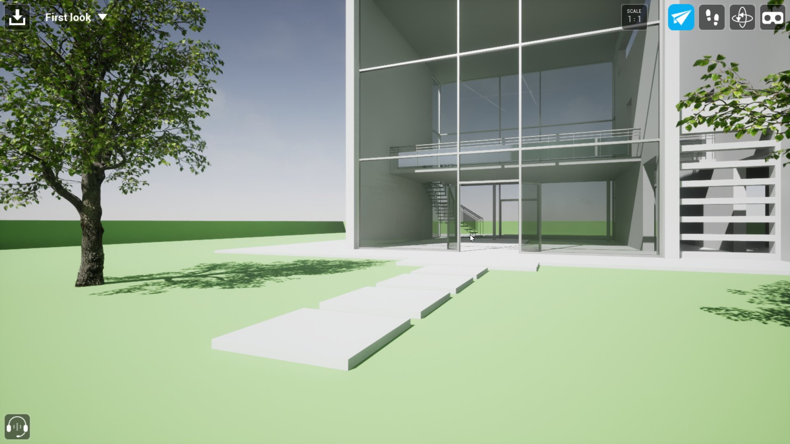
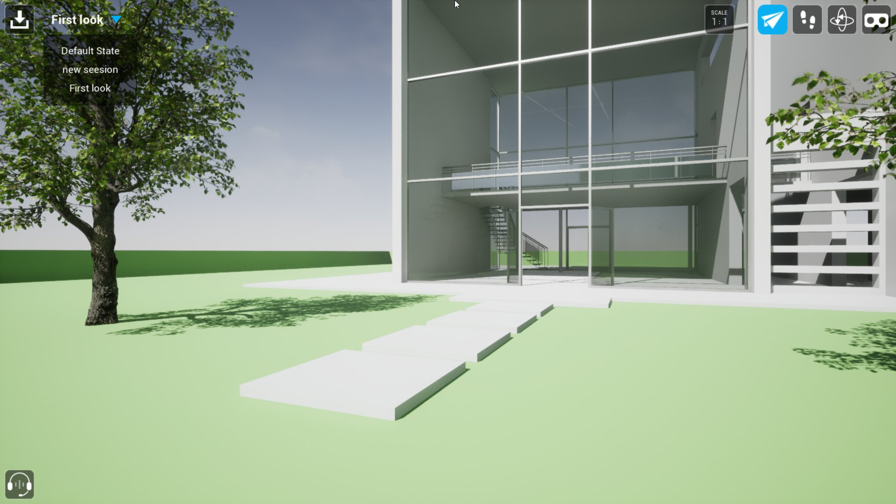
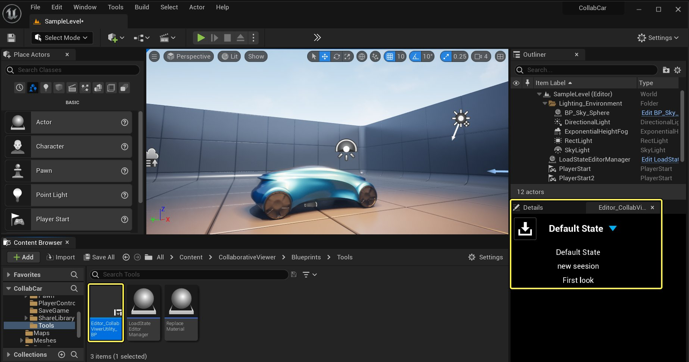

# 保存和加载会话

> 路径：虚幻引擎5.7文档 / 分享和发布项目 / XR开发 / XR开发入门 / 协作查看器（Collab Viewer）模板 / 保存和加载会话

> 原始页面：https://dev.epicgames.com/documentation/unreal-engine/saving-and-loading-a-session-in-unreal-engine

协作视图的主讲者和其他参与者可保存注释、测量值、**X射线** 透明状态以及 **变换** 所移动的项目的位置。

## 保存会话

要保存会话，选择 **保存（Save）** 按钮，输入会话名称，然后按Enter。

点击查看大图。

每个参与者将会话保存在协作视图会话包的本地副本中。 会话保存在 `YourProjectName/Saved/SaveGames` 子文件夹中。

> [!NOTE]
> 不会保存您与其他参与者的当前位置和旋转。
>
> 不能修改已保存的会话，也不能使用现有已保存会话的名称。
>
> 在VR模式下无法保存和恢复会话。

## 加载会话

要加载已保存的会话，选择 **保存（Save）** 按钮旁边的菜单，然后选择会话。

点击查看大图。

会话列表包括您保存的会话，以及当前连接的任何其他参与者保存的会话。

## 虚幻编辑器中的加载状态

现在你可以直接在编辑器中重新加载保存过的状态。

1. 复制 **.sav文件**（代表你想重新加载的状态）以及应用程序 Saved/SaveGames 目录中的 **MainSaveGame.sav** 文件，拷贝到项目中的同一目录。
2. 在编辑器中，打开 **CollaborativeViewer > Blueprints > Tools** 文件夹，选择 **Editor_CollabViewerUtility_BP**。点击右键并选择 **运行编辑器实用工具控件（Run Editor Utility Widget）**。
3. 会出现一个包含默认状态选择器的控件，你现在可以在下拉列表中选择一个复制状态。
4. 你可能需要在视口中移动摄像机来刷新参数。

Click for full image.
