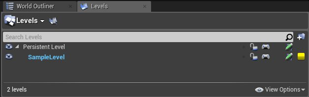
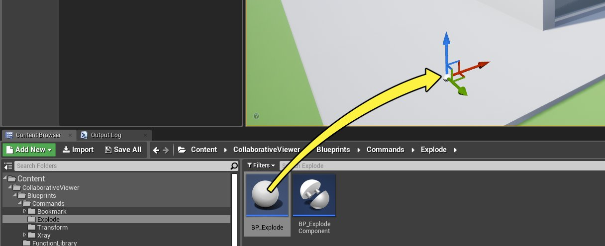
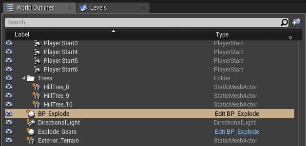
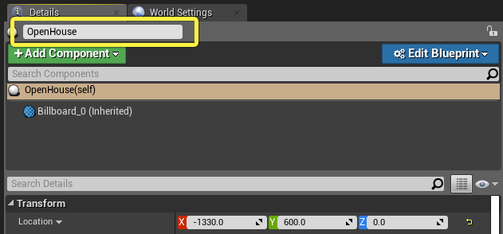
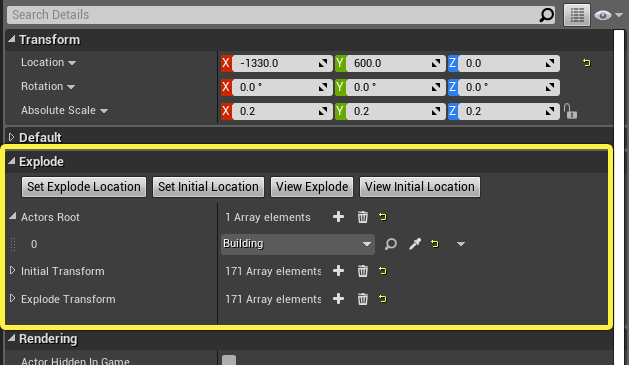
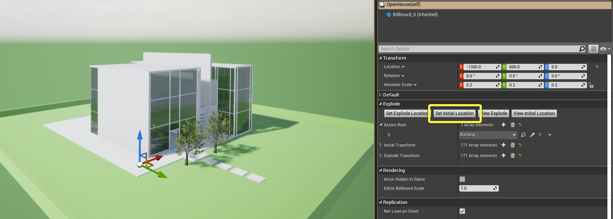
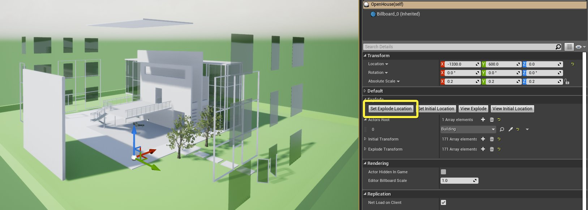
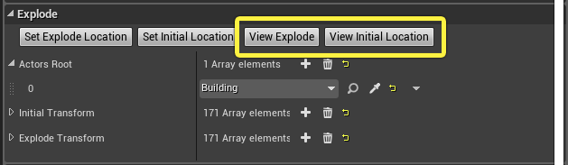

# 设置爆炸动画

> 路径：虚幻引擎5.7文档 / 分享和发布项目 / XR开发 / XR开发入门 / 协作查看器（Collab Viewer）模板 / 设置爆炸动画

> 原始页面：https://dev.epicgames.com/documentation/unreal-engine/setting-up-xr-explode-animations-in-unreal-engine

与一个由小部件组成的总成进行交互的常见方式是将其 *炸开*：使其组件部分在空间中相互分离，以便观察者查看每个单独部件，以及它们结合在一起的方式。

协作查看器（Collab Viewer）模板包含一个蓝图类，可用于设置部件爆炸视图，以及在运行时实现总成默认视图与爆炸视图之间的流畅切换。

## 设置初始和爆炸位置

要为自有内容设置爆炸视图，请执行以下操作：

1. 删除场景中全部现有

   BP_Explode

   Actor。（关卡中可有多个

   BP_Explode

   Actor，但交互菜单目前一次仅列出一个爆炸动画。）
2. 确保所处关卡是Actor要管理的内容所在的关卡。**BP_Explode** 蓝图仅对所处关卡的内容生效。 以默认样本内容为例，打开 **关卡（Levels）** 窗口（**窗口（Window）>关卡（Levels）**），双击 **示例关卡（SampleLevel）**。

   
3. 在

   内容浏览器

   中，在

   CollaborativeViewer/Blueprints/Commands/Explode

   文件夹下找到

   BP_Explode

   蓝图类，拖入视口。

   
4. 在视口或 **世界大纲视图** 中选择该新蓝图Actor。

   
5. 在 **细节（Details）** 面板中，用描述性名称为Actor命名。此名称在运行时将显示在交互菜单中，以便您触发和反转爆炸动画。

   
6. 在 **细节（Details）** 面板中找到 **Explode** 组。运用这组功能按钮设置总成的默认视图和爆炸视图。

   
7. 在 **Actor根** 列表中，需要识别此蓝图在关卡中添加动画的Actor。

   - 可向列表单独添加各Actor。
   - 如果要添加动画的Actor是

     世界大纲视图

     中同一父Actor的子项，只需将该父项添加到此列表即可。

   例如，上图所示的前一步骤中选择了 **建筑（Building）** Actor。此Actor是建筑所含全部默认内容项的父项。因此蓝图可以为建筑中的所有Actor添加动画，但树木、变速器总成、外部场地除外。
8. 列表中所需Actor齐备后，（必要时）全部移至视口中，使其按照安排出现在各自的默认初始位置。点击 **设置初始位置（Set Initial Location）** 按钮记录这些变换。

   
9. 现在，将视口中的所有Actor移至爆炸时所处的位置。点击 **设置爆炸位置（Set Explode Location）** 按钮锁定此类变换。

   
10. 可点击

    查看爆炸（View Explode）

    和

    查看初始位置（View Initial Location）

    按钮，在虚幻编辑器中测试记录的变换。点击此类按钮时，所有拥有动画的部件应在关卡视口中的预设位置之间进行切换。动画将不如运行时流畅，但仍可检查Actor在3D空间中的位置是否符合预期。

    

> [!WARNING]
> **BP_Explode** Actor保存其所管理的Actor列表。如需修改 **BP_Explode** 拥有的对象，例如删除关卡中的一些Actor，或更改父项层级，必须先重新设置初始位置 **和** 爆炸位置，然后再在编辑器中查看这两个位置。否则这些Actor列表会过时。这可能会导致一些Actor丢失在场景中应所处的位置。

> [!NOTE]
> 可在关卡添加多个 **BP_Explode** Actor，为总成的不同部件添加动画。但只有第一个Actor会显示在交互菜单中。
>
> 若创建多个 **BP_Explode** Actor，则一个Actor最多只能存在于一个 **BP_Explode** 中。否则，最终位置可能不合预期。

## 运行时位置切换

要在运行时在爆炸视图和默认视图之间切换，请执行以下操作：

1. 运行或测试游戏，然后打开交互菜单。（在桌面模式中，按

   空格键

   。在VR模式中，按右控制器的肩部按钮。） 菜单底部会出现一个项目，其名称为已创建

   BP_Explode

   Actor的名称。
2. 高亮显示此菜单项，并选择 **爆炸（Explode）**，使注册到同一 **BP_Explode** 的所有部件从关卡中当前位置流畅移至爆炸位置。

   > 图片已省略：爆炸命令
3. 若在总成爆炸分解时重新打开交互菜单，会看到 **构建（Build）** 选项。选择此选项，使爆炸分解部件从当前位置返回默认起始位置。

   > 图片已省略：构建命令

以下视频是上一节运行时构建的自定义动画。
