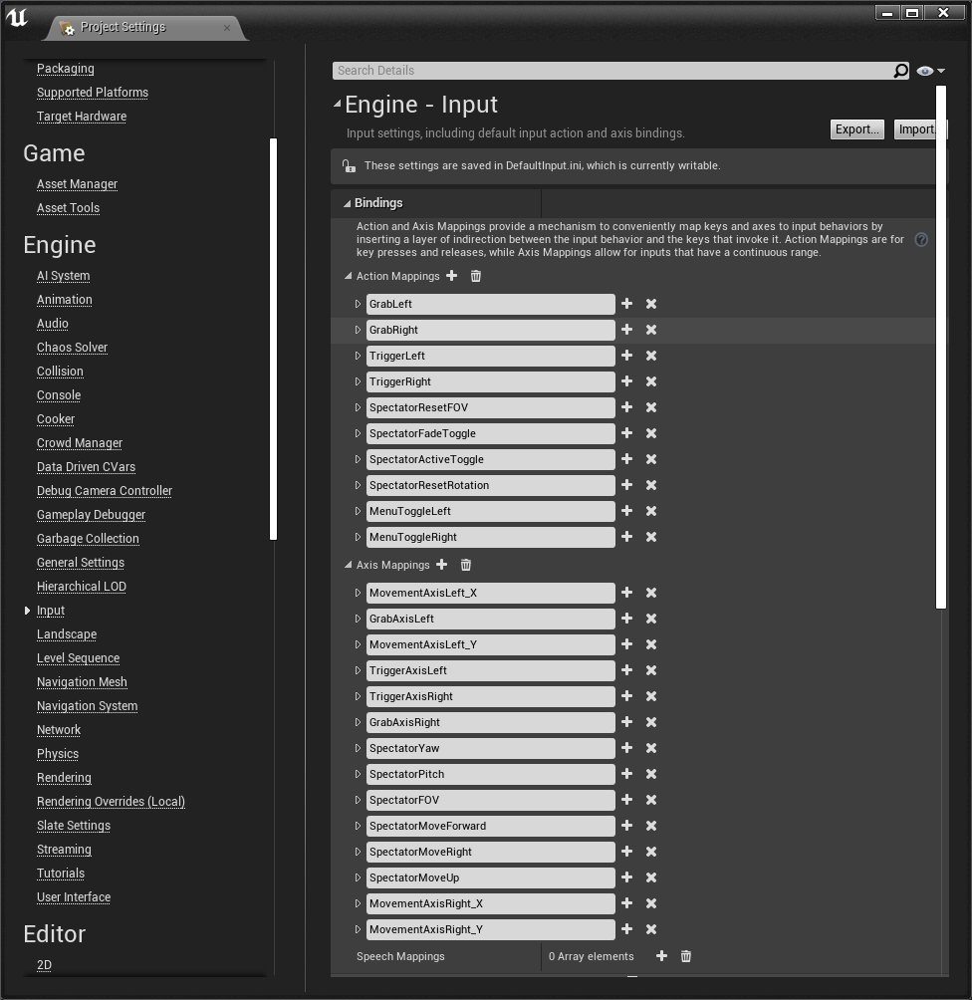
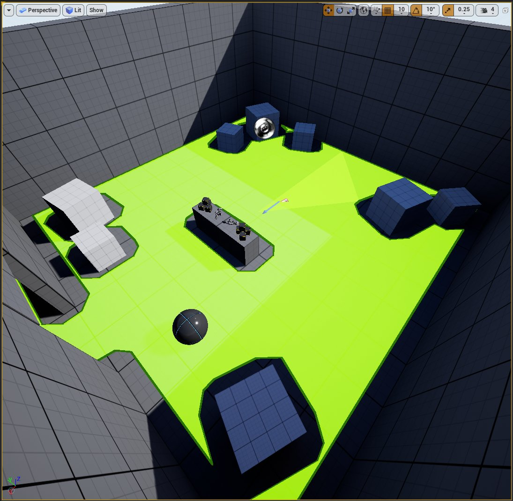

# VR模板

> 路径：虚幻引擎5.7文档 / 分享和发布项目 / XR开发 / XR开发入门 / VR模板

> 原始页面：https://dev.epicgames.com/documentation/unreal-engine/vr-template-in-unreal-engine

**VR模板** 旨在作为 **虚幻引擎** 中所有虚拟现实（VR）项目的起点。该模板封装了传送逻辑、VR观察视角蓝图，以及常见的输入操作逻辑，例如抓取物品和将物品附着到手上。

本页面将介绍VR模板的入门知识以及如何使用该模板来打造自己的VR体验。

## 支持的设备

VR模板与以下设备兼容：

- Oculus Mobile

  - Quest 1
  - Quest 2
- Oculus PC

  - Rift S
  - Quest with Oculus Link
- Steam VR

  - Valve Index
  - HTC Vive
- Windows Mixed Reality

> [!WARNING]
> 你需要先设置你的设备，使其能够在虚幻引擎中进行开发，然后才能使用VR模板。请参阅[XR开发](../../index.md)中的文档，了解如何正确设置你的设备。

## OpenXR

VR模板将使用[OpenXR](../../developing-for-head-mounted-experiences-with-openxr/index.md)框架，这是多家公司的VR和AR开发标准。借助虚幻引擎中的OpenXR插件，模板的逻辑可在多个平台和设备上运行，无需平台专有的检查或调用。

> [!NOTE]
> 虚幻引擎中的OpenXR插件支持扩展插件。你可以在虚幻商城找到扩展插件或创建自己的扩展插件，以便将默认情况下当前不在引擎中的功能添加到OpenXR。

## Pawn、游戏模式和玩家出生点

以下对象将决定VR模板的体验的规则及其设置方式。

| UE对象 | VR模板中的对象名称 | 位置 | 说明 |
| --- | --- | --- | --- |
| [Pawn](../../../../gameplay-systems/gameplay-framework/controllers/player-controllers/index.md) | VRPawn | 内容（Content） > VRTemplate > 蓝图（Blueprints） | 在虚幻引擎中，Pawn是用户的物理呈现，将定义用户如何与虚拟世界交互。在VR模板中，Pawn包含来自运动控制器的输入事件的逻辑。 |
| [游戏模式](../../../../gameplay-systems/gameplay-framework/game-mode-and-game-state/index.md) | VRGameMode | 内容（Content） > VRTemplate > 蓝图（Blueprints） | 游戏模式对象将定义体验规则，例如使用哪个Pawn对象。游戏模式在 **地图和模式（Maps & Modes）** 分段的 **项目设置（Project Settings）** 中设置。 |
| [玩家出生点](../../../../understanding-the-basics/actors-and-geometry/unreal-engine-actors-reference/player-start-actor/index.md) | 玩家出生点（Player Start） | 世界大纲视图（World Outliner） | 玩家出生点Actor将定义Pawn在虚拟世界中的生成位置。对于VR体验，玩家出生点的原点是虚拟世界中的跟踪原点。由于VR模板专为VR中的站立体验而设计，因此玩家出生点位于底层关卡。 |

## 输入

VR模板中的输入基于虚幻引擎中的[操作和轴映射输入系统](../../../../gameplay-systems/input/index.md)。请参阅[使用OpenXR输入](../../making-interactive-xr-experiences/index.md)，详细了解如何使用OpenXR设置输入。

## 运动

VR体验中的运动称为 *移位*。在VR模板中，有两种类型的移位：**传送（Teleport）** 和 **快速转动（Snap Turn）**。在蓝图编辑器中，打开 **VRPawn** 可查看两者的实现方式。

### 传送

传送到关卡中的不同位置：

1. 将右侧运动控制器的拇指杆或触控板朝你想要移动的方向移动。传送可视化工具会在关卡中显示你将移动到的位置。
2. 松开拇指杆或触控板，传送到选中的位置。

### 快速转动

要在不移动你的头部的情况下旋转你的虚拟角色，请沿你想要转动的方向移动左侧运动控制器拇指杆或触控板。

### 设置允许的移动区域

关卡使用[导航网格体](../../../../samples-and-tutorials/content-examples-sample-project/index.md)标记允许用户移动的位置。参见 **NavModifierVolume** 资产 **NavModifier_NoTeleport**，这是如何实现此操作的示例。资产的 **区域类（Area Class）** 参数设置为 **NavArea_Null**，这会阻止用户移动到该体积。

传送查看器在 NavModifier_NoTeleport 体积时消失。

> [!TIP]
> 按下键盘上的P键可切换可导航区域的可视化。
>
> 

## 抓取

VR模板展示了几种不同的方式拾取对象并将对象附着你的手上。

要抓取关卡中的对象：

- 伸向可抓取的对象，然后按住运动控制器上的 **握紧（Grip）** 按钮。
- 这会在你的运动控制器的GripLocation位置周围创建[球体追踪](../../../../gameplay-systems/physics/traces-with-raycasts/traces-in-unreal-engine---overview/index.md)。如果球体中有带有 **GrabComponent** 的 Actor，它就会附着在按下 **握紧（Grip）** 按钮的手上。
- 释放同一运动控制器上的 **握紧（Grip）** 按钮，将对象从你的手上分离。

> [!NOTE]
> 如需为Actor启用抓取功能，请将GrabComponent蓝图添加到Actor中，并在细节面板中选择"抓取（Grab）"类型。在BeginPlay上，组件父节点的碰撞配置设置为PhysicsActor，这是用于VRPawn中的球体追踪的追踪通道。
>
> 你可以打开GrabComponent蓝图类，查看VR模板中抓取功能的实现方式。

### 抓取类型

你可以在对象的 **GrabComponent** 中设置抓取类型，以便定义对象如何附着在你的手上。

**GrabType Enum** 资产中定义了以下抓取类型：

- **自由（Free）**：Actor保持在相对于运动控制器抓取它所在处的位置和方向。以小立方体为例。
- **对齐（Snap）**：Actor具有相对于运动控制器的特定位置和方向。以手枪为例。
- **自定义（Custom）：**借助此选项，你可以使用 **OnGrabbed** 和 **OnDropped** 事件为抓取操作添加自己的逻辑。你还可以利用其他公开的变量，例如 **bIsHeld** 布尔变量，这是一个标记，用于指定对象当前是否由用户持有。你可以创建其他类型的自定义抓取动作，包括双手抓取、转盘、控制杆和其他复杂行为，例如握住时不与几何体重叠的Actor。

> [!TIP]
> 你可以在对象的GrabComponent中设置OnGrabHaptic效果变量，定义抓取对象时的触觉效果。触觉效果的示例包括运动控制器振动。

> [!NOTE]
> GrabComponent中使用的重要函数抽象为使用蓝图接口资产VRInteraction BPI的通用接口。借助此蓝图接口资产，VRPawn可以简化逻辑，避免对每种类型的对象进行多次检查。有关蓝图接口及其优势的更多信息，请参阅[蓝图接口](../../../../blueprints-visual-scripting/specialized-blueprint-visual-scripting-node-groups/types-of-blueprints/blueprint-interface/index.md)。

## 菜单

按运动控制器上的菜单按钮可打开VR模板的菜单。该菜单使用虚幻示意图形（UMG）构建。请参阅[UMG UI设计器](../../../../user-interfaces/umg-editor-reference/index.md)，详细了解如何此工具的用法。

在 **内容浏览器（Content Browser）** 中，**内容（Content）> VR模板（VRTemplate）> 蓝图（Blueprints）> 控件菜单（WidgetMenu）** 是用于设计和创建菜单逻辑的UMG资产，**菜单** 蓝图定义了控制器如何与控件交互。

## VR旁观者

通过[旁观者屏幕模式](../../sharing-xr-experiences/virtual-reality-spectator-screen/index.md)，别人可以在有人使用头戴式显示器（HMD）的情况下观看VR体验。VR模板使用了 **VR旁观者** 蓝图实现旁观者屏幕模式示例。

有两种方法可以在VR模板中启用旁观者模式：

- 在会话期间按 **选项卡（Tab）** 可切换旁观者模式。
- 将 **VRSpectator bSpectatorEnabled** 设置为 **true**。

> [!WARNING]
> VR观众（VR Spectator）与移动VR设备（例如Oculus Quest）不兼容。

你可以通过鼠标和键盘或游戏手柄使用以下输入控制VR观众，从而在虚拟世界中使用HMD查看用户：

| 操作 | 鼠标&键盘输入 | 手柄输入 |
| --- | --- | --- |
| **切换VR旁观者（Toggle VRSpectator）** | Tab键 | 底部面按钮 |
| **向前移动（Move Forward）** | W | 左摇杆上 |
| **向后移动（Move Backward）** | S | 左摇杆下 |
| **向左移动（Move Left）** | A | 左摇杆左 |
| **向右移动（Move Right）** | D | 左摇杆右 |
| **向上移动（Move Up）** | E或空格键 | 右侧肩按钮 |
| **向下移动（Move Down）** | Q | 左侧肩按钮 |
| **俯仰（Pitch）** | 向前或向后移动鼠标 | 右摇杆Y轴 |
| **偏转（Yaw）** | 向左或向右移动鼠标 | 右摇杆X轴 |
| **更改视野（FOV）** | 移动鼠标滚轮 | 右侧扳机键 / 左侧扳机键 |
| **重置视野（Reset FOV）** | 点击鼠标中键 | N/A |
| **切换淡入淡出（Toggle Fade In and Out）** | F | 顶部面按钮 |
| **重置旋转（Reset Rotation）** | R | N/A |

> [!TIP]
> 可以使用VR旁观者作为在同一台PC上实现多人游戏体验的起始点。
