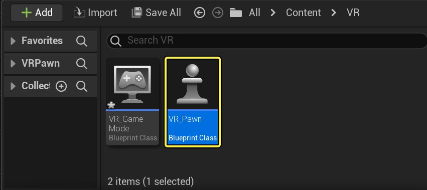
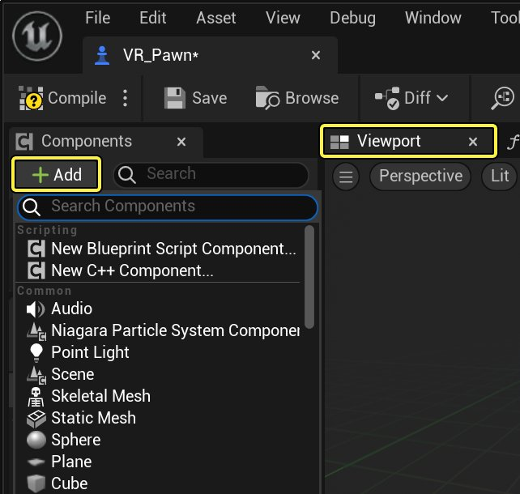
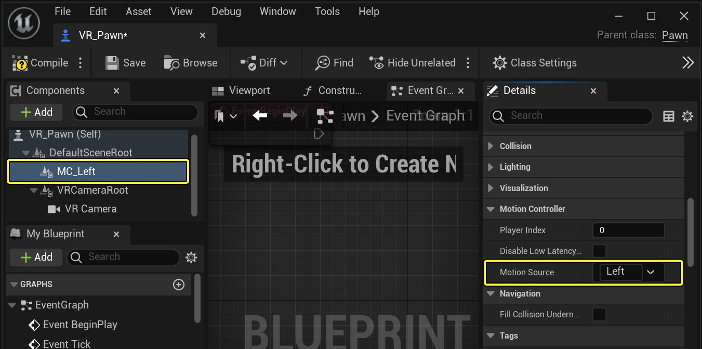
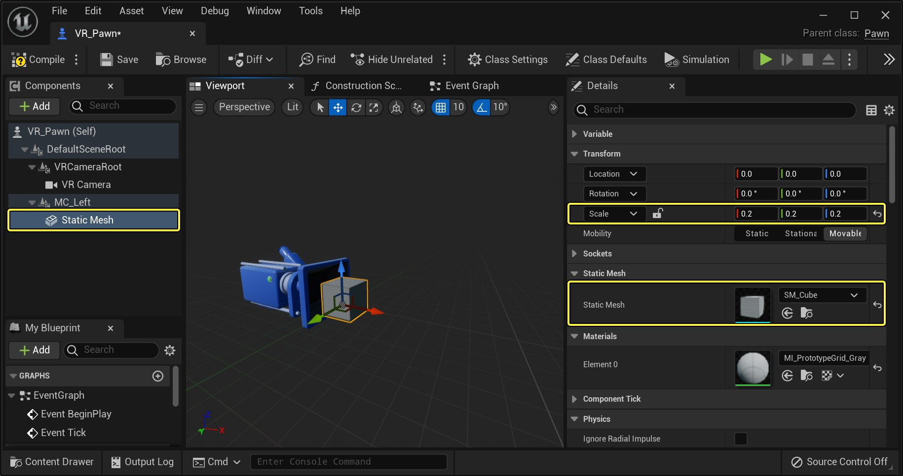
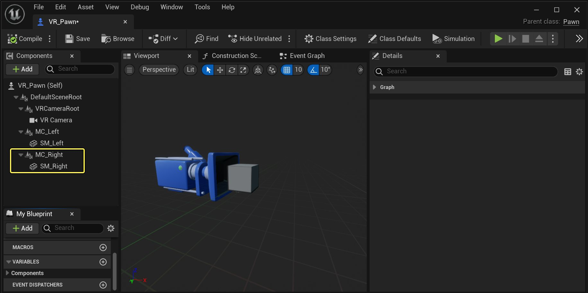
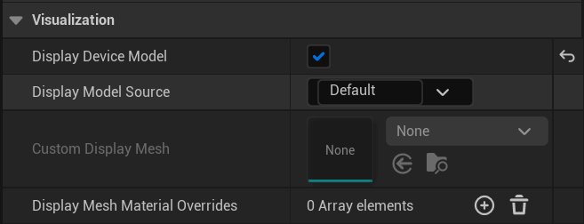

# 运动控制器组件设置

> 路径：虚幻引擎5.7文档 / 分享和发布项目 / XR开发 / 制作交互式XR体验 / 运动控制器组件设置

> 原始页面：https://dev.epicgames.com/documentation/unreal-engine/motion-controller-component-setup-in-unreal-engine

无论你是要针对哪个虚拟现实平台进行开发，添加对运动控制器的支持都可以提升沉浸感和互动程度，而这是无法通过控制器或鼠标和键盘实现的。在以下操作指南中，我们将介绍如何向支持运动控制器的VR平台添加这种支持。

## 支持的平台

"组件（Components）"选项卡中的运动控制器组件将适用于下VR平台。

- Oculus VR
- Steam VR
- Gear VR
- Playstation VR
- Google VR

如果没有列出你开发的目标平台，确保查看平台文档以了解如何设置运动控制器以便使用。

## 运动控制器设置

在下面一节中，我们将介绍如何添加和设置运动控制器工作所需的组件。

> [!NOTE]
> 本操作指南在编写时，假设你已设置了Pawn，以能够与你开发所针对的VR头戴式显示器（HMD）配合工作。如果你不确定如何操作，请查看你开发所针对的VR头戴式显示器（HMD）的[入门指南](../../index.md)。

1. 首先，在 **内容浏览器** 内部，找到并打开 **玩家Pawn** 蓝图。

   

   点击查看大图。
2. 在 **组件（Components）** 部分，单击 **添加组件（Add Component）** 按钮，以显示可以添加到该蓝图的组件。

   

   点击查看大图。
3. 在搜索框中输入 **Motion**，然后单击 **运动控制器（Motion Controller）** 组件以将其添加到组件列表，并将其命名为 **MC_Left**。
4. 选择新添加的运动控制器组件，在 **细节（Details）** 面板的 **运动控制器（Motion Controller）** 部分下面，确保将 **手（Hand）** 设置为 **左（Left）**。

   

   点击查看大图。
5. 接下来，选择 **组件（Components）面板** 中的 **运动控制器组件（Motion Controller Component）**，单击 **添加组件（Add Component）** 按钮，然后搜索并添加 **静态网格体组件（Static Mesh Component）**，将其命名为 **SM_Left**。

   > [!NOTE]
   > 确保该静态网格体组件是运动控制器组件的子代，否则在运动控制器移动时，静态网格体不会跟随。
6. 现在，在静态网格体组件"细节（Details）"面板的 **静态网格体（Static Mesh）** 部分中，输入"静态网格体（Static Mesh）"来表示运动控制器的外观。在本示例中，我们使用简单箱体，但你可以随意使用任何现有的静态网格体。

   

   点击查看大图。
7. 现在，复制整个左手运动控制器设置，然后将 **左（Left）** 替换为 **右（Right）**。还需确保该运动控制器将用于哪只手，方法是前往运动控制器组件，然后将 **手（Hand）** 从"左（Left）"更改为 **右（Right）**。

   

   点击查看大图。
8. 编译并保存你的Pawn蓝图，确保将它放在测试关卡中，然后启动项目。当你戴上HMD，拿起运动控制器时，现在应该能够执行以下视频中显示的操作。

## 运动控制器组件可视化

运动控制器有一个 **可视化（Visualization）** 分类，能让你快速且便捷的添加一个显示模型静态网格体到运动控制器。在默认情况下，系统会试图加载一个与驱动运动控制器的设备相匹配的静态网格体模型。该可视化字段提供下列选项：

| 属性名称 | 说明 |
| --- | --- |
| **显示设备模型（Display Device Model）** | 用于自动渲染一个与设定手关联的模型。 |
| **显示模型源（Display Model Source）** | 确定需要的模型的源。在默认情况下，活跃的XR系统会接受查询并为关联设备提供一个模型（如果有）。注意：如果没有默认模型，这可能会失败；请使用 '自定义' 指定你自己的模型。 |
| **自定义显示网格体（Custom Display Mesh）** | 将显示一个关联到此运动控制器的网格体覆盖。 |
| **显示网格体材质覆盖（Display Mesh Material Overrides）** | 指定显示网格体的材质覆盖。 |

## 培训直播

[OBJECT:TopicCompactVideo] [PARAMLITERAL:title]

Setting Up Motion Controllers

[/PARAMLITERAL] [PARAMLITERAL:videoid]

6ALnsdQnkVQ

[/PARAMLITERAL] [PARAMLITERAL:service]

youtube

[/PARAMLITERAL] [/OBJECT] [OBJECT:TopicCompactVideo] [PARAMLITERAL:title]

Creating Interactions in VR With Motion Controllers Part 1

[/PARAMLITERAL] [PARAMLITERAL:videoid]

eRNtgFo6iU0

[/PARAMLITERAL] [PARAMLITERAL:service]

youtube

[/PARAMLITERAL] [/OBJECT] [OBJECT:TopicCompactVideo] [PARAMLITERAL:title]

Creating Interactions in VR With Motion Controllers Part 2

[/PARAMLITERAL] [PARAMLITERAL:videoid]

utOahIZgKgc

[/PARAMLITERAL] [PARAMLITERAL:service]

youtube

[/PARAMLITERAL] [/OBJECT] [OBJECT:TopicCompactVideo] [PARAMLITERAL:title]

Creating Interactions in VR With Motion Controllers Part 3

[/PARAMLITERAL] [PARAMLITERAL:videoid]

fcmRGkpWefY

[/PARAMLITERAL] [PARAMLITERAL:service]

youtube

[/PARAMLITERAL] [/OBJECT]
