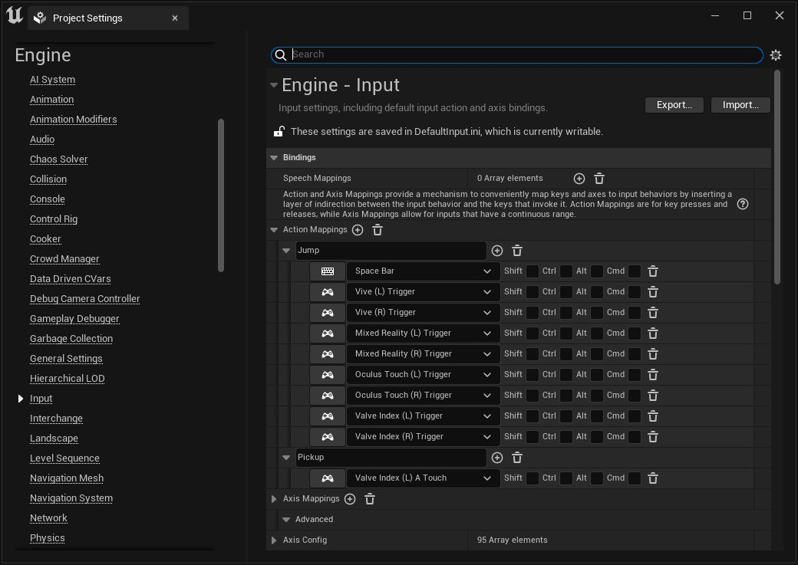

# OpenXR输入

> 路径：虚幻引擎5.7文档 / 分享和发布项目 / XR开发 / 制作交互式XR体验 / OpenXR输入

> 原始页面：https://dev.epicgames.com/documentation/unreal-engine/openxr-input-in-unreal-engine

OpenXR运行时使用[交互配置文件](https://www.khronos.org/registry/OpenXR/specs/1.0/html/xrspec.html#semantic-path-interaction-profiles)来支持各种硬件控制器，并为控制器连接到的任何设备提供操作绑定。虚幻引擎中的OpenXR输入映射依赖[操作映射输入系统](../../../../gameplay-systems/input/index.md)来将操作连接到OpenXR交互配置文件。有关如何使用操作映射输入系统的指南，请参见[创建新输入](../../../../gameplay-systems/input/setting-up-user-inputs/index.md)。

OpenXR输入系统旨在通过模拟未使用虚幻项目中的 **操作映射（Action Mappings）** 显式指定的任何控制器映射来提供跨设备兼容性。在模拟控制器映射时，OpenXR运行时将会选择与用户控制器密切匹配的控制器绑定。 由于OpenXR提供了这种跨设备兼容性，因此你只需要为你支持并可以进行测试的控制器添加绑定。你为控制器指定的任何绑定都会定义连接到该控制器的操作。如果你仅将绑定部分应用到控制器，则控制器不会支持任何缺失的绑定。 在下例中，项目具有两个操作：**跳跃（Jump）** 和 **拾取（Pickup）**。

- 跳跃（Jump）

  映射到多种控制器上的键，例如

  Vive Index (L)触发器（Vive Index (L) Trigger）

  和

  Oculus Touch (L)触发器（Oculus Touch (L) Trigger）

  。
- 拾取（Pickup）

  仅映射至

  Valve Index (L) A Touch

  。 在这种情况下，OpenXR运行时将不会在任何其他控制器上模拟

  拾取（Pickup）

  操作，因为这些控制器绑定了

  跳跃（Jump）

  ，但没有绑定

  拾取（Pickup）

  。如果从

  跳跃（Jump）

  中移除了其他控制器的键，则OpenXR运行时将无法为模拟器模拟

  跳跃（Jump）

  和

  拾取（Pickup）

  。

> [!WARNING]
> 某些运行时可能支持单个配置，无法模拟其他配置。你应该尽可能多的设备添加绑定。

## 姿势

OpenXR提供了两个姿势来表示用户在执行操作时应该使用的手势：

- 抓握（Grip）：

  表示用户为了抓住虚拟对象而抓握时的位置和方向。
- 瞄准（Aim）：

  表示从用户的手或控制器延伸出的光线，用于指向目标。 如需这两种姿势的详细信息，请参见OpenXR

  规格

  。在虚幻引擎中，如果这两种姿势可供你的设备使用，则表示为动作源，并在调用

  枚举动作源

  时作为结果返回。

> [!NOTE]
> 虚幻引擎使用的坐标系与OpenXR规格中规定的坐标系不同。虚幻使用左旋坐标系：+X表示向前，+Z向上，而+Y向右。

> [!TIP]
> 启用 **OpenXRMsftHandInteraction** 插件，在支持此扩展插件的运行时上复制所追踪手的OpenXR抓握和瞄准姿势。 Openxr hand interaction plugin
