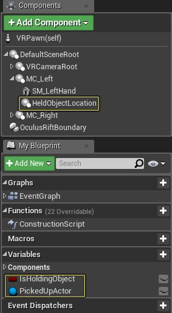
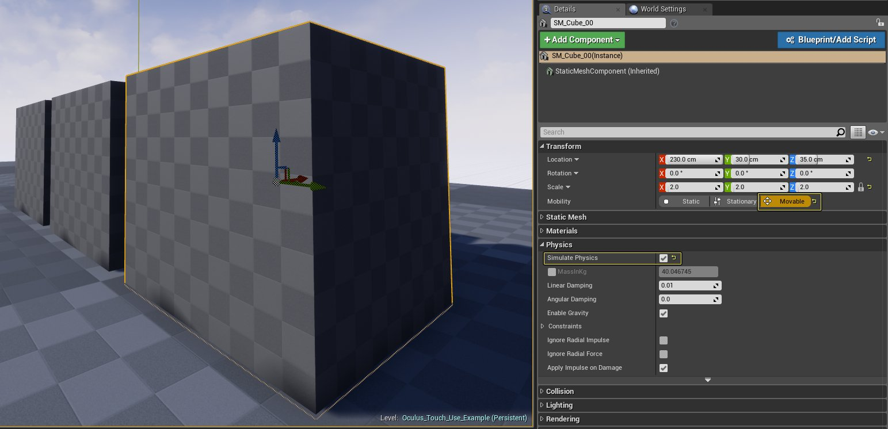

# 使用运动控制器

> 路径：虚幻引擎5.7文档 / 分享和发布项目 / XR开发 / 制作交互式XR体验 / 使用运动控制器

> 原始页面：https://dev.epicgames.com/documentation/unreal-engine/using-motion-controllers-in-unreal-engine

为 UE4 项目添加运动控制器支持能够增加体验的代入感和真实感。用运动控制器拾取放置在世界场景中的物体是让这种代入感和真实感更上一层楼的方法之一。以下文档将说明如何为 UE4 VR 项目添加运动控制器支持。

## 设置运动控制器

以下部分将说明如何设置运动控制器，使其能够捡起和放置关卡中放置的物体。

### 组件、变量和事件设置

开始为事件图表添加节点之前，首先需要创建并设置一些组件和变量。以下部分说明需要哪些组件和变量，以及它们所需要的设置。

| 组件/变量类型 | 名称 | 值 |
| --- | --- | --- |
| **Scene** | HeldObjectLocation | X:38, Y:0, Z:0 |
| **Boolean** | IsHoldingObject | false |

点击查看大图。

> [!NOTE]
> 必须将 **Held Object Location** 设为 **MC_Left** 的子项，这就是物体被捡起时所放置的位置。

你还需要创建两个 **自定义事件**，并将它们命名为：

| 节点名称 | 值 |
| --- | --- |
| **PickUpObject** | N/A |
| **DropObject** | N/A |

### 拿起和放置物品

拿起和放置物品（Holding and Dropping of Items）部分调用不同的自定义事件，处理拿起物品、持有物品和放置物品。用户按下或松开左运动控制器扳机键即可使用此功能。需要注意的一点是我们使用了一个 Branch 语句来确保一次只能拾取一个物体。这点非常重要，因为我们希望用户一次只能拾取一个物体。

点击左上角的 Copy Node Graph 即可复制这部分的蓝图代码。

### 拾取对象的事件

Pick-Up Object Event 部分处理寻找可拾取物体和拾取物体的所有逻辑。虽然这是一个函数，但可以拆分为两个部分。以下部分将讲述这两个部分及其作用。

1. Pick-Up Object Event 的第一个部分负责在世界场景中寻找满足拾取条件的物体。为实现此功能，用户的左运动控制器将从正前方投射 1000 CM 的光线到世界场景中。此光线还将得到指令，忽略物体类型（Object Type）不为物理形体（Physics Body）的物体。

   点击左上角的 Copy Node Graph 复制这部分的蓝图代码。

   > [!NOTE]
   > 为便于进行测试，**Draw Debug Type** 已被设为 **Duration**，便于我们对投射到世界场景中光线进行调试。准备在生产中进行使用后，需要将 Draw Debug Type 设为 **None**。
2. Pick-Up Object Event 的第二个部分负责找到可拾取物体后进行的操作。找到物体后，**Break Hit Result** 节点将获取命中物体的更多信息。因此，我们将利用它来确定命中的 Actor 和组件具体是什么。物理在该物体上禁用，而此物体则附加到 **Held Object Location** 节点，而此节点又附加到左运动控制器。最后将变量 **IsHoldingObject** 设为 true，确保不会拾取其他物品。

### 放下对象的事件

Drop Object Event 部分负责处理放置已拾取物体的全部逻辑并进行重置，以便拾取其他物品。Drop Event 执行的首个操作是进行检查，确保用户手中持有可放置的物品。如用户手中持有物品，则该物品与运动感控制器的连接将被解除，物体的物理也将重新启用，使其能够落在地上。最后，Hit Component 和 Picked Up Actors 变量的旧数据也将被清除，便于保存新拾取的物体。

### 完成的蓝图

蓝图完成后，我们需要在世界场景中添加一些物体进行拾取。我们要拾取的物体必须拥有物理形体，因此可以添加一些静态网格体，并将其 **Mobility** 设为 **Movable**，并启用 **Simulate Physics**。

点击查看大图。

然后将 VRPawn 放置到世界场景中，并将 **Auto Possess Player** 设为 **Player 1**，然后用 VR 预览启动项目。接下来即可戴上 Rift 头戴显示器并拿起运动控制器，用左运动控制器瞄准需要拾取的物体，然后按下扳机键进行拾取。松开扳机键放置物体，然后拾取另一个物体，效果如以下视频所示。

你可以将下方的蓝图复制粘贴到你的 VRPawn 蓝图中。请注意：复制到新蓝图上时需要创建所有必需的变量和组件。

点击左上角的 Copy Node Graph 即可复制这部分的蓝图代码。
