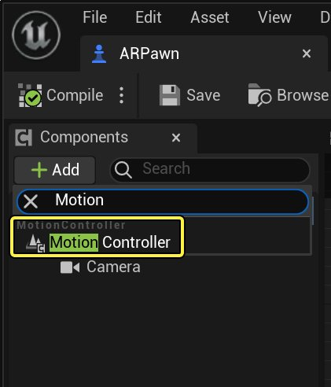
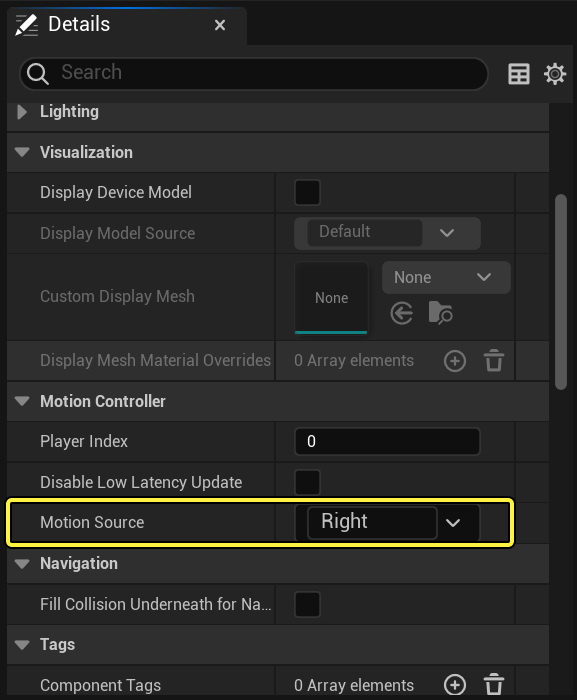
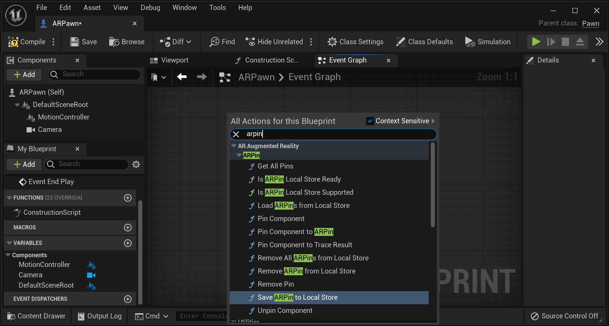
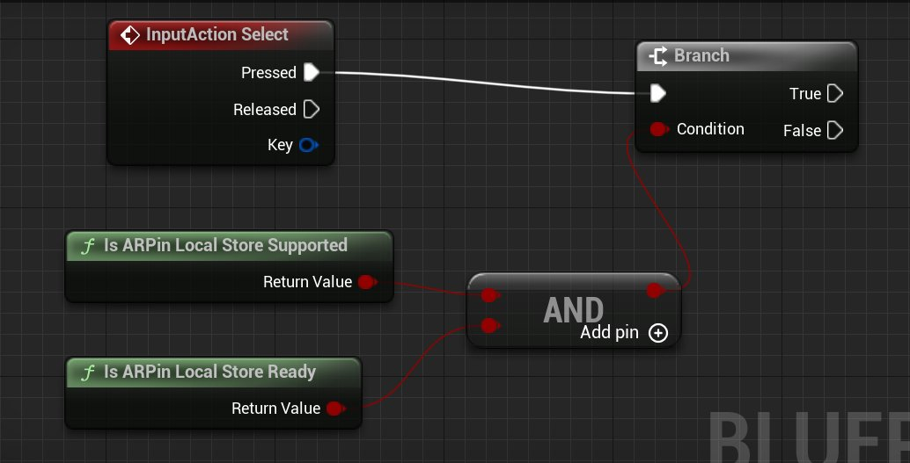
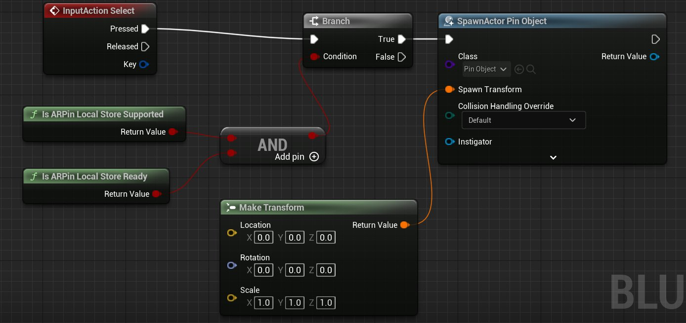
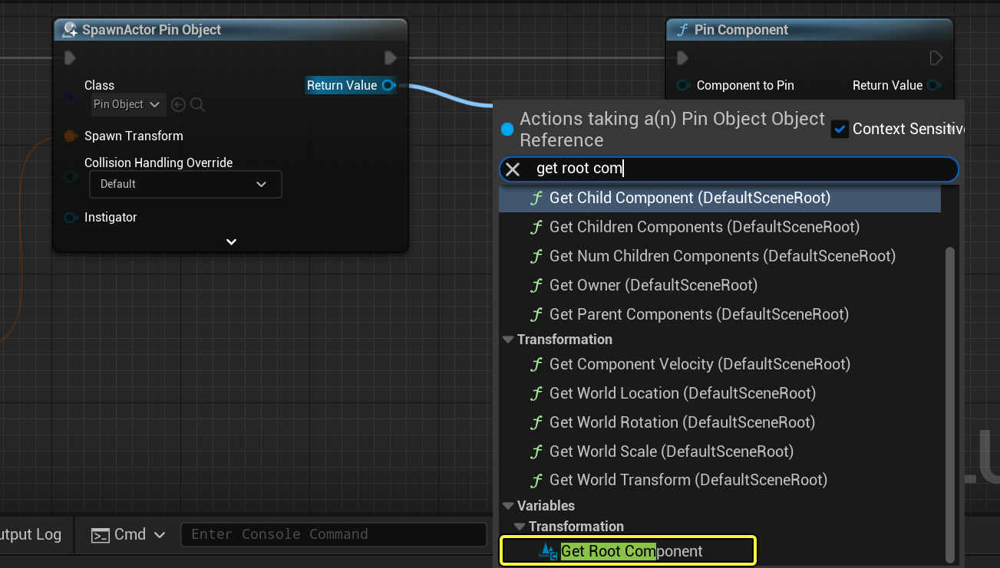
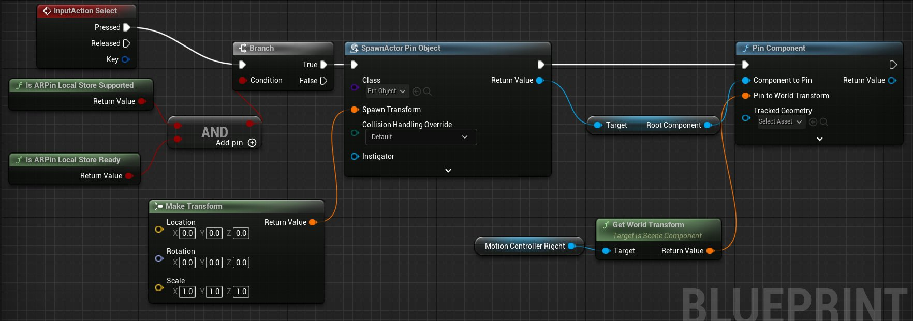
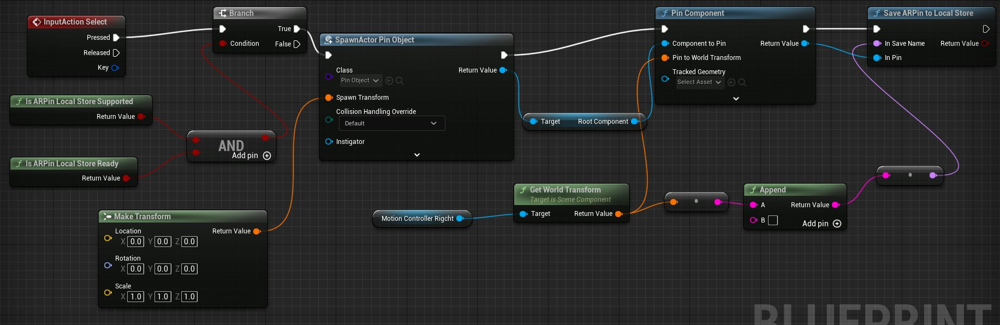

# ARPin本地存储快速入门

> 路径：虚幻引擎5.7文档 / 分享和发布项目 / XR开发 / 共享XR体验 / ARPin / ARPin本地存储快速入门

> 原始页面：https://dev.epicgames.com/documentation/unreal-engine/arpin-local-storage-quick-start-in-unreal-engine

> [!NOTE]
> 本文针对早期版本的虚幻引擎，可能包含当前版本的UE已经废弃的内容。

此快速入门指南将带你了解如何在AR中设置固定的现实世界位置，你可以在虚幻引擎中将虚拟内容附加到该位置。本例中以HoloLens为平台。

通过本指南，你将了解以下流程：

- 将ARPin保存在本地设备上。
- 删除本地ARPin。
- 加载本地ARPin。

> [!TIP]
> 开始之前，确保你的项目已执行了AR设置。参见[设置新的AR项目](https://dev.epicgames.com/documentation/404)，然后继续。

> [!NOTE]
> ARPin本地存储仅适用于特定平台。自5.1版起，支持Windows Mixed Reality插件和一些OpenXR扩展插件，例如Microsoft OpenXR插件。如需详细了解平台支持信息，参见[ARPin](../index.md)文档。

## 步骤1 - 添加并保存ARPin

按照以下步骤在3D空间中生成虚拟对象，并使用ARPin保存数据。首先需要设置 **SpawnActor函数**，然后连接到 **固定组件（Pin Component）**，将该对象固定到特定位置。

**注意：**本指南使用HoloLens平台提供的用户手部位置作为生成位置要访问HoloLens的运动控制器信息，执行以下步骤：

1. 在蓝图编辑器中向ARPawn添加组件 **运动控制器（Motion Controller）**。

   
2. 在细节（Details）面板中，将 **运动源（Motion Source）** 设置为 **右（Right）** 手，以匹配放置引脚的手。

   

### 设置Spawn Actor函数

按照以下步骤设置Spawn Actor函数。本节中，虚拟内容使用名为 **Pin Object** 的自定义[蓝图Actor](../../../../../blueprints-visual-scripting/specialized-blueprint-visual-scripting-node-groups/types-of-blueprints/blueprint-class-assets/index.md)。

1. 双击项目的[Pawn](../../../../../gameplay-systems/gameplay-framework/pawn/index.md)，在 **蓝图编辑器（Blueprint Editor）** 中打开。
2. 在蓝图编辑器的 **事件图表（Event Graph）** 选项卡中点击右键并搜索名称，从而添加以下函数：

   - Is ARPin Local Store Supported
   - Is ARPin Local Store Ready

     

     点击查看大图
3. 将这两个函数的布尔返回值作为 **AND** 逻辑节点的输入。将ADN节点的结果连接到 **Branch** 节点。此设置可确保在执行任何ARPin函数之前两个场景都是正确的。

   
4. 从Branch节点添加 **SpawnActor from Class** 函数。然后，将节点的 **类（Class）** 参数设置为 **引脚对象（Pin Object）**。
5. 添加 **Make Transform** 函数，指定对象生成时相对于生成位置的本地变换。保留本地空间的默认值，因为稍后会指定世界变换。

   

   点击查看大图

   > [!TIP]
   > 欲了解如何在项目中添加输入操作，参见[输入](../../../../../gameplay-systems/input/index.md)，了解常规输入操作。

### 添加Pin Component

按照以下步骤固定上一节中生成的对象。**SpawnActor from Class** 函数返回 **对象（Object）**。但 **Pin Component** 函数需要 **场景组件（Scene Component）**。为了固定对象，抓取对象的根组件，这是定义对象变换的场景组件。

1. 添加函数 **Pin Component**。
2. 从SpawnActor节点拖出 **返回值（Return Value）** 引脚，并选择 **Get Root Component**。

   

   点击查看大图
3. 在事件图表中点击右键，搜索保存对象待固定位置的变量。为了在HoloLens上生成手的位置，搜索 **Get Motion Controller**。将它添加到图表。
4. 将该变量作为 **目标（Target）** 传递到函数 **GetWorldTransform**。然后，将函数的 **返回值（Return Value）** 传递到 **Pin Component** 节点的 **固定到世界变换（Pin to World Transform）** 输入。 世界变换将定义组件固定至的世界空间位置。

   

   点击查看大图
5. 添加函数 **Save ARPin to Local Store** 并传递 **ARPin Object Reference**，后者由 **Pin Component** 返回到Save ARPin to Local Store节点的 **In Pin** 输入。确保每个引脚都有一个唯一的保存名称。然后，将世界变换转换为 **字符串（String）**，以设置该保存名称。

   

   点击查看大图
6. 在AR设备上运行应用程序。执行选择(R)操作时，引脚对象将显示，且ARPin本地存储为ARPin添加条目。

   > 动图已省略：在AR中添加和删除对象

> [!TIP]
> 对于HoloLens，你可以查看保存在Windows开发人员门户本地的所有引脚。 saved pins in Windows Developer Portal

## 步骤2 - 移除ARPin

按照以下步骤从本地存储中移除ARPin，并销毁与之关联的虚拟内容。

1. 调用 **Get All Pins** 并添加 **For Each Loop** 节点，以遍历返回的ARPin数组。

   > 图片已省略：undefined

   点击查看大图
2. 添加函数 **Remove Pin** 以停止更新已固定的组件。

   > 图片已省略：undefined

   点击查看大图
3. 添加函数 **Destroy Actor** 以移除虚拟引脚对象。调用 **Get Pinned Component** 和 **Get Owner** 以从ARPin及其固定的场景组件中获取Actor。

   > 图片已省略：undefined

   点击查看大图
4. 添加函数 **Remove All ARPins from Local Store** 以在遍历所有ARPin并销毁已固定组件之后，从本地存储中移除所有已保存的引脚。

   > 图片已省略：undefined

   点击查看大图
5. 在AR设备上运行应用程序。执行 **选择(L)** 操作时，引脚对象将不显示，且ARPin本地存储移除ARPin的条目。

   > 动图已省略：在AR环境中添加对象

## 步骤3 - 加载ARPin

按照以下步骤加载应用程序上一个会话中保存在设备上的所有ARPin，并再次为ARPin生成虚拟内容。

1. 调用 **Load ARPins from Local Store** 以访问保存在本地设备上的所有ARPin。

   > 图片已省略：undefined

   点击查看大图
2. **Load ARPins from Local Store** 返回ARPin名称的贴图。要遍历贴图中的项目，使用 **Values** 函数将贴图转换为数组。要访问数组中的每个项目，添加 **For Each Loop** 节点。

   > 图片已省略：undefined

   Click image to expand.
3. 在循环主体中，使用默认 **Make Transform** 函数调用 **SpawnActor from Class**。使用变换的默认值，除非你要将对象从预期生成位置偏移。

   > 图片已省略：undefined

   点击查看大图
4. 使用 **Get Root Component** 将返回的对象转换为 **场景组件（Scene Component）**，并传递到 **Pin Component to ARPin**。

   > 图片已省略：undefined

   点击查看大图
5. 在你的AR设备上运行应用程序，并创建几个ARPin。重启应用程序，并看到之前创建的所有引脚在应用程序启动时都显示在相同的位置。

   AR环境中的当前固定点 AR环境中已加载的固定点

   为了区分已加载的引脚和新创建的引脚，对象使用了不同的材质。

## 第4步 - 自行尝试

本指南中，你创建了存储在本地设备上的ARPin。要创建使用云计算服务（例如[Azure](https://azure.microsoft.com/en-us/)）存储，并可在多个设备和平台之间共享的引脚，参见Microsoft的[虚幻引擎中的Azure空间锚](https://docs.microsoft.com/en-us/windows/mixed-reality/develop/unreal/unreal-azure-spatial-anchors)文档。
