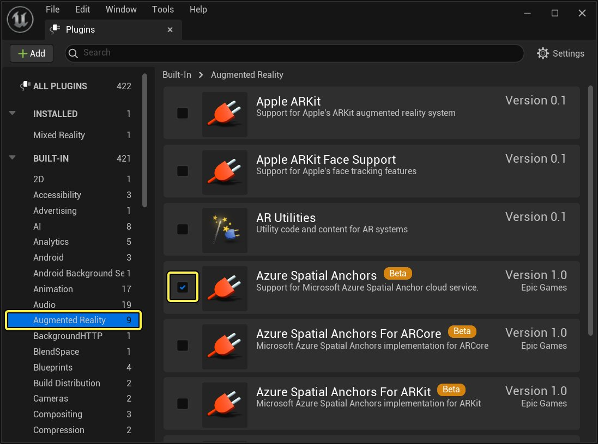

# ARPin概述

> 路径：虚幻引擎5.7文档 / 分享和发布项目 / XR开发 / 共享XR体验 / ARPin / ARPin概述

> 原始页面：https://dev.epicgames.com/documentation/unreal-engine/arpin-overview-in-unreal-engine

**ARPin** 是增强现实（AR）中的固定的现实世界位置，你可以在虚幻引擎将虚拟内容附加到该位置。ARPin API在所有平台中都是一样的，但每个平台都有自己的ARPin数据实现方法。如果底层平台支持追踪现实世界的位置或现实世界的几何体，则此功能可提高ARPin位置的稳定性，使这些位置保持锁定到现实世界中对应的位置或几何体。

> 动图已省略：在AR环境下添加和删除引脚的示例

## 存储ARPin数据

除了将虚拟内容锁定到特定位置或几何体，部分平台还支持将位置数据存储在本地或云端。能够存储位置数据意味着，虚拟内容可以通过某些实现在应用程序会话与多用户体验之间保持一致。

下表介绍哪些AR平台支持将ARPin数据存储在本地或使用[Microsoft Azure](https://azure.microsoft.com/en-us/)云服务存储在云端。

| 平台 | ARPin平台实现 | ARPin持久性平台实现 | 支持ARPin本地存储功能？ | 支持Azure空间锚？ |
| --- | --- | --- | --- | --- |
| ARCore | 锚 | 云锚 | 否 | 是 |
| ARKit | ARAnchor | ARGeoAnchor | 否 | 是 |
| Magic Leap | PersistentCoordinateFrame (PCF) | PersistentCoordinateFrame (PCF) | 是，使用Magic Leap ARPin功能。 | 否 |

## 本地存储ARPin

将数据存储在本地AR设备上，内容可在应用程序会话中持久留存。有关如何在项目中添加ARPin功能的详情，参见[ARPin快速入门](../arpin-local-storage-quick-start/index.md)。

## 将ARPin存储在云端

可以通过Azure空间锚、带ARCore的云锚和带ARKit的Geo Anchor，将ARPin存储在云端。

### Azure空间锚点

将数据存储在云端意味着，虚拟内容和现实世界位置可随时在多个设备和平台之间共享。Azure空间锚是一种云实现，作为插件包含在虚幻引擎中，可以使用Microsoft Azure存储和检索ARPin数据。[Azure空间锚](https://docs.microsoft.com/en-us/azure/spatial-anchors/overview)受多个AR平台支持，其中包括：

- 支持ARCore的Android设备
- 支持ARKit的iOS设备

> [!NOTE]
> Azure空间锚需要用到[Azure](https://azure.microsoft.com/en-us/)账号。

若要在项目中使用Azure空间锚，启用 **Azure空间锚（Azure Spatial Anchors）** 插件和特定于平台的Azure空间锚插件。

点击查看大图。

具体如何在项目中使用Azure空间锚，参见虚幻引擎中Microsoft的[Azure空间锚文档](https://docs.microsoft.com/en-us/windows/mixed-reality/develop/unreal/unreal-azure-spatial-anchors)。

### 带ARCore的云锚

除了能够在支持ARCore的设备上使用Azure空间锚，Google在云中的ARPin平台实现[云锚（Cloud Anchor）](https://developers.google.com/ar/develop/java/cloud-anchors/overview-android)通过[UGoogleARCoreServicesFunctionLibrary](https://docs.unrealengine.com/en-US/API/Plugins/GoogleARCoreServices/UGoogleARCoreServicesFunctionLib-/index.html)在虚幻引擎中公开。

要使用API：

1. 通过调用 `UGoogleARCoreServicesFunctionLibrary::CreateAndHostCloudARPin()`，根据现有ARPin创建云ARPin。
2. 创建云ARPin后，调用 `UCloudARPin::GetCloudID()` 可以访问云ID，即该引脚独有的uuid。
3. 你可以在任何给定时间内通过调用 `UGoogleARCoreServicesFunctionLibrary::CreateAndResolveCloudARPin()` 来解析之前创建的云ARPin。如果解析成功，该云ARPin将提供引脚的世界变换，显示该引脚在物理世界中的创建位置。

### 带ARKit的Geo Anchor

除了能够在支持ARKit的设备上使用Azure空间锚，Apple在云中的ARPin平台实现[ARGeoAnchor](https://developer.apple.com/documentation/arkit/argeoanchor)在虚幻引擎中公开，作为[UARTrackedGeometry](https://docs.unrealengine.com/en-US/API/Runtime/AugmentedReality/UARTrackedGeometry/index.html)的一个子类。

要使用API：

1. 查询[UARGeoTrackingSupport::GetGeoTrackingSupport()](https://dev.epicgames.com/documentation/404)。
2. 如果返回的对象可用，则调用该对象上的函数。例如，要新建Geo Anchor，使用函数 `UARGeoTrackingSupport::AddGeoAnchorAtLocation()`。
