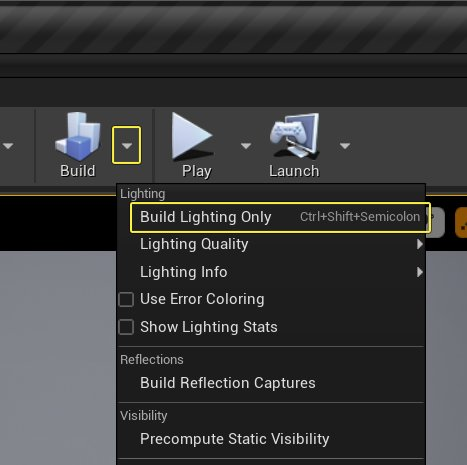
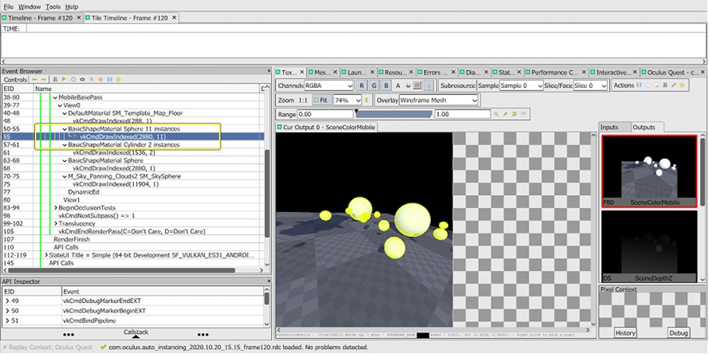
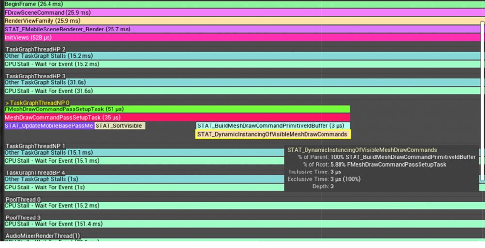
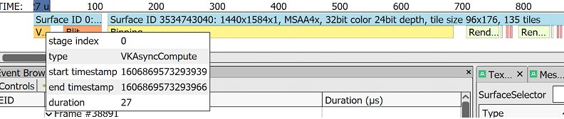

# Oculus上的自动实例化

> 路径：虚幻引擎5.7文档 / 分享和发布项目 / XR开发 / 支持的XR设备 / Oculus开发 / Oculus上的自动实例化

> 原始页面：https://dev.epicgames.com/documentation/unreal-engine/auto-instancing-on-oculus-in-unreal-engine

**绘制调用（Draw Call）** 是RHI绘制对象的指令。**自动实例化** 这项功能会自动将多个绘制调用组合到一个实例化的绘制调用中。如果你拥有多种不同属性的相似对象，**实例化绘制** **调用** 就是用图形API绘制这些对象的多种实例的一种方法。这些对象可能拥有不同的属性，并且与网格体的渲染有关：例如位置、方向、颜色等等。

你可以将多个调用组合成一个调用，从而在提交图形API绘制调用时减少CPU的开销。你还可以将所有图形调用组合为一个，不过这么做需要有顶点缓冲区、统一缓冲区、着色器、光栅化模式以及其它兼容所有绘制调用的图形API状态。

> [!NOTE]
> 每个引擎的兼容要求可能有所差异，这要取决于引擎对其绘制调用施加的限制。

当自动实例化无法组合绘制调用时，通常是因为它违反了隐藏的兼容要求。理解虚幻自动实例化的工作原理可以帮助你完成调试，并发现未来的新要求。

确保启用以下CVar：

- **r.Mobile.SupportGPUScene=1** 必须在.ini文件夹中手动设置为1，因为不是所有安卓设备都支持计算着色器。
- **r.MeshDrawCommands.DynamicInstancing** 默认设置为1，所以不需要手动设置。
- **r.MeshDrawCommands.UseCachedCommands** 默认设置为1，所以不需要手动设置。

## 常见的实例化不兼容

如果是使用了光照材质的静态网格体组件，[请确保构建了光照贴图](../../../../../working-with-content/static-meshes/understanding-lightmapping/index.md)。



如果没有构建光照贴图（或者它们失去时效），UE4会使用一个[间接光照缓存](../../../../../building-virtual-worlds/lighting-the-environment/global-illumination/indirect-lighting-cache/index.md)来替代它们。间接光照缓存会通过使用 **统一缓冲区**（在DirectX中叫做 **常量缓冲区**）将照明数据传给一个绘制调用，这样可以防止绘制调用组合，因为统一缓冲区应该对每个绘制调用都是唯一的。

光照贴图不会有这个问题，因为它们的数据通道是专为支持实例化而有意设计的。

要在编辑器中测试自动实例化：

1. 确保 **视图模式** 为 **光照**、**细节光照** 或 **反射**。这是非常必要的步骤，因为许多调试视图模式都不兼容光照贴图数据通道。
2. 确保以下模式为 **开启**：

   - **显示 > 高级 > LOD父处理**
   - **显示 > 光照功能 > 体积光照贴图**
   - **显示 > 光照功能 > 间接光源缓存**
3. 确保以下模式为 **关闭**：

   - **视图模式 > 光照贴图密度**
   - **视图模式 > 细节层级着色 > 网格体LOD着色**
   - **视图模式 > 细节层级着色 > 层级LOD着色**
   - **显示 > 高级 > BSP分割**
   - **显示 > 高级 > 属性着色**
   - **显示 > 高级 > 网格体边缘**
   - **显示 > 高级 > 光照影响**
   - **显示 > 高级 > 质量属性**

> [!NOTE]
> 当在编辑器中测试时，如果`IsRichVew`返回为True，则所有`FStaticMeshSceneProxy` 都会失去`bStaticRelevance`并获得`bDynamicRelevance`。这样可以间接使得自动实例化排除静态网格体。
>
> 上述调试视图模式可能使得`IsRichVew`返回为True。

## 验证

使用CVar **r.MeshDrawCommands.LogDynamicInstancingStats 1** 可以查看自动实例化的状态。这个控制台指令可以打印出绘制调用减少的因数，也就是在实例化合并前后绘制调用数量的比率。

如果你想知道这个软件里发生了什么，请使用[RenderDoc](../../../../../designing-visuals-rendering-and-graphics/optimizing-and-debugging-projects-for-realtime-rendering/using-renderdoc/index.md)做一次捕捉。你应该会看到多个对象被组合为一个实例化绘制调用：



点击放大。RenderDoc会报告注解中实例的数量。注解由虚幻引擎发出。

## 它如何运作

因为这个系统较为复杂，我们不可能列出所有实例化不兼容的原因，但是可以展示基础的内部函数，让你在需要调试实例化不兼容时有更深的理解。

在查看自动实例化运作的源代码之前，请先关闭以下CVar：

- **r.ParallelInitViews=0**
- **r.MeshDrawCommands.ParallelPassSetup=0**

### 缓存的绘制调用

每个绘制调用都有相关的`FCachedMeshDrawCommandInfo::StateBucketId`，这是一个32位的整数，可以缓存绘制调用。

虚幻会缓存`StaticMeshComponent`，它不会更改性能。该行为由`r.MeshDrawCommands.UseCachedCommands`控制，默认设置为 **1**。

这意味着当绘制调用被缓存时，就会计算`FCachedMeshDrawCommandInfo::StateBucketId`的值。它会在`FCachedPassMeshDrawListContext::FinalizeCommand`中进行。`FCachedMeshDrawCommandInfo::StateBucketId`的计算取决于`FMeshDrawCommand::GetDynamicInstancingHash`计算的哈希值评估。在该函数中，你可以看到哈希值取决于以下属性：

- `IndexBuffer`
- `VertexBuffers`
- `VertexStreams`
- `PipelineId`
- `DynamicInstancingHash`
- `FirstIndex`
- `NumPrimitives`
- `NumInstances`
- `IndirectArgsBufferOrBaseVertexIndex`
- `NumVertices`
- `StencilRefAndPrimitiveIdStreamIndex`

`IndexBuffer`、`VertexBuffers`、`VertexStreams`和`NumVertices`是由静态网格体决定的；因此你的所有对象都需要引用同一个静态网格体。`PipelineId`由材质和渲染器决定。`DynamicInstancingHash`也由材质决定。剩余的属性与UE4的一般用例无关。

### 未缓存的绘制调用

`MeshPassProcessor.h`中的`FVisibleMeshDrawCommand`类代表了动态生成的未缓存的绘制调用，例如SkeletalMeshComponent或其它编辑器控件。不过目前它还无法使用，而且从UE4.25开始，未缓存的绘制调用不支持自动实例化。

### 材质

由于`PipelineId`和`DynamicInstancingHash`的原因，绘制调用的实例化兼容可能取决于材质。`PipelineId`受到材质的混合模式和着色模型选择的影响。使用不同的混合模式和着色器模型会导致不同的管线状态对象。`DynamicInstancingHash`是由`FMeshDrawShaderBindings::GetDynamicInstancingHash`函数计算的。以下属性决定了输出哈希值的属性。

| 属性 | 描述 |
| --- | --- |
| `LooseParametersHash` | 它是从材质纹理计算的哈希值的累积。 |
| `UniformBufferHash` | 参考材质参数的使用或[材质参数集](../../../../../designing-visuals-rendering-and-graphics/unreal-engine-materials/material-functions/index.md)。 |
| Size（大小）, frequencies（频率） | 这两个都是由材质生成的着色器结果决定的。 |

如果两种材质引用了同样的纹理集和统一缓冲区，那么二者就是兼容的。该统一缓冲区需要：简洁光照缓存能够防止实例化；上传带有唯一统一缓冲区的光照数据，因此可更改`UniformBufferHash`。

> [!NOTE]
> 从虚幻引擎4.25版本开始，使用材质参数和参数集就不会防止实例化了。虚幻材质表达式缓存让相同参数的混合到相同的统一缓冲区。

## CPU开销

自动实例化会在视锥剔除之后发生，这意味如果屏幕上的一些内容不可见，它就不会参与绘制调用的合并，这样可以节省计算开销。

但是，分类和组合绘制调用依然会在CPU周期产生开销；这意味只有当你知道自己的场景是由无法实例化的不兼容组件组成时，才应该关闭自动实例化。

通过检查CPU合并绘制调用的开销，表明该操作开销非常低（对移动端VR而言）。它们也会被分布到多个核心中。



`STAT_DynamicInstancingOfVisibleMeshDrawCommands`是一项CPU追踪活动，它会呈现收集可兼容绘制调用时的CPU开销。

## GPU开销

GPU开销与计算着色器如何将图元的统一缓冲区放入可添加索引的数据结构中有关。只有在每个实例数据都更改并且需要更新时才会执行此计算着色器。

为了确保UE4每帧都会更新每个实例数据，在命令提示符或已连接设备的PowerShell中使用这个指令：

```
	adb shell "am broadcast -a android.intent.action.RUN -e cmd 'r.GPUScene.UploadEveryFrame 1'" 
```

UploadEveryFrame打开之后，RenderDoc for Oculus的RenderStage追踪功能就会测量计算着色器的开销。



上述RenderDoc for Oculus捕捉会显示计算着色器开销，一个使用基础材质构成的球体中有15个实例，安排这些实例耗时27毫秒。这比渲染单格的开销要低。
