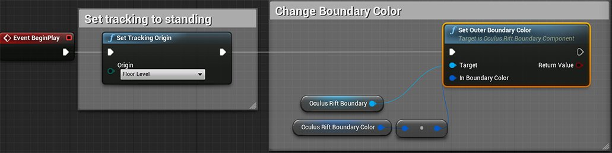

# 修改 Oculus Rift Guardian 系统的颜色

> 路径：虚幻引擎5.7文档 / 分享和发布项目 / XR开发 / 支持的XR设备 / Oculus开发 / Oculus 指南 / 修改 Oculus Rift Guardian 系统的颜色

> 原始页面：https://dev.epicgames.com/documentation/unreal-engine/change-the-oculus-rift-guardian-system-color-in-unreal-engine

Skill_family: Tutorial Level 2 Version: 5.0 Parent: sharing-and-releasing-projects/xr-development/supported-xr-platforms/developing-for-oculus/OculusHowTo Order: 2 tags: Oculus topic-image:sharing-and-releasing-projects/xr-development/supported-xr-platforms/developing-for-oculus/OculusHowTo/GuardianSystem\HTGuardian_System_Topic_Image.png prereq:sharing-and-releasing-projects/xr-development/supported-xr-platforms/developing-for-steamvr/HowTo/StandingCamera prereq:sharing-and-releasing-projects/xr-development\MotionController prereq:sharing-and-releasing-projects/xr-development/supported-xr-platforms/developing-for-oculus/OculusHowTo/GuardianSystem

Oculus Guardian 系统用于显示 VR 交互区域的边界。追踪设备靠近边界时，Oculus Runtime 将自动进行可视提示，告知用户。以下教程将说明如何修改用于显示 VR 互动区的 Oculus Guardian 系统的颜色。

> [!NOTE]
> 需要设置 Guardian 系统使用 Oculus 应用程序才能使其正常使用。如需了解详细操作方法，请查看官方 [Oculus Guardian 系统](https://developer.oculus.com/documentation/pcsdk/latest/concepts/dg-guardian-system/) 设置页面。

> [!WARNING]
> 在 UE 中禁用 Guardian 系统 **不** 明智，也不可取。然而，您可以调整用户靠近边界时 UE 作出的响应。

## 步骤

> [!NOTE]
> 必须为 Pawn 添加 **OculusRiftBoundary**，否则以下操作将无法实现。如果您不熟悉这些操作，请参考 [设置 Guardian 系统](../set-up-the-oculus-rift-guardian-system/index.md) 页面。

1. 创建一个名为 **Oculus Rift Boundary Color** 的新 **变量**，并将其类型设为 **Linear Color**、颜色设为 **Red**。
2. 在 **事件图表** 中添加一个 **Event Begin Play** 和 **Set Tracking Origin** 节点。将 Set Tracking Origin 节点的 **Origin** 设为 **Floor Level**，然后将 Event Begin Play 连接到 Set Tracking Origin 节点。
3. 右键点击事件图表，从菜单中搜寻 **Set Outer Boundary Color**，点击将其添加到图表。
4. 将 **Oculus Rift Boundary Color** 变量和 **Oculus Rift Boundary** 组件拖入事件图表。将 Oculus Rift Boundary Color 变量连接到 Set Boundary Color 节点上的 **In Boundary Color**，然后将 Oculus Rift Boundary 连接到 **Target** 输入。
5. 将 Set Tracking Origin 节点的输出连接到 Set Outer Boundary Color 节点的输入，操作完成后事件图表应与下图类似。

   

   点击查看全图。

## 最终结果

现在即可戴上头戴显示器，运行关卡。边界显示的颜色便是您在Oculus Rift Boundary Color变量设置的颜色。

## UE项目下载

可使用以下链接下载用于创建此例的UE项目。

- Oculus Rift Guardian 系统范例项目
