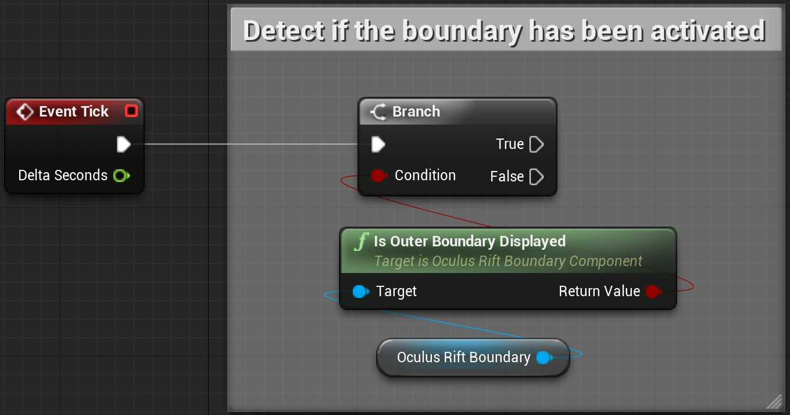
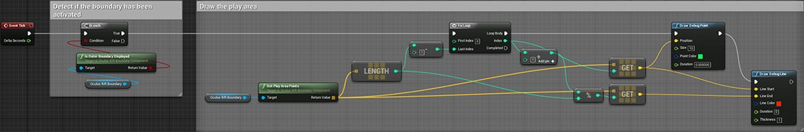

# 检测Oculus Rift Guardian系统激活

> 路径：虚幻引擎5.7文档 / 分享和发布项目 / XR开发 / 支持的XR设备 / Oculus开发 / Oculus 指南 / 检测Oculus Rift Guardian系统激活

> 原始页面：https://dev.epicgames.com/documentation/unreal-engine/detect-oculus-rift-guardian-system-activation-in-unreal-engine

Skill_family: Tutorial Level 2 Version: 5.0 Parent: sharing-and-releasing-projects/xr-development/supported-xr-platforms/developing-for-oculus/OculusHowTo Order: 2 tags: VR topic-image:sharing-and-releasing-projects/xr-development/supported-xr-platforms/developing-for-oculus/OculusHowTo/GuardianSystem\HTGuardian_System_Topic_Image.png prereq:sharing-and-releasing-projects/xr-development/supported-xr-platforms/developing-for-steamvr/HowTo/StandingCamera prereq:sharing-and-releasing-projects/xr-development/making-interactive-xr-experiences/set-up-motion-controllers prereq:sharing-and-releasing-projects/xr-development/supported-xr-platforms/developing-for-oculus/OculusHowTo/GuardianSystem

Oculus Guardian系统用于显示VR交互区域的边界。追踪设备靠近边界时，Oculus Runtime将自动进行可视提示，告知用户。在以下教程中，我们将阐述如何显示交互以及其他可视提示，以告知用户他们的一台设备已超出或快要超出交互区域。

> [!NOTE]
> 要使Guardian系统能够正常工作，需要确保你已使用Oculus应用程序对它进行了设置。有关如何设置此系统的更多信息，请参阅官方[Oculus Guardian系统](https://developer.oculus.com/documentation/pcsdk/latest/concepts/dg-guardian-system/)设置页面。

> [!WARNING]
> 在UE中禁用Guardian系统 **不** 明智，也不可取。然而，你可以调整用户靠近边界时UE作出的响应。

## 步骤

1. 要显示Oculus Rift边界，在某台用户设备靠近边界时我们必须要了解这一情况。而 **Is Outer Boundary Displayed** 节点恰恰使我们能够做到这一点，但是我们需要一种方法，以在每一次更新时检查这一情况是否发生。要在UE中做到这一点，我们首先需要向事件图表中添加以下节点：

   | 节点名称 | 值 |
   | --- | --- |
   | **Event Tick** | N/A |
   | **Branch** | N/A |
   | **Is Outer Boundary Displayed** | N/A |
   | **Oculus Rift Boundary** | N/A |
2. 添加好节点之后，我们需要将它们连接起来，使得仅当用户设备靠近边界时才会调用Is Outer Boundary Displayed节点；除此以外，我们不希望任何事件发生。要实现这一点，请按照下图所示设置事件图表：

   

   单击查看大图。
3. 接下来，我们不仅要显示用户在Oculus应用程序中设置的边界，还要显示与这些边界相吻合的正方形/长方形交互区域。为了做到这一点，我们将使用 **Get Play Area Points** 节点来检查运行区域中的所有点。然后，为了确定正方形/长方形交互区域的大小，我们将使用 **For Loop** 检查每一个点，并且在每一个点上，我们都绘制一个点，然后将每个点都用一条线连起来向用户显示该信息。要实现这一点，请按照下图所示设置事件图表：

   单击图片复制蓝图代码。
4. 完成上述步骤后，请确保将"For Loop"与"Branch"节点的"True"输出相连，然后务必编译并保存蓝图。完成后，你的蓝图事件图表应该类似于下图：

   

   单击查看大图。

## 最终结果

现在，请戴上Oculus Rift HMD，拿起Touch控制器并使用"VR预览（VR Preview）"启动项目。项目启动后，缓缓将一个Touch控制器朝着Guardian边界移动。当Guardian边界显示时，你应该也会看到正方形/长方形交互区域显示，如以下视频中所示。

## UE项目下载

在下面可以找到一个链接，可供你下载用来创建此示例的UE项目。

- Oculus Rift Guardian系统示例项目
