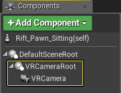
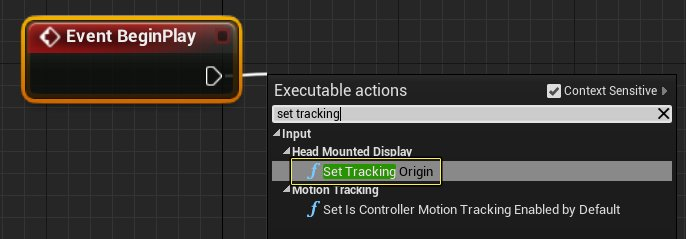
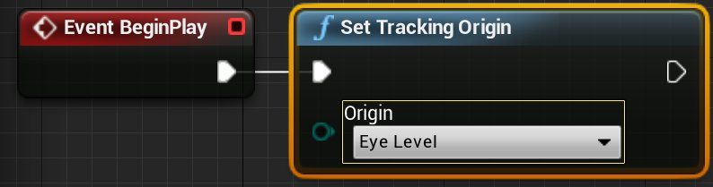
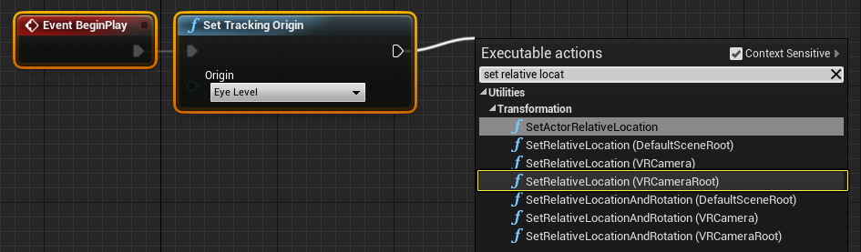
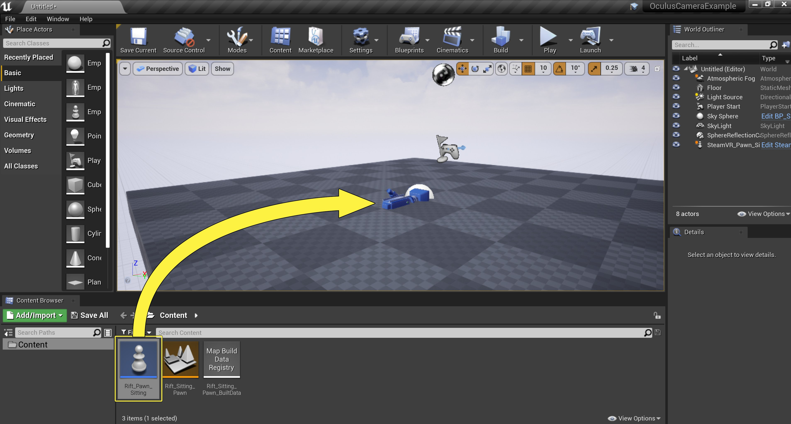
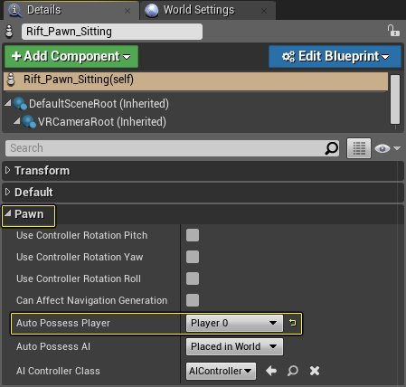

# 为Oculus Rift设置坐立式摄像机

> 路径：虚幻引擎5.7文档 / 分享和发布项目 / XR开发 / 支持的XR设备 / Oculus开发 / Oculus 指南 / 为Oculus Rift设置坐立式摄像机

> 原始页面：https://dev.epicgames.com/documentation/unreal-engine/set-up-a-seated-camera-for-the-oculus-rift-in-unreal-engine

开始用UE4开发Oculus Rift上的VR项目时，首先需要考虑的一点便是确定该体验为坐立式或站立式。以下指南将讲述如何设置坐立式Oculus Rift体验的UE4项目VR相机。

## 步骤

以下内容将讲述如何进行坐立式Oculus Rift体验的Pawn设置。

1. 首先打开或新建一个Pawn蓝图，然后前往 **视口** 标签的 **组件** 部分。在此处用以下命名添加以下两个组件，并将VRCamera设为VRCameraRoot的子项：

   | 组件命名 | 值 |
   | --- | --- |
   | **场景** | VRCameraRoot |
   | **相机** | VRCamera |

   

   点击查看全图。

   When

   > [!NOTE]
   > 无论您使用的是何种VR头戴显示器，Epic都推荐以此方式设置VR相机。因为它能在不实际移动相机的情况下实现相机位置的偏移。
2. 在Pawn蓝图中前往 **事件图表（Event Graph）**，从 **Event Begin Play** 节点连出引线，显示"可执行操作（Executable Actions）"列表。在列表中搜索 **Set Tracking Origin** 节点，点击并将其添加到事件图表。

   

   点击查看全图。
3. Set Tracking Origin节点拥有两个选项：**地面平面（Floor Level）** 和 **视线平面（Eye Level）**。针对坐立式体验，需要将Set Tracking Origin节点的 **原点** 设为 **视线平面**。

   

   点击查看全图。
4. 接下来在 **我的蓝图（My Blueprint）** 标签下的 **变量（Variables）** 部分中新建一个名为 **RiftCameraHeight** 的 **矢量** 变量，并将 **Z** 轴值设为 **121**。

   > [!NOTE]
   > 对坐立式体验而言，需要将相机的高度设为真实世界中用户的坐立高度（以厘米为单位）。
5. 然后从Set Tracking Origin节点的输出连出引线，搜索 **Set Relative Location** 节点，选择 **SetRelativeLocation(VRCameraRoot)** 选项。

   

   点击查看全图。
6. 将 **RiftCameraHeight** 变量连接到Set Relative Location节点上的 **New Location** 输入，然后按下"编译"按钮。操作完成后，事件图表与下图类似。

   > [!TIP]
   > 点击上图左上角并按下CRTL + C即可复制完成的蓝图。复制后前往蓝图事件按下CTRL + V进行粘贴。
7. 将Pawn蓝图从内容浏览器拖入关卡，将其放置在关卡中0,0,0处。

   

   点击查看全图。
8. 选中放置在关卡中的Pawn蓝图，然后在 **Pawn** 设置下的 **细节** 面板中将 **自动拥有玩家（Auto Possess Player）** 从 **禁用（Disabled）** 改为 **Player 0**。

   

   点击查看全图。

## 最终结果

最后前往 **主工具栏** 将 **播放模式（Play Mode）** 改为 **VR预览（VR Preview）**，然后按下 **播放** 按钮。您戴上Oculus Rift头戴显示器坐下观察关卡时，将看到与以下视频相似的内容。

## UE4项目下载

可使用以下链接下载用于创建此例的UE4项目。

- Oculus Rift坐立式VR相机范例项目
