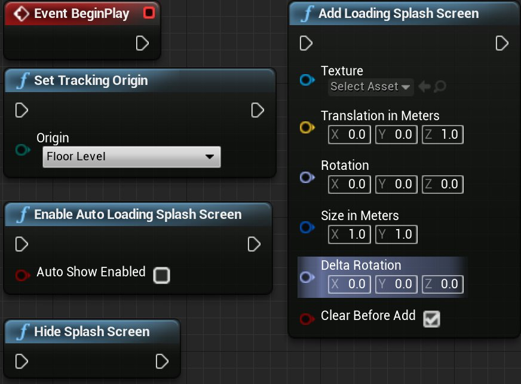
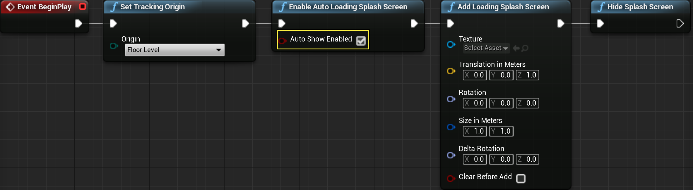
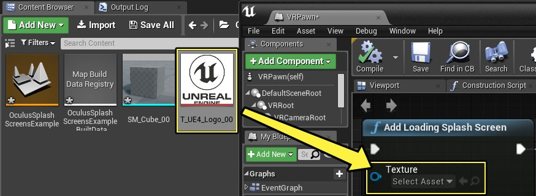
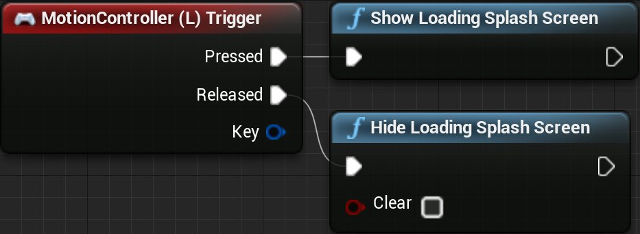
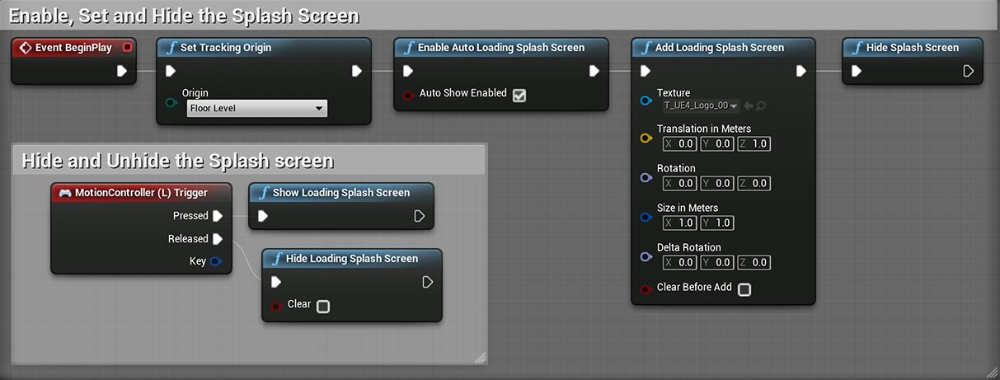

# 为 Oculus Rift 设置启动画面

> 路径：虚幻引擎5.7文档 / 分享和发布项目 / XR开发 / 支持的XR设备 / Oculus开发 / Oculus 指南 / 为 Oculus Rift 设置启动画面

> 原始页面：https://dev.epicgames.com/documentation/unreal-engine/using-splash-screens-for-the-oculus-rift-in-unreal-engine

Skill_family: Tutorial Level 1 Version: 5.0 Parent: sharing-and-releasing-projects/xr-development/supported-xr-platforms/developing-for-oculus/OculusHowTo Order: 2 tags: Oculus prereq: sharing-and-releasing-projects/xr-development/supported-xr-platforms/developing-for-steamvr/HowTo/StandingCamera prereq: sharing-and-releasing-projects/xr-development/making-interactive-xr-experiences/using-motion-controllers prereq: sharing-and-releasing-projects/xr-development/supported-xr-platforms/developing-for-oculus/OculusHowTo/GuardianSystem

在 UE VR 项目中变更关卡时有大量数据被卸载和加载，因此用户可能会遇到一些帧率问题。为掩盖加载新关卡时可能出现的帧率问题，可显示一个过渡画面或影片。以下教程将说明如何在 UE 项目中设置并调用过渡画面。

## 步骤

> [!NOTE]
> * 针对此指南，您需要下载、解压并导入以下 zip 文件中包含的两个文件，**[Oculus 过渡画面源文件](https://d1iv7db44yhgxn.cloudfront.net/documentation/attachments/3480984d-aa4c-4f91-8191-36973ef55240/oclussplashscreensourcecontent.zip)**

1. 打开 VRPawn 并前往 **事件图表**。在事件图表中点击右键，搜索并添加以下蓝图节点：

   - Event Begin Play
   - Set Tracking Origin
   - Enable Auto Loading Splash Screen
   - Add Loading Splash Screen
   - Hide Splash Screen

   

   点击查看全图。
2. 我们需要在关卡加载时调用过渡画面，因此需要首先启动过渡画面的自动加载，然后设置过渡画面的内容。最后我们需要隐藏过渡画面，以便在之后需要时调用。对 VRPawn 事件图表中的节点进行设置，使其与下图相符：

   

   点击查看全图。

   > [!NOTE]
   > 勾选 **Enable Auto Loading Splash Screen** 上的 **Auto Show Enabled** 属性，之后关卡加载时便会自动调用过渡画面。
3. **Add Loading Splash Screen** 节点中有一个 **Texture** 输出，控制调用此节点时将显示的纹理或影片。将 **T_UE4_Logo_00** 或其他纹理设为使用的纹理。

   

   点击查看全图。

   > [!NOTE]
   > 将纹理设为过渡画面的图像时，最好将纹理压缩设置设为 **UserInterface2D** 并启用 **Never Stream** 选项，确保过渡画面以最高精度显示。
4. 将以下三个节点连接到 VRPawn 事件图表，以便显示和隐藏过渡画面。设置完成后应与下图相同：

   - Motion Controller (L)Trigger
   - Show Loading Splash Screen
   - Hide Loading Splash Screen

   

   点击查看全图。

   > [!NOTE]
   > 可以用此方式显示过渡画面，但也可将此功能添加到关卡蓝图，使关卡加载后便会出现过渡画面，直到关卡加载完成。
5. 操作完成后，VRPawn 蓝图与下图相似。此时便可戴上头戴显示器，手持触摸控制器，站在 VR 交互区中央。

   

   点击查看全图。

## 最终结果

现在按下触摸控制器上的左扳机键后，场景应变黑，并出现 UE Logo 或您选择的图像。松开触摸控制器左扳机键将返回关卡，显示以下视频中的画面。

## UE 项目下载

可使用以下链接下载用于创建此例的 UE 项目。

- Oculus Rift 过渡画面范例项目
